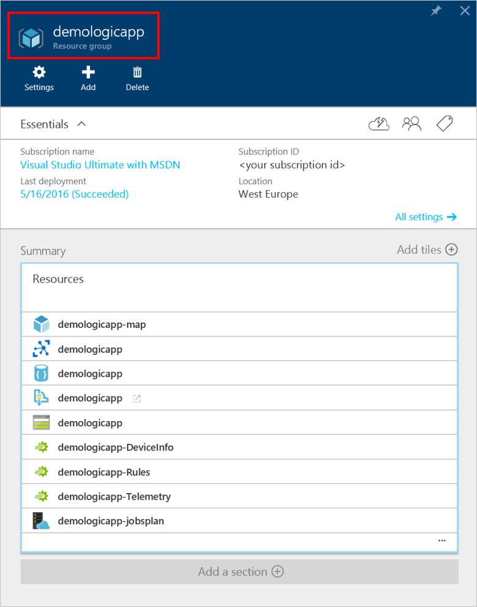
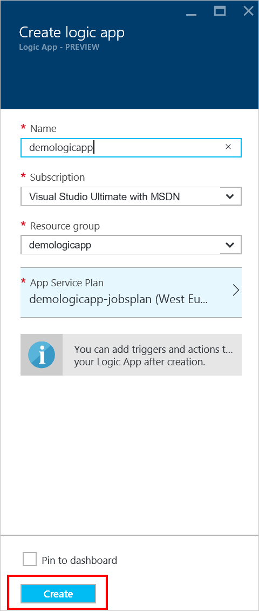
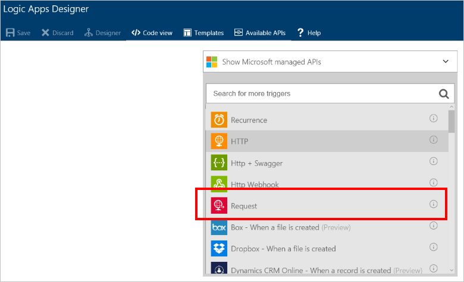
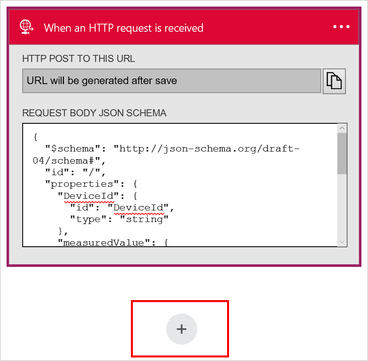
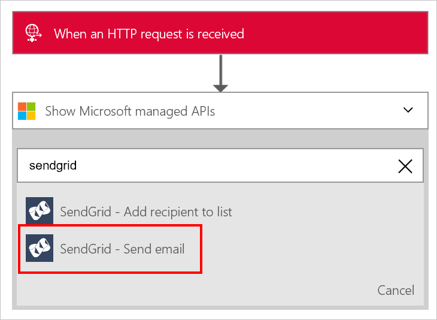
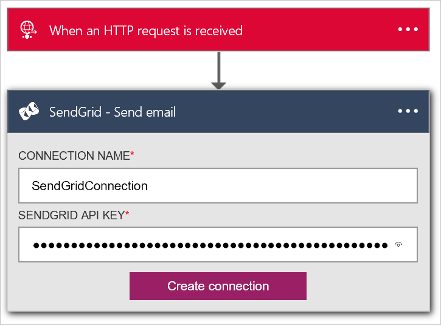
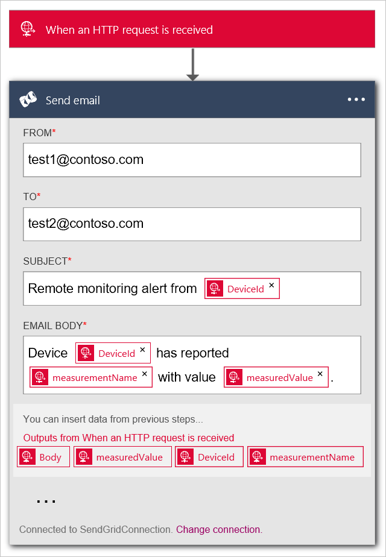

<properties
  pageTitle="Azure IoT Suite and Logic Apps | Microsoft Azure"
  description="A tutorial on how to hook up Logic Apps to Azure IoT Suite for business process."
  services=""
  suite="iot-suite"
  documentationCenter=""
  authors="aguilaaj"
  manager="timlt"
  editor=""/>

<tags
  ms.service="iot-suite"
  ms.devlang="na"
  ms.topic="article"
  ms.tgt_pltfrm="na"
  ms.workload="na"
  ms.date="08/10/2016"
  ms.author="araguila"/>
  
# Tutorial: Connect Logic App to your Azure IoT Suite Remote Monitoring preconfigured solution

The [Microsoft Azure IoT Suite][lnk-internetofthings] remote monitoring preconfigured solution is a great way to get started quickly with an end-to-end feature set that exemplifies an IoT solution. This tutorial walks you through how to add Logic App to your Microsoft Azure IoT Suite remote monitoring preconfigured solution. This demonstrates how you can take your IoT solution even further by connecting it to a business process.

_If you’re looking for a walkthrough on how to provision a remote monitoring preconfigured solution, see [Tutorial: Get started with the IoT preconfigured solutions][lnk-getstarted]._

Before you start this tutorial, in addition to provisioning the remote monitoring preconfigured solution in your Azure subscription, you need to create a SendGrid account to enable you to send an email that triggers your business process. You can sign up for a free trial account at [SendGrid](https://sendgrid.com/) by clicking **Try for Free**. After you have registered for your free trial account, you need to create an [API key](https://sendgrid.com/docs/User_Guide/Settings/api_keys.html) in SendGrid that grants permissions to send mail. You will need this API key later in the tutorial.

Assuming you’ve already provisioned your remote monitoring preconfigured solution, navigate to the resource group for that solution in the [Azure Portal][lnk-azureportal]. The resource group has the same name as the solution name you chose when you provisioned your remote monitoring solution. In the resource group, you can see all the pre-provisioned Azure resources for your solution (with the exception of the Azure Active Directory application that you can find in the Azure Classic Portal). The following screenshot shows an example **Resource group** blade for a remote monitoring preconfigured solution:



To begin, set up the logic app to use with the preconfigured solution.

## Set up the Logic App

1. Click __Add__ at the top of your resource group blade in the Azure Portal.

2. Search for __Logic App__, select it and then click **Create**.

3. Fill out the __Name__ and use the same **Subscription**, **Resource group**, and **App Service Plan** that you used when you provisioned your remote monitoring solution. Click __Create__.

    

4. When your deployment completes, you will see the Logic App is now listed as a resource in your resource group.

5. Click on the Logic App to navigate to the Logic App blade, this immediately opens the **Logic Apps Designer**.

    

6. Select __Manual – When an HTTP request is received__. This specifies that an incoming HTTP request with a specific JSON formatted payload acts as a trigger.

7. Paste the following into the Request Body JSON Schema:

    ```
    {
      "$schema": "http://json-schema.org/draft-04/schema#",
      "id": "/",
      "properties": {
        "DeviceId": {
          "id": "DeviceId",
          "type": "string"
        },
        "measuredValue": {
          "id": "measuredValue",
          "type": "integer"
        },
        "measurementName": {
          "id": "measurementName",
          "type": "string"
        }
      },
      "required": [
        "DeviceId",
        "measurementName",
        "measuredValue"
      ],
      "type": "object"
    }
    ```
    
    Note: you can copy the URL for the HTTP post after you save the logic app, but first you must add an action.

8. Click __(+)__ under your manual trigger. Then click **Add an action**.

    

9. Search for **SendGrid - Send email** and click on it.

    

10. Enter a name for the connection, such as **SendGridConnection**, enter the **SendGrid Api Key** you created when you set up your SendGrid account, and click **Create connection**.

    

11. Add email addresses you own to both the **From** and **To** fields. Add **Remote monitoring alert [DeviceId]** to the **Subject** field. In the **Email Body** field add **Device [DeviceId] has reported [measurementName] with value [measuredValue].** You can add **[DeviceId]**, **[measurementName]**, and **[measuredValue]** by clicking in the **You can insert data from previous steps** section.

    

12. Click __Save__ in the top menu.

13. Click the **When an HTTP request is received** trigger and copy the __Http Post to this URL__ value. You will need this URL later in this tutorial.

> [AZURE.NOTE] Logic Apps enable you to run [many different types of action][lnk-logic-apps-actions] including actions in Office 365. 

## Set up the EventProcessor Web Job

In this section, you connect your preconfigured solution to the Logic App you created by adding the URL to trigger the Logic App to the action that fires when a device sensor value exceeds a threshold.

1. Use your git client to clone the latest version of the [azure-iot-remote-monitoring github repository][lnk-rmgithub]. For example:

    ```
    git clone https://github.com/Azure/azure-iot-remote-monitoring.git
    ```

2. In Visual Studio, open the __RemoteMonitoring.sln__ from the local copy of the repository.

3. Open the __ActionRepository.cs__ file in the **Infrastructure\\Repository** folder.

4. Update the **actionIds** dictionary with the __Http Post to this URL__ you noted from your Logic App as shown below:

    ```
    private Dictionary<string,string> actionIds = new Dictionary<string, string>()
    {
        { "Send Message", "<Http Post to this UR>" },
        { "Raise Alarm", "<Http Post to this UR> }
    };
    ```

5. Save the changes in solution and exit Visual Studio.

## Deploy from the command-line

In this section, you deploy your updated version of the remote monitoring solution to replace the version currently running in Azure.

1. Following the [dev set-up][lnk-devsetup] instructions to set up your environment for deployment.

2.  To deploy locally, follow the [local deployment][lnk-localdeploy] instructions.

3.  To deploy to the cloud and update your existing cloud deployment, follow the [cloud deployment][lnk-clouddeploy] instructions. Use the name of your original deployment as the deployment name. For example if the original deployment was called **demologicapp**, use the following command:

    ``
    build.cmd cloud release demologicapp
    ``
    
    When the build script runs, be sure to use the same Azure account, subscription, region, and Active Directory instance you used when you first provisioned the solution.

## See your Logic App in action

The remote monitoring preconfigured solution has two rules set up by default when you first provision a solution. Both rules are on the **SampleDevice001** device:

* Temperature > 38.00
* Humidity > 48.00

The temperature rule triggers the **Raise Alarm** action and the Humidity rule triggers the **SendMessage** action. Assuming you used the same URL for both in actions the **ActionRepository** class, your logic app will trigger for either rule and use SendGrid to send an email to the **To** address with details of the alert.

> [AZURE.NOTE] The Logic App continues to trigger every time threshold being met, so to avoid unnecessary emails, you can either disable the rules in your solution portal or disable the Logic App in the [Azure Portal][lnk-azureportal].

In addition to receiving emails, you can also see when the Logic App runs in the portal:


## Next steps

Now that you've used a Logic App to connect the preconfigured solution to a business process, you can learn more about the options for customizing the preconfigured solutions:

- [Use dynamic telemetry with the remote monitoring preconfigured solution][lnk-dynamic]
- [Device information metadata in the remote monitoring preconfigured solution][lnk-devinfo]

[lnk-dynamic]: iot-suite-dynamic-telemetry.md
[lnk-devinfo]: iot-suite-remote-monitoring-device-info.md

[lnk-internetofthings]: https://azure.microsoft.com/documentation/suites/iot-suite/
[lnk-getstarted]: iot-suite-getstarted-preconfigured-solutions.md
[lnk-azureportal]: https://portal.azure.com
[lnk-logic-apps-actions]: ../connectors/apis-list.md
[lnk-rmgithub]: https://github.com/Azure/azure-iot-remote-monitoring
[lnk-devsetup]: https://github.com/Azure/azure-iot-remote-monitoring/blob/master/Docs/dev-setup.md
[lnk-localdeploy]: https://github.com/Azure/azure-iot-remote-monitoring/blob/master/Docs/local-deployment.md
[lnk-clouddeploy]: https://github.com/Azure/azure-iot-remote-monitoring/blob/master/Docs/cloud-deployment.md
