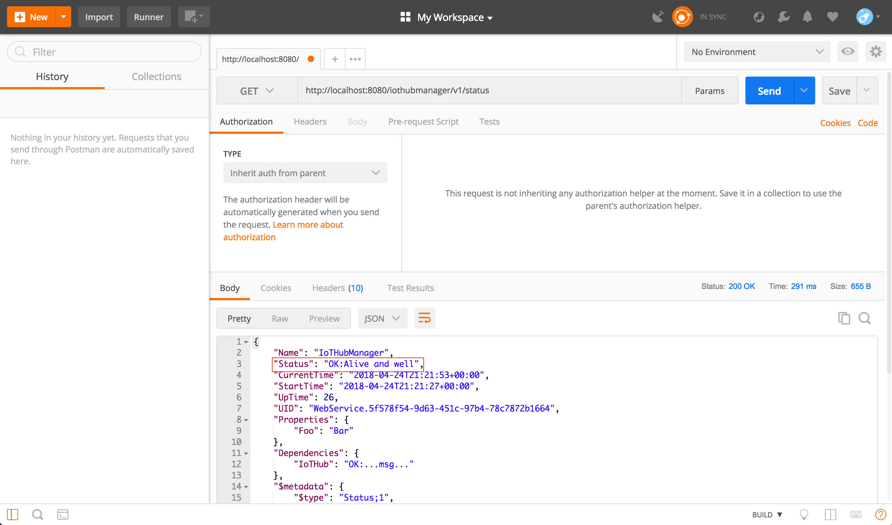
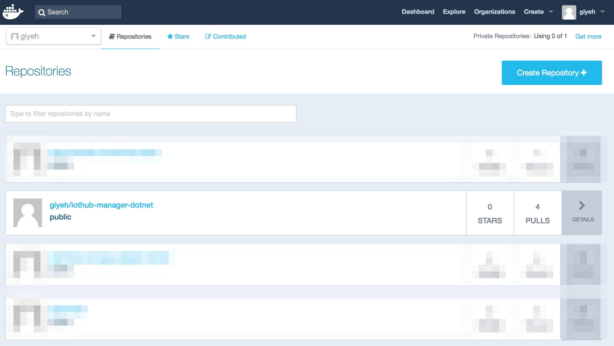
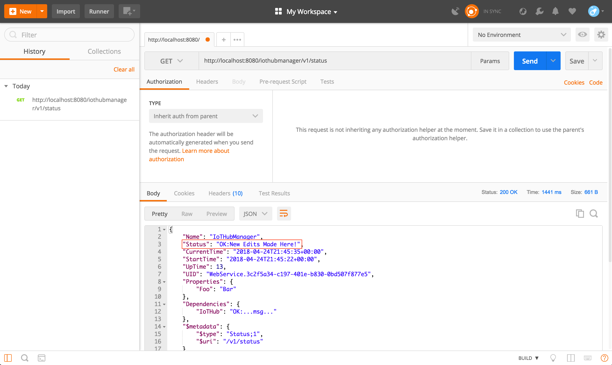

# Change and Redeploy a Microservice

This tutorial shows you how to edit one of the microservices in remote monitoring, build an image of your microservice, deploy the image to your docker hub, and then use it in remote monitoring. To introduce this concept, the tutorial uses a basic scenario where you will call a microservice API and change the status message from "Alive and Well" to "New Edits Made Here!".

Remote monitoring uses microservices that are built using docker images  that are pulled from a docker hub. 

In this tutorial, you learn how to:

>[!div class="checklist"]
> * Edit and build a microservice in remote monitoring
> * Build a docker image
> * Push a docker image to your docker hub
> * Pull the new docker image

## Prerequisites

To follow this tutorial, you will need the following:

>[!div class="checklist"]
> * [Deploy the remote monitoring preconfigured solution locally](iot-suite-remote-monitoring-deploy-local.md)
> * [A Docker account](https://hub.docker.com/)
> * [Postman](https://www.getpostman.com/) 

## Delete all docker images and docker containers on your local machine.

You will first remove all images and containers on your local machine so that you are starting with a fresh Docker slate. Having cached docker images or docker containers could interfere with new local deployments of remote monitoring.

1. To remove all containers, you'll first need to stop all running containers. Open your terminal and type "docker stop $(docker ps -aq)". After that runs, you need to type "docker rm $(docker ps -aq)"
2. To remove all images, open your terminal and type "docker rmi $(docker images -q)"
3. You can check if there are any containers on the machine by typing "docker ps -aq". If you successfully removed all containers, nothing should show up.
4. You can check if there are any images on the machine by typing "docker images". If you successfully removed all containers, nothing should show up.

## Call the IoT hub manager microservice API and view response status

In this part you will call the default IoT hub manager microservice API and view what the current status is.

1. Make sure remote monitoring is running locally on your machine.
2. Locate where you downloaded Postman and open it.
3. In Postman, enter the following in the GET: http://localhost:8080/iothubmanager/v1/status.
4. View the return and you should see, "Status": "OK:Alive and Well".


## Change the status and build the image

We will now change the status message of the Iot Hub Manager microservice to "New Edits Made Here!" and then rebuild the docker image with this new status.

1. Make sure your terminal is open and change to the directory where you have cloned remote monitoring. 
2. Change your directory to "..azure-iot-pcs-remote-monitoring-dotnet/iothub-manager/WebService/v1/Controllers".
3. Open StatusController.cs in any text editor or IDE that you like. 
4. Locate the following code:
```javascript
return new StatusApiModel(true, "Alive and well");
```
and change it to look like this and save it.

```javascript
return new StatusApiModel(true, "New Edits Made Here!");
```
5. Go back to you terminal but now change to the following directory: "..azure-iot-pcs-remote-monitoring-dotnet/iothub-manager/scripts/docker".
6. Type "sh build" to build your new docker image.
7. In the same terminal, type "docker images" to verify your new image was successfully created. The Repository should be "azureiotpcs/iothub-manager-dotnet".


## Tag and push the image
Before you can push your new docker image to a docker hub, Docker expects your images to be tagged.

1. Type "docker images" in your terminal and locate the Image ID of the docker image you just created.
2. To tag your image with "testing" type "docker tag [Image ID] [docker ID]/iothub-manager-dotnet:testing" into the terminal.
3. To push your newly tagged image to your docker hub, type "docker push [docker ID]/iothub-manager-dotnet:testing".
4. Open your internet browser and go to your [docker hub](https://hub.docker.com/) and sign in.
5. You should now see your newly pushed docker image on your docker hub.


## Update your local instance of remote monitoring
You will now need to update your local docker-compose.yml to pull your new docker image from your docker hub.

1. Go back to you terminal and change to the following directory: "..azure-iot-pcs-remote-monitoring-dotnet/scripts/local".
2. Open docker-compose.yml in any text editor or IDE that you like.
3. Locate the following code:
```docker
image: azureiotpcs/pcs-auth-dotnet:testing
```
and change it to look like this and save it.
```docker
image: [docker ID]/pcs-auth-dotnet:testing
```
## Check IoT hub manager microservice API and view the new response status
You will now finish up by redeploying a local instance of remote monitoring and viewing the new status response in Postman.

1. Go back to you terminal and change to the following directory: "..azure-iot-pcs-remote-monitoring-dotnet/scripts/local".
2. Type "docker-compose up" to start your local instance of remote monitoring.
3. Locate where you downloaded Postman and open it.
3. In Postman, enter the following in the GET: http://localhost:8080/iothubmanager/v1/status.
4. You should now see, "Status": "OK: New Edits Made Here!".



## Next steps

In this tutorial, you saw how to:

<!-- Repeat task list from intro -->
>[!div class="checklist"]
> * Edit and build a microservice in Remote Monitoring v2
> * Build a docker image
> * Push a docker image to your docker hub
> * Pull the new docker image 

<!-- Next tutorials in the sequence -->