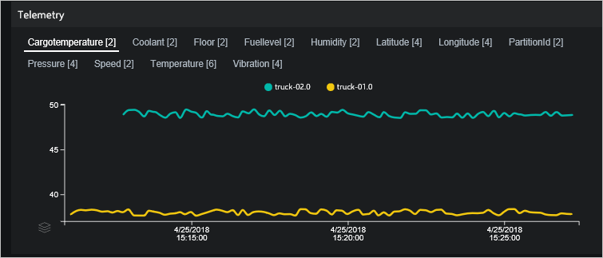

# Customize the remote monitoring preconfigured solution

This article provides information about how you can access the source code and customize the remote monitoring preconfigured solution. The article describes:

* The GitHub repositories that contain the source code and resources for the microservices that make up the preconfigured solution.
* Common customization scenarios such as adding a new device type.

The following video presents an overview of the options for customizing the remote monitoring preconfigured solution:

>[!VIDEO https://channel9.msdn.com/Shows/Internet-of-Things-Show/How-to-customize-the-Remote-Monitoring-Preconfigured-Solution-for-Azure-IoT/Player]

## Project overview

### Implementations

The remote monitoring solution has both .NET and Java implementations. Both implementations provide similar functionality and rely on the same underlying Azure services. You can find the top-level GitHub repositories here:

* [.NET solution](https://github.com/Azure/azure-iot-pcs-remote-monitoring-dotnet)
* [Java solution](https://github.com/Azure/azure-iot-pcs-remote-monitoring-java)

### Microservices

If you are interested in a specific feature of the solution, you can access the GitHub repositories for each individual microservice. Each microservice implements a different part of the solution functionality. To learn more about the overall architecture, see [Remote monitoring preconfigured solution architecture](iot-suite-remote-monitoring-sample-walkthrough.md).

This table summarizes the current availability of each microservice for each language:

<!-- please add links for each of the repos in the table, you can find them here https://github.com/Azure/azure-iot-pcs-team/wiki/Repositories-->

| Microservice      | Description | Java | .NET |
| ----------------- | ----------- | ---- | ---- |
| Web UI            | Web app for remote monitoring solution. Implements UI using React.js framework. | [N/A(React.js)](https://github.com/Azure/azure-iot-pcs-remote-monitoring-webui) | [N/A(React.js)](https://github.com/Azure/azure-iot-pcs-remote-monitoring-webui) |
| IoT Hub Manager   | Handles communication with the IoT Hub.        | [Available](https://github.com/Azure/iothub-manager-java) | [Available](https://github.com/Azure/iothub-manager-dotnet)   |
| Authentication    |  Manages Azure Active Directory integration.  | Not yet available | [Available](https://github.com/Azure/pcs-auth-dotnet)   |
| Device simulation | Manages a pool of simulated devices. | Not yet available | [Available](https://github.com/Azure/device-simulation-dotnet)   |
| Telemetry         | Makes device telemetry available to the UI. | [Available](https://github.com/Azure/device-telemetry-java) | [Available](https://github.com/Azure/device-telemetry-dotnet)   |
| Telemetry Agent   | Analyzes the telemetry stream, stores messages from Azure IoT Hub, and generates alerts according to defined rules.  | [Available](https://github.com/Azure/telemetry-agent-java) | [Available](https://github.com/Azure/telemetry-agent-dotnet)   |
| UI Config         | Manages configuration data from the UI. | [Available](https://github.com/azure/pcs-ui-config-java) | [Available](https://github.com/azure/pcs-ui-config-dotnet)   |
| Storage adapter   |  Manages interactions with storage service.   | [Available](https://github.com/azure/pcs-storage-adapter-java) | [Available](https://github.com/azure/pcs-storage-adapter-dotnet)   |
| Reverse proxy     | Exposes private resources in a managed way through a unique endpoint. | Not yet available | [Available](https://github.com/Azure/reverse-proxy-dotnet)   |

The Java solution currently uses the .NET authentication, simulation, and reverse proxy microservices. These microservices will be replaced by Java versions as soon as they become available.

## Presentation and visualization

The following sections describe options to customize the presentation and visualizations layer in the remote monitoring solution:

### Customize the map

See the [Customize map](https://github.com/Azure/azure-iot-pcs-remote-monitoring-dotnet/wiki/Developer-Reference-Guide#upgrade-map-key-to-see-devices-on-a-dynamic-map) page in GitHub for details of the map components in the solution.

<!--
### Connect an external visualization tool

See the [Connect an external visualization tool](https://github.com/Azure/azure-iot-pcs-remote-monitoring-dotnet/) page in GitHub for details of how to connect an external visualization tool.

-->

### Duplicate an existing control

Each page in the remote monitoring solution is composed of a set of controls, referred to as *panels* in the source code. For example, the **Dashboard** page is made up of five panels: Overview, Map, Alarms, Telemetry, and KPIs. You can find the source code that defines each page and its panels in the [pcs-remote-monitoring-webui](https://github.com/Azure/pcs-remote-monitoring-webui) GitHub repository. For example, the code that defines the **Dashboard** page, its layout, and the panels on the page is located in the [src/components/pages/dashboard](https://github.com/Azure/pcs-remote-monitoring-webui/tree/master/src/components/pages/dashboard) folder.

The following steps outline how to duplicate and existing panel, modify it, and use the modified version. The steps use the **alarms** panel as an example:

1. In your local copy of the repository, make a copy of the **alarms** folder in the `src/components/pages/dashboard/panels` folder. Name the new copy **cust_alarms**.

1. In the **alarmsPanel.js** file in the **cust_alarms** folder, edit the name of the class to be **CustAlarmsPanel**:

    ```nodejs
    export class CustAlarmsPanel extends Component {
    ```

1. Add the following line to the `src/components/pages/dashboard/panels/index.js` file:

    ```nodejs
    export * from './cust_alarms';
    ```

1. Replace `AlarmsPanel` with `CustAlarmsPanel` in the `src/components/pages/dashboard/dashboard.js` file:

    ```nodejs
    import {
      OverviewPanel,
      CustAlarmsPanel,
      TelemetryPanel,
      KpisPanel,
      MapPanel,
      transformTelemetryResponse,
      chartColors
    } from './panels';

    ...

    <Cell className="col-3">
      <CustAlarmsPanel
        alarms={currentActiveAlarmsWithName}
        isPending={kpisIsPending || rulesIsPending}
        error={rulesError || kpisError}
        t={t} />
    </Cell>
    ```

You have now replaced the original **Alarms** panel with a copy called **CustAlarms**. This copy is identical to the original. You can now modify the copy. For example, to change the column ordering in the **Alarms** panel:

1. Open the `src/components/pages/dashboard/panels/cust_alarms/alarmsPanel.js` file.

1. Modify the column definitions as shown in the following code snippet:

    ```nodejs
    this.columnDefs = [
      rulesColumnDefs.severity,
      {
        headerName: 'rules.grid.count',
        field: 'count'
      },
      {
        ...rulesColumnDefs.ruleName,
        minWidth: 200
      },
      rulesColumnDefs.explore
    ];
    ```

The following screenshot shows the new version of the **Alarms** panel:


### Customize the telemetry chart

The telemetry chart on the **Dashboard** page is defined by the files in the `src/components/pages/dashboard/panels/telemtry` folder. The UI retrieves the telemetry from the solution back end in the `src/services/telemetryService.js` file. The following steps show you how to change the time period displayed on the telemetry chart from 15 minutes to five minutes:

1. In the `src/services/telemetryService.js` file, locate the function called **getTelemetryByDeviceIdP15M**. Make a copy of this function and modify the copy as follows:

    ```nodejs
    static getTelemetryByDeviceIdP5M(devices = []) {
      return TelemetryService.getTelemetryByMessages({
        from: 'NOW-PT5M',
        to: 'NOW',
        order: 'desc',
        devices
      });
    }
    ```

1. To use this new function to populate the telemetry chart, open the `src/components/pages/dashboard/dashboard.js` file. Locate the line that initializes the telemetry stream and modify it as follows:

    ```node.js
    const getTelemetryStream = ({ deviceIds = [] }) => TelemetryService.getTelemetryByDeviceIdP5M(deviceIds)
    ```

The telemetry chart now shows the last five minutes worth of telemetry data:



### Add a new KPI

The **Dashboard** page displays KPIs in the **System KPIs** panel. These KPIs are calculated in the `src/components/pages/dashboard/dashboard.js` file. The KPIs are rendered by the `src/components/pages/dashboard/panels/kpis/kpisPanel.js` file. The following steps describe how to calculate and render a new KPI value on the **Dashboard** page. The example shown is to add a new percentage change in warning alarms KPI:

1. Open the `src/components/pages/dashboard/dashboard.js` file. Modify the **initialState** object to include a **warningAlarmsChange** property as follows:

    ```nodejs
    const initialState = {
      ...

      // Kpis data
      currentActiveAlarms: [],
      topAlarms: [],
      alarmsPerDeviceId: {},
      criticalAlarmsChange: 0,
      warningAlarmsChange: 0,
      kpisIsPending: true,
      kpisError: null,

      ...
    };
    ```

1. Modify the **currentAlarmsStats** object to include **totalWarningCount** as a property:

    ```nodejs
    return {
      openWarningCount: (acc.openWarningCount || 0) + (isWarning && isOpen ? 1 : 0),
      openCriticalCount: (acc.openCriticalCount || 0) + (isCritical && isOpen ? 1 : 0),
      totalWarningCount: (acc.totalWarningCount || 0) + (isWarning ? 1 : 0),
      totalCriticalCount: (acc.totalCriticalCount || 0) + (isCritical ? 1 : 0),
      alarmsPerDeviceId: updatedAlarmsPerDeviceId
    };
    ```

1. Calculate the new KPI. Find the calculation for the critical alarms count. Duplicate the code and modify the copy as follows:

    ```nodejs
    // ================== Warning Alarms Count - START
    const currentWarningAlarms = currentAlarmsStats.totalWarningCount;
    const previousWarningAlarms = previousAlarms.reduce(
      (cnt, { severity }) => severity === 'warning' ? cnt + 1 : cnt,
      0
    );
    const warningAlarmsChange = ((currentWarningAlarms - previousWarningAlarms) / currentWarningAlarms * 100).toFixed(2);
    // ================== Warning Alarms Count - END
    ```

1. Include the new **warningAlarmsChange** KPI in the KPI stream:

    ```nodejs
    return ({
      kpisIsPending: false,

      // Kpis data
      currentActiveAlarms,
      topAlarms,
      criticalAlarmsChange,
      warningAlarmsChange,
      alarmsPerDeviceId: currentAlarmsStats.alarmsPerDeviceId,

      ...
    });

1. Include the new **warningAlarmsChange** KPI in the state data used to render the UI:

    ```nodejs
    const {
      ...

      currentActiveAlarms,
      topAlarms,
      alarmsPerDeviceId,
      criticalAlarmsChange,
      warningAlarmsChange,
      kpisIsPending,
      kpisError,

      ...
    } = this.state;
    ```

1. Update the data passed to the KPIs panel:

    ```node.js
    <KpisPanel
      topAlarms={topAlarmsWithName}
      alarmsPerDeviceId={alarmsPerDeviceType}
      criticalAlarmsChange={criticalAlarmsChange}
      warningAlarmsChange={warningAlarmsChange}
      isPending={kpisIsPending || rulesIsPending || devicesIsPending}
      error={devicesError || rulesError || kpisError}
      colors={chartColorObjects}
      t={t} />
    ```

You have now finished the changes in the `src/components/pages/dashboard/dashboard.js` file. The following steps describe the changes to make in the `src/components/pages/dashboard/panels/kpis/kpisPanel.js` file to display the new KPI:

1. Modify the following line of code to retrieve the new KPI value as follows:

    ```nodejs
    const { t, isPending, criticalAlarmsChange, warningAlarmsChange, error } = this.props;
    ```

1. Modify the markup to display the new KPI value as follows:

    ```nodejs
    <div className="kpi-cell">
      <div className="kpi-header">{t('dashboard.panels.kpis.criticalAlarms')}</div>
      <div className="critical-alarms">
        {
          criticalAlarmsChange !== 0 &&
            <div className="kpi-percentage-container">
              <div className="kpi-value">{ criticalAlarmsChange }</div>
              <div className="kpi-percentage-sign">%</div>
            </div>
        }
      </div>
      <div className="kpi-header">{t('Warning alarms')}</div>
      <div className="critical-alarms">
        {
          warningAlarmsChange !== 0 &&
            <div className="kpi-percentage-container">
              <div className="kpi-value">{ warningAlarmsChange }</div>
              <div className="kpi-percentage-sign">%</div>
            </div>
        }
      </div>
    </div>
    ```

The **Dashboard** page now displays the new KPI value:


### Other customization options

To further modify the presentation and visualizations layer in the remote monitoring solution, you can edit the code. The relevant GitHub repositories are:

* [UIConfig (.NET)](https://github.com/Azure/pcs-ui-config-dotnet/)
* [UIConfig (Java)](https://github.com/Azure/pcs-ui-config-java/)
* [Azure PCS Remote Monitoring WebUI](https://github.com/Azure/pcs-remote-monitoring-webui)

## Device connectivity and streaming

The following sections describe options to customize the device connectivity and streaming layer in the remote monitoring solution. [Device models](https://github.com/Azure/device-simulation-dotnet/wiki/Device-Models) describe the device types and telemetry in the solution. You use device models for both simulated and physical devices.

For an example of a physical device implementation, see [Connect your device to the remote monitoring preconfigured solution](iot-suite-connecting-devices-node.md).

If you are using a _physical device_, you must provide the client application with a device model that contains the device metadata and telemetry specification.

The following sections discuss using device models with simulated devices:

### Add a telemetry type

The device types in the Contoso demo solution specify the telemetry that each device type sends. To specify the additional telemetry types, a device can send telemetry definitions as metadata to the solution. If you use this format, the dashboard consumes your device telemetry and available methods dynamically and you don't need to modify the UI. Alternatively, you can modify the device type definition in the solution.

To learn how to add custom telemetry in the _device simulator_ microservice, see [Test your solution with simulated devices](iot-suite-remote-monitoring-test.md).

### Add a device type

The Contoso demo solution defines some sample device types. The solution enables you to define custom device types to meet your specific application requirements. For example, your company may use an industrial gateway as the primary device connected to the solution.

To create an accurate representation of your device, you need to modify the application that runs on your device to match the device requirements.

To learn how to add a new device type in the _device simulator_ microservice, see [Test your solution with simulated devices](iot-suite-remote-monitoring-test.md).

### Define custom methods for simulated devices

To learn how to define custom methods for simulated devices in the remote monitoring solution, see [Device Models](https://github.com/Azure/device-simulation-dotnet/wiki/%5BAPI-Specifications%5D-Device-Models) in the GitHub repository.

<!--
#### Using the simulator service

TODO: add steps for the simulator microservice here
-->

#### Using a physical device

To implement methods and jobs on your physical devices, see the following IoT Hub articles:

* [Understand and invoke direct methods from IoT Hub](../iot-hub/iot-hub-devguide-direct-methods.md).
* [Schedule jobs on multiple devices](../iot-hub/iot-hub-devguide-jobs.md).

### Other customization options

To further modify the device connectivity and streaming layer in the remote monitoring solution, you can edit the code. The relevant GitHub repositories are:

* [Device Telemetry (.NET)](https://github.com/Azure/device-telemetry-dotnet)
* [Device Telemetry (Java)](https://github.com/Azure/device-telemetry-java)
* [Telemetry Agent (.NET)](https://github.com/Azure/telemetry-agent-dotnet)
* [Telemetry Agent (Java)](https://github.com/Azure/telemetry-agent-java)

## Data processing and analytics

<!--
The following sections describe options to customize the data processing and analytics layer in the remote monitoring solution:

### Rules and actions

See the [Customize rules and actions](https://github.com/Azure/azure-iot-pcs-remote-monitoring-dotnet/) page in GitHub for details of how to customize the rules and actions in solution.


### Other customization options
-->

To modify the data processing and analytics layer in the remote monitoring solution, you can edit the code. The relevant GitHub repositories are:

* [Telemetry Agent (.NET)](https://github.com/Azure/telemetry-agent-dotnet)
* [Telemetry Agent (Java)](https://github.com/Azure/telemetry-agent-java)

## Infrastructure

<!--
The following sections describe options for customizing the infrastructure services in the remote monitoring solution:

### Change storage

The default storage service for the remote monitoring solution is Cosmos DB. See the [Customize storage service](https://github.com/Azure/azure-iot-pcs-remote-monitoring-dotnet/) page in GitHub for details of how to change the storage service the solution uses.

### Change log storage

The default storage service for logs is Cosmos DB. See the [Customize log storage service](https://github.com/Azure/azure-iot-pcs-remote-monitoring-dotnet/) page in GitHub for details of how to change the storage service the solution uses for logging.

### Other customization options
-->

To modify the infrastructure in the remote monitoring solution, you can edit the code. The relevant GitHub repositories are:

* [IoTHub Manager (.NET)](https://github.com/Azure/iothub-manager-dotnet)
* [IoTHub Manager (Java)](https://github.com/Azure/iothub-manager-java)
* [Storage Adapter (.NET)](https://github.com/Azure/pcs-storage-adapter-dotnet)
* [Storage Adapter (Java)](https://github.com/Azure/pcs-storage-adapter-java)

## Next steps

In this article, you learned about the resources available to help you customize the preconfigured solution.

For more conceptual information about the remote monitoring preconfigured solution, see [Remote monitoring architecture](iot-suite-remote-monitoring-sample-walkthrough.md)

For more information about customizing the remote monitoring solution, see:

* [Developer Reference Guide](https://github.com/Azure/azure-iot-pcs-remote-monitoring-dotnet/wiki/Developer-Reference-Guide)
* [Developer Troubleshooting Guide](https://github.com/Azure/azure-iot-pcs-remote-monitoring-dotnet/wiki/Developer-Troubleshooting-Guide)

<!-- Next tutorials in the sequence -->