# Explore the capabilities of the remote monitoring preconfigured solution

This tutorial shows you the key capabilities of the remote monitoring solution. To introduce these capabilities, the tutorial showcases common customer scenarios using a simulated IoT application for a company called Contoso.

The tutorial helps you understand the typical IoT scenarios the remote monitoring solution provides out-of-the-box.

In this tutorial, you learn how to:

>[!div class="checklist"]
> * Visualize and filter devices on the dashboard
> * Respond to an alarm
> * Update the firmware in your devices
> * Organize your assets

## Prerequisites

To complete this tutorial, you need a deployed instance of the remote monitoring solution in your Azure subscription.

If you haven't deployed the remote monitoring solution yet, you should complete the [Deploy the remote monitoring preconfigured solution](iot-suite-remote-monitoring-deploy.md) tutorial.

## The Contoso sample IoT deployment

You can use the Contoso sample IoT deployment to understand the basic scenarios the remote monitoring solution provides out-of-the-box. These scenarios are based on real-life IoT deployments. Most likely, you will choose to customize the remote monitoring solution to meet your specific requirements, but the Contoso sample helps you learn the basics.

> [!NOTE]
> If you used the CLI to deploy the preconfigured solution, the file `deployment-{your deployment name}-output.json` contains information about deployment such as the URL to accss the deployed sample.

The Contoso sample provisions a set of simulated devices and rules to act on them. Once you understand the basic scenarios, you can continue exploring more of the solution features in [Perform advanced device monitoring using the remote monitoring solution](iot-suite-remote-monitoring-monitor.md).

Contoso is a company that manages a variety of assets in different environments. Contoso plans to use the power of cloud-based IoT applications to remotely monitor and manage multiple assets from a centralized application. The following sections provide a summary of the initial configuration of the Contoso sample:

> [!NOTE]
> The Contoso demo is only one way to provision simulated devices and create rules. Other provisioning options include the creation of your own custom devices. To learn more about how to create your own devices and rules, see [Manage and configure your devices](iot-suite-remote-monitoring-manage.md) and [Detect issues using threshold-based rules](iot-suite-remote-monitoring-automate.md).

### Contoso devices

Contoso uses different types of smart devices. These devices fulfill different roles for the company, sending various telemetry streams. Additionally, each device type has different device properties and supported methods.

The following table shows a summary of the provisioned device types:

| Device type        | Telemetry                                  | Properties                                  | Tags                    | Methods                                                                                      |
| ------------------ | ------------------------------------------ | ------------------------------------------- | ----------------------- | -------------------------------------------------------------------------------------------- |
| Chiller            | Temperature, Humidity, Pressure            | Type, Firmware version, Model               | Location, Floor, Campus | Reboot, Firmware Update, Emergency Valve Release, Increase Pressure                          |
| Prototyping device | Temperature, Pressure, Geo-location        | Type, Firmware version, Model               | Location, Mode          | Reboot, Firmware Update, Move device, Stop device, Temperature release, Temperature increase |
| Engine             | Tank fuel level, Coolant sensor, Vibration | Type, Firmware version, Model               | Location, Floor, Campus | Restart, Firmware Update, Empty tank, Fill tank                                              |
| Truck              | Geo-location, Speed, Cargo temperature     | Type, Firmware version, Model               | Location, Load          | Lower cargo temperature, Increase cargo temperature, Firmware update                         |
| Elevator           | Floor, Vibration, Temperature              | Type, Firmware version, Model, Geo-location | Location, Campus        | Stop elevator, Start elevator, Firmware update                                               |

> [!NOTE]
> The Contoso demo sample provisions two devices per type. For each type, one functions correctly within the boundaries defined as normal by Contoso, and the one has some kind of malfunctioning. In the next section, you learn about the rules that Contoso defines for the devices. These rules define the boundaries of correct behavior.

### Contoso rules

Operators at Contoso know the thresholds that determine whether a device is working correctly. For example, a chiller is not working correctly if the pressure that it reports is greater than 250 PSI. The following table shows threshold-based rules Contoso defines for each device type:

| Rule Name | Description | Threshold | Severity | Affected devices |
| --------- | ----------- | --------- | -------- | ---------------- |
| Chiller pressure too high | Alerts if chillers reach higher than normal pressure levels   |P>250 psi       | Critical | Chillers            |
| Prototyping device temp too high  | Alerts if prototyping devices reach higher than normal temperature levels  |T>80&deg; F |Critical | Prototyping devices |
| Engine tank empty  | Alerts if engine fuel tank goes empty                     | F<5 gallons | Info     | Engines             |
| Higher than normal cargo temperature | Alerts if truck's cargo temperature is higher than normal                 | T<45&deg; F |Warning  | Trucks              |
| Elevator vibration stopped      | Alerts if elevator stops completely (based on vibration level)                     | V<0.1 mm |Warning  | Elevators           |

### Operate the Contoso sample deployment

You have now seen the initial setup in the Contoso sample. The following sections describe three scenarios in the Contoso sample that illustrate how an operator might use the preconfigured solution.

## Respond to a pressure alarm

This scenario shows you how to identify and respond to an alarm that's triggered by a chiller device. The chiller is located in Redmond, in building 43, floor 2.

As an operator, you see in the dashboard that there's an alarm related to the pressure of a chiller. You can pan and zoom on the map to see more detail.

1. On the **Dashboard** page, in the **System Alarms** grid, you can see the **Chiller pressure too high** alarm. The chiller is also highlighted on the map:

    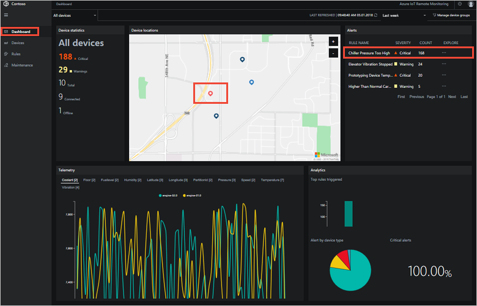

1. To view the device details and telemetry, click the highlighted chiller on the map. The telemetry shows a pressure spike:

    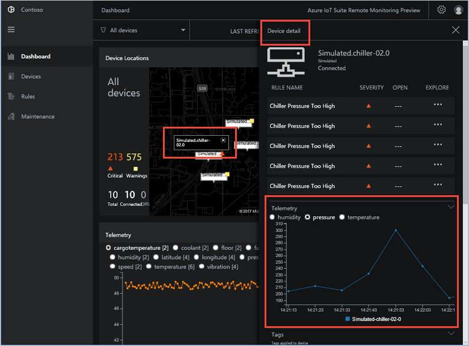

1. Close **Device detail**.

1. To navigate to the **Maintenance** page, click **...** in the **Explore Alarm** column next to the alarm in the alarm grid.

On the **Maintenance** page, you can view the details of the rule that triggered the chiller pressure alarm.

1. You can see the number of times the alarm has triggered, acknowledgments, and open and closed alarms:

    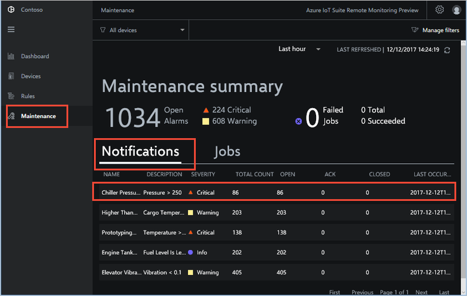

1. The first alarm in the list is the most recent one. Click the **Chiller Pressure** alarm to view the associated devices and telemetry. The telemetry shows a pressure spike for the chiller:

    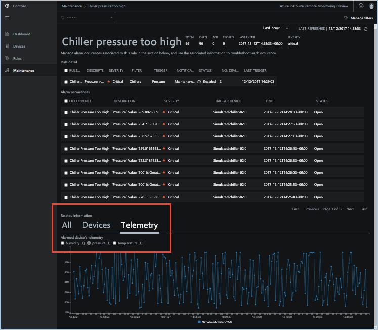

You have now identified the issue that triggered the alarm and the associated device. As an operator, the next steps are to acknowledge the alarm and mitigate the issue.

1. To indicate that you are now working on the alarm, change the **Alarm status** to **Acknowledged**:

    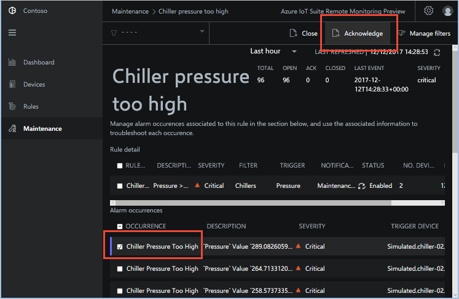

1. To act on the chiller, select it and then choose **Schedule**. Select **EmergencyValveRelease**, add a job name **ChillerPressureRelease**, and choose **Apply**. These settings create a job that executes immediately:

    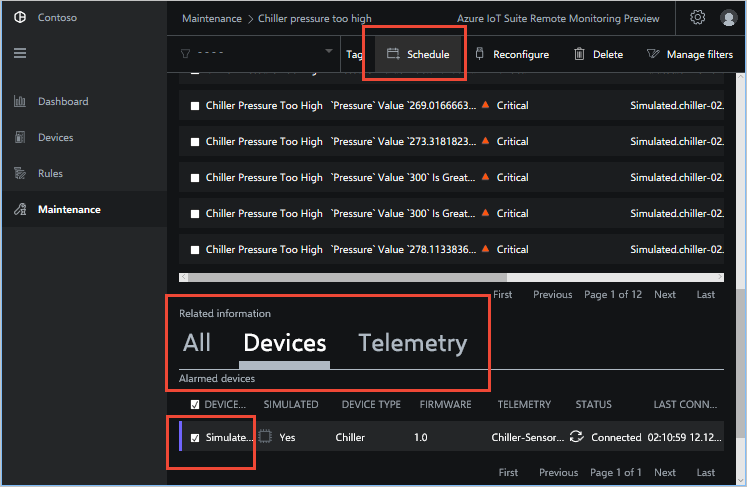

1. To view the job status, return to the **Maintenance** page and view the list of jobs in the **System Status** view. You can see the job has run to release the valve pressure on the chiller:

    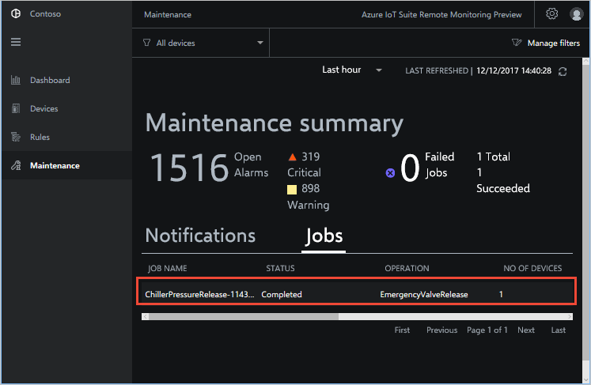

Finally, confirm that the telemetry values from the chiller are back to normal.

1. To view the alarms grid, navigate to the **Dashboard** page.

1. To view the device telemetry, select the device for the original alarm on the map, and confirm that is back to normal.

1. To close the incident, navigate to the **Maintenance** page, select the alarm, and set the status to **Closed**:

    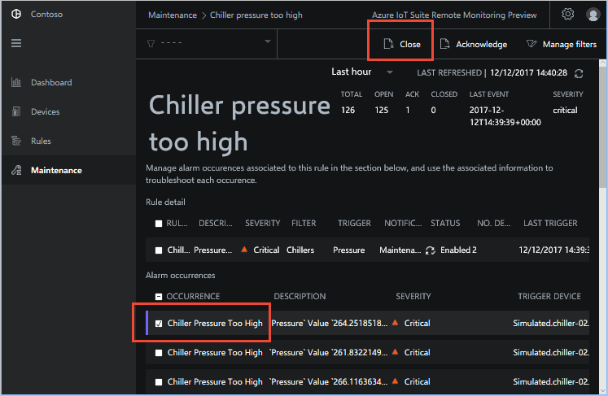

## Update device firmware

Contoso is testing a new type of device in the field. As part of the testing cycle, you need to ensure that device firmware updates work correctly. The following steps show you how to use the remote monitoring solution to update the firmware on multiple devices.

To perform the necessary device management tasks, use the **Devices** page. Start by filtering for all prototyping devices:

1. Navigate to the **Devices** page. Choose the **Prototyping devices** filter in the **Filters** drop-down:

    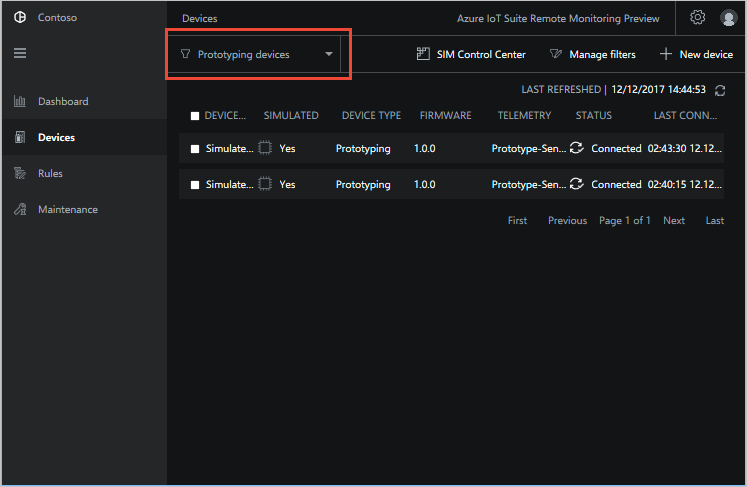

    > [!TIP]
    > Click **Manage** to manage the available filters.

1. Select one of the prototyping devices:

    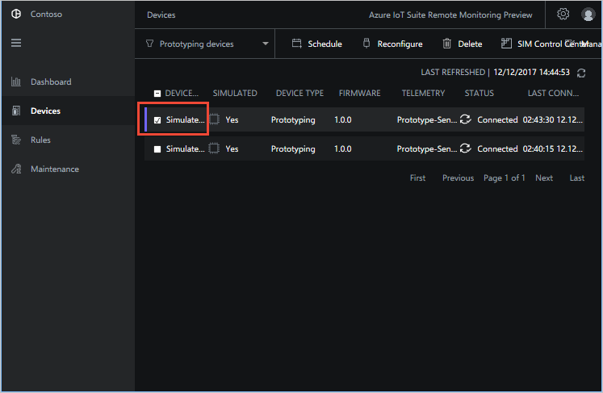

1. Click the **Schedule** button and then choose **Firmware update**. Enter values for **Job name** and **Firmware URI**. Choose **Apply** to schedule the job to run now:

    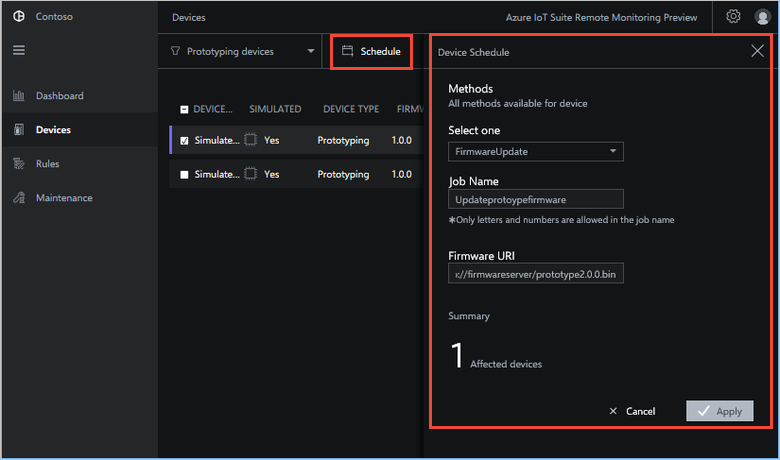

    > [!NOTE]
    > With the simulated devices you can use any URL you like as the **Firemware URI** value. The simulated devices do not access the URL.

1. Note how many devices the job affects and choose **Apply**:

    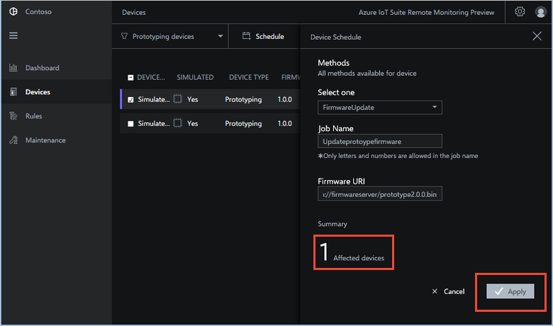

You can use the **Maintenance** page to track the job as it runs.

1. To view the list of jobs, navigate to the **Maintenance** page and click **System status**.

1. Locate the event related to the job you created. Verify that the firmware update process was initiated correctly.

You can create a filter to verify the firmware version update correctly.

1. To create a filter, navigate to the **Devices** page and select **Manage**:

    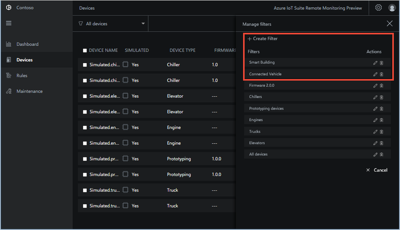

1. Create a filter that includes only devices with the new firmware version:

    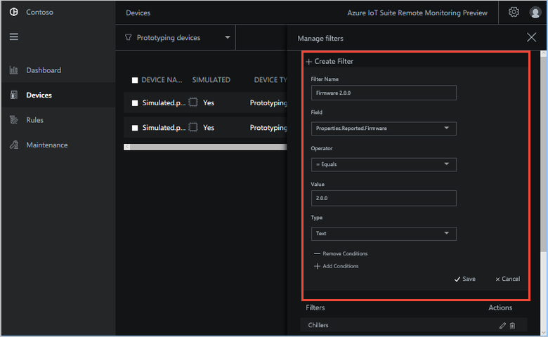

1. Return to the **Devices** page and verify that the device has the new firmware version.

## Organize your assets

Contoso has two different teams for field service activities:

* The Smart Building team manages chillers, elevators, and engines.
* The Smart Vehicle team manages trucks and prototyping devices.

To make it easier as an operator to organize and manage your devices, you want to tag them with the appropriate team name.

You can create tag names to use with devices.

1. To display all the devices, navigate to the **Devices** page and choose the **All devices** filter:

    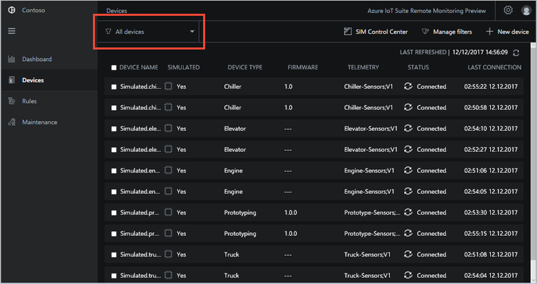

1. Select the **Trucks** and **Prototyping** devices. Then choose **Tag**:

    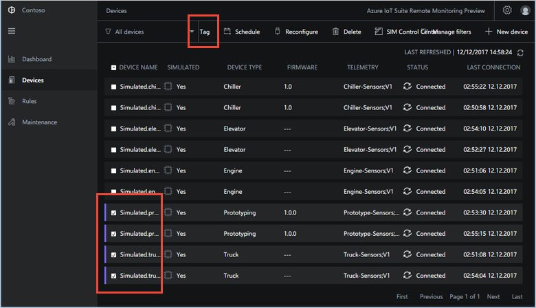

1. Choose **Tag** and then create a new string tag called **FieldService** with a value **ConnectedVehicle**. Choose a name for the job. Then click **Apply**:

    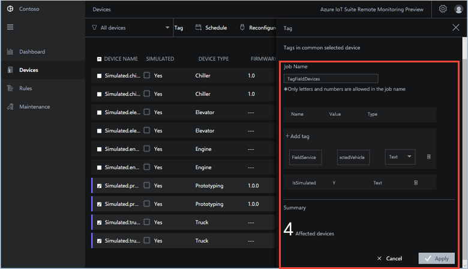

1. Select the **Chiller**, **Elevator**, and **Engine** devices. Then choose **Tag**:

    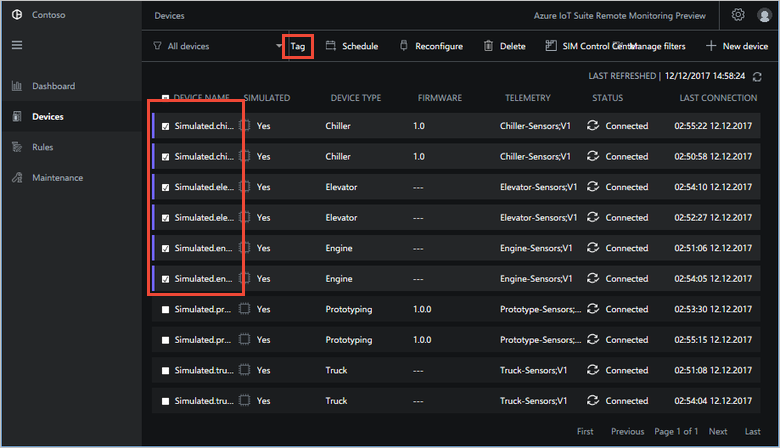

1. Choose **Tag** and then create a new tag called **FieldService** with a value **SmartBuilding**. Choose a name for the job. Then click **Save**:

    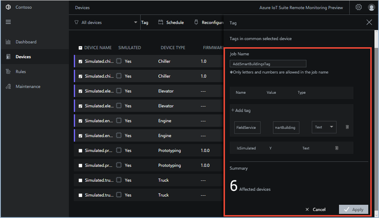

You can use the tag values to create filters.

1. On the **Devices** page, choose **Manage filters**:

    

1. Create a new filter that uses the tag name **FieldService** and value **SmartBuilding**. Save the filter as **Smart Building**.

1. Create a new filter that uses the tag name **FieldService** and value **ConnectedVehicle**. Save the filter as **Connected Vehicle**.

Now the Contoso operator can query devices based on the operating team without the need to change anything on the devices.

## Next steps

In this tutorial, you learned to:

>[!div class="checklist"]
> * Visualize and filter devices on the dashboard
> * Respond to an alarm
> * Update the firmware in your devices
> * Organize your assets

Now that you have explored the remote monitoring solution, the suggested next steps are to learn about the advanced features of the remote monitoring solution:

* [Monitor your devices](./iot-suite-remote-monitoring-monitor.md).
* [Manage your devices](./iot-suite-remote-monitoring-manage.md).
* [Automate your solution with rules](./iot-suite-remote-monitoring-automate.md).
* [Maintain your solution](./iot-suite-remote-monitoring-maintain.md).
