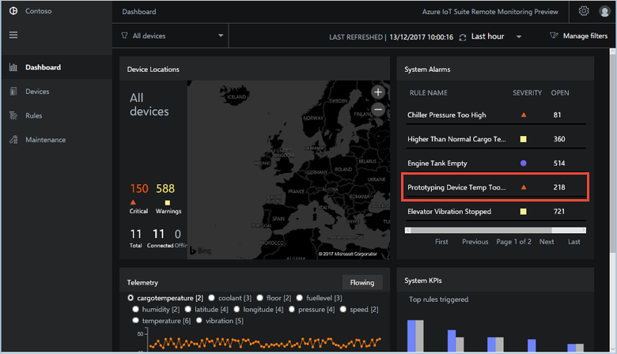
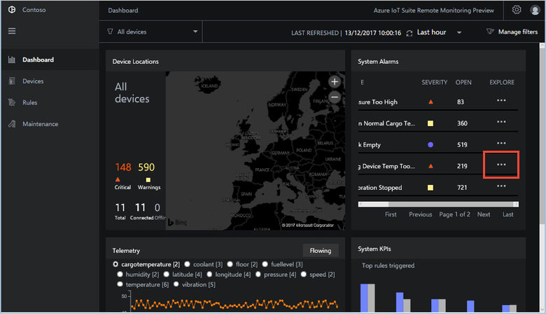
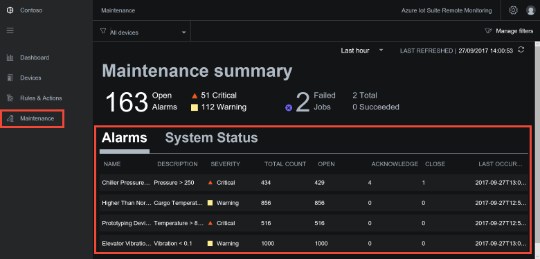
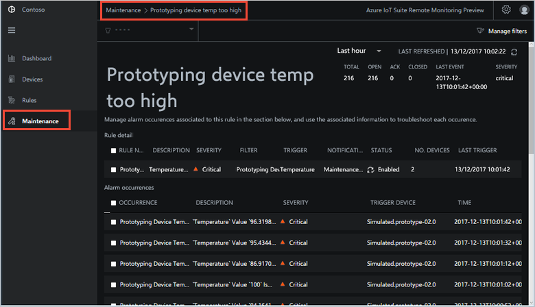
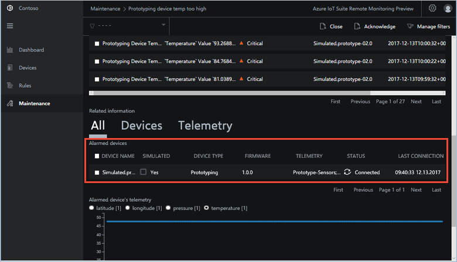
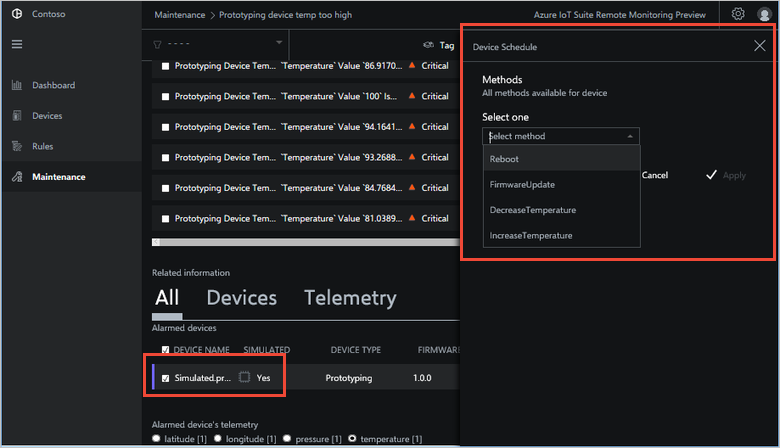
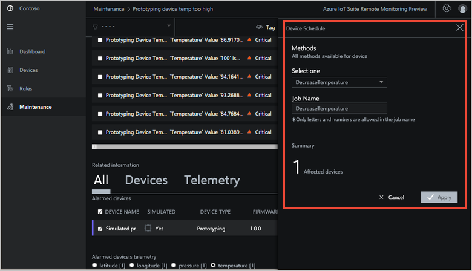
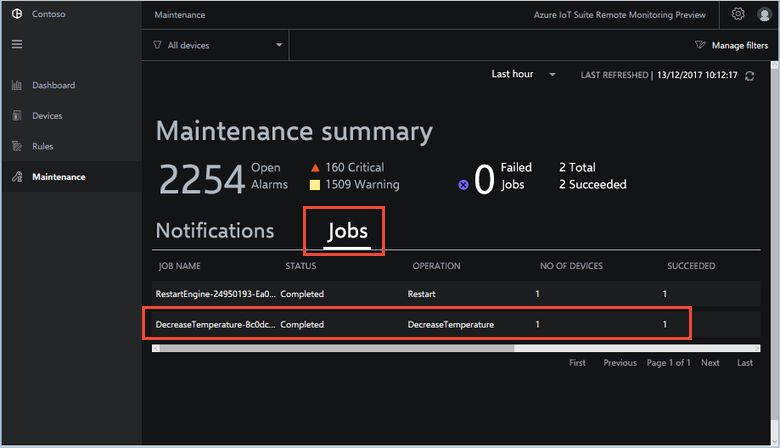
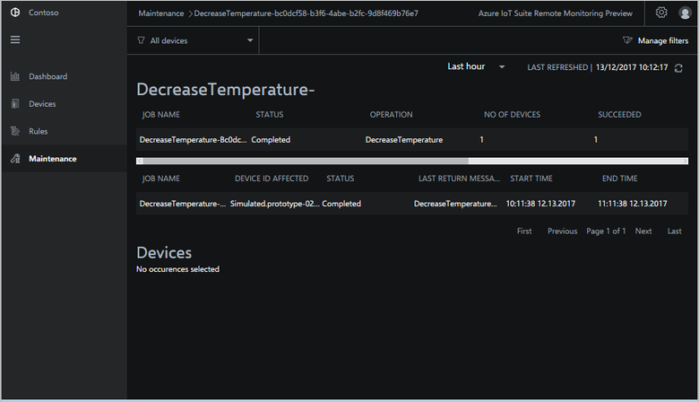

# Troubleshoot and remediate device issues

This tutorial shows you how to use the **Maintenance** page in the solution to troubleshoot and remediate device issues. To introduce these capabilities, the tutorial uses a scenario in the Contoso IoT application.

Contoso is testing a new **Prototype** device in the field. As a Contoso operator, you notice during testing that the **Prototype** device is unexpectedly triggering a temperature alarm on the dashboard. You must now investigate the behavior of this faulty **Prototype** device.

In this tutorial, you learn how to:

>[!div class="checklist"]
> * Use the **Maintenance** page to investigate the alarm
> * Call a device method to remediate the issue

## Prerequisites

To follow this tutorial, you need a deployed instance of the remote monitoring solution in your Azure subscription.

If you haven't deployed the remote monitoring solution yet, you should complete the [Deploy the remote monitoring preconfigured solution](iot-suite-remote-monitoring-deploy.md) tutorial.

## Use the maintenance dashboard

On the **Dashboard** page you notice there are unexpected temperature alarms coming from the rule associated with the **Prototype** devices:

To investigate the issue further, choose the **Explore Alarm** option next to the alarm:

You can now see a list of alarms on the **Maintenance** page:

To display details of the alarm, choose the alarm in the **Alarms** list. The detail view shows:

* When the alarm was triggered
* Status information about the devices associated with the alarm
* Telemetry from the devices associated with the alarm

To acknowledge the alarm, select the **Alarm occurrences** and choose **Acknowledge**. This action enables other operators to see that you have seen the alarm and are working on it.

In the list, you can see the **Prototype** device responsible for firing the temperature alarm:

## Remediate the issue

To remediate the issue with the **Prototype** device, you need to call the **DecreaseTemperature** method on the device.

To act on a device, select it in the list of devices and then choose **Schedule**. The **Engine** device model specifies three methods a device must support:

Choose **DecreaseTemperature** and set the job name to **DecreaseTemperature**. Then choose **Apply**:

To track the status of the job on the **Maintenance** page, choose **System Status**. Use the **System Status** view to track all the jobs and method calls in the solution:

To view the details of a specific job or method call, choose it in the list in the **System Status** view:

## Next steps

In this tutorial, we showed you how to:

<!-- Repeat task list from intro -->
>[!div class="checklist"]
> * Use the **Maintenance** page to investigate the alarm
> * Call a device method to remediate the issue

Now you have learned how to manage device issues, the suggested next step is to learn how to [Test your solution with simulated devices](iot-suite-remote-monitoring-test.md).

<!-- Next tutorials in the sequence -->