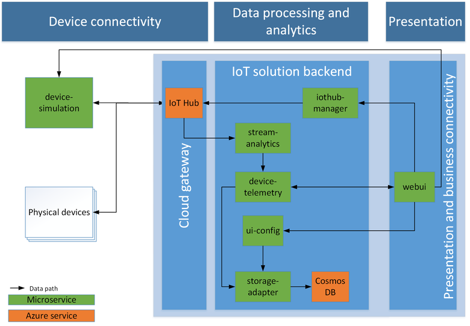

<properties
 pageTitle="Remote Monitoring preconfigured solution walkthrough | Microsoft Azure"
 description="A description of the Azure IoT preconfigured solution remote monitoring and its architecture."
 services=""
 suite="iot-suite"
 documentationCenter=""
 authors="dominicbetts"
 manager="timlt"
 editor=""/>

<tags
 ms.service="iot-suite"
 ms.devlang="na"
 ms.topic="get-started-article"
 ms.tgt_pltfrm="na"
 ms.workload="na"
 ms.date="07/18/2016"
 ms.author="dobett"/>

# Remote monitoring preconfigured solution walkthrough

## Introduction

The IoT Suite remote monitoring [preconfigured solution][lnk-preconfigured-solutions] is an implementation of an end-to-end monitoring solution for multiple machines running in remote locations. The solution combines key Azure services to provide a generic implementation of the business scenario and you can use it as a starting point for you own implementation. You can [customize][lnk-customize] the solution to meet your own specific business requirements.

This article walks you through some of the key elements of the remote monitoring solution to enable you to understand how it works. This knowledge is useful for troubleshooting issues with the solution, for planning how to customize to the solution to meet your own specific requirements, and for planning your own IoT solution that uses Azure services.

## Logical architecture

The following diagram outlines the logical components of the preconfigured solution:




## Simulated devices

In the preconfigured solution, the simulated device represents a cooling device (such as a building air conditioner or facility air handling unit). When you deploy the preconfigured solution you also automatically provision four simulated devices which run in an [Azure WebJob][lnk-webjobs]. The simulated devices make it easy for you to explore the behavior of the solution without the need to deploy any physical devices. To deploy a real physical device, see the [Connect your device to the remote monitoring preconfigured solution][lnk-connectyourdevice] tutorial.

Each simulated device can send the following message types to IoT Hub:

| Message  | Description |
|----------|-------------|
| Startup  | When the device starts, it sends a **device-info** message containing information about itself such as its device id, device metadata, a list of commands the device supports, and the current configuration of the device. |
| Presence | A device periodically sends a **presence** message to report whether or not the device can sense the presence of a sensor. |
| Telemetry | A device periodically sends a **telemetry** message that reports simulated values for the temperature and humidity collected from the simulated sensors connected to the simulated device. |


The simulated devices send the following device properties in a **device-info** message:

| Property               |  Purpose |
|------------------------|--------- |
| Device ID              | Id that is either provided or assigned when a device is created in the solution. |
| Manufacturer           | Device manufacturer |
| Model Number           | Model number of the device |
| Serial Number          | Serial number of the device |
| Firmware               | Current version of firmware on the device |
| Platform               | Platform architecture of the device |
| Processor              | Processor running the device |
| Installed RAM          | Amount of RAM installed on the device |
| Hub Enabled State      | IoT Hub state property of the device |
| Created Time           | Time the device was created in the solution |
| Updated Time           | Last time properties were updated for the device |
| Latitude               | Latitude location of the device |
| Longitude              | Longitude location of the device |

The simulator seeds these properties in simulated devices with sample values.  Each time the simulator initializes a simulated device, the device posts the pre-defined metadata to IoT Hub. Note that this overwrites any metadata updates made in the device portal.


The simulated devices can handle the following commands sent from the solution dashboard through the IoT hub:

| Command                | Description                                         |
|------------------------|-----------------------------------------------------|
| PingDevice             | Sends a _ping_ to the device to check it is alive   |
| StartTelemetry         | Starts the device sending telemetry 				   |
| StopTelemetry          | Stops the device from sending telemetry             |
| ChangeSetPointTemp     | Changes the set point value around which the random data is generated |
| DiagnosticTelemetry    | Triggers the device simulator to send an additional telemetry value (externalTemp) |
| ChangeDeviceState      | Changes an extended state property for the device and sends the device info message from  the device |

The device command acknowledgment to the solution back end is provided through the IoT hub.

## IoT Hub

The [IoT hub][lnk-iothub] ingests data sent from the devices into the cloud and makes it available to the Azure Stream Analytics (ASA) jobs. IoT hub also sends commands to your devices on behalf of the device portal. Each stream ASA jobs uses a separate IoT Hub consumer group to read the stream of messages from your devices.

## Azure Stream Analytics

In the remote monitoring solution, [Azure Stream Analytics][lnk-asa] (ASA) dispatches messages received by the IoT hub from your devices to other back end components for processing or storage. Different ASA jobs perform specific functions based on the content of the messages.

**Job 1: Device Info** filters device information messages from the incoming message stream and sends them to an Event Hub endpoint. A device sends device information messages at start up and in response to a **SendDeviceInfo** command. This job uses the following query definition to identify **device-info** messages:

```
SELECT * FROM DeviceDataStream Partition By PartitionId WHERE  ObjectType = 'DeviceInfo'
```

This job sends its output to an Event Hub for further processing.

**Job 2: Rules** evaluates incoming temperature and humidity telemetry values against per-device thresholds. Threshold values are set in the rules editor available in the solution dashboard. Each device/value pair is stored by timestamp in a blob which Stream Analytics reads in as **Reference Data**. The job compares any non-empty value against the set threshold for the device. If it exceeds the '>' condition, the job outputs an **alarm** event that indicates that the threshold is exceeded and provides the device, value, and timestamp values. This job uses the following query definition to identify telemetry messages that should trigger an alarm:

```
WITH AlarmsData AS 
(
SELECT
     Stream.DeviceID,
     'Temperature' as ReadingType,
     Stream.Temperature as Reading,
     Ref.Temperature as Threshold,
     Ref.TemperatureRuleOutput as RuleOutput,
     Stream.EventEnqueuedUtcTime AS [Time]
FROM IoTTelemetryStream Stream
JOIN DeviceRulesBlob Ref ON Stream.DeviceID = Ref.DeviceID
WHERE
     Ref.Temperature IS NOT null AND Stream.Temperature > Ref.Temperature

UNION ALL

SELECT
     Stream.DeviceID,
     'Humidity' as ReadingType,
     Stream.Humidity as Reading,
     Ref.Humidity as Threshold,
     Ref.HumidityRuleOutput as RuleOutput,
     Stream.EventEnqueuedUtcTime AS [Time]
FROM IoTTelemetryStream Stream
JOIN DeviceRulesBlob Ref ON Stream.DeviceID = Ref.DeviceID
WHERE
     Ref.Humidity IS NOT null AND Stream.Humidity > Ref.Humidity
)

SELECT *
INTO DeviceRulesMonitoring
FROM AlarmsData

SELECT *
INTO DeviceRulesHub
FROM AlarmsData
```

The job sends its output to an Event Hub for further processing and saves details of each alert to blob storage from where the solution dashboard can read the alert information.

**Job 3: Telemetry** operates on the incoming device telemetry stream in two ways. The first sends all telemetry messages from the devices to persistent blob storage for long-term storage. The second computes average, minimum, and maximum humidity values over a five minute sliding window and sends this data to blob storage. The solution dashboard reads the telemetry data from blob storage to populate the charts. This job uses the following query definition:

```
WITH 
    [StreamData]
AS (
    SELECT
        *
    FROM 
      [IoTHubStream] 
    WHERE
        [ObjectType] IS NULL -- Filter out device info and command responses
) 

SELECT
    *
INTO
    [Telemetry]
FROM
    [StreamData]

SELECT
    DeviceId,
    AVG (Humidity) AS [AverageHumidity], 
    MIN(Humidity) AS [MinimumHumidity], 
    MAX(Humidity) AS [MaxHumidity], 
    5.0 AS TimeframeMinutes 
INTO
    [TelemetrySummary]
FROM
    [StreamData]
WHERE
    [Humidity] IS NOT NULL
GROUP BY
    DeviceId, 
    SlidingWindow (mi, 5)
```

## Event Hubs

The **device info** and **rules** ASA jobs output their data to Event Hubs to reliably forward on to the **Event Processor** running in the WebJob.

## Azure storage

The solution uses Azure blob storage to persist all the raw and summarized telemetry data from the devices in the solution. The dashboard reads the telemetry data from blob storage to populate the charts. To display alerts, the dashboard reads the data from blob storage that records when telemetry values exceeded the configured threshold values. The solution also uses blob storage to record the threshold values set by a user in the dashboard.

## WebJobs

In addition to hosting the device simulators, the WebJobs in the solution also host the **Event Processor** running in an Azure WebJob that handles device information messages and command responses. It uses:

- Device information messages to update the device registry (stored in the DocumentDB database) with the current device information.
- Command response messages to update the device command history (stored in the DocumentDB database).

## DocumentDB

The solution uses a DocumentDB database to store information about the devices connected to the solution such as device metadata and the history of commands sent to the devices from the dashboard.

## Web apps

### Remote monitoring dashboard
This page in the web application uses PowerBI javascript controls (See [PowerBI-visuals repo](https://www.github.com/Microsoft/PowerBI-visuals)) to visualize the telemetry data from the devices. The solution uses the ASA telemetry job to write the telemetry data to blob storage.


### Device administration portal

This web app enables you to:

- Provision a new device. This sets the unique device id and generates the authentication key. It writes information about the device both to the IoT Hub identity registry and to the solution specific DocumentDB database.
- Manage device properties. This includes viewing existing properties and updating with new properties.
- Send commands to a device.
- View the command history for a device.
- Enable and disable devices.

## Next steps

The following TechNet blog posts provide more detail about the remote monitoring preconfigured solution:

- [IoT Suite - Under The Hood - Remote Monitoring](http://social.technet.microsoft.com/wiki/contents/articles/32941.iot-suite-under-the-hood-remote-monitoring.aspx)
- [IoT Suite - Remote Monitoring - Adding Live and Simulated Devices](http://social.technet.microsoft.com/wiki/contents/articles/32975.iot-suite-remote-monitoring-adding-live-and-simulated-devices.aspx)


[lnk-preconfigured-solutions]: iot-suite-what-are-preconfigured-solutions.md
[lnk-customize]: iot-suite-guidance-on-customizing-preconfigured-solutions.md
[lnk-connectyourdevice]: iot-suite-connecting-devices.md
[lnk-iothub]: https://azure.microsoft.com/documentation/services/iot-hub/
[lnk-asa]: https://azure.microsoft.com/documentation/services/stream-analytics/
[lnk-webjobs]: https://azure.microsoft.com/documentation/articles/websites-webjobs-resources/