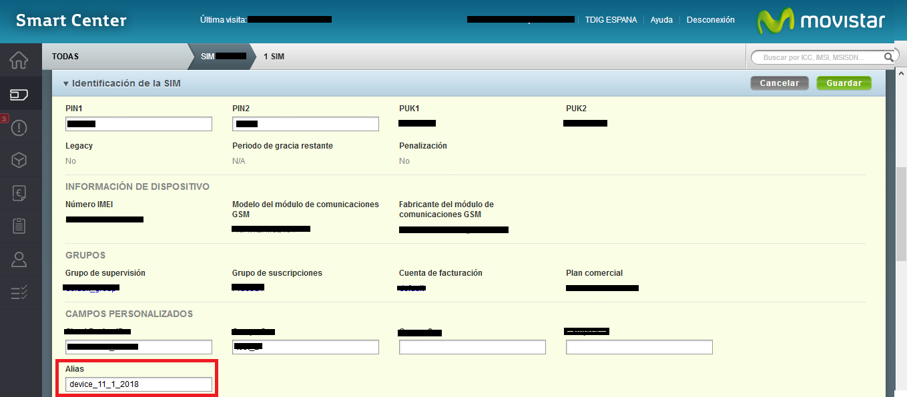
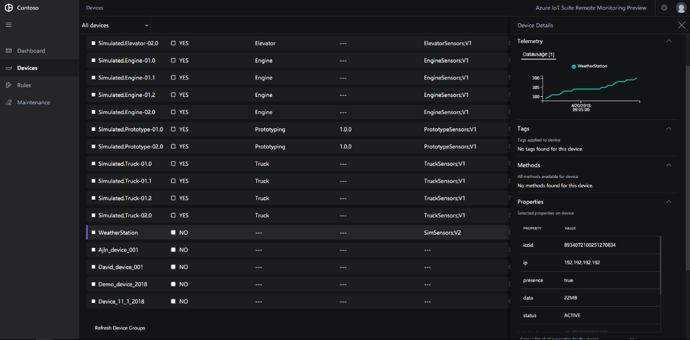

# Integrate SIM data in the Remote Monitoring solution

## Overview
IoT devices often connect to the cloud using a SIM card that allows them to send data streams from anywhere. The Azure IoT Remote Monitoring solution allows the integration of SIM Management data, so that operators can also track the health of the device through the data provided by the SIM. 
Remote Monitoring provides out of the box integration with Telefonica IoT, allowing customers using its IoT Connectivity Platform synchronize their device SIMs connectivity data the solutions. This solution can be extended to support other telephone company providers through GitHub repository.
In this tutorial, you learn how to:
* Integrate SIM data into the Remote Monitoring solution
* View real-time telemetry
* View SIM data 

## Telefonica IoT Integration Setup

### Prerequisites
To sync your connectivity data into Azure Remote Monitoring Solution, follow these steps:

1.	Fill a request at [Telefonica’s site](https://iot.telefonica.com/contact), select the option **Azure Remote Monitoring**, including your contact data.
2.	Telefonica will activate your account. 
3.	If you are not a Telefónica client yet and you want to enjoy this or other IoT Connectivity Cloud Ready services, visit [Telefonica’s site](https://iot.telefonica.com/contact) and select the option **Connectivity**.

### Telefonica SIM setup
Telefónica SIM & Azure Twin device ID association will be based on Telefónica IoT SIM "alias" property. 

Navigate to [Telefónica IoT Connectivity Platform Portal](https://m2m-movistar-es.telefonica.com/) > SIM Inventory > Select your SIM,and update each SIM “alias” with your desired Twin deviceID. 

This task can also be done in bulk mode (refer to Telefónica IoT Connectivity Platform user manuals)

To connect your device to the Remote Monitoring, you can follow these tutorials using [C](iot-suite-connecting-devices-linux.md) or [Node](iot-suite-connecting-devices-node.md). 

## View device telemetry and SIM Properties
Once your Telefonica account is properly configured and your device is connected, you can view device details and SIM data.
The following connectivity parameters can be published:
* ICCID
* IP
* Network presence
* SIM Status
* Network-based location
* Consumed data traffic

 
## Next steps

Now that you have an overview of how to integrate SIM Data into Azure IoT Remote Monitoring, here are suggested next steps for solutions accelerators:

* [Operate the Azure IoT Remote Monitoring solution](iot-suite-remote-monitoring-explore.md)
* [Perform advanced monitoring](iot-suite-remote-monitoring-monitor.md)
* [Manage your devices](iot-suite-remote-monitoring-manage.md)
* [Troubleshoot device issues](iot-suite-remote-monitoring-maintain.md)

