---
# Mandatory fields. See more on aka.ms/skyeye/meta.
title: Visualize Device Data with Time Series Insights | Microsoft Docs
description: Learn how to set up a Time Series Insights environment, then explore and analyze the time series data of your IoT solutions or connected things.
services: ''
suite: iot-suite
author: philmea
manager: timlt
ms.author: philmea
ms.date: 04/16/2018
ms.topic: article
ms.service: iot-suite
---
# Visualize Device Data with Time Series Insights

An operator may want to further extend the out of the box data visualization provided by RM. Our solution accelerator provides out of the box integration with TSI. In this how-to you will learn how to to configure Time Series Insights to analyze device telemetry and detect anomalies.

## Prerequisites

To complete this how-to, you should have the following:

* An active Azure subscription.
* A provisioned remote monitoring preconfigured solution. You can follow these directions to [deploy the remote monitoring preconfigured solution](/iot-suite/iot-suite-remote-monitoring-deploy).

## Create a consumer group in your IoT hub

You will need to create a dedicated consumer group in your IoT hub to be used for streaming data to Time Series Insights.

[!NOTE] Consumer groups are used by applications to pull data from Azure IoT Hub. Each consumer group allows up to five output consumers. You should create a new consumer group for every five output sinks and you can create up to 32 consumer groups.

1. In the Azure portal, click the Cloud Shell button.

1. Execute the following command to create a new consumer group:

```azurecli-interactive
az iot hub consumer-group create --hub-name contoso-rm30526 --name timeseriesinsights --resource-group contoso-rm
```

## Create a new Time Series Insights environment

Azure Time Series Insights is a fully managed analytics, storage, and visualization service for managing IoT-scale time-series data in the cloud. It provides massively scalable time-series data storage and enables you to explore and analyze billions of events streaming in from all over the world in seconds. Use Time Series Insights to store and manage terabytes of time-series data, explore, and visualize billions of events simultaneously, conduct root-cause analysis, and to compare multiple sites and assets.

1. Sign in to the [Azure portal](http://portal.azure.com/).

1. Select **Create a resource** > **Internet of Things** > **Time Series Insights**.

    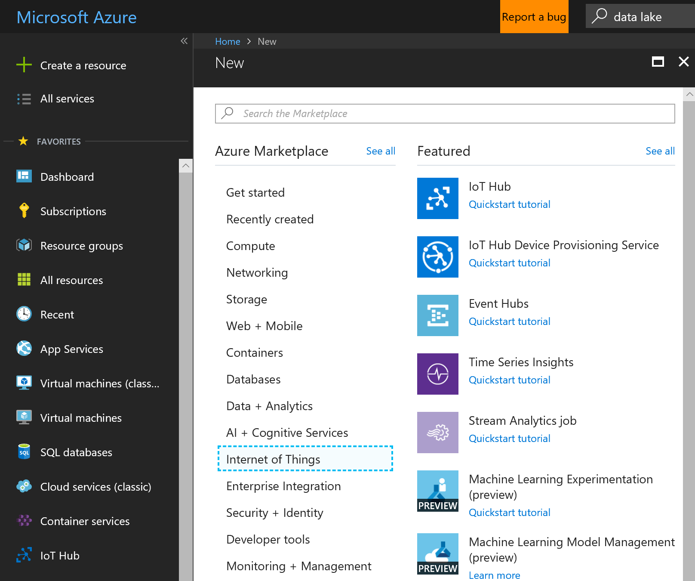

1. To create your Time Series Insights environment, use the values in the following table:

    | Setting | Value |
    | ------- | ----- |
    | Environment Name | The following screenshot uses the name **howto-iot-tsi**. Choose your own unique name when you complete this step. |
    | Subscription | Select your Azure subscription in the drop-down. |
    | Resource group | **Create new**. We are using the name **howto-rg**. |
    | Location | We are using **East US**. Create your environment in the same region as your Remote Monitoring solution. |
    | Sku |**S1** |
    | Capacity | **1** |
    | Pin to dashboard | **Yes** |

    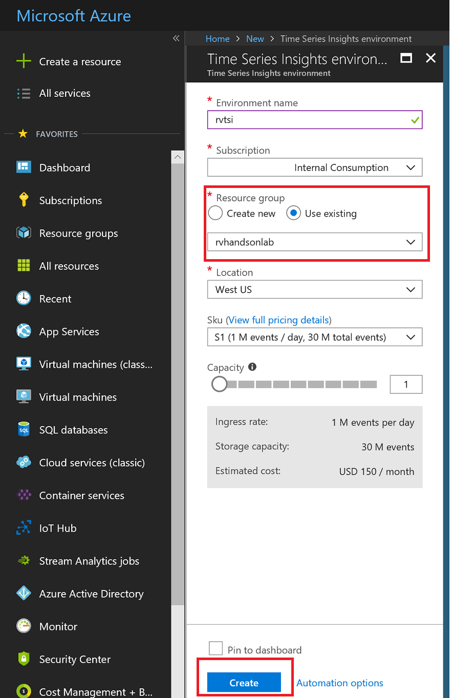

1. Click **Create**. It can take a moment for the environment to be created.

1. Make a note of the Time Series Insights environment name you chose.

## Create Event Source

Create a new Event Source to connect to your IoT hub. Make sure that you use the consumer group created in the previous steps. Time Series Insights requires each service to have a dedicated consumer group not in use by another service.

1. Navigate to your new Time Series Environment.

1. On the left, select **Event Sources** and then click **Add**.

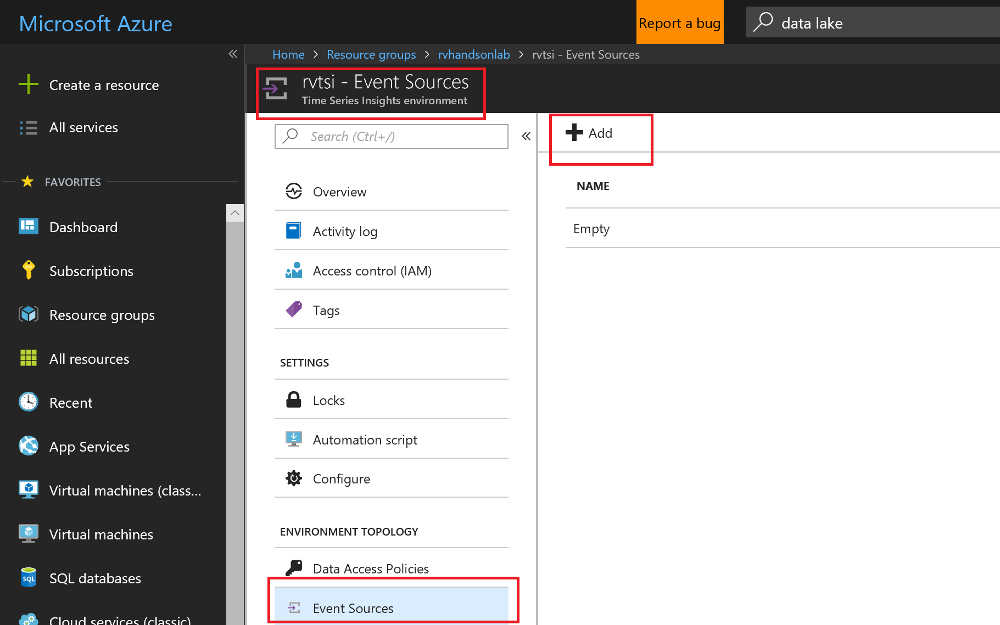

1. To configure your IoT hub as a new event source, use the values in the following table:

    | Setting | Value |
    | ------- | ----- |
    | Event source Name | The following screenshot uses the name **howto-iot-hub**. Use your own unique name when you complete this step. |
    | Source | **IoT Hub** |
    | Import option | **Use IoT Hub from available subscriptions** |
    | Subscription Id | Select your Azure subscription in the drop-down. |
    | Iot hub name | **howto-iot-hub**. Use the name of your IoT hub from your Remote Monitoring solution. |
    | Iot hub policy name | **iothubowner** Ensure the policy used is an owner policy. |
    | Iot hub policy key | This field is populated automatically. |
    | Iot hub consumer group | **timeseriesinsights** |
    | Event serialization format | **JSON**     | Timestamp property name | Leave blank |

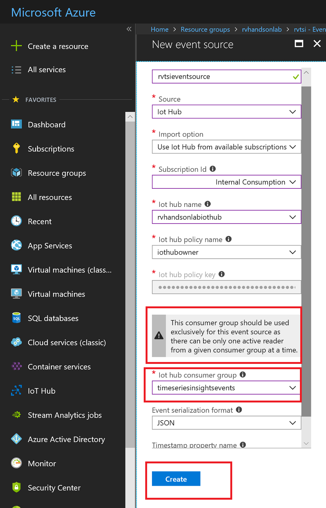

1. Click **Create**.

## Configure data access

To allow additional users to explorer data in Time Series Insights, configure your Data Access Policy with the appropriate permissions.

[!NOTE] A user will see a Data Access Policy Error if they don't have permission to explore the data.

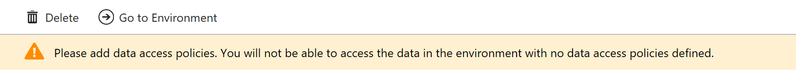

1. Navigate to the Environment Topology and select **Data Access Policies**.

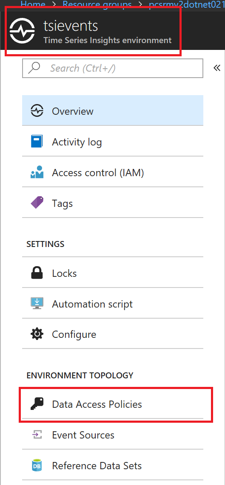

1. Click **Add**.

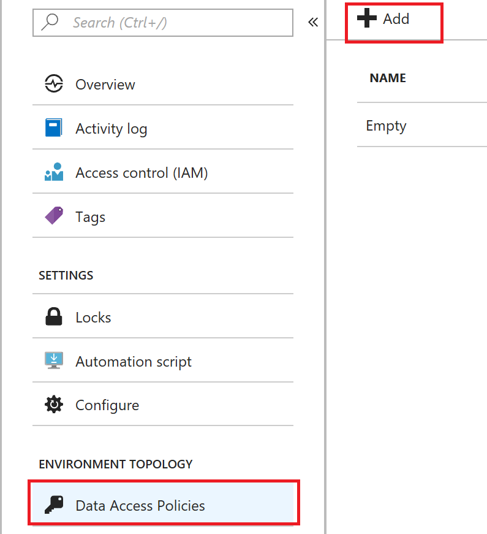

1. Click **Select role** and select the **Contributor** role.

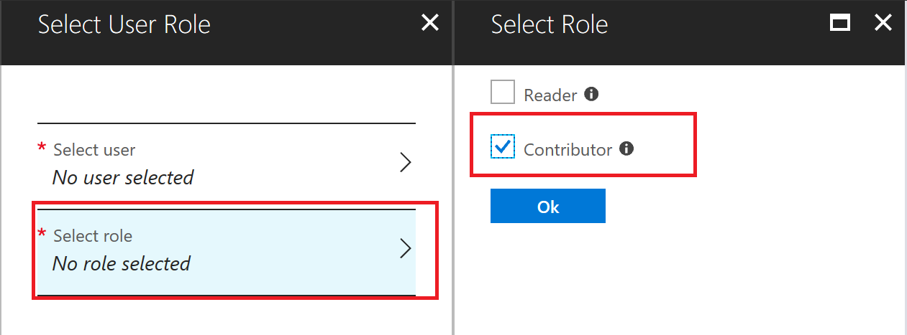

1. Click **Select user**, search for your user name or email address, then click **Select**.

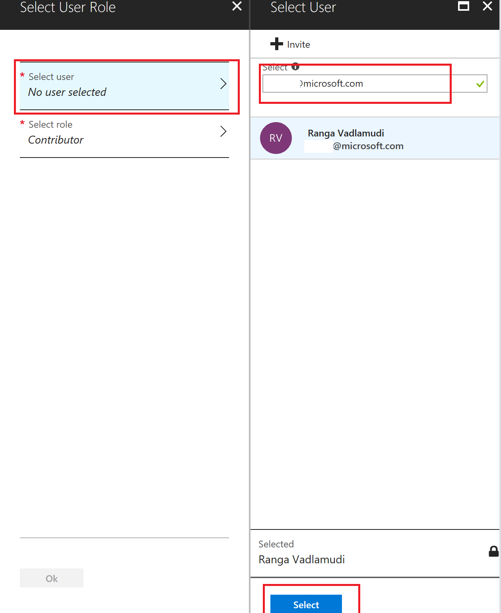

For more information on Time Series Insights data access policies, see [Grant data access to a Time Series Insights environment using Azure portal](https://docs.microsoft.com/en-us/azure/time-series-insights/time-series-insights-data-access).

## Time Series Insights Explorer

The Time Series Insights explorer is a web app that helps you create visualizations of your data.

1. Select the **Overview** tab.

1. Click **Go To Environment**, which will open the Time Series Insights explorer web app.

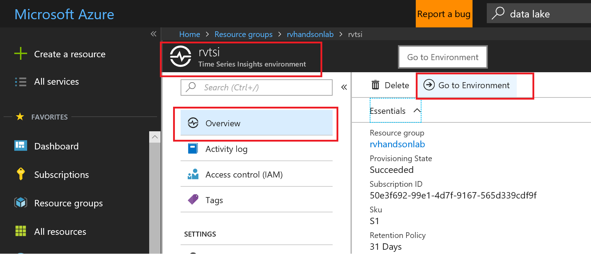

1. Select Temperature and Split By ID


1. Right Click to Explore events

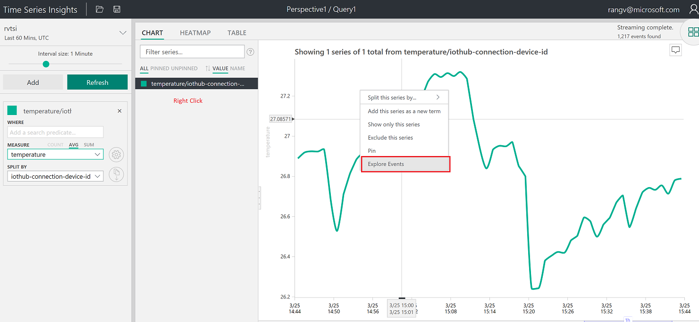

1. Explore Events in Tabular format

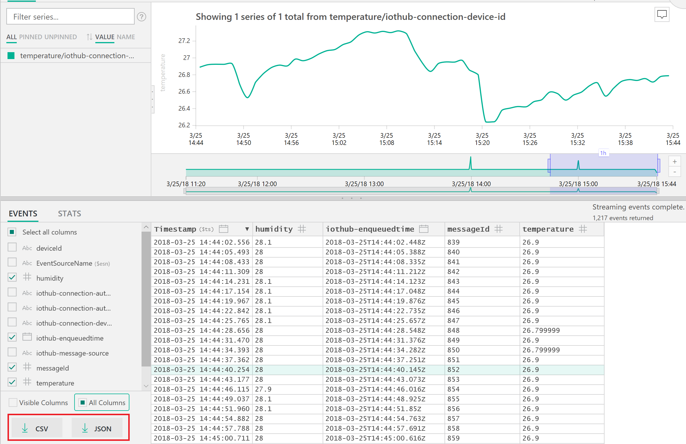

1. Create a perspective with various charts

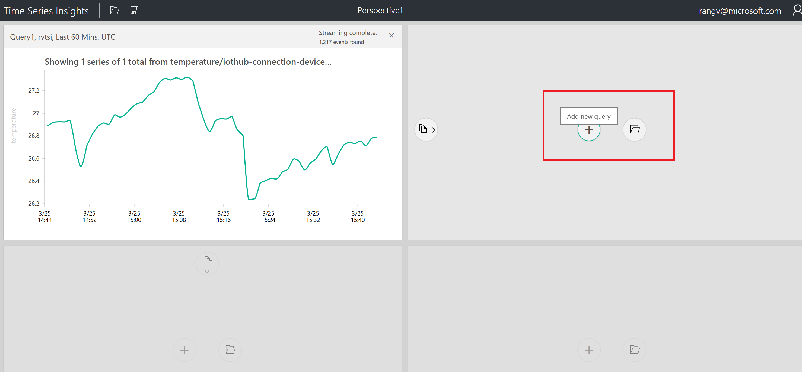

1. Select Humidity and ID

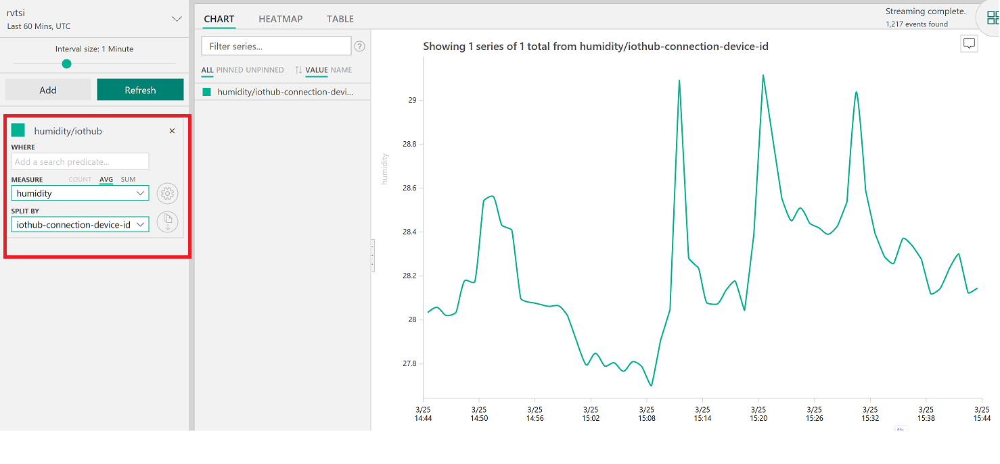

1. Create a chart by selecting a timeframe with drag feature

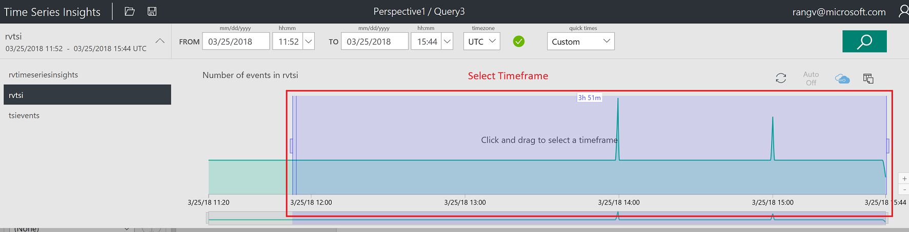

1. Create 3rd Chart by adding a predicate

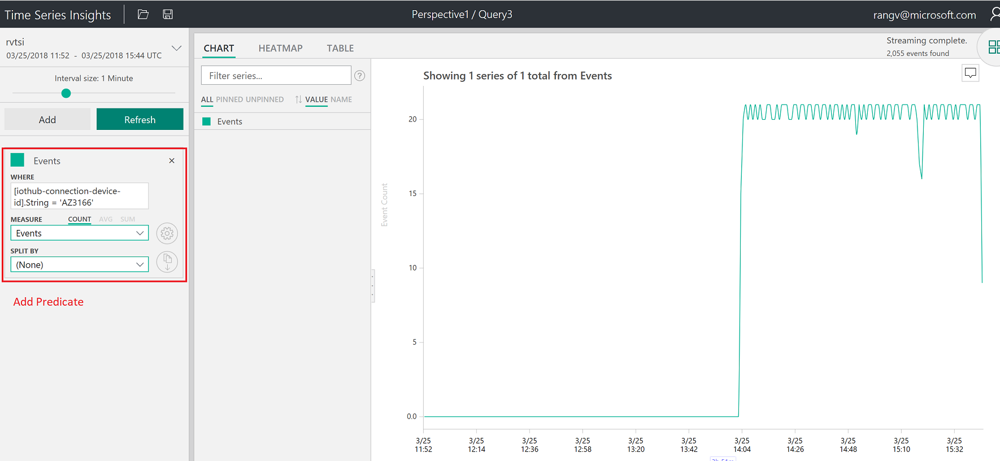

1. Perspective with 4 different charts

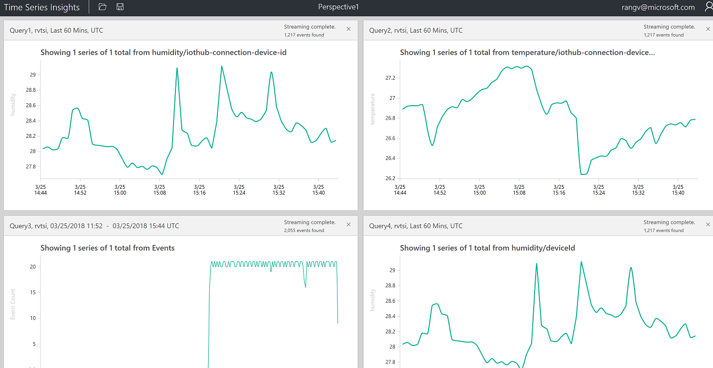

To learn about how to explore and query data in the Time Series Insights explorer, see [Azure Time Series Insights explorer](https://docs.microsoft.com/azure/time-series-insights/time-series-insights-explorer).