# Build a project in Azure using Jenkins and Azure Container Instances

Azure Container Instances makes it easy for you to get up and running without having to provision virtual machines or adopt a higher-level service. Azure Container Instances provides per-second billing based on the capacity you need; making it an attractive option for transient workloads such as performing a build.

You learn how to:
> [!div class="checklist"]
> * Install and configure a Jenkins server on Azure
> * Install and configure the Azure Container Agents plugin for Jenkins
> * Use Azure Container Instances to build the [Spring PetClinic Sample Application](https://github.com/spring-projects/spring-petclinic)

## Prerequisites

- **Azure subscription** - To learn about Azure purchase options, see [How to buy Azure](https://azure.microsoft.com/pricing/purchase-options/) or [Free one-month trial](https://azure.microsoft.com/pricing/free-trial/).

- **Azure CLI 2.0 or Azure Cloud Shell** - Install one of the following products into which to enter Azure commands:

    - [Azure CLI 2.0](/cli/azure/install-azure-cli?view=azure-cli-latest) - Allows you to run Azure commands from a command or terminal window.
    - [Azure Cloud Shell](/azure/cloud-shell/quickstart.md) - Browser-based shell experience. Cloud Shell enables access to a browser-based command-line experience built with Azure management tasks in mind.

## Install a Jenkins server on Azure using the Jenkins Marketplace image

Jenkins supports a model where the Jenkins server delegates work to one or more agents to allow a single Jenkins installation to host a large number of projects or to provide different environments needed for builds or tests. The steps in this section guide you through installing and configuring a Jenkins server on Azure.

[!INCLUDE [jenkins-install-from-azure-marketplace-image](../../includes/jenkins-install-from-azure-marketplace-image.md)]

## Connect to the Jenkins server running on Azure

Once you've installed Jenkins on Azure, you need to connect to Jenkins. The following steps walk you through setting up an SSH connection to the Jenkins VM running on Azure. 

[!INCLUDE [jenkins-connect-to-jenkins-server-running-on-azure](../../includes/jenkins-connect-to-jenkins-server-running-on-azure.md)]

## Update Jenkins DNS

Jenkins needs to know its own URL when it is creating links that point back to itself. For example, the URL needs to be used when Jenkins sends emails containing direct links to build results. 

This section walks you through setting the Jenkins URL.

1. In your browser, navigate to the Jenkins dashboard at `http://localhost:8080`.

1. Select **Manage Jenkins**.

    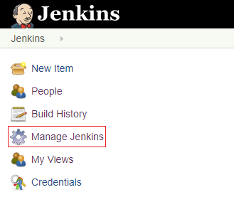

1. Select **Configure System**.

    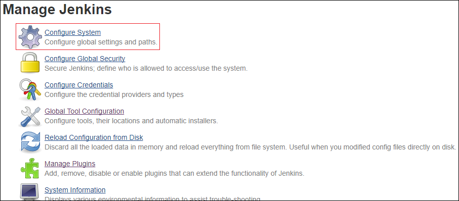

1. Under **Jenkins Location**, enter the URL of your Jenkins server.

1. Select **Save**.

## Update Jenkins to allow Java Network Launch Protocol (JNLP)

> [!NOTE]
> This tutorial illustrates how to configure a JNLP agent. From version 0.4.x onwards, the [Jenkins Azure Container Agents plugin](https://plugins.jenkins.io/azure-container-agents) also supports SSH.
>
>

The Jenkins agent connects with the Jenkins server via the Java Network Launch Protocol (JNLP). This section explains how to specify a port for JNLP agents to use when communicating with the Jenkins server.

1. In the Jenkins dashboard, select **Manage Jenkins**.

    

1. Select **Configure Global Security**.

    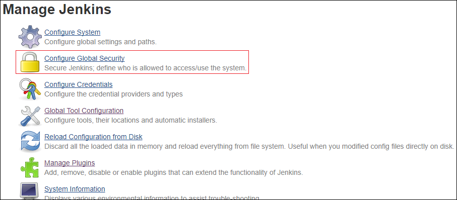

1. Under **Agents**, select **Fixed**, and enter a port. The screen shot shows a port value of 12345 as an example. You should specify a port that makes sense for your environment.

    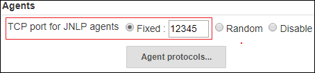

1. Select **Save**.

1. Using either Azure CLI 2.0 or Cloud Shell, enter the following command to create an inbound rule for your Jenkins network security group:

    ```azurecli
    az network nsg rule create  \
    --resource-group JenkinsResourceGroup \
    --nsg-name JenkinsNSG  \
    --name allow-https \
    --description "Allow access to port 12345 for HTTPS" \
    --access Allow \
    --protocol Tcp  \
    --direction Inbound \
    --priority 102 \
    --source-address-prefix "*"  \
    --source-port-range "*"  \
    --destination-address-prefix "*" \
    --destination-port-range "12345"
    ```

## Create and add an Azure service principal to the Jenkins credentials

You need an Azure service principal to deploy to Azure. The following steps guide you through the process of creating a service principal (if you don't already have one), and updating Jenkins with your service principal.

1. If you already have a service principal (and know its subscription ID, tenant, appId, and password), you can skip this step. If you need to create a security principal, refer to the article [Create an Azure service principal with Azure CLI 2.0](/cli/azure/create-an-azure-service-principal-azure-cli?view=azure-cli-latest). While creating the principal, make note of the values for the subscription ID, tenant, appId, and password.

1. Select **Credentials**.

    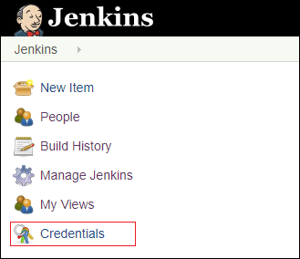

1. Under **Credentials**, select **System**.

    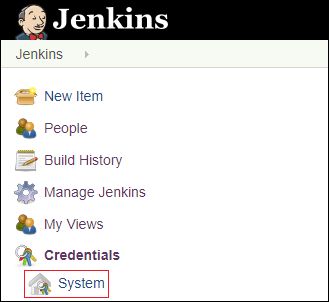

1. Select **Global credentials (unrestricted)**.

    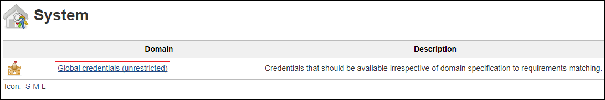

1. Select **Adding some credentials**.

    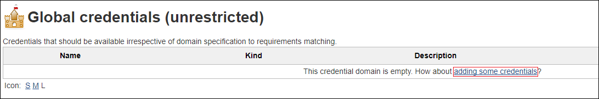

1. In the **Kind** dropdown list, select **Microsoft Azure Service Principal** to cause the page to display fields specific to adding a service principal. Then, supply the requested values as follows:

    - **Scope** - Select the option for **Global (Jenkins, nodes, items, all child items, etc.)**.
    - **Subscription ID** - Use the Azure subscription ID you specified when running `az account set`.
    - **Client ID** - Use the `appId` value returned from `az ad sp create-for-rbac`.
    - **Client Secret** - Use the `password` value returned from `az ad sp create-for-rbac`.
    - **Tenant ID** - Use the `tenant` value returned from `az ad sp create-for-rbac`.
    - **Azure Environment** - Select `Azure`.
    - **ID** - Enter `myTestSp`. This value is used again later in this tutorial.
    - **Description** - (Optional) Enter a description value for this principal.

    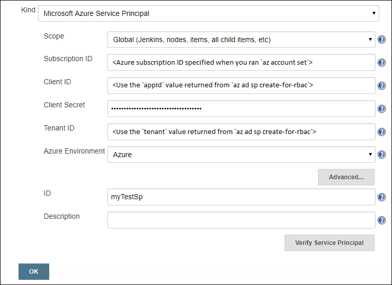

1. Once you have entered the information defining the principal, you can optionally select **Verify Service Principal** to ensure that everything is working correctly. If your service principal is correctly defined, you see a message stating, "Successfully verified the Microsoft Azure Service Principal." below the **Description** field.

1. When you are finished, select **OK** to add the principal to Jenkins. The Jenkins dashboard displays the newly added principal on the **Global Credentials** page.

## Create an Azure resource group for your Azure Container Instances

Azure Container Instances must be placed in an Azure resource group. An Azure resource group is a container that holds related resources for an Azure solution.

Using either Azure CLI 2.0 or Cloud Shell, enter the following command to create a resource group called `JenkinsAciResourceGroup` in location `eastus`:

```azurecli
az group create --name JenkinsAciResourceGroup --location eastus
```

When finished, the `az group create` command displays results similar to the following example:

```JSON
{
  "id": "/subscriptions/<subscriptionId>/resourceGroups/JenkinsAciResourceGroup",
  "location": "eastus",
  "managedBy": null,
  "name": "JenkinsAciResourceGroup",
  "properties": {
    "provisioningState": "Succeeded"
  },
  "tags": null
}
```

## Install the Azure Container Agents plugin for Jenkins

If you've already installed the Azure Container Agents plugin, you can skip this section.

Once you have the Azure resource group created for your Jenkins agent, the following steps illustrate how to install the Azure Container Agents plugin:

1. In the Jenkins dashboard, select **Manage Jenkins**.

    

1. Select **Manage Plugins**.

    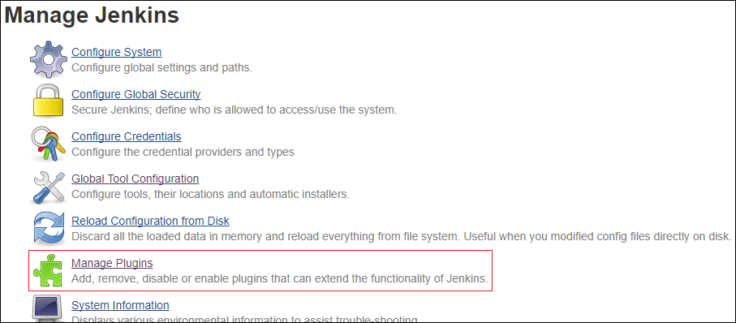

1. Select **Available**.

    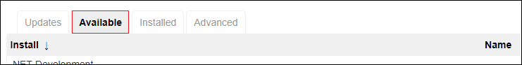

1. Enter `Azure Container Agents` into the **Filter** text box. (The list filters as you enter the text.)

    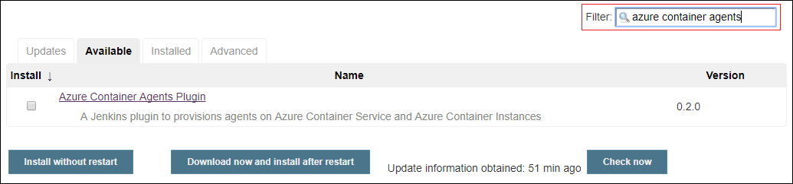

1. Select the checkbox next to the **Azure Container Agents** plugin, and one of the install options. For purposes of this demo, I've selected the **Install without restart** option.

    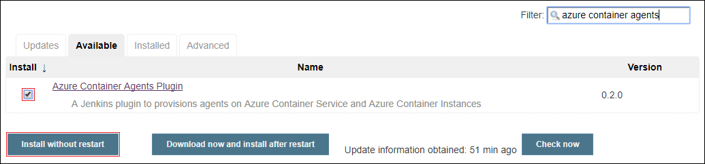

1.  After selecting the option to install the desired plugin(s), the Jenkins dashboard displays a page detailing the status of what you're installing.

    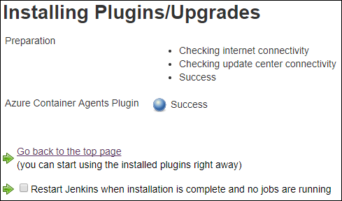

    To return the main page of the Jenkins dashboard, select **Go back to the top page**.

## Configure the Azure Container Agents plugin

Once the Azure Container Agents plugin is installed, this section guides you through configuring the plugin within the Jenkins dashboard.

1. In the Jenkins dashboard, select **Manage Jenkins**.

    

1. Select **Configure System**.

    

1. Locate the **Cloud** section at the bottom of the page, and from the **Add a new cloud** dropdown list, select **Azure Container Instance**.

    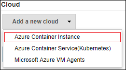

1. In the **Azure Container Instance** section, specify the following values:

    - **Cloud name** - (Optional as this value defaults to an auto-generated name.) Specify a name for this instance. 
    - **Azure Credential** - Select the dropdown arrow, and then select the `myTestSp` entry that identifies the Azure service principal you created earlier.
    - **Resource Group** - Select the dropdown arrow, and then select the `JenkinsAciResourceGroup` entry that identifies the Azure Container Instance resource group you created earlier.

    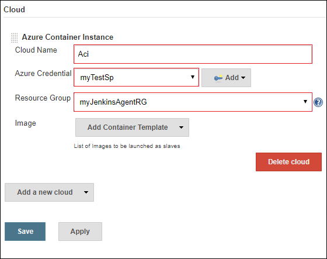

1. Select the **Add Container Template** dropdown arrow, and then select **Aci Container Template**.

1. In the **Aci container Template** section, specify the following values:

    - **Name** - Enter `ACI-container`.
    - **Labels** - Enter `ACI-container`.
    - **Docker Image** - Enter `cloudbees/jnlp-slave-with-java-build-tools`

    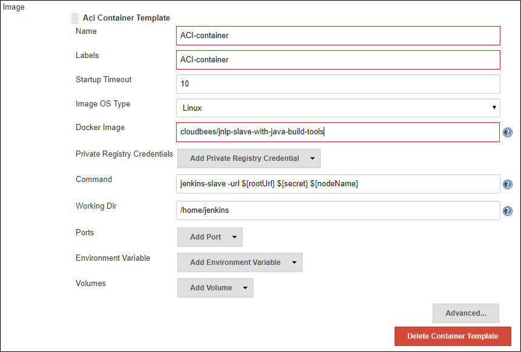

1. Select **Advanced**.

1. Select the **Retention Strategy** dropdown arrow, and select **Container Idle Retention Strategy**. By selecting this option, Jenkins keeps the agent up until no new job is executed on the agent and the specified idle time has elapsed.

    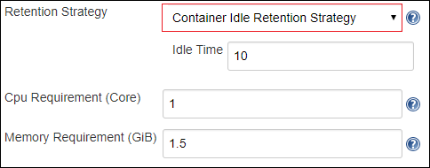

1. Select **Save**.

## Create the Spring PetClinic Application job in Jenkins

The following steps guide you through creating a Jenkins job - as a freestyle project - to build the Spring PetClinic Application.

1. In the Jenkins dashboard, select **New Item**.

    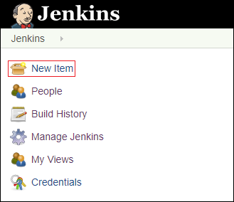

1. Enter `myPetClinicProject` for the item name, and select **Freestyle project**.

    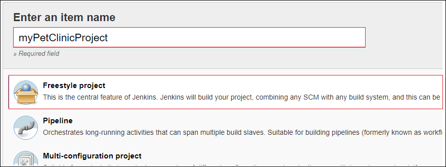

1. Select **OK**.

1. Select the **General** tab, and specify the following values:

    - **Restrict where project can be run** - Select this option.
    - **Label Expression** - Enter `ACI-container`. When you exit the field, a message displays confirming that the label is served by the cloud configuration created in the previous step.

    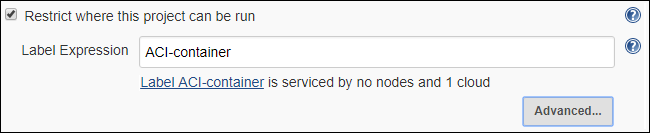

1. Select the **Source Code Management** tab, and specify the following values:

    - **Source Code Management** - Select **Git**.
    - **Repository URL** - Enter the following URL for the Spring PetClinic Sample Application GitHub repo: `https://github.com/spring-projects/spring-petclinic.git`.

1. Select the **Build** tab, and perform the following tasks:

    - Select the **Add build step** dropdown arrow, and select **Invoke top-level Maven targets**.

    - For **Goals**, enter `package`.

1. Select **Save** to save the new project definition.

## Build the Spring PetClinic Application job in Jenkins

It's time to build your project! This section explains how to build a project from the Jenkins dashboard.

1. In the Jenkins dashboard, select `myPetClinicProject`.

    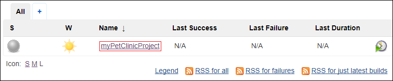

1. Select **Build now**. 

    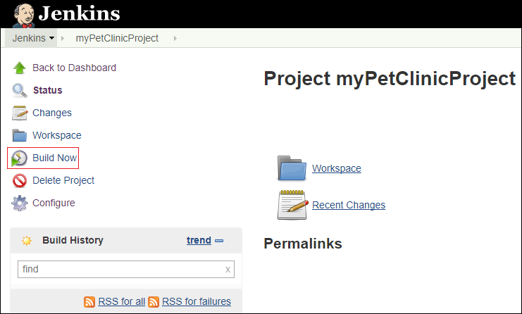

1. When you start a build in Jenkins, the build is queued. In the case of an Azure Container Agent, the build can't be run until the Azure Container Agent is started and brought online. Until then, you see a message indicating the agent name and the fact that the build is pending. (This process takes about five minutes, but is only necessary the first time you use the agent for a build. Subsequent builds are much faster as the agent is online at that point.)

    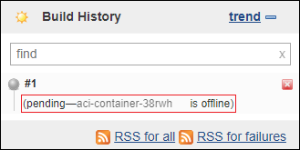

    Once the build starts, a barber pole progress bar indicates that the build is running:

    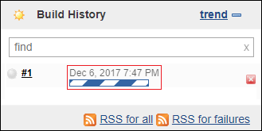

1. When the barber pole progress bar disappears, select the arrow next to the build number. From the context menu, select **Console output**.

    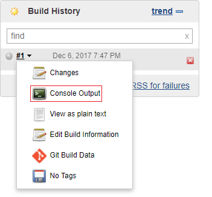

1. The console log information emitted from the build process. To view all the build information (including information about the build being performed remotely on the Azure agent you created), select **Full log**.

    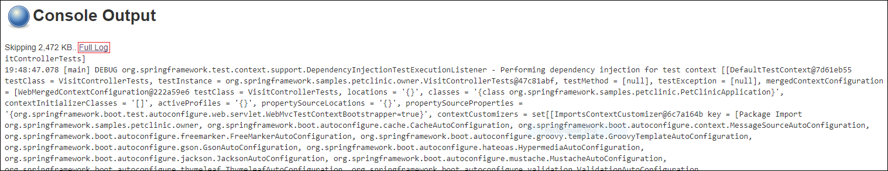

    The full log displays more verbose build information:

    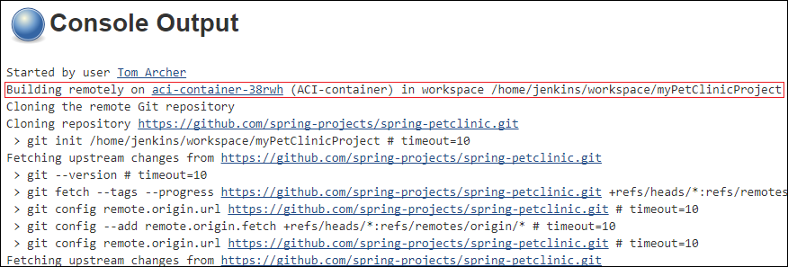
    
1. To view the build's disposition, scroll to the bottom of the log.

    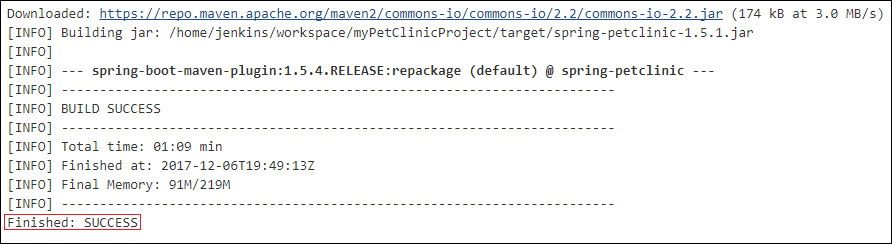

## Clean up Azure resources

In this tutorial, you created resources contained within two Azure resource groups: 
    - `JenkinsResourceGroup` - Contains the Azure resources for the Jenkins server.
    - `JenkinsAciResourceGroup` - Contains the Azure resources for the Jenkins agent.
    
If you no longer need to use any of the resources in an Azure resource group, you can delete the resource group using the `az group delete` command as follows (replacing the &lt;resourceGroup> placeholder with the name of the resource group you want to delete):

```azurecli
az group delete -n <resourceGroup>
```

## Next steps
> [!div class="nextstepaction"]
> [Visit the Jenkins on Azure hub to see the latest articles and samples](https://docs.microsoft.com/azure/jenkins/)