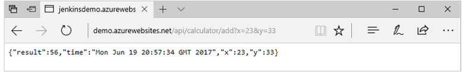

# Deploy to Azure App Service by using the Jenkins plugin 

To deploy a Java web app to Azure, you can use the Azure CLI in [Jenkins Pipeline](/azure/jenkins/execute-cli-jenkins-pipeline) or you can use the [Azure App Service Jenkins plugin](https://plugins.jenkins.io/azure-app-service). 
The Jenkins plugin version 1.0 supports continuous deployment by using the Web Apps feature of Azure App Service through:
* File upload.
* Docker for Web Apps on Linux.

In this tutorial, you learn how to:
> [!div class="checklist"]
> * Configure Jenkins to deploy Web Apps through file upload.
> * Configure Jenkins to deploy Web App for Containers.

## Create and configure a Jenkins instance

If you don't already have a Jenkins Master, start with the [solution template](install-jenkins-solution-template.md), which includes the Java Development Kit (JDK) version 8 and the following required Jenkins plugins:

* [Jenkins Git client plugin](https://plugins.jenkins.io/git-client) version 2.4.6 
* [Docker Commons plugin](https://plugins.jenkins.io/docker-commons) version 1.4.0
* [Azure Credentials](https://plugins.jenkins.io/azure-credentials) version 1.2
* [Azure App Service](https://plugins.jenkins.io/azure-app-service) version 0.1

You can use the Jenkins plugin to deploy a web app in any language that is supported by Web Apps, such as C#, PHP, Java, and Node.js. In this tutorial, we use a [simple Java web app for Azure](https://github.com/azure-devops/javawebappsample). To fork the repo to your own GitHub account, select the **Fork** button in the upper right corner of the GitHub interface.  

> [!NOTE]
> The Java JDK and Maven are required to build the Java project. Install these components on the Jenkins Master, or on the VM agent if you use the agent for continuous integration. If you are deploying a Java SE application, ZIP is also needed on the build server.
>

To install the components, sign in to the Jenkins instance with SSH and run the following commands:

```bash
sudo apt-get install -y openjdk-7-jdk
sudo apt-get install -y maven
```

To deploy to Web App for Containers, install Docker on the Jenkins Master or on the VM agent that is used for the build. For instructions, see [Install Docker on Ubuntu](https://docs.docker.com/engine/installation/linux/ubuntu/).

## <a name="service-principal"></a> Add an Azure service principal to the Jenkins credentials

You need an Azure service principal to deploy to Azure. 


1. To create an Azure service principal, use the [Azure CLI](/cli/azure/create-an-azure-service-principal-azure-cli?toc=%2fazure%2fazure-resource-manager%2ftoc.json) or the [Azure portal](/azure/azure-resource-manager/resource-group-create-service-principal-portal).
2. On the Jenkins dashboard, select **Credentials** > **System**. Then, select **Global credentials(unrestricted)**.
3. To add a Microsoft Azure service principal, select **Add Credentials**. Supply values for the **Subscription ID**, **Client ID**, **Client Secret**, and **OAuth 2.0 Token Endpoint** fields. Set the **ID** field to **mySp**. We use this ID in subsequent steps in this article.


## Configure Jenkins to deploy Web Apps by uploading files

To deploy your project to Web Apps, you can upload your build artifacts by file upload. Azure App Service supports multiple deployment options. The Azure App Service Jenkins plugin makes it simple for you and derives the deployment option based on the file type. 

* For Java EE applications, [WAR deployment](/azure/app-service/deploy-zip#deploy-war-file) is used.
* For Java SE applications, [ZIP deployment](/azure/app-service/deploy-zip#deploy-zip-file) is used.
* For other languages, [Git deployment](/azure/app-service/deploy-local-git) is used.

Before you set up the job in Jenkins, you need an Azure App Service plan and a web app to run the Java app.


1. Create an Azure App Service plan with the **FREE** pricing tier by using the `az appservice plan create` [Azure CLI command](/cli/azure/appservice/plan#az-appservice-plan-create). The App Service plan defines the physical resources that are used to host your apps. All applications that are assigned to an App Service plan share these resources. Shared resources help you to save on costs when hosting multiple apps.
2. Create a web app. You can use the [Azure portal](/azure/app-service/configure-common) or the following `az` Azure CLI command:
    ```azurecli-interactive	
    az webapp create --name <myAppName> --resource-group <myResourceGroup> --plan <myAppServicePlan>
    ```
    
3. Set up the Java runtime configuration that your app needs. The following Azure CLI command configures the web app to run on a recent JDK 8 and [Apache Tomcat](https://tomcat.apache.org/) version 8.0:
    ```azurecli-interactive
    az webapp config set \
    --name <myAppName> \
    --resource-group <myResourceGroup> \
    --java-version 1.8 \
    --java-container Tomcat \
    --java-container-version 8.0
    ```

### Set up the Jenkins job

1. Create a new **freestyle** project on the Jenkins Dashboard.
2. Configure the **Source Code Management** field to use your local fork of the [simple Java web app for Azure](https://github.com/azure-devops/javawebappsample). Provide the **Repository URL** value. For example: http:\//github.com/&lt;your_ID>/javawebappsample.
3. Add a step to build the project by using Maven by adding the **Execute shell** command. For this example, we need an additional command to rename the \*.war file in the target folder to **ROOT.war**:   
    ```bash
    mvn clean package
    mv target/*.war target/ROOT.war
    ```

4. Add a post-build action by selecting **Publish an Azure Web App**.
5. Supply **mySp** as the Azure service principal. This principal was stored as the [Azure Credentials](#service-principal) in a previous step.
6. In the **App Configuration** section, choose the resource group and web app in your subscription. The Jenkins plugin automatically detects whether the web app is based on Windows or Linux. For a Windows web app, the **Publish Files** option is presented.
7. Fill in the files that you want to deploy. For example, specify the WAR package if you're using Java. Use the optional **Source Directory** and **Target Directory** parameters to specify the source and target folders to use for file upload. The Java web app on Azure is run in a Tomcat server. So for Java, you upload your WAR package to the webapps folder. For this example, set the **Source Directory** value to **target** and the **Target Directory** value to **webapps**.
8. If you want to deploy to a slot other than production, you can also set the **Slot** name.
9. Save the project and build it. Your web app is deployed to Azure when the build is complete.

### Deploy Web Apps by uploading files using Jenkins Pipeline

The Azure App Service Jenkins plugin is pipeline-ready. You can refer to the following sample in the GitHub repo.

1. In the GitHub interface, open the **Jenkinsfile_ftp_plugin** file. To edit the file, select the pencil icon. Update the **resourceGroup** and **webAppName** definitions for your web app on lines 11 and 12, respectively:
    ```java
    def resourceGroup = '<myResourceGroup>'
    def webAppName = '<myAppName>'
    ```

2. Set the **withCredentials** definition on line 14 to the credential ID in your Jenkins instance:
    ```java
    withCredentials([azureServicePrincipal('<mySp>')]) {
    ```

### Create a Jenkins pipeline

1. Open Jenkins in a web browser. Select **New Item**.
2. Provide a name for the job and select **Pipeline**. Select **OK**.
3. Select the **Pipeline** tab.
4. For the **Definition** value, select **Pipeline script from SCM**.
5. For the **SCM** value, select **Git**. Enter the GitHub URL for your forked repo. For example: https://&lt;your_forked_repo>.git.
6. Update the **Script Path** value to **Jenkinsfile_ftp_plugin**.
7. Select **Save** and run the job.

## Configure Jenkins to deploy Web App for Containers

Web Apps on Linux supports deployment by using Docker. To deploy your web app by using Docker, you need to provide a Dockerfile that packages your web app with a service runtime into a Docker image. The Jenkins plugin then builds the image, pushes it to a Docker registry, and deploys the image to your web app.

Web Apps on Linux also supports traditional deployment methods, like Git and file upload, but only for built-in languages (.NET Core, Node.js, PHP, and Ruby). For other languages, you need to package your application code and service runtime together into a Docker image and use Docker to deploy.

Before setting up the job in Jenkins, you need a web app on Linux. You also need a container registry to store and manage your private Docker container images. You can use DockerHub to create the container registry. In this example, we use Azure Container Registry.

* [Create your web app on Linux](../app-service/containers/quickstart-nodejs.md).
* Azure Container Registry is a managed [Docker Registry](https://docs.docker.com/registry/) service that is based on the open-source Docker Registry version 2.0. [Create an Azure container registry](/azure/container-registry/container-registry-get-started-azure-cli). You can also use DockerHub.

### Set up the Jenkins job for Docker

1. Create a new **freestyle** project on the Jenkins Dashboard.
2. Configure the **Source Code Management** field to use your local fork of the [simple Java web app for Azure](https://github.com/azure-devops/javawebappsample). Provide the **Repository URL** value. For example: http:\//github.com/&lt;your_ID>/javawebappsample.
3. Add a step to build the project by using Maven by adding an **Execute shell** command. Include the following line in the command:
    ```bash
    mvn clean package
    ```

4. Add a post-build action by selecting **Publish an Azure Web App**.
5. Supply **mySp** as the Azure service principal. This principal was stored as the [Azure Credentials](#service-principal) in a previous step.
6. In the **App Configuration** section, choose the resource group and a Linux web app in your subscription.
7. Choose **Publish via Docker**.
8. Fill in the **Dockerfile** path value. You can keep the default value /Dockerfile.
For the **Docker registry URL** value, supply the URL by using the format https://&lt;yourRegistry>.azurecr.io if you use Azure Container Registry. If you use DockerHub, leave the value blank.
9. For the **Registry credentials** value, add the credential for the container registry. You can get the userid and password by running the following commands in the Azure CLI. The first command enables the administrator account:
    ```azurecli-interactive
    az acr update -n <yourRegistry> --admin-enabled true
    az acr credential show -n <yourRegistry>
    ```

10. The Docker image name and tag value in the **Advanced** tab are optional. By default, the value for the image name is obtained from the image name that you configured in the Azure portal in the **Docker Container** setting. The tag is generated from $BUILD_NUMBER.
    > [!NOTE]
    > Be sure to specify the image name in the Azure portal or supply a **Docker Image** value in the **Advanced** tab. For this example, set the **Docker image** value to &lt;your_Registry>.azurecr.io/calculator and leave the **Docker Image Tag** value blank.

11. The deploy fails if you use a built-in Docker image setting. Change the Docker configuration to use a custom image in the **Docker Container** setting in the Azure portal. For a built-in image, use the file upload approach to deploy.
12. Similar to the file upload approach, you can choose a different **Slot** name other than **production**.
13. Save and build the project. Your container image is pushed to your registry and the web app is deployed.

### Deploy Web App for Containers by using Jenkins Pipeline

1. In the GitHub interface, open the **Jenkinsfile_container_plugin** file. To edit the file, select the pencil icon. Update the **resourceGroup** and **webAppName** definitions for your web app on lines 11 and 12, respectively:
    ```java
    def resourceGroup = '<myResourceGroup>'
    def webAppName = '<myAppName>'
    ```

2. Change line 13 to your container registry server:
    ```java
    def registryServer = '<registryURL>'
    ```

3. Change line 16 to use the credential ID in your Jenkins instance:
    ```java
    azureWebAppPublish azureCredentialsId: '<mySp>', publishType: 'docker', resourceGroup: resourceGroup, appName: webAppName, dockerImageName: imageName, dockerImageTag: imageTag, dockerRegistryEndpoint: [credentialsId: 'acr', url: "http://$registryServer"]
    ```

### Create a Jenkins pipeline    

1. Open Jenkins in a web browser. Select **New Item**.
2. Provide a name for the job and select **Pipeline**. Select **OK**.
3. Select the **Pipeline** tab.
4. For the **Definition** value, select **Pipeline script from SCM**.
5. For the **SCM** value, select **Git**. Enter the GitHub URL for your forked repo. For example: https://&lt;your_forked_repo>.git.
7. Update the **Script Path** value to **Jenkinsfile_container_plugin**.
8. Select **Save** and run the job.

## Verify your web app

1. To verify that the WAR file is deployed successfully to your web app, open a web browser.
2. Go to http://&lt;your_app_name>.azurewebsites.net/api/calculator/ping. Replace &lt;your_app_name> with the name of your web app. You see the message:
    ```
    Welcome to Java Web App!!! This is updated!
    Sun Jun 17 16:39:10 UTC 2017
    ```

3. Go to http://&lt;your_app_name>.azurewebsites.net/api/calculator/add?x=&lt;x>&y=&lt;y>. Replace &lt;x> and &lt;y> with any numbers to get the sum of x + y. The calculator shows the sum:
    

### For Azure App Service on Linux

1. To verify your web app, run the following command in the Azure CLI:
    ```CLI
    az acr repository list -n <myRegistry> -o json
    ```
    The following message is displayed:
    ```CLI
    ["calculator"]
    ```
    
2. Go to http://&lt;your_app_name>.azurewebsites.net/api/calculator/ping. Replace &lt;your_app_name> with the name of your web app. You see the message: 
    ```
    Welcome to Java Web App!!! This is updated!
    Sun Jul 09 16:39:10 UTC 2017
    ```

3. Go to http://&lt;your_app_name>.azurewebsites.net/api/calculator/add?x=&lt;x>&y=&lt;y>. Replace &lt;x> and &lt;y> with any numbers to get the sum of x + y.
    
## Troubleshooting the Jenkins plugin

If you encounter any bugs with the Jenkins plugins, file an issue in the [Jenkins JIRA](https://issues.jenkins-ci.org/) for the specific component.

## Next steps

In this tutorial, you used the Azure App Service Jenkins plugin to deploy to Azure.

You learned how to:

> [!div class="checklist"]
> * Configure Jenkins to deploy Azure App Service through file upload 
> * Configure Jenkins to deploy to Web App for Containers 
