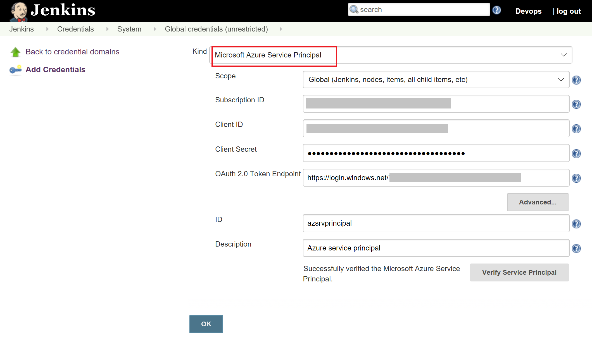

# Deploy to Azure App Service with Jenkins and the Azure CLI
To deploy a Java web app to Azure, you can use Azure CLI in [Jenkins Pipeline](https://jenkins.io/doc/book/pipeline/). In this tutorial, you create a CI/CD pipeline on an Azure VM including how to:

> [!div class="checklist"]
> * Create a Jenkins VM
> * Configure Jenkins
> * Create a web app in Azure
> * Prepare a GitHub repository
> * Create Jenkins pipeline
> * Run the pipeline and verify the web app

This tutorial requires the Azure CLI version 2.0.4 or later. To find the version, run `az --version`. If you need to upgrade, see [Install the Azure CLI]( /cli/azure/install-azure-cli).

[!INCLUDE [cloud-shell-try-it.md](../../includes/cloud-shell-try-it.md)]

## Create and Configure Jenkins instance
If you do not already have a Jenkins master, start with the [Solution Template](install-jenkins-solution-template.md), which includes the required [Azure Credentials](https://plugins.jenkins.io/azure-credentials) plugin by default. 

The Azure Credential plugin allows you to store Microsoft Azure service principal credentials in Jenkins. In version 1.2, we added the support so that Jenkins Pipeline can get the Azure credentials. 

Ensure you have version 1.2 or later:
* Within the Jenkins dashboard, click **Manage Jenkins -> Plugin Manager ->** and search for **Azure Credential**. 
* Update the plugin if the version is earlier than 1.2.

Java JDK and Maven are also required in the Jenkins master. To install, sign in to Jenkins master using SSH and run the following commands:
```bash
sudo apt-get install -y openjdk-7-jdk
sudo apt-get install -y maven
```

## Add Azure service principal to Jenkins credential

An Azure credential is needed to execute Azure CLI.

* Within the Jenkins dashboard, click **Credentials -> System ->**. Click **Global credentials(unrestricted)**.
* Click **Add Credentials** to add a [Microsoft Azure service principal](https://docs.microsoft.com/cli/azure/create-an-azure-service-principal-azure-cli?toc=%2fazure%2fazure-resource-manager%2ftoc.json) by filling out the Subscription ID, Client ID, Client Secret, and OAuth 2.0 Token Endpoint. Provide an ID for use in subsequent step.



## Create an Azure App Service for deploying the Java web app

Create an Azure App Service plan with the **FREE** pricing tier using the  [az appservice plan create](/cli/azure/appservice/plan#az-appservice-plan-create) CLI command. The appservice plan defines the physical resources used to host your apps. All applications assigned to an appservice plan share these resources, allowing you to save cost when hosting multiple apps. 

```azurecli-interactive
az appservice plan create \
    --name myAppServicePlan \ 
    --resource-group myResourceGroup \
    --sku FREE
```

When the plan is ready, the Azure CLI shows similar output to the following example:

```json
{ 
  "adminSiteName": null,
  "appServicePlanName": "myAppServicePlan",
  "geoRegion": "North Europe",
  "hostingEnvironmentProfile": null,
  "id": "/subscriptions/0000-0000/resourceGroups/myResourceGroup/providers/Microsoft.Web/serverfarms/myAppServicePlan",
  "kind": "app",
  "location": "North Europe",
  "maximumNumberOfWorkers": 1,
  "name": "myAppServicePlan",
  ...
  < Output has been truncated for readability >
} 
``` 

### Create an Azure Web app

 Use the [az webapp create](/cli/azure/webapp?view=azure-cli-latest#az-webapp-create) CLI command to create a web app definition in the `myAppServicePlan` App Service plan. The web app definition provides a URL to access your application with and configures several options to deploy your code to Azure. 

```azurecli-interactive
az webapp create \
    --name <app_name> \ 
    --resource-group myResourceGroup \
    --plan myAppServicePlan
```

Substitute the `<app_name>` placeholder with your own unique app name. This unique name is part of the default domain name for the web app, so the name needs to be unique across all apps in Azure. You can map a custom domain name entry to the web app before you expose it to your users.

When the web app definition is ready, the Azure CLI shows information similar to the following example: 

```json 
{
  "availabilityState": "Normal",
  "clientAffinityEnabled": true,
  "clientCertEnabled": false,
  "cloningInfo": null,
  "containerSize": 0,
  "dailyMemoryTimeQuota": 0,
  "defaultHostName": "<app_name>.azurewebsites.net",
  "enabled": true,
   ...
  < Output has been truncated for readability >
}
```

### Configure Java 

Set up the Java runtime configuration that your app needs with the  [az appservice web config update](/cli/azure/webapp/config#az-appservice-web-config-update) command.

The following command configures the web app to run on a recent Java 8 JDK and [Apache Tomcat](http://tomcat.apache.org/) 8.0.

```azurecli-interactive
az webapp config set \ 
    --name <app_name> \
    --resource-group myResourceGroup \ 
    --java-version 1.8 \ 
    --java-container Tomcat \
    --java-container-version 8.0
```

## Prepare a GitHub Repository
Open the [Simple Java Web App for Azure](https://github.com/azure-devops/javawebappsample) repo. To fork the repo to your own GitHub account, click the **Fork** button in the top right-hand corner.

* In GitHub web UI, open **Jenkinsfile** file. Click the pencil icon to edit this file to update the resource group and name of your web app on line 20 and 21 respectively.

```java
def resourceGroup = '<myResourceGroup>'
def webAppName = '<app_name>'
```

* Change line 23 to update credential ID in your Jenkins instance

```java
withCredentials([azureServicePrincipal('<mySrvPrincipal>')]) {
```

## Create Jenkins pipeline
Open Jenkins in a web browser, click **New Item**. 

* Provide a name for the job and select **Pipeline**. Click **OK**.
* Click the **Pipeline** tab next. 
* For **Definition**, select **Pipeline script from SCM**.
* For **SCM**, select **Git**.
* Enter the GitHub URL for your forked repo: https:\<your forked repo\>.git
* Click **Save**

## Test your pipeline
* Go to the pipeline you created, click **Build Now**
* A build should succeed in a few seconds, and you can go to the build and click **Console Output** to see the details

## Verify your web app
To verify the WAR file is deployed successfully to your web app. Open a web browser:

* Go to http://&lt;app_name>.azurewebsites.net/api/calculator/ping  
You see:

        Welcome to Java Web App!!! This is updated!
        Sun Jun 17 16:39:10 UTC 2017

* Go to http://&lt;app_name>.azurewebsites.net/api/calculator/add?x=&lt;x>&y=&lt;y> (substitute &lt;x> and &lt;y> with any numbers) to get the sum of x and y


## Deploy to Azure Web App on Linux
Now that you know how to use Azure CLI in your Jenkins pipeline, you can modify the script to deploy to an Azure Web App on Linux.

Web App on Linux supports a different way to do the deployment, which is to use Docker. To deploy, you need to provide a Dockerfile that packages your web app with service runtime into a Docker image. The plugin will then build the image, push it to a Docker registry and deploy the image to your web app.

* Follow the steps [here](../app-service/containers/quickstart-nodejs.md) to create an Azure Web App running on Linux.
* Install Docker on your Jenkins instance by following the instructions in this [article](https://docs.docker.com/engine/installation/linux/ubuntu/).
* Create a Container Registry in the Azure portal by using the steps [here](/azure/container-registry/container-registry-get-started-azure-cli).
* In the same [Simple Java Web App for Azure](https://github.com/azure-devops/javawebappsample) repo you forked, edit the **Jenkinsfile2** file:
    * Line 18-21, update to the names of your resource group, web app, and ACR respectively. 
        ```
        def webAppResourceGroup = '<myResourceGroup>'
        def webAppName = '<app_name>'
        def acrName = '<myRegistry>'
        ```

    * Line 24, update \<azsrvprincipal\> to your credential ID
        ```
        withCredentials([azureServicePrincipal('<mySrvPrincipal>')]) {
        ```

* Create a new Jenkins pipeline as you did when deploying to Azure web app in Windows, only this time, use **Jenkinsfile2** instead.
* Run your new job.
* To verify, in Azure CLI, run:

    ```
    az acr repository list -n <myRegistry> -o json
    ```

    You get the following result:
    
    ```
    [
    "calculator"
    ]
    ```
    
    Go to http://&lt;app_name>.azurewebsites.net/api/calculator/ping. You see the message: 
    
        Welcome to Java Web App!!! This is updated!
        Sun Jul 09 16:39:10 UTC 2017

    Go to http://&lt;app_name>.azurewebsites.net/api/calculator/add?x=&lt;x>&y=&lt;y> (substitute &lt;x> and &lt;y> with any numbers) to get the sum of x and y
    
## Next steps
In this tutorial, you configured a Jenkins pipeline that checks out the source code in GitHub repo. Runs Maven to build a war file and then uses Azure CLI to deploy to Azure App Service. You learned how to:

> [!div class="checklist"]
> * Create a Jenkins VM
> * Configure Jenkins
> * Create a web app in Azure
> * Prepare a GitHub repository
> * Create Jenkins pipeline
> * Run the pipeline and verify the web app
