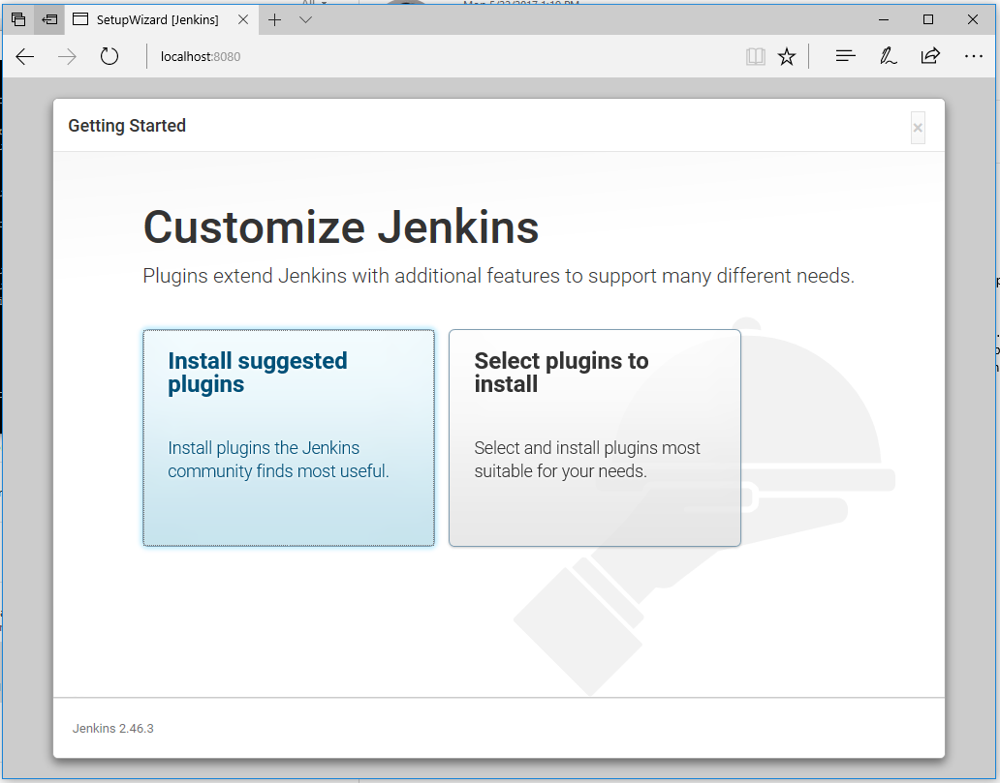

# Create your first Jenkins Master on a Linux (Ubuntu) VM on Azure

This quickstart shows how to install the latest stable Jenkins version on a Linux (Ubuntu 14.04 LTS) VM along with the tools and plugins configured to work with Azure. These include:
<ul>
<li>Git for source control</li>
<li>Azure credential plugin for connecting securely</li>
<li>Azure VM Agents plugin for elastic build, test and continuous integration</li>
<li>Azure Storage plugin for storing artifacts></li>
<li>Azure CLI to deploy apps using scripts</li>
</ul>

## Prerequisites

To complete this quickstart, you need:

*  An Azure account ([get a free trial](https://azure.microsoft.com/pricing/free-trial/))

## Create the VM in Azure by deploying the solution template

Go to http://aka.ms/jenkins-on-azure, click **GET IT NOW**  

In Azure Portal, click **Create**.
   


In the **Set up basic settings** tab:


* Provide a name to your Jenkins instance.
* Select a VM disk type.
* User name: must meet length requirements, and must not include reserved words or unsupported characters. Names like "admin" are not allowed.
* Authentication type: you can create an instance that is secured by a password or [SSH public key](https://docs.microsoft.com/en-us/azure/virtual-machines/linux/ssh-from-windows). If you use a password, note that it must have 3 of the following: 1 lower case character, 1 upper case character, 1 number and 1 special character.
* Select a subscription.
* Create a new resource group or use an existing one.
* Select a location.

In the **Configure additional options** tab:


* Provide a domain name label

Click **OK** to go to the next step. 

Once validation passes, click **OK** to download the template and parameters. 

Next, select **Purchase** to provision all the resources.

## Setup SSH port forwarding

By default the Jenkins instance is using the http protocol and listens on port 8080. Users shouldn't authenticate over unsecured protocols.
	
You need to setup port forwarding to view the Jenkins UI on your local machine.

### If you are using Windows:

Install Putty and run this command if you use password to secure Jenkins:
```
putty.exe -ssh -L 8080:localhost:8080 <username>@<Domain name label>.<location>.cloudapp.azure.com
```
* Enter the password to login.


If you use SSH, run this command:
```
putty -i <private key file including path> -L 8080:localhost:8080 <username>@<Domain name label>.<location>.cloudapp.azure.com
```

### If you are using Linux or Mac:

If you use a password to secure your Jenkins master, run this command:
```
ssh -L 8080:localhost:8080 <username>@<Domain name label>.<location>.cloudapp.azure.com
```
* Enter the password to login.

If you use SSH, run this command:
```
ssh -i <private key file including path> -L 8080:localhost:8080 <username>@<Domain name label>.<location>.cloudapp.azure.com
```

## Connect to Jenkins
After you have started your tunnel, navigate to http://localhost:8080/ on your local machine.

You must unlock the Jenkins dashboard for the first time with the initial admin password.


To get a token, SSH into the VM and run `sudo cat /var/lib/jenkins/secrets/initialAdminPassword`.


You will be asked to install the suggested plugins.



Next, create an admin user for your Jenkins master.

Your Jenkins instance is now ready to use! You can access a read-only view by going to http://&lt;Public DNS name of instance you just created>.


## Next Steps

> [!div class="nextstepaction"]
> [Azure VMs as Jenkins agents](jenkins-azure-vm-agents.md)
