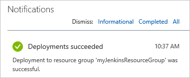

# Create a Jenkins server on an Azure Linux VM using the Azure Portal

This quickstart shows how to install Jenkins on an Ubuntu Linux VM with the tools and plugins configured to work with Azure. When you're finished, you'll have a Jenkins server running in Azure building code from a [GitHub](https://github.com).

## Prerequisites

* An Azure subscription

[!INCLUDE [quickstarts-free-trial-note](../../includes/quickstarts-free-trial-note.md)]

## Create the Jenkins VM from the solution template

Go to [The marketplace image for Jenkins](https://azuremarketplace.microsoft.com/marketplace/apps/azure-oss.jenkins?tab=Overview) and select  **GET IT NOW** from the left hand side of the page. Review the pricing details and select **Continue** to open the configuration page in the Azure portal. Select **Create** to start configuring the Jenkins VM. 
   

In the **Configure basic settings** tab:

* Use **Jenkins** for the name of your server.
* Select **SSD** for VM disk type.
* **User name**: must meet length requirements, and must not include reserved words or unsupported characters. Names like "admin" are not allowed.  For more information, see [here](/azure/virtual-machines/windows/faq) for user name and password requirements.
* Select **Password** as the **Authentication type** and enter a password. The password must have an upper case character, a number, and one special character.
* Use **myJenkinsResourceGroup** for the **Resource Group**.
* Choose the **East US** [Azure region](https://azure.microsoft.com/regions/) from the **Location** drop-down.

Select **OK** to proceed to the **Configure additional options** tab.

* Enter a unique domain name to identify the Jenkins server in DNS.

Select **OK**. Once validation passes, select **OK** again from the **Summary** tab. Finally, select **Purchase** to create the Jenkins VM. When your server is ready, you'll get a notification in the Portal:   

## Connect to Jenkins

Navigate to http://<jenkins_domain>.eastus.cloudapp.azure.com:8080/ on from your web browser.

Unlock the Jenkins dashboard for the first time with the initial admin password.

To get a token, SSH into the VM and run `sudo cat /var/lib/jenkins/secrets/initialAdminPassword`.

You are asked to install the suggested plugins.

Next, create an admin user for your Jenkins master.

Your Jenkins instance is now ready to use! You can access a read-only view by going to http://\<Public DNS name of instance you just created\>.

## Next Steps

In this tutorial, you:

> [!div class="checklist"]
> * Created a Jenkins Master with the solution template.
> * Performed initial configuration of Jenkins.
> * Installed plugins.

Follow this link to see how to use Azure VM Agents for continuous integration with Jenkins.

> [!div class="nextstepaction"]
> [Azure VMs as Jenkins agents](jenkins-azure-vm-agents.md)
