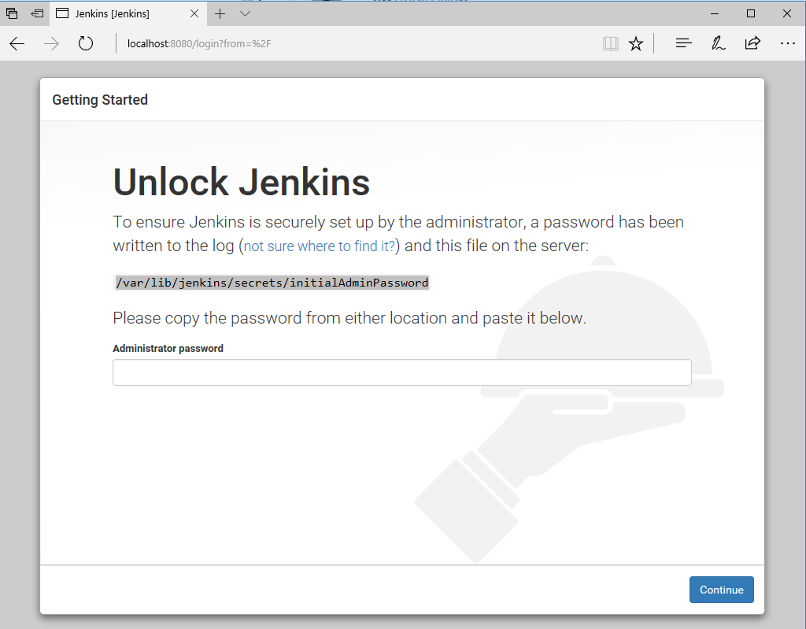
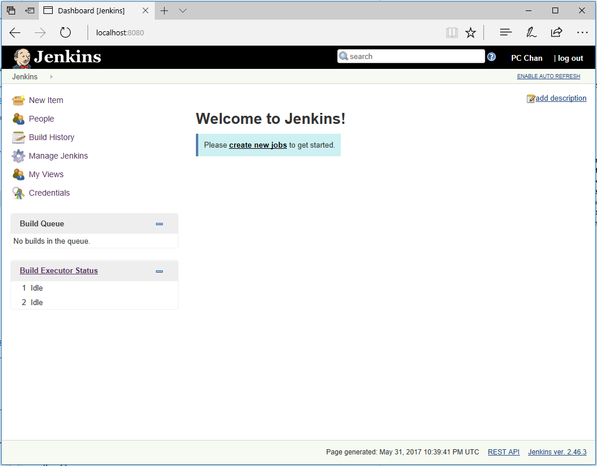
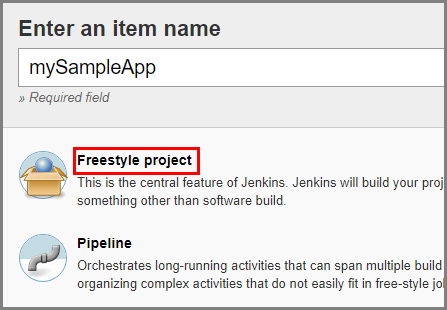
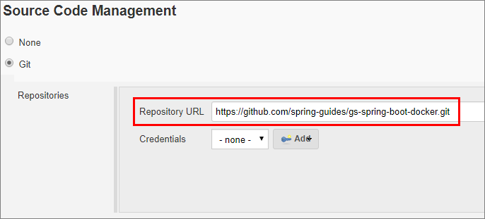
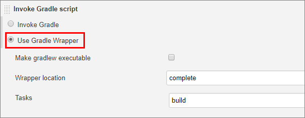
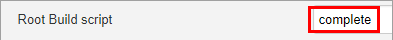
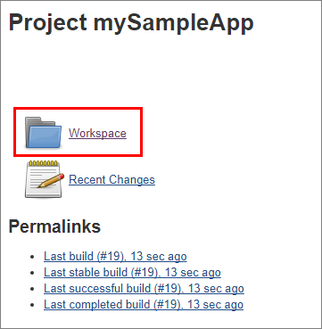

# Create a Jenkins server on an Azure Linux VM from the Azure portal

This quickstart shows how to install [Jenkins](https://jenkins.io) on an Ubuntu Linux VM with the tools and plug-ins configured to work with Azure. When you're finished, you have a Jenkins server running in Azure building a sample Java app from [GitHub](https://github.com).

## Prerequisites

* An Azure subscription
* Access to SSH on your computer's command line (such as the Bash shell or [PuTTY](http://www.putty.org/))

[!INCLUDE [quickstarts-free-trial-note](../../includes/quickstarts-free-trial-note.md)]

## Create the Jenkins VM from the solution template
Jenkins supports a model where the Jenkins server delegates work to one or more agents to allow a single Jenkins installation to host a large number of projects or to provide different environments needed for builds or tests. The steps in this section guide you through installing and configuring a Jenkins server on Azure.

[!INCLUDE [jenkins-install-from-azure-marketplace-image](../../includes/jenkins-install-from-azure-marketplace-image.md)]

## Connect to Jenkins

Navigate to your virtual machine (for example, http://jenkins2517454.eastus.cloudapp.azure.com/) in  your web browser. The Jenkins console is inaccessible through unsecured HTTP so instructions are provided on the page to access the Jenkins console securely from your computer using an SSH tunnel.


Set up the tunnel using the `ssh` command on the page from the command line, replacing `username` with the name of the virtual machine admin user chosen earlier when setting up the virtual machine from the solution template.

```bash
ssh -L 127.0.0.1:8080:localhost:8080 jenkinsadmin@jenkins2517454.eastus.cloudapp.azure.com
```

After you have started the tunnel, navigate to http://localhost:8080/ on your local machine. 

Get the initial password by running the following command in the command line while connected through SSH to the Jenkins VM.

```bash
sudo cat /var/lib/jenkins/secrets/initialAdminPassword
```

Unlock the Jenkins dashboard for the first time using this initial password.



Select **Install suggested plugins** on the next page and then create a Jenkins admin user used to access the Jenkins dashboard.



The Jenkins server is now ready to build code.

## Create your first job

Select **Create new jobs** from the Jenkins console, then name it **mySampleApp** and select **Freestyle project**, then select **OK**.

 

Select the **Source Code Management** tab, enable **Git**, and enter the following URL in **Repository URL**  field: `https://github.com/spring-guides/gs-spring-boot.git`

 

Select the **Build** tab, then select **Add build step**, **Invoke Gradle script**. Select **Use Gradle Wrapper**, then enter `complete` in **Wrapper location** and `build` for **Tasks**.

 

Select **Advanced** and then enter `complete` in the **Root Build script** field. Select **Save**.

 

## Build the code

Select **Build Now** to compile the code and package the sample app. When your build completes, select the **Workspace** link for the project.

 

Navigate to `complete/build/libs` and ensure the `gs-spring-boot-0.1.0.jar` is there to verify that your build was successful. Your Jenkins server is now ready to build your own projects in Azure.

## Troubleshooting the Jenkins solution template

If you encounter any bugs with the Jenkins solution template, file an issue in the [Jenkins GitHub repo](https://github.com/azure/jenkins/issues).

## Next Steps

> [!div class="nextstepaction"]
> [Add Azure VMs as Jenkins agents](jenkins-azure-vm-agents.md)
