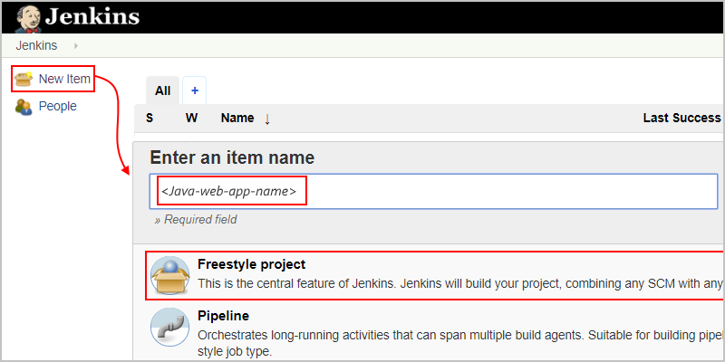

# Tutorial: Deploy Java web apps to Azure App Service by using Jenkins for continuous integration and deployment

This tutorial shows how you can deploy a sample Java web app to 
[Azure App Service Web Apps on Linux](/azure/app-service/containers/app-service-linux-intro) 
by setting up continuous integration and deployment (CI/CD) using Jenkins. 
The sample web app was developed using the 
[Spring Boot](http://projects.spring.io/spring-boot/) framework. 

In this tutorial, you'll complete these tasks:

> [!div class="checklist"]
> * Install and set up the Azure App Service Jenkins plug-ins so you can deploy to Azure App Service.
> * Define a Jenkins job that builds Docker images from a GitHub repo when a new commit is pushed.
> * Define and set up an Azure Web App for deploying Docker images that are pushed to Azure Container registry.
> * Deploy the sample app to Azure App Service with a manual build.
> * Trigger a Jenkins build and update the web app by pushing changes to GitHub.

[!INCLUDE [quickstarts-free-trial-note](../../includes/quickstarts-free-trial-note.md)]

## Prerequisites

To complete this tutorial, you need these items:

* A [Jenkins](https://jenkins.io/) server with the Java Development Kit (JDK) 
and Maven tools installed on an Azure Linux VM

  If you don't have a Jenkins server, complete these steps now in the Azure portal: 
  [Create Jenkins server on an Azure Linux VM](/azure/jenkins/install-jenkins-solution-template)

* A [GitHub](https://github.com) account

* The [Azure CLI](/cli/azure), either from your local command line 
or in the [Azure Cloud Shell](/azure/cloud-shell/overview)

## Install Jenkins plug-ins

1. In your web browser, go to your Jenkins web console and sign in. 
From the left menu, select **Manage Jenkins** > **Manage Plugins**.

   

1. On the **Available** tab, find and select these plug-ins:

   - [Azure App Service](https://plugins.jenkins.io/azure-app-service)
   - [GitHub Branch Source](https://plugins.jenkins.io/github-branch-source)
   - Jenkins [Environment Injector Plugin](https://plugins.jenkins.io/envinject)    

   If the plugins don't appear, make sure they're not 
   already installed by checking the **Installed** tab.

1. To install the selected plug-ins, choose 
**Download now and install after restart**.

1. When you're done, on the left menu, select **Manage Jenkins** 
so you can return to the Jenkins management page.

## Set up Jenkins for GitHub

When new commits get pushed to your GitHub repo where 
you'll keep your sample Java web app, you want Jenkins 
to get those [events from GitHub](https://developer.github.com/webhooks/). 
To get these events in Jenkins, enable webhooks for GitHub. 

1. On your Jenkins web console's **Manage Jenkins** page, 
select **Configure System**. 

   

1. On the configuration page, scroll to the **GitHub** section. 
If you haven't already provided details for your GitHub server, 
select **Add GitHub Server** > **GitHub Server**. 

   

1. Check that the **Manage hooks** property appears selected. 
Choose **Advanced** so you can choose addtional settings. 

   

1. Choose **Manage additional GitHub actions**, 
and select **Convert login and password to token**.

   

1. Select **From login and password**, 
enter your GitHub username and password, 
and choose **Create token credentials**, 
which creates a [GitHub Personal Access Token (PAT)](https://help.github.com/articles/creating-a-personal-access-token-for-the-command-line/).   

   

1. Now under **GitHub Server**, open the **Credentials** list, 
and select your new token. Check that authentication is working 
by choosing **Test connection**.

   

> [!NOTE]
> 
> If your GitHub account has two-factor authentication enabled, 
> create your token on GitHub and set up Jenkins to use that token. 
> For more information, see the documentation for the 
> [Jenkins GitHub plug-in](https://wiki.jenkins.io/display/JENKINS/Github+Plugin).

## Fork sample repo and create pipeline job 

Now you'll create a local copy of the GitHub repo that has the sample Java web app. 
You'll then create a pipeline job so you can build that app.

1. Go to the [GitHub repo that has the Spring Boot sample app](https://github.com/spring-guides/gs-spring-boot-docker), 
and fork the repo to your GitHub account by choosing **Fork**.

   

1. Return to the Jenkins web console home page, 
and select **New Item**. Provide a name for your sample app, 
for example, "MyJavaApp", and select **Freestyle project**. 
At the bottom, choose **OK**.   

   

1. On the **General** tab, select **GitHub project**. 
For **Project url**, enter the URL for your forked repo,  
for example: `https://github.com/<your-GitHub-user-name>/gs-spring-boot-docker`

1. Go to the **Source Code Management**  section, 
select **Git**, enter the URL for your forked repo plus `.git`, 
for example: `https://github.com/<your-GitHub-user-name>/gs-spring-boot-docker.git`

1. Go to the **Build Triggers** section, 
and select **GitHub hook trigger for GITscm polling**.

1. Go to the **Build** section, choose **Add build step**, 
and select **Invoke top-level Maven targets**. 
In the **Goals** box, enter `package`.

1. When you're done, choose **Save**. 

1. To test your pipeline job, go to your project page in Jenkins, 
and select **Build Now**.

   

## Set up Azure App Service 

1. By using either the Azure CLI or [Cloud Shell](/azure/cloud-shell/overview), 
create a new [Web App on Linux](/azure/app-service/containers/app-service-linux-intro). 

   This tutorial uses the "MyJavaApp" as the web app name, 
   but make sure you provide a unique name for your own app.
   
    ```azurecli-interactive
    az group create --name <your-resource-group-jenkins> --location <your-Azure-region>
    az appservice plan create --is-linux --name myLinuxAppServicePlan --resource-group myResourceGroupJenkins 
    az webapp create --name myJavaApp --resource-group myResourceGroupJenkins --plan myLinuxAppServicePlan --runtime "java|1.8|Tomcat|8.5"
    ```

1. Create an [Azure Container Registry](/azure/container-registry/container-registry-intro) to store the Docker images built by Jenkins. The container registry name used in this tutorial is `jenkinsregistry`, but you need to use a unique name for your own container registry. 

    ```azurecli-interactive
    az acr create --name jenkinsregistry --resource-group myResourceGroupJenkins --sku Basic --admin-enabled
    ```
3. Configure the web app to run Docker images pushed to the container registry and specify that the app running in the container listens for requests on port 8080.   

    ```azurecli-interactive
    az webapp config container set -c jenkinsregistry/webapp --resource-group myResourceGroupJenkins --name myJavaApp
    az webapp config appsettings set --resource-group myResourceGroupJenkins --name myJavaApp --settings PORT=8080
    ```

## Configure the Azure App Service Jenkins plug-in

1. In the Jenkins web console, select the **MyJavaApp** job you created and then select **Configure** on the left hand of the page.
2. Scroll down to **Post-build Actions**, select **Add post-build action**, and choose **Publish an Azure Web App**.
3. Under **Azure Profile Configuration**, select **Add** next to **Azure Credentials** and choose **Jenkins**.
4. In the **Add Credentials** dialog, select **Microsoft Azure Service Principal** from the **Kind** drop-down.
5. Create an Active Directory Service principal from the Azure CLI or [Cloud Shell](/azure/cloud-shell/overview).
    
    ```azurecli-interactive
    az ad sp create-for-rbac --name jenkins_sp --password secure_password
    ```

    ```json
    {
        "appId": "BBBBBBBB-BBBB-BBBB-BBBB-BBBBBBBBBBB",
        "displayName": "jenkins_sp",
        "name": "http://jenkins_sp",
        "password": "secure_password",
        "tenant": "CCCCCCCC-CCCC-CCCC-CCCCCCCCCCC"
    }
    ```
6. Enter the credentials from the service principal into the **Add credentials** dialog. If you don't know your Azure subscription ID, you can query it from the CLI:
     
     ```azurecli-interactive
     az account list
     ```

     ```json
        {
            "cloudName": "AzureCloud",
            "id": "AAAAAAAA-AAAA-AAAA-AAAA-AAAAAAAAAAAA",
            "isDefault": true,
            "name": "Visual Studio Enterprise",
            "state": "Enabled",
            "tenantId": "CCCCCCCC-CCCC-CCCC-CCCC-CCCCCCCCCCC",
            "user": {
            "name": "raisa@fabrikam.com",
            "type": "user"
            }
     ```

    
6. Verify the service principal authenticates with Azure by selecting **Verify Service Principal**. 
7. Select **Add** to save the credentials.
8. Select the service principal credential you just added from the **Azure Credentials** drop-down when you are back to the **Publish an Azure Web App** configuration.
9. In **App Configuration**, choose your resource group and web app name from the drop-down.
10. Select the **Publish via Docker** radio button.
11. Enter `complete/Dockerfile` for **Dockerfile path**.
12. Enter `https://jenkinsregistry.azurecr.io` in the **Docker registry URL** field.
13. Select **Add** next to **Registry Credentials**. 
14. Enter the admin username for the Azure Container Registry you created for the **Username**.
15. Enter the password for the Azure Container registry in the **Password** field. You can get your username and password from the Azure portal or through the following CLI command:

    ```azurecli-interactive
    az acr credential show -n jenkinsregistry
    ```
    
15. Select **Add** to save the credential.
16. Select the newly created credential from the **Registry credentials** drop-down in the **App Configuration** panel for the **Publish an Azure Web App**. The finished post-build action should look like the following image:   
    
17. Select **Save** to save the job configuration.

## Deploy the app from GitHub

1. From the Jenkins project, select **Build Now** to deploy the sample app to Azure.
2. Once the build completes, your app is live on Azure at its publishing URL, for example http://myjavaapp.azurewebsites.net.   
   

## Push changes and redeploy

1. From your Github fork, browse on the web to  `complete/src/main/java/Hello/Application.java`. Select the **Edit this file** link from the right-hand side of the GitHub interface.
2. Make the following change to the `home()` method and commit the change to the repo's master branch.
   
    ```java
    return "Hello Docker World on Azure";
    ```
3. A new build starts in Jenkins, triggered by the new commit on the `master` branch of the repo. Once it completes, reload your app on Azure.     
      

## Troubleshooting the Jenkins plugin

If you encounter any bugs with the Jenkins plugins, file an issue in the [Jenkins JIRA](https://issues.jenkins-ci.org/) for the specific component.

## Next steps

> [!div class="nextstepaction"]
> [Use Azure VMs as build agents](/azure/jenkins/jenkins-azure-vm-agents)