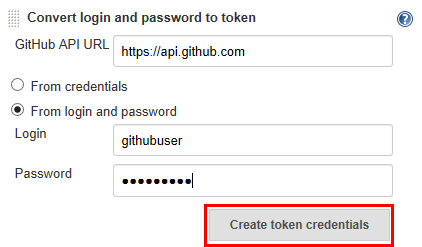
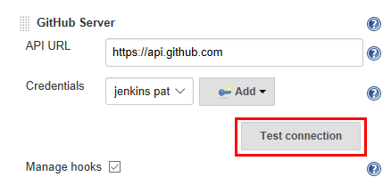
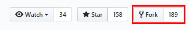
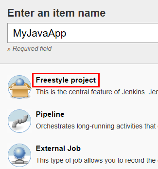
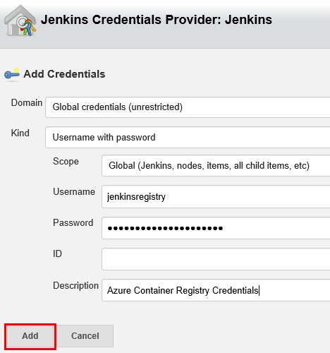
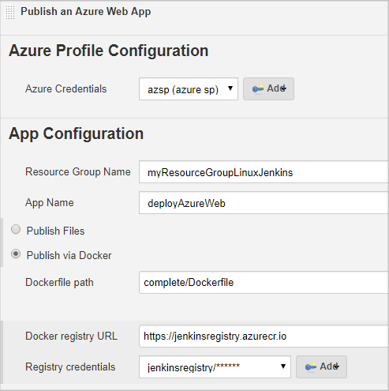
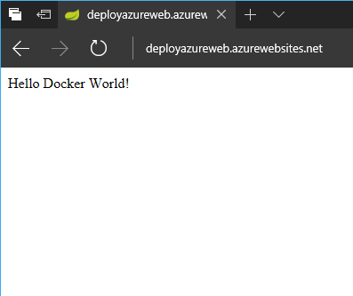
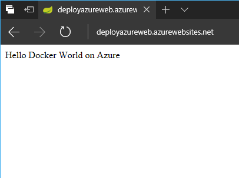

# Set up continuous integration and deployment to Azure App Service with Jenkins

This tutorial sets up continuous integration and deployment (CI/CD) of a sample Java web app developed with the [Spring Boot](http://projects.spring.io/spring-boot/) framework to [Azure App Service Web App on Linux](/azure/app-service/containers/app-service-linux-intro) using Jenkins.

You will perform the following tasks in this tutorial:

> [!div class="checklist"]
> * Install the Jenkins plug-ins needed to deploy to Azure App Service.
> * Define a Jenkins job to build Docker images from a GitHub repo when a new commit is pushed.
> * Define a new Azure Web App for Linux and configure it to deploy Docker images pushed to Azure Container registry.
> * Configure the Azure App Service Jenkins plug-in.
> * Deploy the sample app to Azure App Service with a manual build.
> * Trigger a Jenkins build and update the web app by pushing changes to GitHub.

## Before you begin

To complete this tutorial, you need:

* [Jenkins](https://jenkins.io/) with JDK and Maven tools configured. If you don't have a Jenkins system, create one now in Azure from the [Jenkins solution template](/azure/jenkins/install-jenkins-solution-template).
* A [GitHub](https://github.com) account.
* [Azure CLI](/cli/azure), either from your local command line or in the [Azure Cloud Shell](/azure/cloud-shell/overview)

[!INCLUDE [quickstarts-free-trial-note](../../includes/quickstarts-free-trial-note.md)]

## Install Jenkins plug-ins

1. Open a web browser to your Jenkins web console and select **Manage Jenkins** from the left-hand menu, then select **Manage Plugins**.
2. Select the **Available** tab.
3. Search for and select the checkbox next to the following plug-ins:   

    - [Azure App Service Plug-in](https://plugins.jenkins.io/azure-app-service)
    - [GitHub Branch Source Plug-in](https://plugins.jenkins.io/github-branch-source)

    If the plugins do not appear, make sure they aren't already installed by checking the **Installed** tab.

1. Select **Download now and install after restart** to enable the plugins in your Jenkins configuration.

## Configure GitHub and Jenkins

Set up Jenkins to receive [GitHub webhooks](https://developer.github.com/webhooks/) when new commits are pushed to a repo in your account.

1. Select **Manage Jenkins**, then **Configure System**. In the **GitHub** section, make sure **Manage hooks** is selected and then select **Manage additional GitHub actions** and choose **Convert login and password to token**.
2. Select the **From login and password** radio button and enter your GitHub username and password. Select **Create token credentials** to create a new [GitHub Personal Access Token](https://help.github.com/articles/creating-a-personal-access-token-for-the-command-line/).   
   
3.  Select the newly created token from the **Credentials** drop down in the GitHub Servers configuration. Select **Test connection** to verify that the authentication is working.   
   

> [!NOTE]
> If your GitHub account has two-factor authentication enabled,  create the token on GitHub and configure Jenkins to use it. Review the [Jenkins GitHub plug-in](https://wiki.jenkins.io/display/JENKINS/Github+Plugin) documentation for full details.

## Fork the sample repo and create a Jenkins job 

1. Open the [Spring Boot sample application repo](https://github.com/spring-guides/gs-spring-boot-docker) and fork it to your own GitHub account by selecting **Fork** in the top right-hand corner.   
    
1. In the Jenkins web console, select **New Item**, give it a name **MyJavaApp**, select **Freestyle project**, then select **OK**.   
    
2. Under the **General** section, select **GitHub** project and enter your forked repo URL such as https://github.com/raisa/gs-spring-boot-docker
3. Under the **Source code management**  section, select **Git**, enter your forked repo `.git` URL such as https://github.com/raisa/gs-spring-boot-docker.git
4. Under the **Build Triggers** section, select **GitHub hook trigger for GITscm polling**.
5. Under the **Build** section, select **Add build step** and choose **Invoke top-level Maven targets**. Enter `package` in the **Goals** field.
6. Select **Save**. You can test your job by selecting **Build Now** from the project page.

## Configure Azure App Service 

1. Using the Azure CLI or [Cloud Shell](/azure/cloud-shell/overview), create a new [Web App on Linux](/azure/app-service/containers/app-service-linux-intro). The web app name in this tutorial is `myJavaApp`, but you need to use a unique name for your own app.
   
    ```azurecli-interactive
    az group create --name myResourceGroupJenkins --location westus
    az appservice plan create --is-linux --name myLinuxAppServicePlan --resource-group myResourceGroupJenkins 
    az webapp create --name myJavaApp --resource-group myResourceGroupJenkins --plan myLinuxAppServicePlan --runtime "java|1.8|Tomcat|8.5"
    ```

2. Create an [Azure Container Registry](/azure/container-registry/container-registry-intro) to store the Docker images built by Jenkins. The container registry name used in this tutorial is `jenkinsregistry`, but you need to use a unique name for your own container registry. 

    ```azurecli-interactive
    az acr create --name jenkinsregistry --resource-group myResourceGroupJenkins --sku Basic --admin-enabled
    ```
3. Configure the web app to run Docker images pushed to the container registry and specify that the app running in the container listens for requests on port 8080.   

    ```azurecli-interactive
    az webapp config container set -c jenkinsregistry/webapp --resource-group myResourceGroupJenkins --name myJavaApp
    az webapp config appsettings set --resource-group myResourceGroupJenkins --name myJavaApp --settings PORT=8080
    ```

## Configure the Azure App Service Jenkins plug-in

1. In the Jenkins web console, select the **MyJavaApp** job you created and then select **Configure** on the left hand of the page.
2. Scroll down to **Post-build Actions**, select **Add post-build action**, and choose **Publish an Azure Web App**.
3. Under **Azure Profile Configuration**, select **Add** next to **Azure Credentials** and choose **Jenkins**.
4. In the **Add Credentials** dialog, select **Microsoft Azure Service Principal** from the **Kind** drop-down.
5. Create an Active Directory Service principal from the Azure CLI or [Cloud Shell](/azure/cloud-shell/overview).
    
    ```azurecli-interactive
    az ad sp create-for-rbac --name jenkins_sp --password secure_password
    ```

    ```json
    {
        "appId": "BBBBBBBB-BBBB-BBBB-BBBB-BBBBBBBBBBB",
        "displayName": "jenkins_sp",
        "name": "http://jenkins_sp",
        "password": "secure_password",
        "tenant": "CCCCCCCC-CCCC-CCCC-CCCCCCCCCCC"
    }
    ```
6. Enter the credentials from the service principal into the **Add credentials** dialog. If you don't know your Azure subscription ID, you can query it from the CLI:
     
     ```azurecli-interactive
     az account list
     ```

     ```json
        {
            "cloudName": "AzureCloud",
            "id": "AAAAAAAA-AAAA-AAAA-AAAA-AAAAAAAAAAAA",
            "isDefault": true,
            "name": "Visual Studio Enterprise",
            "state": "Enabled",
            "tenantId": "CCCCCCCC-CCCC-CCCC-CCCC-CCCCCCCCCCC",
            "user": {
            "name": "raisa@fabrikam.com",
            "type": "user"
            }
     ```

    
6. Verify the service principal authenticates with Azure by selecting **Verify Service Principal**. 
7. Select **Add** to save the credentials.
8. Select the service principal credential you just added from the **Azure Credentials** drop-down when you are back to the **Publish an Azure Web App** configuration.
9. In **App Configuration**, choose your resource group and web app name from the drop-down.
10. Select the **Publish via Docker** radio button.
11. Enter `complete/Dockerfile` for **Dockerfile path**.
12. Enter `https://jenkinsregistry.azurecr.io` in the **Docker registry URL** field.
13. Select **Add** next to **Registry Credentials**. 
14. Enter the admin username for the Azure Container Registry you created for the **Username**.
15. Enter the password for the Azure Container registry in the **Password** field. You can get your username and password from the Azure portal or through the following CLI command:

    ```azurecli-interactive
    az acr credential show -n jenkinsregistry
    ```
    
15. Select **Add** to save the credential.
16. Select the newly created credential from the **Registry credentials** drop-down in the **App Configuration** panel for the **Publish an Azure Web App**. The finished post-build action should look like the following image:   
    
17. Select **Save** to save the job configuration.

## Deploy the app from GitHub

1. From the Jenkins project, select **Build Now** to deploy the sample app to Azure.
2. Once the build completes, your app is live on Azure at its publishing URL, for example http://myjavaapp.azurewebsites.net.   
   

## Push changes and redeploy

1. From your Github fork, browse on the web to  `complete/src/main/java/Hello/Application.java`. Select the **Edit this file** link from the right-hand side of the GitHub interface.
2. Make the following change to the `home()` method and commit the change to the repo's master branch.
   
    ```java
    return "Hello Docker World on Azure";
    ```
3. A new build starts in Jenkins, triggered by the new commit on the `master` branch of the repo. Once it completes, reload your app on Azure.     
      

## Troubleshooting the Jenkins plugin

If you encounter any bugs with the Jenkins plugins, file an issue in the [Jenkins JIRA](https://issues.jenkins-ci.org/) for the specific component.

## Next steps

> [!div class="nextstepaction"]
> [Use Azure VMs as build agents](/azure/jenkins/jenkins-azure-vm-agents)