# Tutorial: Deploy Java web apps to Azure from GitHub by using Jenkins for continuous integration and deployment

This tutorial shows how to deploy a Java web app from GitHub to 
[Azure App Service on Linux](/azure/app-service/containers/app-service-linux-intro) 
with continuous integration (CI) and continuous deployment (CD) in Jenkins. 
That way, when you update your app by pushing commits to GitHub, Jenkins automatically 
builds and redeploys your app. The sample app in this tutorial was developed by using the 
[Spring Boot](http://projects.spring.io/spring-boot/) framework. 

In this tutorial, you'll complete these tasks:

> [!div class="checklist"]
> * Install Jenkins plug-ins so you can work with GitHub, 
> deploy to Azure App Service, and other related tasks.
> * Connect Jenkins to GitHub.
> * Create an Azure service principal so you can authenticate without using your own credentials. 
> * Fork the sample repo and create a Jenkins pipeline that builds your sample app when a new commit is pushed in GitHub.
> * Create build files for your Jenkins pipeline.
> * Point your Jenkins pipeline at a build script.
> * Deploy your sample app to Azure by running a manual build.
> * Push app updates in GitHub and redeploy to Azure by automatically triggering a Jenkins build.

[!INCLUDE [quickstarts-free-trial-note](../../includes/quickstarts-free-trial-note.md)]

## Prerequisites

To complete this tutorial, you need these items:

* A [Jenkins](https://jenkins.io/) server with the Java Development Kit (JDK) 
and Maven tools installed on an Azure Linux VM

  If you don't have a Jenkins server, 
  complete these steps now in the Azure portal: 
  [Create Jenkins server on an Azure Linux VM](/azure/jenkins/install-jenkins-solution-template)

* A [GitHub](https://github.com) account

* [Azure CLI](/cli/azure/install-azure-cli), 
which you can run from either your local command line 
or [Azure Cloud Shell](/azure/cloud-shell/overview)

## Install Jenkins plug-ins

1. From your web browser, sign in to your Jenkins web console at this location:

   `https://<Jenkins-server-name>.<Azure-region>.cloudapp.azure.com`

1. From the Jenkins home page, select **Manage Jenkins** > **Manage Plugins**.

   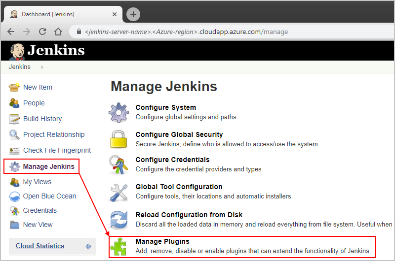

1. On the **Available** tab, select these plug-ins:

   - [Azure App Service](https://plugins.jenkins.io/azure-app-service)
   - [GitHub Branch Source](https://plugins.jenkins.io/github-branch-source)
   - Jenkins [Environment Injector Plugin](https://plugins.jenkins.io/envinject)

   If these plug-ins don't appear, make sure they're not 
   already installed by checking the **Installed** tab.

1. To install your selected plug-ins, choose 
**Download now and install after restart**.

1. After you're done, on the Jenkins menu, 
select **Manage Jenkins** so that you return to 
the Jenkins management page for the next steps.

## Connect Jenkins to GitHub

To have Jenkins monitor and receive GitHub events when new 
commits for your web app are pushed to GitHub, enable 
[GitHub webhooks](https://developer.github.com/webhooks/) in Jenkins.

> [!NOTE]
> 
> These steps create token credentials in Jenkins 
> by using your GitHub login and password. 
> However, if your GitHub account uses two-factor authentication, 
> create your token in GitHub and set up Jenkins to use that token. 
> For more information, see the documentation for the 
> [Jenkins GitHub plug-in](https://wiki.jenkins.io/display/JENKINS/Github+Plugin).

1. From the **Manage Jenkins** page, select **Configure System**. 

   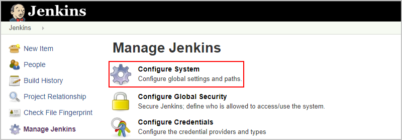

1. In **GitHub** section, provide details for your GitHub server, 
if you haven't already. Choose **Add GitHub Server**, and select **GitHub Server**. 

   

1. If the **Manage hooks** property isn't selected, select this property. 
Choose **Advanced** so you can specify other settings. 

   

1. Choose **Manage additional GitHub actions**, 
and select **Convert login and password to token**.

   

1. Select **From login and password** so you 
can enter your GitHub username and password. 
When you're done, choose **Create token credentials**, 
which creates a [GitHub Personal Access Token (PAT)](https://help.github.com/articles/creating-a-personal-access-token-for-the-command-line/).   

   

1. In the **GitHub Server** section, open the **Credentials** list, 
and select your new token. Check that authentication is working 
by choosing **Test connection**.

   

## Create service principal

In a later section, you'll create a Jenkins pipeline job for building your app. 
To authenticate running the pipeline job from a script, create an 
[Azure Active Directory service principal](https://docs.microsoft.com/azure/active-directory/develop/app-objects-and-service-principals). 
A service principal is an identity you can assign specific permissions 
and use for accessing Azure resources without entering your own credentials. 
To create the service principal, run the Azure CLI 
[**az ad sp create-for-rbac**](https://docs.microsoft.com/cli/azure/create-an-azure-service-principal-azure-cli?view=azure-cli-latest) 
command, either from your local command line or Azure Cloud Shell:

```azurecli-interactive
az ad sp create-for-rbac --name "your_jenkins_sp_name" --password your_secure_password
```

Make sure you create a strong password based on the 
[Azure Active Directory password rules and restrictions](). If you don't provide a password, the Azure CLI creates a password for you. 
Here's the output from the `create-for-rbac` command: 

```json
{
   "appId": "<app-ID>",
   "displayName": "your_jenkins_sp_name",
   "name": "http://your_jenkins_sp_name",
   "password": "<your_secure_password>",
   "tenant": "<Azure-Active-Directory-tenant-ID>"
}
```

## Fork sample repo and create pipeline job 

Now create your working copy, or fork, for the GitHub repo that has the sample Java 
web app. You'll then create the pipeline job in Jenkins for building that app.

1. Go to the [GitHub repo for the Spring Boot sample app](https://github.com/spring-guides/gs-spring-boot). 
To fork the repo to your GitHub account, choose **Fork** in the upper-right corner.

   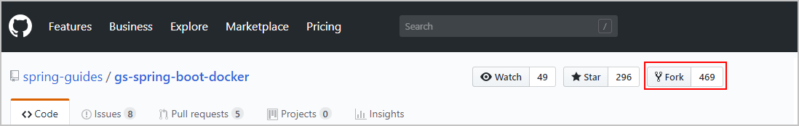

1. Return to your Jenkins home page, and select **New Item**. 

   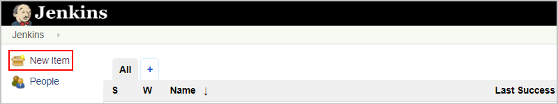

1. Provide a name for your pipeline job, for example, 
"My-Java-Web-App-pipeline", and select **Pipeline**. 
At the bottom, choose **OK**.   

   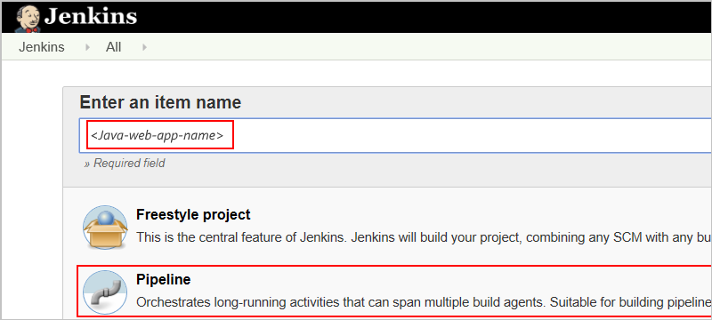

1. On the **General** tab, select **Prepare an environment for the run**. 
In the **Properties Content** box that appears, 
add these environment variables:

   ```text
   AZURE_CRED_ID=<your-Azure-service-principal-ID>
   RES_GROUP=<Azure-resource-group-name>
   WEB_APP=<your-Java-web-app-name>
   ```

   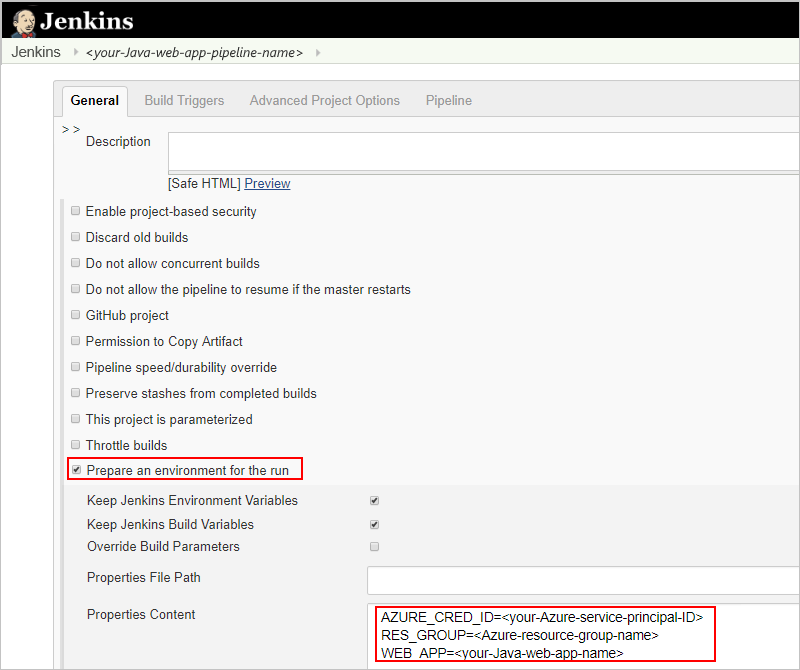

   This step sets up Jenkins with your service principal 
   so you can run the pipeline job and deploy to Azure 
   without entering your own credentials.

1. When you're done, choose **Save**.

## Create build files

1. In your GitHub fork's `src/main/resources/` folder, 
create a config file named `web.config` that contains this XML 
but replaces `$(JAR_FILE_NAME)` with `gs-spring-boot-0.1.0.jar`:

   ```xml
   <?xml version="1.0" encoding="UTF-8">
   <configuration>
      <system.webServer>
         <handlers>
            <add name="httpPlatformHandler" path="*" verb="*" modules="httpPlatformHandler" resourceType="Unspecified" />
         </handlers>
         <httpPlatform processPath="%JAVA_HOME%\bin\java.exe"
        arguments="-Djava.net.preferIPv4Stack=true -Dserver.port=%HTTP_PLATFORM_PORT% -jar &quot;%HOME%\site\wwwroot\${JAR_FILE_NAME}&quot;"></httpPlatform>
      </system.webServer>
   </configuration>
   ```

1. In your GitHub fork's root folder, create a build 
script file named `Jenkinsfile` that contains this text 
([source in GitHub here](https://github.com/Microsoft/todo-app-java-on-azure/blob/master/doc/resources/jenkins/Jenkinsfile-webapp-se)):

   ```text  
   node {
      stage('init') {
         checkout scm
      }
      stage('build') {
         sh '''
            mvn clean package
            cd target
            cp ../src/main/resources/web.config web.config
            cp todo-app-java-on-azure-1.0-SNAPSHOT.jar app.jar 
            zip todo.zip app.jar web.config
         '''
      }
      stage('deploy') {
         azureWebAppPublish azureCredentialsId: env.AZURE_CRED_ID,
         resourceGroup: env.RES_GROUP, appName: env.WEB_APP, filePath: "**/todo.zip"
      }
   }
   ```

1. Commit both `web.config` and `Jenkinsfile` to your GitHub fork, 
and push your changes.

## Point pipeline at build script

1. In Jenkins, select your previously created pipeline job. 

   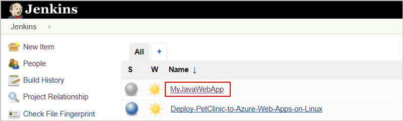

1. On the left menu, select **Configure**.

1. On the **Pipeline** tab, from the **Definition** list, 
select **Pipeline script from SCM**.

   1. After the **SCM** box appears, 
   select **Git** as your source control. 

   1. In the **Repositories** section, for **Repository URL**, 
   enter the URL for your GitHub fork, for example: 

      `https://github.com/<your-GitHub-username>/gs-spring-boot`

   1. For **Credentials**, select your GitHub personal access token.

   1. In the **Script Path** box, 
   add the path to your "Jenkinsfile" script.

   1. When you're done, choose **Save**.

   For example:

   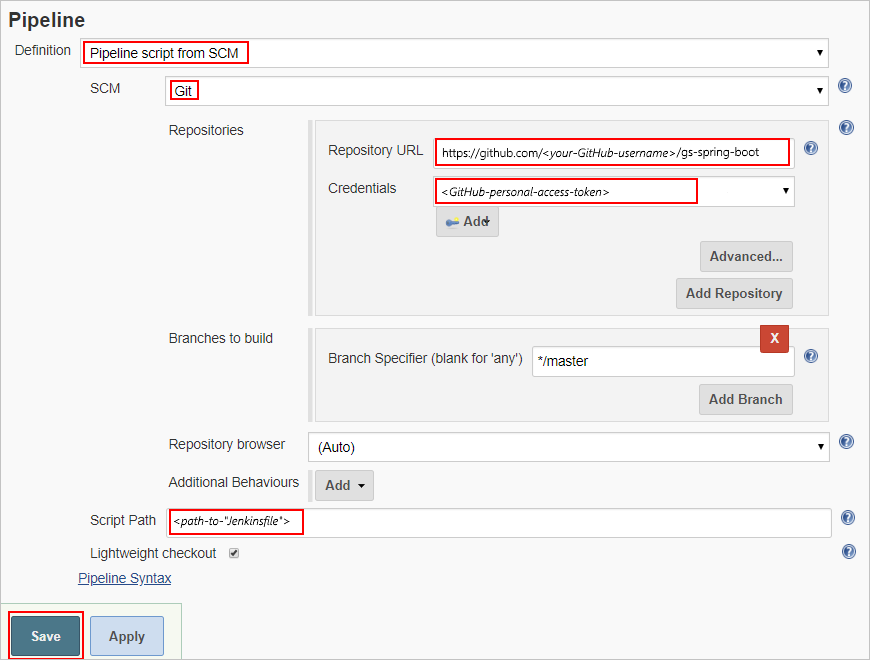

1. To test your pipeline job, return to your pipeline 
job page in Jenkins, and select **Build Now**.

   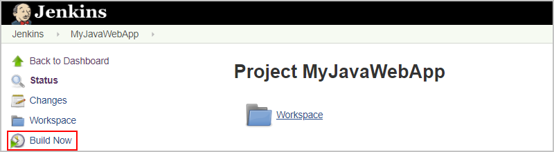

## Deploy to Azure manually

1. With the Azure CLI, either from the command line or Azure Cloud Shell, create an 
[Azure App Service web app on Linux](/azure/app-service/containers/app-service-linux-intro) 
where Jenkins can deploy your Java web app from GitHub after finishing a build. 
Make sure your App Service web app uses a unique name.

   ```azurecli-interactive
   az group create --name your-Azure-resource-group-for-Jenkins-name --location your-Azure-region
   az appservice plan create --is-linux --name your-Linux-App-Service-Plan --resource-group your-Azure-resource-group-for-Jenkins-name
   az webapp create --name your-Java-web-app-name --resource-group your-Azure-resource-group-for-Jenkins-name --plan your-Linux-App-Service-Plan --runtime "java|1.8|Tomcat|8.5"
   ```

1. In Jenkins, select your pipeline job, and then select **Build Now**.

1. After the build finishes, Jenkins deploys your app, 
which is now live on Azure at the publication URL, for example: 

   `http://<your-Java-web-app>.azurewebsites.net`

   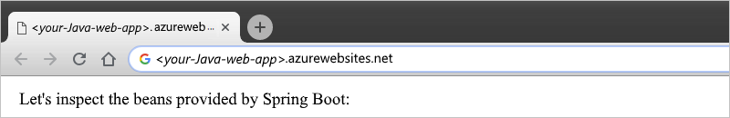

## Push changes and redeploy

1. In your web browser, go to this location in your web app's GitHub fork:

   `complete/src/main/java/Hello/Application.java`
   
1. From the upper-right corner in GitHub, choose **Edit this file**.

1. Make this change to the `commandLineRunner()` method, 
and commit the change to the repo's `master` branch.
   
   ```java
   System.out.println("Let's inspect the beans provided by Spring Boot on Azure");
   ```

   This commit in the `master` branch starts a build in Jenkins. 
   When the build finishes, reload your app in Azure.     

   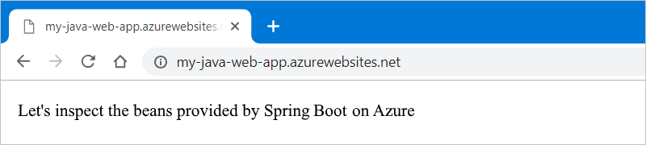

## Report Jenkins plug-in bugs

If you find any bugs with the Jenkins plug-ins, 
open an issue for that specific component in the 
[Jenkins JIRA](https://issues.jenkins-ci.org/).

## Next steps

> [!div class="nextstepaction"]
> [Use Azure VMs as build agents](/azure/jenkins/jenkins-azure-vm-agents)