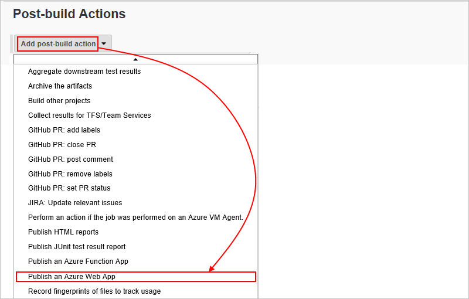
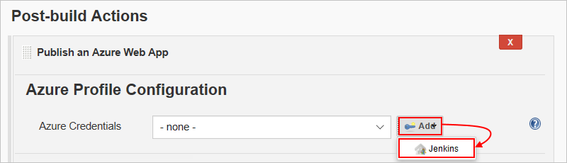
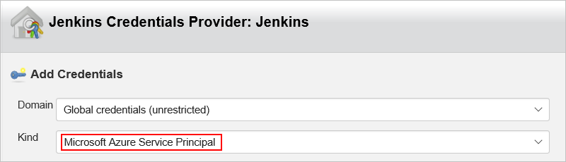
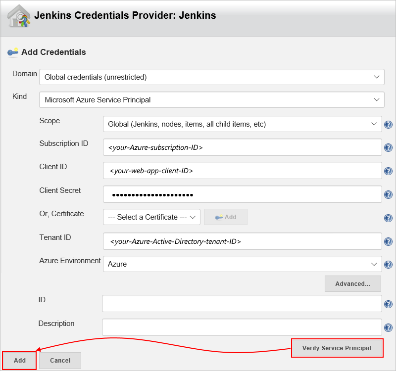
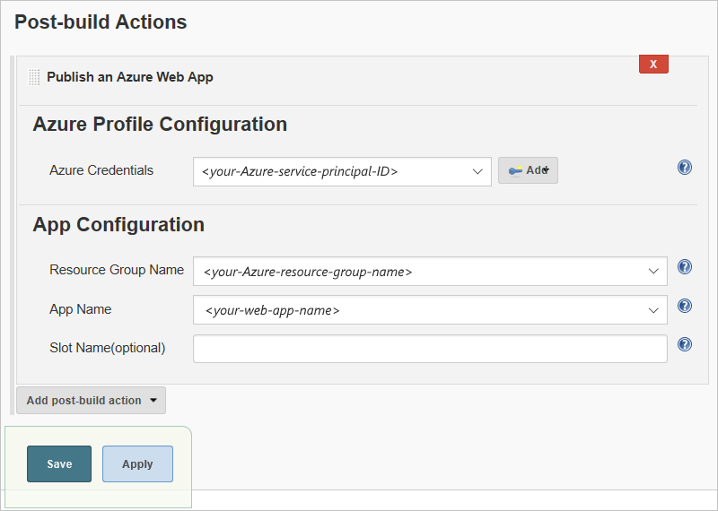

# Tutorial: Deploy Java web apps from GitHub to Azure with Jenkins through continuous integration and deployment

This tutorial shows how to set up continuous integration and deployment 
(CI/CD) in Jenkins so you can deploy a sample Java web app from GitHub to 
[Azure App Service Web Apps on Linux](/azure/app-service/containers/app-service-linux-intro), 
and keep that app updated when new commits get pushed in GitHub. 
The sample web app in this tutorial was developed by using the 
[Spring Boot](http://projects.spring.io/spring-boot/) framework. 

In this tutorial, you'll complete these tasks:

> [!div class="checklist"]
> * Install and set up the Azure App Service Jenkins 
> plug-ins so you can deploy to Azure App Service.
> * Create an Azure service principal for authentication 
> so you don't have to sign in with your user name and password.
> * Define a Jenkins pipeline job that builds your web app from a GitHub repo when a new commit is pushed.
> * Deploy the sample app to Azure App Service with a manual build.
> * Trigger a Jenkins build and update the web app by pushing changes to GitHub.

[!INCLUDE [quickstarts-free-trial-note](../../includes/quickstarts-free-trial-note.md)]

## Prerequisites

To complete this tutorial, you need these items:

* A [Jenkins](https://jenkins.io/) server with the Java Development Kit (JDK) 
and Maven tools installed on an Azure Linux VM

  If you don't have a Jenkins server, 
  complete these steps now in the Azure portal: 
  [Create Jenkins server on an Azure Linux VM](/azure/jenkins/install-jenkins-solution-template)

* A [GitHub](https://github.com) account

* [Azure CLI](/cli/azure), either from your local command line 
or in the [Azure Cloud Shell](/azure/cloud-shell/overview)

## Install Jenkins plug-ins

1. From your web browser, sign in to your Jenkins web console at this location:

   `https://<your-Jenkins-server>.<Azure-region>.cloudapp.azure.com`

1. From the Jenkins main menu, select **Manage Jenkins** > **Manage Plugins**.

   

1. On the **Available** tab, select these plug-ins:

   - [Azure App Service](https://plugins.jenkins.io/azure-app-service)
   - [GitHub Branch Source](https://plugins.jenkins.io/github-branch-source)
   - Jenkins [Environment Injector Plugin](https://plugins.jenkins.io/envinject)

   If these plug-ins don't appear, make sure they're not 
   already installed by checking the **Installed** tab.

1. To install your selected plug-ins, choose 
**Download now and install after restart**.

1. After you're done, on the Jenkins menu, select **Manage Jenkins** 
so you can return to the Jenkins management page.

## Set up Jenkins for GitHub

To have Jenkins monitor and get [events from GitHub](https://developer.github.com/webhooks/) 
when new commits for your web app are pushed to your local GitHub repo, 
enable webhooks for GitHub in Jenkins.

1. In Jenkins, from the **Manage Jenkins** page, select **Configure System**. 

   

1. In **GitHub** section, provide details for your GitHub server, 
if you haven't already. Choose **Add GitHub Server**, and select **GitHub Server**. 

   

1. If the **Manage hooks** property isn't already selected, select this property. 
Choose **Advanced** so you can specify other settings. 

   

1. Choose **Manage additional GitHub actions**, 
and select **Convert login and password to token**.

   

1. Select **From login and password**, 
enter your GitHub username and password, 
and choose **Create token credentials**, 
which creates a [GitHub Personal Access Token (PAT)](https://help.github.com/articles/creating-a-personal-access-token-for-the-command-line/).   

   

1. In the **GitHub Server** section, open the **Credentials** list, 
and select your new token. Check that authentication is working 
by choosing **Test connection**.

   

> [!NOTE]
> 
> If your GitHub account has two-factor authentication enabled, 
> create your token on GitHub and set up Jenkins to use that token. 
> For more information, see the documentation for the 
> [Jenkins GitHub plug-in](https://wiki.jenkins.io/display/JENKINS/Github+Plugin).

## Create service principal

For the pipeline job you later create 
To authenticate without providing credentials each time you need access, 
create an [Azure Active Directory service principal](azure/active-directory/develop/app-objects-and-service-principals) 
for running the pipeline job that you later create for building your app. 
This service principal is an identity you can use for authentication 
without having to provide credentials every time you need access. 

To create the service principal , use either the [Azure CLI command](cli/azure/create-an-azure-service-principal-azure-cli), 
or [Azure Cloud Shell](/azure/cloud-shell/overview):

```azurecli-interactive
az ad sp create-for-rbac --name your-service-principal-name --password your-secure-password
```

```json
{
   "appId": "<web-app-client-ID>",
   "displayName": "<your-service-principal-name>",
   "name": "http://<your-service-prinicipal-name>",
   "password": "<your-secure-password>",
   "tenant": "<Azure-Active-Directory-tenant-ID>"
}
```

## Fork sample repo and create pipeline job 

Now create a local working copy of the GitHub repo for the sample Java web app. 
You'll then create a pipeline job for building that app in Jenkins.

1. Go to the [GitHub repo for the Spring Boot sample app](https://github.com/spring-guides/gs-spring-boot), 
and fork the repo to your GitHub account by choosing **Fork**.

   

1. Return to your Jenkins web console home page, 
and select **New Item**. 

   

1. Provide a name for your pipeline job, for example, 
"My-Java-Web-App-pipeline", and select **Pipeline**. 
At the bottom, choose **OK**.   

   

1. On the **General** tab, select **Prepare an environment for the run**. 

   

1. In the **Properties Content** box that appears, 
add these environment variables:

   ```text
   AZURE_CRED_ID=<your-Azure-service-principal-name>
   RES_GROUP=<Azure-resource-group-name>
   WEB_APP=<your-web-app-name>
   ```

1. When you're done, choose **Save**.

## Set up service principal in Jenkins

Now you'll set up Jenkins with your service principal 
credentials so you can deploy to Azure App Service.

1. From your Jenkins web console home page, 
select your previously created pipeline job, 
for example, "My-Java-Web-App-pipeline". 

   

1. On the left menu, select **Configure**.

1. Go to the **Post-build Actions** section, 
and from the **Add post-build action** list, 
select **Publish an Azure Web App**.

   

   If you can't find the **Post-build Actions** section, 
   check that your job is a pipeline job.

1. After the **Azure Profile Configuration** section appears, next to 
the **Azure Credentials** box, choose **Add**, and select **Jenkins**.

   

1. In the **Jenkins Credentials Provider: Jenkins** dialog box, 
under **Add Credentials**, from the **Kind** list, select 
**Microsoft Azure Service Principal**.

   

1. In the **Add Credentials** section, enter your service principal's credentials. 

   1. If you don't know your Azure subscription ID, 
   you can get the ID by using the Azure CLI as shown:

      ```azurecli-interactive
      az account list
      ```

      ```json
      {
         "cloudName": "AzureCloud",
         "id": "<your-Azure-subscription-ID>",
         "isDefault": true,
         "name": "<your-Azure-subscription-name>",
         "state": "Enabled",
         "tenantId": "<your-Azure-Active-Directory-tenant-ID>",
         "user": {
            "name": "<Azure-username>",
            "type": "user"
         }
      }
      ```

   1. To make sure your service principal authenticates 
   with Azure, choose **Verify Service Principal**.

   1. When you're done, choose **Add**, which returns you 
   to the **Publish an Azure Web App** section. 

      

1. In the **Azure Profile Configuration** section, from the **Azure Credentials** list, 
select your new Azure service principal credentials. Under **App Configuration**, 
select the **Resource Group Name** and **App Name** for your web app, and choose **Save**.  

   

## Create web.config file

1. In your local repo's `src/main/resources/` folder, 
create a file named `web.config` that contains this XML:

   ```xml
   <?xml version="1.0" encoding="UTF-8">
   <configuration>
      <system.webServer>
         <handlers>
            <add name="httpPlatformHandler" path="*" verb="*" modules="httpPlatformHandler" resourceType="Unspecified" />
         </handlers>
         <httpPlatform processPath="%JAVA_HOME%\bin\java.exe"
        arguments="-Djava.net.preferIPv4Stack=true -Dserver.port=%HTTP_PLATFORM_PORT% -jar &quot;%HOME%\site\wwwroot\${JAR_FILE_NAME}&quot;"></httpPlatform>
      </system.webServer>
   </configuration>
   ```

1. In this XML file, replace `$(JAR_FILE_NAME)` with `gs-spring-boot-0.1.0.jar`.

## Create Jenkins file

1. In your local repo's root folder, create a script 
file named `Jenkinsfile` that contains this text 
([source in GitHub here](https://github.com/Microsoft/todo-app-java-on-azure/blob/master/doc/resources/jenkins/Jenkinsfile-webapp-se)):

   ```text  
   node {
      stage('init') {
         checkout scm
      }
      stage('build') {
         sh '''
            mvn clean package
            cd target
            cp ../src/main/resources/web.config web.config
            cp todo-app-java-on-azure-1.0-SNAPSHOT.jar app.jar 
            zip todo.zip app.jar web.config
         '''
      }
      stage('deploy') {
         azureWebAppPublish azureCredentialsId: env.AZURE_CRED_ID,
         resourceGroup: env.RES_GROUP, appName: env.WEB_APP, filePath: "**/todo.zip"
      }
   }
   ```

1. Commit these files to your local repo, and push your changes.

1. From your Jenkins web console home page, select your pipeline job. 

1. In the **Pipeline** section, from the **Definition** list, 
select **Pipeline script from SCM**. 

   1. In the **SCM** box that appears, 
   select **Git** as your source control. 

   1. In the **Repositories** section, add your repo's URL, 
   including your fork's location. 
   
   1. In the **Script Path** box, 
   add the path to your script, 
   which is "Jenkinsfile" in this example. 

   1. When you're done, choose **Save**.

1. To test your pipeline job, go to your project page in Jenkins, 
and select **Build Now**.

   

## Set up Azure App Service 

By using either the Azure CLI or [Cloud Shell](/azure/cloud-shell/overview), 
create a [Web App on Linux](/azure/app-service/containers/app-service-linux-intro). 
This example uses the "My-Java-Web-App", 
but make sure you use a unique name for your own app.
   
```azurecli-interactive
az group create --name your-Jenkins-resource-group --location your-Azure-region
az appservice plan create --is-linux --name your-Linux-App-Service-Plan --resource-group your-Jenkins-resource-group 
az webapp create --name my-Java-Web-App --resource-group your-Jenkins-resource-group --plan your-Linux-App-Service-Plan --runtime "java|1.8|Tomcat|8.5"
```

## Deploy to Azure

1. In your Jenkins web console, from your pipeline job, 
select **Build Now** so that your sample app deploys to Azure.

1. After the build completes, your app is live on Azure at the publication URL, 
for example: `http://my-java-web-app.azurewebsites.net`

   

## Push changes and redeploy

1. From your GitHub fork in your web browser, go to this location: 

   `complete/src/main/java/Hello/Application.java`
   
1. In the upper-right corner inside GitHub, choose **Edit this file**.

1. Make this change to the `commandLineRunner()` method, 
and commit the change to the repo's `master` branch.
   
   ```java
   System.out.println("Let's inspect the beans provided by Spring Boot on Azure");
   ```

   This commit in the `master` branch starts a build in Jenkins. 
   When the build finishes, reload your app in Azure.     

   

## Troubleshoot Jenkins plug-ins

If you find any bugs with the Jenkins plug-ins, 
open an issue for that specific component in the 
[Jenkins JIRA](https://issues.jenkins-ci.org/).

## Next steps

> [!div class="nextstepaction"]
> [Use Azure VMs as build agents](/azure/jenkins/jenkins-azure-vm-agents)