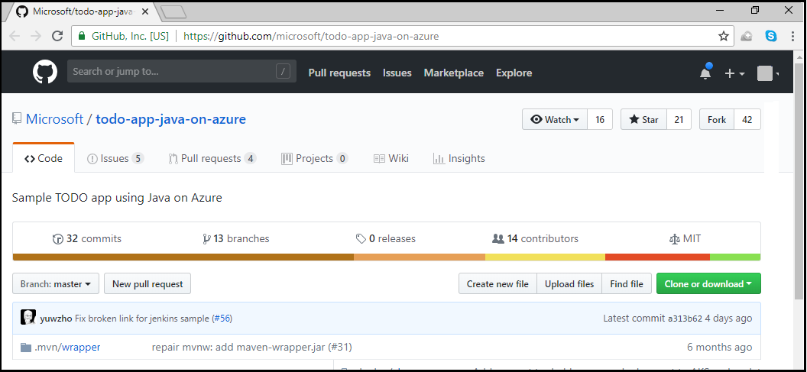
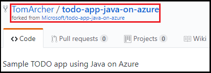
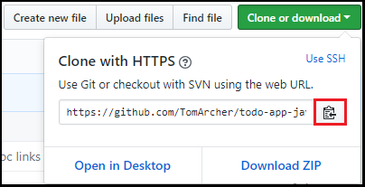
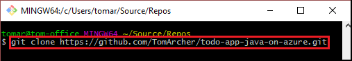
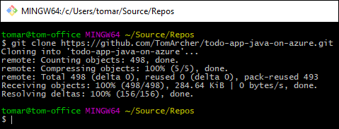
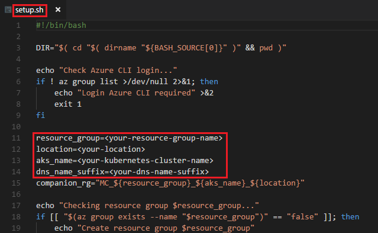
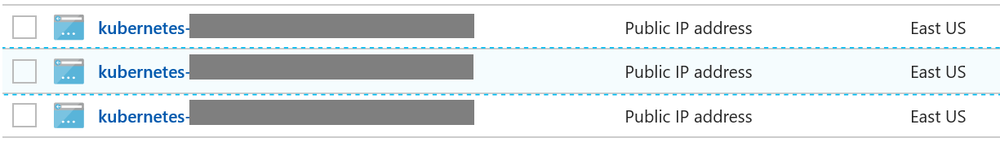

# Deploy to Azure Kubernetes Service (AKS) using Jenkins and blue/green deployment pattern

Azure Kubernetes Service (AKS) manages your hosted Kubernetes environment, making it quick and easy to deploy and manage containerized applications without container orchestration expertise. AKS also eliminates the burden of ongoing operations and maintenance by provisioning, upgrading, and scaling resources on demand, without taking your applications offline. For more information about AKS, see to the [AKS documentation](/azure/aks/).

Blue/green deployment is a DevOps Continuous Delivery (CD) pattern that relies on keeping an existing (blue) version live while a new (green) one is deployed. Typically, this pattern employs load balancing to direct increasing amounts of traffic to the green deployment. If monitoring discovers an incident, traffic can be rerouted to the blue deployment still running. For more information about Continuous Delivery, see to the article, [What is Continuous Delivery](/azure/devops/what-is-continuous-delivery).

In this tutorial, you learn how to perform the following tasks in learning how to deploy to AKS using Jenkins and the blue/green deployment pattern:

> [!div class="checklist"]
> * Learn about the blue/green deployment pattern
> * Create a managed Kubernetes cluster.
> * Run a sample script to configure a Kubernetes cluster
> * Manually configure a Kubernetes cluster
> * Create and run a Jenkins job

## Prerequisites
- [GitHub account](https://github.com) : You need a GitHub account to clone the sample repo.
- [Azure CLI 2.0](https://docs.microsoft.com/en-us/cli/azure/install-azure-cli?view=azure-cli-latest) : The Azure CLI 2.0 is used to create the Kubernetes cluster.
- [Chocolatey](https://chocolatey.org) - A package manager used to install kubectl.
- [kubectl](https://kubernetes.io/docs/tasks/tools/install-kubectl/) : A command-line interface for running commands against Kubernetes clusters.
- [jq](https://stedolan.github.io/jq/download/) : A lightweight command-line JSON processor.

## Clone the sample app from GitHub

A sample app that illustrates how to deploy to AKS using Jenkins and the blue/green pattern is on the Microsoft repo in GitHub. In this section, you create a fork of that repo in your GitHub, and clone the app to your local system.

1. Browse to the GitHub repo for the [todo-app-java-on-azure](https://github.com/microsoft/todo-app-java-on-azure.git) sample app.

    

1. Fork the repo by selecting **Fork** in the upper right of the page, and follow the instructions to fork the repo in your GitHub account.

    

1. Once you fork the repo, you see that the account name changes to your account name, and a note indicates from where the repo was forked (Microsoft).

    

1. Selecting **Clone or download**.

    

1. In the **Clone with HTTPS** window, select the copy icon.

    

1. Open a terminal or Bash window.

1. Change directories to the desired location where you want to store the local copy (clone) of the repo.

1. Using the `git clone` command, clone the URL you copied previously.

    

1. Select the &lt;Enter> key to start the clone process.

    

1. Change directories to the newly created directory that contains the clone of the app source.

## Create and configure a managed Kubernetes cluster

In this section, you perform the following steps:

- Use the Azure CLI 2.0 to create a managed Kubernetes cluster.
- Learn how to set up a cluster either by using the setup script or manually.
- Create the Azure Container Registry.

> [!NOTE]	
> AKS is currently in preview. For information on enabling the preview for your Azure subscription. see [Quickstart: Deploy an Azure Kubernetes Service (AKS) cluster
](/azure/aks/kubernetes-walkthrough#enabling-aks-preview-for-your-azure-subscription) for more details.

### Use the Azure CLI 2.0 to create a managed Kubernetes cluster
In order to create a managed Kubernetes cluster with [Azure CLI 2.0](https://docs.microsoft.com/en-us/cli/azure/install-azure-cli?view=azure-cli-latest), ensure that you are using Azure CLI version 2.0.25 or later.

1. Sign in to your Azure account. Once you enter the following `az login` command, instructions are provided that explain how to complete the signin. 
    
    ```bash
    az login
    ```

1. When you run the `az login` command in the previous step, a list of all your Azure subscriptions displays (along with their subscription IDs). In this step, you set the default Azure subscription. Replace the &lt;your-subscription-id> placeholder with the desired Azure subscription ID. 

    ```bash
    az account set -s <your-subscription-id>
    ```

1. Create a resource group. Replace the &lt;your-resource-group-name> placeholder with the name of your new resource group, and replace the &lt;your-location> placeholder with the location. The command `az account list-locations` displays all Azure locations. During the AKS preview, not all locations are available. If you enter a location that is not valid at this time, the error message will list the available locations.

    ```bash
    az group create -n <your-resource-group-name> -l <your-location>
    ```

1. Create the Kubernetes cluster. Replace the &lt;your-resource-group-name> with the name of the resource group created in the previous step, and replace the &lt;you-kubernetes-cluster-name> with the name of your new cluster. (This process can take several minutes to complete.)

    ```bash
    az aks create -g <your-resource-group-name> -n <your-kubernetes-cluster-name> --generate-ssh-keys --node-count 2
    ```

### Set up the Kubernetes cluster

Setting up a blue/green deployment in AKS can be done either with a setup script provided in the sample cloned earlier or manually. In this section, you see how to do both.

#### Set up the Kubernetes cluster via the sample setup script
1. Edit the **deploy/aks/setup/setup.sh** file, replacing the following placeholders with the appropriate values for your environment: 

    - **&lt;your-resource-group-name>**
    - **&lt;your-kubernetes-cluster-name>**
    - **&lt;your-location>**
    - **&lt;your-dns-name-suffix>**

    

1. Run the setup script.

    ```bash
    sh setup.sh
    ```

#### Set up a Kubernetes cluster manually 
1. Download the Kubernetes configuration to your profile folder.

    ```bash
    az aks get-credentials -g <your-resource-group-name> -n <your-kubernetes-cluster-name> --admin
    ```

1. Change directory to the **deploy/aks/setup**  directory. 

1. Run the following **kubectl** commands to set up the services for the public endpoint and the two test endpoints.

    ```bash
    kubectl apply -f  service-green.yml
    kubectl apply -f  test-endpoint-blue.yml
    kubectl apply -f  test-endpoint-green.yml
    ```

1. Update the DNS name for the public and test endpoints. When a Kubernetes cluster is created, an [additional resource group](https://github.com/Azure/AKS/issues/3)
    is created with the naming patter of **MC_&lt;your-resource-group-name>_&lt;your-kubernetes-cluster-name>_&lt;your-location>**.

    Locate the public ip's in the resource group

    

    For each of the services, find the external IP address by running the following command:
    
    ```bash
    kubectl get service todoapp-service
    ```
    
    Update the DNS name for the corresponding IP address with the following command:

    ```bash
    az network public-ip update --dns-name aks-todoapp --ids /subscriptions/<your-subscription-id>/resourceGroups/MC_<resourcegroup>_<aks>_<location>/providers/Microsoft.Network/publicIPAddresses/kubernetes-<ip-address>
    ```

    Repeat the call for `todoapp-test-blue` and `todoapp-test-green`:

    ```bash
    az network public-ip update --dns-name todoapp-blue --ids /subscriptions/<your-subscription-id>/resourceGroups/MC_<resourcegroup>_<aks>_<location>/providers/Microsoft.Network/publicIPAddresses/kubernetes-<ip-address>

    az network public-ip update --dns-name todoapp-green --ids /subscriptions/<your-subscription-id>/resourceGroups/MC_<resourcegroup>_<aks>_<location>/providers/Microsoft.Network/publicIPAddresses/kubernetes-<ip-address>
    ```

    The DNS name needs to be unique in your subscription. `<your-dns-name-suffix>` can be used to ensure the uniqueness.

### Create Azure Container Registry

1. Run the `az acr create` command to create an Azure Container Registry. After the Azure Container Registry creation, use `login server` as the Docker registry URL in the next section.

    ```bash
    az acr create -n <your-registry-name> -g <your-resource-group-name>
    ```

1. Run the `az acr credential` command to show your Azure Container Registry credentials. Note the Docker registry username and password as they are used in the next section.

    ```bash
    az acr credential show -n <your-registry-name>
    ```

## Prepare the Jenkins server

In this section, you see how to prepare the Jenkins server to run a build, which is fine for testing. However, as explained in the Jenkins article on the [security implications of building on master](https://wiki.jenkins.io/display/JENKINS/Security+implication+of+building+on+master), it is advised to use an [Azure VM agent](https://plugins.jenkins.io/azure-vm-agents) or [Azure Container agent](https://plugins.jenkins.io/azure-container-agents) to spin up an agent in Azure to run your builds. 

1. Deploy a [Jenkins Master on Azure](https://aka.ms/jenkins-on-azure).

1. Connect to the server via SSH, and install the build tools on the server where you run your build.
   
   ```bash
   sudo apt-get install git maven 
   ```
   
1. [Install Docker](https://docs.docker.com/install/linux/docker-ce/ubuntu/#install-docker-ce). Ensure the user `jenkins` has permission to run the `docker` commands.

1. [Install kubectl](https://kubernetes.io/docs/tasks/tools/install-kubectl/).

1. [Download jq](https://stedolan.github.io/jq/download/).

1. Install jq with the following command:

   ```bash
   sudo apt-get install jq
   ```
   
1. Install the plugins in Jenkins by performing the following steps within the Jenkins dashboard:

    1. Select **Manage Jenkins > Manage Plugins > Available**.
    1. Search for and install the Azure Container Service Plugin.

1. You need to add credentials that will be used to manage resources in Azure. If you don’t already have the plugin, install the **Azure Credential** plugin.

1. Add your Azure Service Principal credential as type/kind **Microsoft Azure Service Principal**.

1. Add your Azure Docker Registry username and password (as obtained in the section, **Create Azure Container Registry**) as type/kind **Username with password**.

## Edit the Jenkinsfile

1. In your own repo, navigate to `/deploy/aks/` and open `Jenkinsfile`

2. Update the file as follows:

    ```groovy
    def servicePrincipalId = '<your-service-principal>'
    def resourceGroup = '<your-resource-group-name>'
    def aks = '<your-kubernetes-cluster-name>'

    def cosmosResourceGroup = '<your-cosmodb-resource-group>'
    def cosmosDbName = '<your-cosmodb-name>'
    def dbName = '<your-dbname>'

    def dockerRegistry = '<your-acr-name>.azurecr.io'
    ```
    
    And update ACR credential ID:
    
    ```groovy
    def dockerCredentialId = '<your-acr-credential-id>'
    ```

## Create the job
1. Add a new job in type **Pipeline**.

1. Select **Pipeline > Definition > Pipeline script from SCM**.

1. Enter the SCM repo url with your &lt;your-forked-repo>

1. Enter the script path as `deploy/aks/Jenkinsfile`.

## Run the job

1. Verify that you can run your project successfully in your local environment. [Run project on local machine](https://github.com/Microsoft/todo-app-java-on-azure/blob/master/README.md#run-it)

1. Run the Jenkins job. When running the Jenkins job the first time, Jenkins will deploy the todo app to the Blue environment, which is the default inactive environment. 

1. To verify that the job ran, browse to the urls:
    - Public end point: `http://aks-todoapp<your-dns-name-suffix>.<your-location>.cloudapp.azure.com`
    - Blue end point - `http://aks-todoapp-blue<your-dns-name-suffix>.<your-location>.cloudapp.azure.com`
    - Green end point - `http://aks-todoapp-green<your-dns-name-suffix>.<your-location>.cloudapp.azure.com`

The public and the Blue test end points have the same update while the Green end point shows the default tomcat image. 

If you run the build more than once, it cycles through Blue and Green deployments. In other words, if the current environment is Blue, the job will deploy/test to the Green environment and then update the application public endpoint to route traffic to the Green environment if all is good with testing.

## Additional information

For more on zero-downtime deployment, check out this [quickstart template](https://github.com/Azure/azure-quickstart-templates/tree/master/301-jenkins-aks-zero-downtime-deployment). 

## Clean up resources

When no longer needed, delete the Azure resources you created in this tutorial.

```bash
az group delete -y --no-wait -n <your-resource-group-name>
```

## Troubleshooting

If you encounter any bugs with the Jenkins plugins, file an issue in the [Jenkins JIRA](https://issues.jenkins-ci.org/) for the specific component.

## Next steps

In this tutorial, you learned how to deploy to Azure Kubernetes Service (AKS) using Jenkins and blue/green deployment pattern. To learn more about the Azure Jenkins provider, see the Jenkins on Azure site.

> [!div class="nextstepaction"]
> [Jenkins on Azure](/azure/jenkins/)