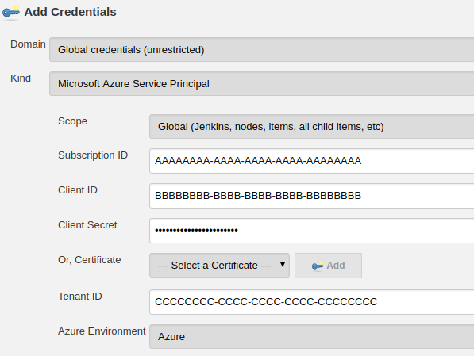
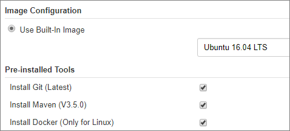

# Scale your Jenkins deployments to meet demand with Azure VM agents

This tutorial shows how to use the Jenkins [Azure VM Agents plugin](https://plugins.jenkins.io/azure-vm-agents) to add on-demand capacity with Linux virtual machines running in Azure.

In this tutorial, you will:

> [!div class="checklist"]
> * Install the Azure VM Agents plugin
> * Configure the plugin to create resources in your Azure subscription
> * Set the compute resources available to each agent
> * Set the operating system and tools installed on each agent
> * Create a new Jenkins freestyle job
> * Run the job on an Azure VM agent

> [!VIDEO https://channel9.msdn.com/Shows/Azure-Friday/Continuous-Integration-with-Jenkins-Using-Azure-VM-Agents/player]

## Prerequisites

* An Azure subscription
* A Jenkins master server. If you don't have one, view the [quickstart](install-jenkins-solution-template.md) to set up one in Azure.

[!INCLUDE [quickstarts-free-trial-note](../../includes/quickstarts-free-trial-note.md)]

## Install Azure VM Agents plugin

> [!TIP]
> If you deployed Jenkins on Azure using the [solution template](install-jenkins-solution-template.md), the Azure VM Agent plugin is already installed.

1. From the Jenkins dashboard, select **Manage Jenkins**, then select **Manage Plugins**.
2. Select the **Available** tab, then search for **Azure VM Agents**. Select the checkbox next to the entry for the plugin and select **Install without restart** from the bottom of the dashboard.

## Configure the Azure VM Agents plugin

1. From the Jenkins dashboard, select **Manage Jenkins**, then **Configure System**.
2. Scroll to the bottom of the page and find the **Cloud** section with the  **Add new cloud** dropdown and choose **Microsoft Azure VM Agents**.
3. Select an existing service principal from **Add** drop-down in the **Azure Credentials** section. If none is listed, perform the following steps to [create a service principal](/cli/azure/create-an-azure-service-principal-azure-cli?toc=%2fazure%2fazure-resource-manager) for your Azure account and add it to your Jenkins configuration:   

    a. Select **Add** next to **Azure Credentials** and choose **Jenkins**.   
    b. In the **Add Credentials** dialog, select **Microsoft Azure Service Principal** from the **Kind** drop-down.   
    c. Create an Active Directory Service principal from the Azure CLI or [Cloud Shell](/azure/cloud-shell/overview).
    
    ```azurecli-interactive
    az ad sp create-for-rbac --name jenkins_sp --password secure_password
    ```

    ```json
    {
        "appId": "BBBBBBBB-BBBB-BBBB-BBBB-BBBBBBBBBBB",
        "displayName": "jenkins_sp",
        "name": "http://jenkins_sp",
        "password": "secure_password",
        "tenant": "CCCCCCCC-CCCC-CCCC-CCCCCCCCCCC"
    }
    ```
    d. Enter the credentials from the service principal into the **Add credentials** dialog. If you don't know your Azure subscription ID, you can query it from the CLI:
     
     ```azurecli-interactive
     az account list
     ```

     ```json
        {
            "cloudName": "AzureCloud",
            "id": "AAAAAAAA-AAAA-AAAA-AAAA-AAAAAAAAAAAA",
            "isDefault": true,
            "name": "Visual Studio Enterprise",
            "state": "Enabled",
            "tenantId": "CCCCCCCC-CCCC-CCCC-CCCC-CCCCCCCCCCC",
            "user": {
            "name": "raisa@fabrikam.com",
            "type": "user"
            }
     ```

    The completed service principal should use the `id` field for **Subscription ID**, the `appId` value for **Client ID**, `password` for **Client Secret**, and a URL for **OAuth 2.0 Token Endpoint** of `https://login.windows.net/<tenant_value>`. Select **Add** to add the service principal and then configure the plugin to use the newly created credential.

    

    

4. In the **Resource Group Name** section, leave **Create new** selected and enter `myJenkinsAgentGroup`.
5. Select **Verify configuration** to connect to Azure to test the profile settings.
6. Select **Apply** to update the plugin configuration.

## Configure agent resources

Configure a template for use to define an Azure VM agent. This template defines the compute resources each agent has when created.

1. Select **Add** next to **Add Azure Virtual Machine Template**.
2. Enter `defaulttemplate` for the **Name**
3. Enter `ubuntu` for the **Label**
4. Select the desired [Azure region](https://azure.microsoft.com/regions/) from the combo box.
5. Select a [VM size](/azure/virtual-machines/linux/sizes) from the drop-down under **Virtual Machine Size**. A general-purpose `Standard_DS1_v2` size is fine for this tutorial.   
6. Leave the **Retention time** at `60`. This setting defines the number of minutes Jenkins can wait before it deallocated idle agents. Specify 0 if you do not want idle agents to be removed automatically.

   

## Configure agent operating system and tools

In the **Image Configuration** section of the plugin configuration, select **Ubuntu 16.04 LTS**. Check the boxes next to **Install Git (Latest)**, **Install Maven (V3.5.0)**, and **Install Docker** to install these tools on newly created agents.



Select **Add** next to **Admin Credentials**, then select **Jenkins**. Enter a username and password used to log in to the agents, making sure they satisfy the [username and password policy](/azure/virtual-machines/linux/faq#what-are-the-username-requirements-when-creating-a-vm) for administrative accounts on Azure VMs.

Select **Verify Template** to verify the configuration and then select **Save** to save your changes and return to the Jenkins dashboard.

## Create a job in Jenkins

1. Within the Jenkins dashboard, click **New Item**. 
2. Enter `demoproject1` for the name and select **Freestyle project**, then select **OK**.
3. In the **General** tab, choose **Restrict where project can be run** and type `ubuntu` in **Label Expression**. You see a message confirming that the label is served by the cloud configuration created in the previous step. 
   
4. In the **Source Code Management** tab, select **Git** and add the following URL into the **Repository URL** field: `https://github.com/spring-projects/spring-petclinic.git`
5. In the **Build** tab, select **Add build step**, then **Invoke top-level Maven targets**. Enter `package` in the **Goals** field.
6. Select **Save** to save the job definition.

## Build the new job on an Azure VM agent

1. Go back to the Jenkins dashboard.
2. Select the job you created in the previous step, then click **Build now**. A new build is queued, but does not start until an agent VM is created in your Azure subscription.
3. Once the build is complete, go to **Console output**. You see that the build was performed remotely on an Azure agent.


## Next steps

> [!div class="nextstepaction"]
> [CI/CD to Azure App Service](deploy-jenkins-app-service-plugin.md)
