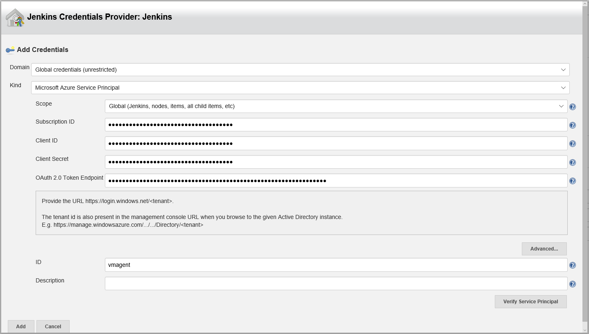
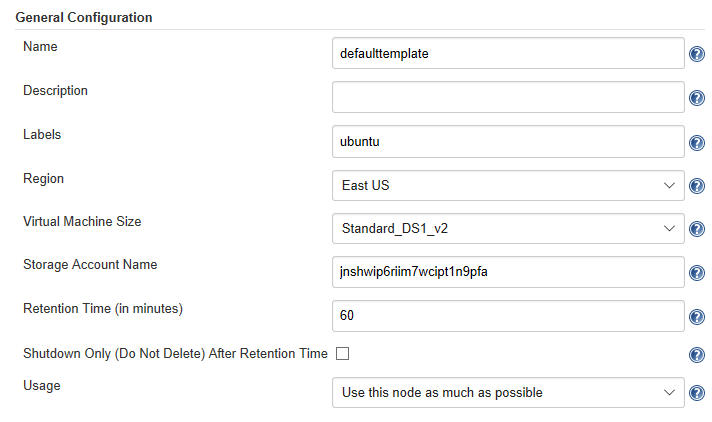
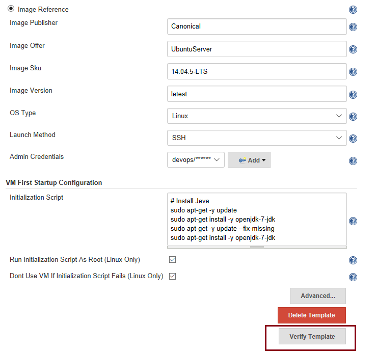
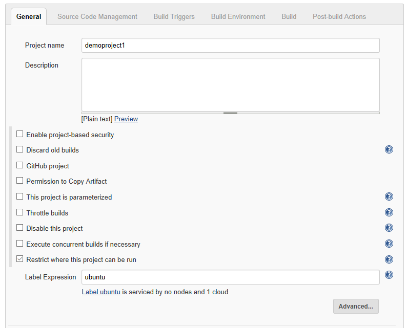
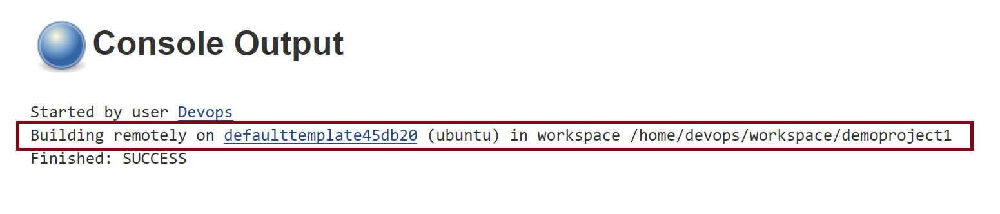

# Use Azure VM agents for continuous integration with Jenkins.

This quickstart shows how to use the Jenkins Azure VM Agents plugin to create an on-demand Linux (Ubuntu) agent in Azure.

## Prerequisites

To complete this quickstart:

* If you do not already have a Jenkins master, you can start with the [Solution Template](install-jenkins-solution-template.md) 
* Refer to [Create an Azure Service principal with Azure CLI 2.0](https://docs.microsoft.com/en-us/cli/azure/create-an-azure-service-principal-azure-cli?toc=%2fazure%2fazure-resource-manager%2ftoc.json) if you do not already have an Azure service principal.

## Install Azure VM Agents plugin

If you start from the [Solution Template](install-jenkins-solution-template.md), the Azure VM Agent plugin is installed in the Jenkins master.

Otherwise, install the **Azure VM Agents** plugin from within the Jenkins dashboard.

## Configure the plugin

* Within the Jenkins dashboard, click **Manage Jenkins -> Configure System ->**. Scroll to the bottom of the page and find the section with the dropdown **Add new cloud**. From the menu, select **Microsoft Azure VM Agents**
* Select an existing account from the Azure Credentials dropdown.  To add a new **Microsoft Azure Service Principal** enter the following: Subscription ID, Client ID, Client Secret, and OAuth 2.0 Token Endpoint.



* Click **Verify configuration** to make sure that the profile configuration is correct.
* Save the configuration, and continue to the next step.

## Template configuration

### General configuration
Next, configure a template for use to define an Azure VM agent. 

* Click **Add** to add a template. 
* Provide a name for your new template. 
* For the label, enter  "ubuntu." This label is used during the job configuration.
* Select the desired region from the combo box.
* Select the desired VM size.
* Specify the Azure Storage account name or leave it blank to use the default name "jenkinsarmst."
* Specify the retention time in minutes. This setting defines the number of minutes Jenkins can wait before automatically deleting an idle agent. Specify 0 if you do not want idle agents to be deleted automatically.



### Image configuration

To create a Linux (Ubuntu) agent, select **Image reference** and use the following configuration as an example. Refer to [Azure Marketplace](https://azuremarketplace.microsoft.com/en-us/marketplace/apps/category/compute?subcategories=virtual-machine-images&page=1) for the latest Azure supported images.

* Image Publisher: Canonical
* Image Offer: UbuntuServer
* Image Sku: 14.04.5-LTS
* Image version: latest
* OS Type: Linux
* Launch method: SSH
* Provide an admin credentials
* For VM initialization script, enter:
```
# Install Java
sudo apt-get -y update
sudo apt-get install -y openjdk-7-jdk
sudo apt-get -y update --fix-missing
sudo apt-get install -y openjdk-7-jdk
```


* Click **Verify Template** to verify the configuration.
* Click **Save**.

## Create a job in Jenkins

* Within the Jenkins dashboard, click **New Item**. 
* Enter a name and select **Freestyle project** and click **OK**.
* In the **General** tab, select "Restrict where project can be run" and type "ubuntu" in Label Expression. You now see "ubuntu" in the dropdown.
* Click **Save**.



## Build your new project

* Go back to the Jenkins dashboard.
* Right-click the new job you created, then click **Build now**. A build is kicked off. 
* Once the build is complete, go to **Console output**. You see that the build was performed remotely on Azure.



## Reference

* Azure Friday video: [Continuous Integration with Jenkins using Azure VM agents](https://channel9.msdn.com/Shows/Azure-Friday/Continuous-Integration-with-Jenkins-Using-Azure-VM-Agents)
* Support information and configuration options:  [Azure VM Agent Jenkins Plugin Wiki](https://wiki.jenkins-ci.org/display/JENKINS/Azure+VM+Agents+Plugin) 

