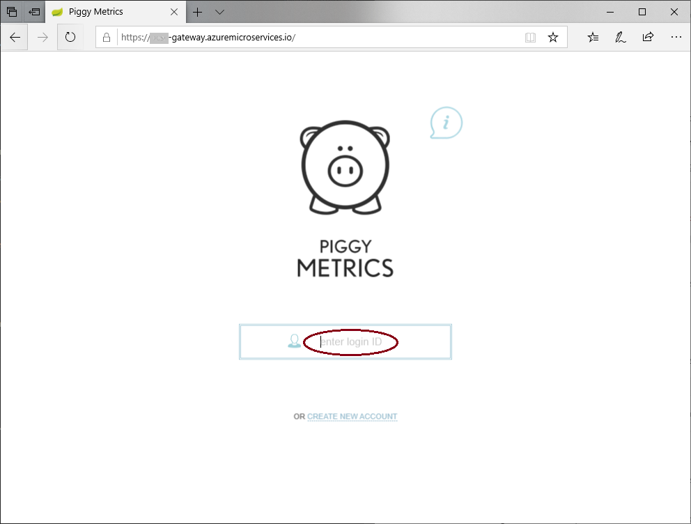

# Tutorial: Deploy apps to Azure Spring Cloud using Jenkins and the Azure CLI

[Azure Spring Cloud](https://docs.microsoft.com/azure/spring-cloud/spring-cloud-overview) is a fully managed microservice development with built-in service discovery and configuration management. The service makes it easy to deploy Spring Boot-based microservice applications to Azure. This tutorial demonstrates how you can use Azure CLI in Jenkins to automate continuous integration and delivery (CI/CD) for Azure Spring Cloud.

In this tutorial, you'll complete these tasks:

> [!div class="checklist"]
> * Provision a service instance and launch a Java Spring application
> * Prepare your Jenkins server
> * Use the Azure CLI in a Jenkins pipeline to build and deploy the microservice applications 

This tutorial assumes intermediate knowledge of core Azure services, Azure Spring Cloud, Jenkins [pipelines](https://jenkins.io/doc/book/pipeline/) and plug-ins, and GitHub.

## Prerequisites

>[!Note]
> Azure Spring Cloud is currently offered as a public preview. Public preview offerings allow customers to experiment with new features prior to their official release.  Public preview features and services are not meant for production use.  For more information about support during previews, please review our [FAQ](https://azure.microsoft.com/support/faq/) or file a [Support request](https://docs.microsoft.com/azure/azure-supportability/how-to-create-azure-support-request) to learn more.

- **Azure subscription**: If you don't have an Azure subscription, create a [free account](https://azure.microsoft.com/free/?ref=microsoft.com&utm_source=microsoft.com&utm_medium=docs&utm_campaign=visualstudio) before you begin.

* A GitHub account. If you don't have a GitHub account, create a [free account](https://github.com/) before you begin.

* A Jenkins master server. If you don't already have a Jenkins master, deploy [Jenkins](https://aka.ms/jenkins-on-azure) on Azure by following the steps in this [quickstart](https://docs.microsoft.com/azure/jenkins/install-jenkins-solution-template). The following are required on the Jenkins node/agent (for example. build server):

    * [Git](https://git-scm.com/)
    * [JDK 8](https://docs.microsoft.com/java/azure/jdk/?view=azure-java-stable)
    * [Maven 3.0 or above](https://maven.apache.org/download.cgi)
    * [Azure CLI installed](/cli/azure/install-azure-cli?view=azure-cli-latest), version 2.0.67 or higher

    >[!TIP]
    > Tools like Git, JDK, Az CLI, and Azure plug-ius are included by default in the Azure Marketplace [Microsoft Jenkins](https://aka.ms/jenkins-on-azure) solution template.
    
* [Sign up for an Azure subscription](https://azure.microsoft.com/free/)
 
## Provision a service instance and launch a Java Spring application

We use [Piggy Metrics](https://github.com/Azure-Samples/piggymetrics) as the sample Microsoft service application and follow the same steps in [Quickstart: Launch a Java Spring application using the Azure CLI](https://docs.microsoft.com/azure/spring-cloud/spring-cloud-quickstart-launch-app-cli) to provision the service instance and set up the applications. If you have already gone through the same process, you can skip to the next section. Otherwise, included in the following are the Azure CLI commands. Refer to [Quickstart: Launch a Java Spring application using the Azure CLI](https://docs.microsoft.com/azure/spring-cloud/spring-cloud-quickstart-launch-app-cli) to get additional background information.

Your local machine needs to meet the same prerequisite as the Jenkins build server. Make sure the following are installed to build and deploy the microservice applications:
    * [Git](https://git-scm.com/)
    * [JDK 8](https://docs.microsoft.com/java/azure/jdk/?view=azure-java-stable)
    * [Maven 3.0 or above](https://maven.apache.org/download.cgi)
    * [Azure CLI installed](/cli/azure/install-azure-cli?view=azure-cli-latest), version 2.0.67 or higher

1. Install the Azure Spring Cloud extension:

    ```Azure CLI
        az extension add --name spring-cloud
    ```

2. Create a resource group to contain your Azure Spring Cloud service:

    ```Azure CLI
        az group create --location eastus --name <resource group name>
    ```

3. Provision an instance of Azure Spring Cloud:

    ```Azure CLI
        az spring-cloud create -n <service name> -g <resource group name>
    ```

4. Fork the [Piggy Metrics](https://github.com/Azure-Samples/piggymetrics) repo to your own GitHub account. In your local machine, clone your repo in a directory called `source-code`:

    ```bash
        mkdir source-code
        git clone https://github.com/<your GitHub id>/piggymetrics
    ```

5. Set up your configuration server. Make sure you replace &lt;your GitHub id&gt; with the correct value.

    ```Azure CLI
        az spring-cloud config-server git set -n <your-service-name> --uri https://github.com/<your GitHub id>/piggymetrics --label config
    ```

6. Build the project:

    ```bash
        cd piggymetrics
        mvn clean package -D skipTests
    ```

7. Create the three microservices: **gateway**, **auth-service**, and **account-service**:

    ```Azure CLI
        az spring-cloud app create --n gateway -s <service name> -g <resource group name>
        az spring-cloud app create --n auth-service -s <service name> -g <resource group name>
        az spring-cloud app create --n account-service -s <service name> -g <resource group name>
    ```

8. Deploy the applications: 

    ```Azure CLI
        az spring-cloud app deploy -n gateway -s <service name> -g <resource group name> --jar-path ./gateway/target/gateway.jar
        az spring-cloud app deploy -n account-service -s <service name> -g <resource group name> --jar-path ./account-service/target/account-service.jar
        az spring-cloud app deploy -n auth-service -s <service name> -g <resource group name> --jar-path ./auth-service/target/auth-service.jar
    ```

9. Assign public endpoint to gateway:

    ```Azure CLI
        az spring-cloud app update -n gateway -s <service name> -g <resource group name> --is-public true
    ```

10. Query the gateway application to get the url so that you can verify that the application is running.

    ```Azure CLI
    az spring-cloud app show --name gateway | grep url
    ```
    
    Navigate to the URL provided by the previous command to run the PiggyMetrics application. 

## Prepare Jenkins server

In this section, you prepare the Jenkins server to run a build, which is fine for testing. However, because of security implication, you should use an [Azure VM agent](https://plugins.jenkins.io/azure-vm-agents) or [Azure Container agent](https://plugins.jenkins.io/azure-container-agents) to spin up an agent in Azure to run your builds. For more information, see the Jenkins article on the [security implications of building on master](https://wiki.jenkins.io/display/JENKINS/Security+implication+of+building+on+master).

### Install plug-ins

1. Sign in to your Jenkins server. Choose **Manage Jenkins > Manage Plugins**.
2. On the **Available** tab, select the following plug-ins:
    * [GitHub Integration](https://plugins.jenkins.io/github-pullrequest)
    * [Azure Credential](https://plugins.jenkins.io/azure-credentials)

    If these plug-ins don't appear in the list, check the **Installed** tab to see if they're already installed.

3. To install the plug-ins, choose **Download now and install after restart**.

4. Restart your Jenkins server to complete the installation.

### Add your Azure Service Principal credential in Jenkins credential store

1. You need an Azure Service Principal to deploy to Azure. For more information, see the [Create service principal](https://docs.microsoft.com/azure/jenkins/tutorial-jenkins-deploy-web-app-azure-app-service#create-service-principal) section in the Deploy to Azure App Service tutorial. The output from `az ad sp create-for-rbac` looks something like this:

    ```
    {
        "appId": "xxxxxx-xxx-xxxx-xxx-xxxxxxxxxxxx",
        "displayName": "xxxxxxxjenkinssp",
        "name": "http://xxxxxxxjenkinssp",
        "password": "xxxxxx-xxx-xxxx-xxx-xxxxxxxxxxxx",
        "tenant": "xxxxxx--xxx-xxxx-xxx-xxxxxxxxxxxx"
    }
    ```

2. On the Jenkins dashboard, select **Credentials** > **System**. Then, select **Global credentials(unrestricted)**.

3. Select **Add Credentials**. 

4. Select **Microsoft Azure Service Principal** as kind.

5. Supply values for:
        * Subscription ID: use your Azure subscription ID
        * Client ID: use `appId`
        * Client Secret: use `password`
        * Tenant ID: use `tenant` 
        * Azure Environment: select a pre-set value. For example, use **Azure** for Azure Global
        * ID: set as **azure_service_principal**. We use this ID in a later step in this article
        * Description: is an optional field. We recommend providing a meaningful value here.

### Install Maven and Az CLI spring-cloud extension

The sample pipeline uses Maven to build and Az CLI to deploy to the service instance. When Jenkins is installed, it creates an admin account named *jenkins*. Ensure that the user *jenkins* has permission to run the spring-cloud extension.

1. Connect to the Jenkins master via SSH. 

2. Install Maven

    ```bash
        sudo apt-get install maven 
    ```

3. Install the Azure CLI. For more information, see [Installing the Azure CLI](https://docs.microsoft.com/cli/azure/install-azure-cli?view=azure-cli-latest). Azure CLI is installed by default if you use [Jenkins Master on Azure](https://aka.ms/jenkins-on-azure).

4. Switch to the `jenkins` user:

    ```bash
        sudo su jenkins
    ```

5. Add the **spring-cloud** extension:

    ```bash
        az extension add --name spring-cloud
    ```

## Create a Jenkinsfile
1. In your own repo (https://github.com/&lt;your GitHub id&gt;/piggymetrics), create a **Jenkinsfile** in the root.

2. Update the file as follows. Make sure you replace the values of **\<resource group name>** and **\<service name>**. Replace **azure_service_principal** with the right ID if you use a different value when you added the credential in Jenkins. 

```groovy
    node {
      stage('init') {
        checkout scm
      }
      stage('build') {
        sh 'mvn clean package'
      }
      stage('deploy') {
        withCredentials([azureServicePrincipal('azure_service_principal')]) {
          // login to Azure
          sh '''
            az login --service-principal -u $AZURE_CLIENT_ID -p $AZURE_CLIENT_SECRET -t $AZURE_TENANT_ID
            az account set -s $AZURE_SUBSCRIPTION_ID
          '''  
          // Set default resource group name and service name. Replace <resource group name> and <service name> with the right values
          sh 'az configure --defaults group=<resource group name>'
          sh 'az configure --defaults spring-cloud=<service name>'
          // Deploy applications
          sh 'az spring-cloud app deploy -n gateway --jar-path ./gateway/target/gateway.jar'
          sh 'az spring-cloud app deploy -n account-service --jar-path ./account-service/target/account-service.jar'
          sh 'az spring-cloud app deploy -n auth-service --jar-path ./auth-service/target/auth-service.jar'
          sh 'az logout'
        }
      }
    }
```

3. Save and commit the change.

## Create the job

1. On the Jenkins dashboard, click **New Item**.

2. Provide a name, *Deploy-PiggyMetrics* for the job and select **Pipeline**. Click OK.

3. Click the **Pipeline** tab next.

4. For **Definition**, select **Pipeline script from SCM**.

5. For **SCM**, select **Git**.

6. Enter the GitHub URL for your forked repo: **https://github.com/&lt;your GitHub id&gt;/piggymetrics.git**

7. Make sure **Branch Specifier (black for 'any')** is ***/Azure**

8. Keep **Script path** as **Jenkinsfile**

7. Click **Save**

## Validate and run the job

Before running the job, let's update the text in the login input box to **enter login ID**.

1. In your own repo, open `index.html` in **/gateway/src/main/resources/static/**

2. Search for "enter your login" and update to "enter login ID"

    ```HTML
        <input class="frontforms" id="frontloginform" name="username" placeholder="enter login ID" type="text" autocomplete="off"/>
    ```

3. Commit the changes

4. Run the job in Jenkins manually. On the Jenkins dashboard, click the job *Deploy-PiggyMetrics* and then **Build Now**.

After the job is complete, navigate to the public IP of the **gateway** application and verify that your application has been updated. 



## Clean up resources

When no longer needed, delete the resources created in this article:

```bash
az group delete -y --no-wait -n <resource group name>
```

## Next steps

In this article, you learned how to use Azure CLI in Jenkins to automate continuous integration and delivery (CI/CD) for Azure Spring Cloud.

To learn more about Azure Jenkins provider, see the Jenkins on Azure site.

> [!div class="nextstepaction"]
> [Jenkins on Azure](/azure/jenkins/)
