# Tutorial: Deploy from GitHub to Azure App Service with Jenkins continuous integration and deployment

This tutorial deploys a sample Java web app from GitHub to 
[Azure App Service on Linux](/azure/app-service/containers/app-service-linux-intro) 
by setting up continuous integration (CI) and continuous 
deployment (CD) in Jenkins. When you update the app by 
pushing commits to GitHub, Jenkins automatically builds 
and republishes your app to Azure App Service. The sample 
app in this tutorial was developed by using the 
[Spring Boot](https://projects.spring.io/spring-boot/) framework. 

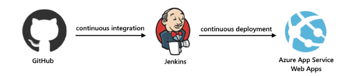

In this tutorial, you'll complete these tasks:

> [!div class="checklist"]
> * Install Jenkins plug-ins so you can build from GitHub, 
> deploy to Azure App Service, and other related tasks.
> * Fork the sample GitHub repo so you have a working copy.
> * Connect Jenkins to GitHub.
> * Create an Azure service principal so Jenkins 
> can access Azure without using your credentials.
> * Add your service principal to Jenkins.
> * Create the Jenkins pipeline that builds and deploys 
> the sample app each time you update the app in GitHub.
> * Create build and deployment files for your Jenkins pipeline.
> * Point your Jenkins pipeline at the build and deployment script.
> * Deploy your sample app to Azure by running a manual build.
> * Push an app update in GitHub, which triggers Jenkins to build and redeploy to Azure.

[!INCLUDE [quickstarts-free-trial-note](../../includes/quickstarts-free-trial-note.md)]

## Prerequisites

To complete this tutorial, you need these items:

* A [Jenkins](https://jenkins.io/) server with the Java Development Kit (JDK) 
and Maven tools installed on an Azure Linux VM

  If you don't have a Jenkins server, 
  complete these steps now in the Azure portal: 
  [Create Jenkins server on an Azure Linux VM](/azure/jenkins/install-jenkins-solution-template)

* A [GitHub](https://github.com) account so you can get a 
working copy (fork) for the sample Java web app. 

* [Azure CLI](/cli/azure/install-azure-cli), 
which you can run from either your local command line 
or [Azure Cloud Shell](/azure/cloud-shell/overview)

## Install Jenkins plug-ins

1. Sign in to your Jenkins web console at this location:

   `https://<Jenkins-server-name>.<Azure-region>.cloudapp.azure.com`

1. On the Jenkins main page, select **Manage Jenkins** > **Manage Plugins**.

   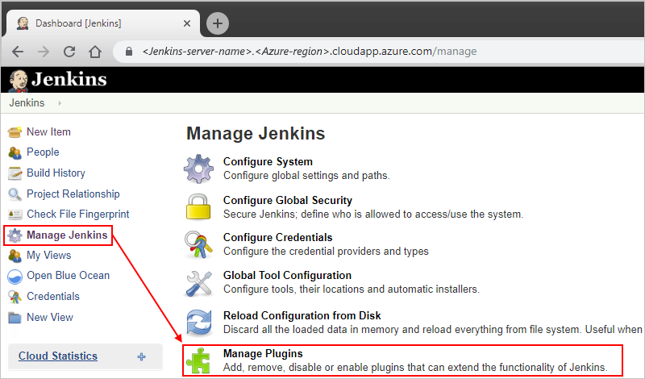

1. On the **Available** tab, select these plug-ins:

   - [Azure App Service](https://plugins.jenkins.io/azure-app-service)
   - [GitHub Branch Source](https://plugins.jenkins.io/github-branch-source)
   - Jenkins [Environment Injector Plugin](https://plugins.jenkins.io/envinject)
   - [Azure Credentials](https://plugins.jenkins.io/azure-credentials)

   If these plug-ins don't appear, make sure they're not 
   already installed by checking the **Installed** tab.

1. To install your selected plug-ins, choose 
**Download now and install after restart**.

1. After you're done, on the Jenkins menu, 
select **Manage Jenkins** so that you return to 
the Jenkins management page for future steps.

## Fork sample GitHub repo

1. [Sign in to GitHub repo for the Spring Boot sample app](https://github.com/spring-guides/gs-spring-boot). 

1. In the upper-right corner in GitHub, choose **Fork**.

   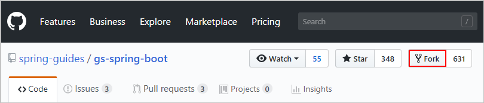

1. Follow the prompts to select your GitHub account and finish forking.

Next, set up Jenkins with your GitHub credentials.

## Connect Jenkins to GitHub

To have Jenkins monitor GitHub and respond when new 
commits get pushed to your web app in your GitHub fork, 
enable [GitHub webhooks](https://developer.github.com/webhooks/) 
in Jenkins.

> [!NOTE]
> 
> These steps create personal access token credentials for Jenkins 
> to work with GitHub by using your GitHub username and password. 
> However, if your GitHub account uses two-factor authentication, 
> create your token in GitHub and set up Jenkins to use that token instead. 
> For more information, see the 
> [Jenkins GitHub plug-in](https://wiki.jenkins.io/display/JENKINS/GitHub+Plugin) documentation.

1. From the **Manage Jenkins** page, 
select **Configure System**. 

   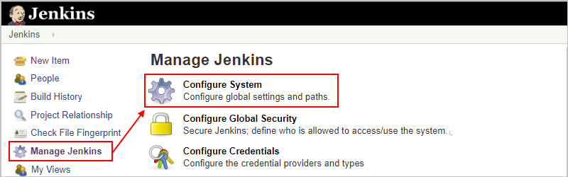

1. In **GitHub** section, provide details for your GitHub server. 
From the **Add GitHub Server** list, select **GitHub Server**. 

   

1. If the **Manage hooks** property isn't selected, select this property. 
Choose **Advanced** so you can specify other settings. 

   

1. From the **Manage additional GitHub actions** list, 
select **Convert login and password to token**.

   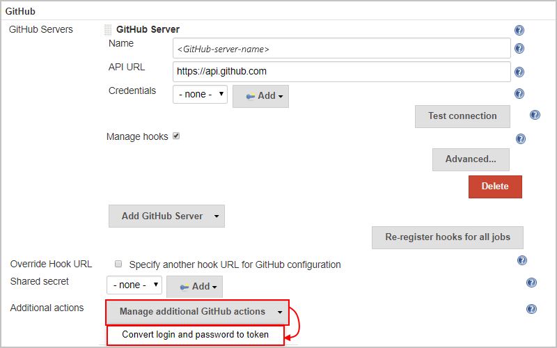

1. Select **From login and password** so you 
can enter your GitHub username and password. 
When you're done, choose **Create token credentials**, 
which creates a [GitHub personal access token (PAT)](https://help.github.com/articles/creating-a-personal-access-token-for-the-command-line/).   

   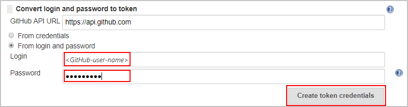

1. In the **GitHub Server** section, from the **Credentials** list, 
select your new token. Check that authentication is working 
by choosing **Test connection**.

   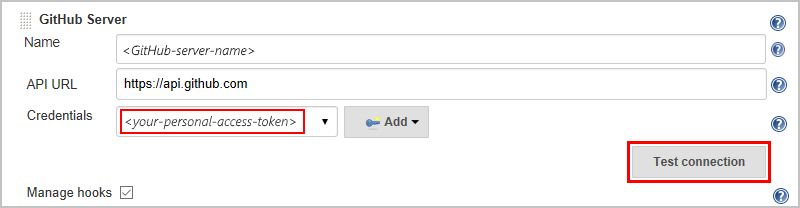

Next, create the Azure service principal that Jenkins 
uses for authenticating and accessing Azure resources.

## Create service principal

In a later section, you create a Jenkins pipeline job that builds 
your app from GitHub and deploys your app to Azure App Service. 
To have Jenkins access Azure without entering your credentials, 
create a [service principal](https://docs.microsoft.com/azure/active-directory/develop/app-objects-and-service-principals) 
in Azure Active Directory for Jenkins. A service principal is 
a separate identity that Jenkins can use for authenticating access 
to Azure resources. To create this service principal, run the Azure CLI command 
[**`az ad sp create-for-rbac`**](https://docs.microsoft.com/cli/azure/create-an-azure-service-principal-azure-cli?view=azure-cli-latest), 
either from your local command line or Azure Cloud Shell, for example: 

```azurecli-interactive
az ad sp create-for-rbac --name "yourAzureServicePrincipalName" --password yourSecurePassword
```

Make sure you use quotation marks around the service principal name. 
Also, create a strong password based on the 
[Azure Active Directory password rules and restrictions](/azure/active-directory/active-directory-passwords-policy). 
If you don't provide a password, the Azure CLI creates a password for you. 

Here's the output generated by the **`create-for-rbac`** command: 

```json
{
   "appId": "yourAzureServicePrincipal-ID", // A GUID such as AAAAAAAA-AAAA-AAAA-AAAA-AAAAAAAAAAAA
   "displayName": "yourAzureServicePrincipalName", // A user-friendly name for your Azure service principal
   "name": "http://yourAzureServicePrincipalName",
   "password": "yourSecurePassword",
   "tenant": "yourAzureActiveDirectoryTenant-ID" // A GUID such as BBBBBBBB-BBBB-BBBB-BBBB-BBBBBBBBBBBB
}
```

> [!TIP]
> 
> If you already have a service principal,
> you can reuse that identity instead.
> When providing service principal values for authentication, 
> use the `appId`, `password`, and `tenant` property values. 
> When searching for an existing service principal, 
> use the `displayName` property value.

## Add service principal to Jenkins

1. On the Jenkins main page, select **Credentials** > **System**. 

1. On the **System** page, under **Domain**, 
select **Global credentials (unrestricted)**.

1. From the left menu, select **Add Credentials**.

1. From the **Kind** list, select **Azure Service Principal**.

1. Provide the information for your service principal and Azure 
subscription in the properties described by the table in this step:

   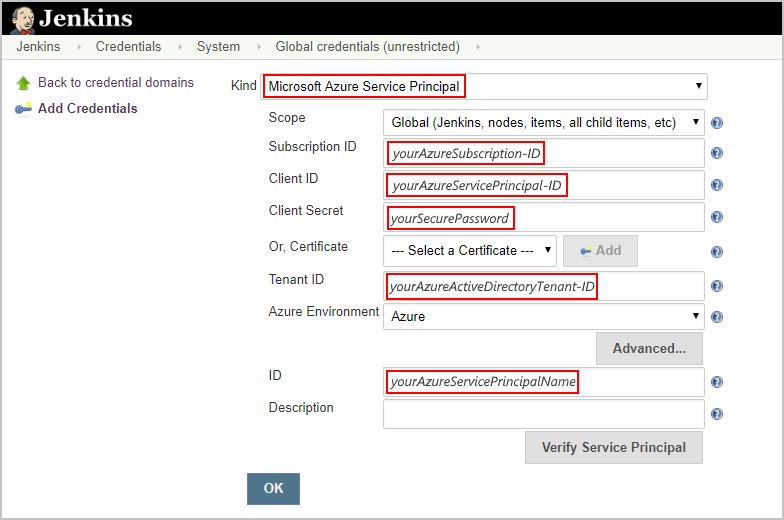

   | Property | Value | Description | 
   |----------|-------|-------------| 
   | **Subscription ID** | <*yourAzureSubscription-ID*> | The GUID value for your Azure subscription <p>**Tip**: If you don't know your Azure subscription ID, run this Azure CLI command from either the command line or in Cloud Shell, and then use the `id` GUID value: <p>`az account list` | 
   | **Client ID** | <*yourAzureServicePrincipal-ID*> | The `appId` GUID value previously generated for your Azure service principal | 
   | **Client Secret** | <*yourSecurePassword*> | The `password` value or "secret" you provided for your Azure service principal | 
   | **Tenant ID** | <*yourAzureActiveDirectoryTenant-ID*> | The `tenant` GUID value for your Azure Active Directory tenant | 
   | **ID** | <*yourAzureServicePrincipalName*> | The `displayName` value for your Azure service principal | 
   |||| 

1. To confirm that your service principal works, 
choose **Verify Service Principal**. When you're done, choose **OK**.

Next, create the Jenkins pipeline that builds and deploys your app.

## Create Jenkins pipeline

In Jenkins, create the pipeline job for building and deploying your app.

1. Return to your Jenkins home page, and select **New Item**. 

   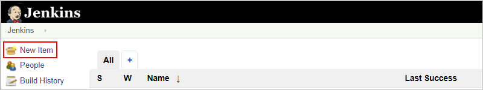

1. Provide a name for your pipeline job, for example, 
"My-Java-Web-App", and select **Pipeline**. 
At the bottom, choose **OK**.  

   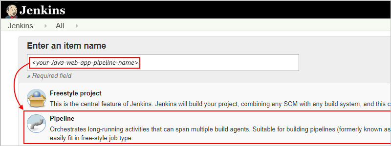

1. Set up Jenkins with your service principal so Jenkins 
can deploy to Azure without using your own credentials.

   1. On the **General** tab, select 
   **Prepare an environment for the run**. 

   1. In the **Properties Content** box that appears, 
   add these environment variables and their values. 

      ```ini
      AZURE_CRED_ID=yourAzureServicePrincipalName
      RES_GROUP=yourWebAppAzureResourceGroupName
      WEB_APP=yourWebAppName
      ```

      

1. When you're done, choose **Save**.

Next, create build and deployment scripts for Jenkins.

## Create build and deployment files

Now create the files that Jenkins uses for building and deploying your app.

1. In your GitHub fork's `src/main/resources/` folder, create this 
app configuration file named `web.config`, which contains this XML 
but replace `$(JAR_FILE_NAME)` with `gs-spring-boot-0.1.0.jar`:

   ```xml
   <?xml version="1.0" encoding="UTF-8"?>
   <configuration>
      <system.webServer>
         <handlers>
            <add name="httpPlatformHandler" path="*" verb="*" modules="httpPlatformHandler" resourceType="Unspecified" />
         </handlers>
         <httpPlatform processPath="%JAVA_HOME%\bin\java.exe" arguments="-Djava.net.preferIPv4Stack=true -Dserver.port=%HTTP_PLATFORM_PORT% -jar &quot;%HOME%\site\wwwroot\${JAR_FILE_NAME}&quot;"></httpPlatform>
      </system.webServer>
   </configuration>
   ```

1. In your GitHub fork's root folder, create this build and 
deployment script named `Jenkinsfile`, which contains this text 
([source in GitHub here](https://github.com/Microsoft/todo-app-java-on-azure/blob/master/doc/resources/jenkins/Jenkinsfile-webapp-se)):

   ```groovy
   node {
      stage('init') {
         checkout scm
      }
      stage('build') {
         sh '''
            mvn clean package
            cd target
            cp ../src/main/resources/web.config web.config
            cp todo-app-java-on-azure-1.0-SNAPSHOT.jar app.jar 
            zip todo.zip app.jar web.config
         '''
      }
      stage('deploy') {
         azureWebAppPublish azureCredentialsId: env.AZURE_CRED_ID,
         resourceGroup: env.RES_GROUP, appName: env.WEB_APP, filePath: "**/todo.zip"
      }
   }
   ```

1. Commit both `web.config` and `Jenkinsfile` files 
to your GitHub fork, and push your changes.

## Point pipeline at script

Now specify the build and deployment script you want Jenkins to use.

1. In Jenkins, select your previously created pipeline job. 

   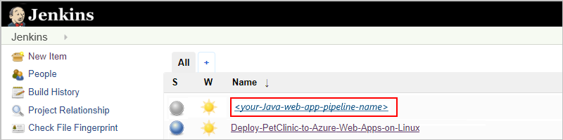

1. On the left menu, select **Configure**.

1. On the **Pipeline** tab, from the **Definition** list, 
select **Pipeline script from SCM**.

   1. In the **SCM** box that appears, 
   select **Git** as your source control. 

   1. In the **Repositories** section, for **Repository URL**, 
   enter your GitHub fork's URL, for example: 

      `https://github.com/<your-GitHub-username>/gs-spring-boot`

   1. For **Credentials**, select your previously created 
   GitHub personal access token.

   1. In the **Script Path** box, 
   add the path to your "Jenkinsfile" script.

   When you're done, your pipeline definition 
   looks like this example: 

   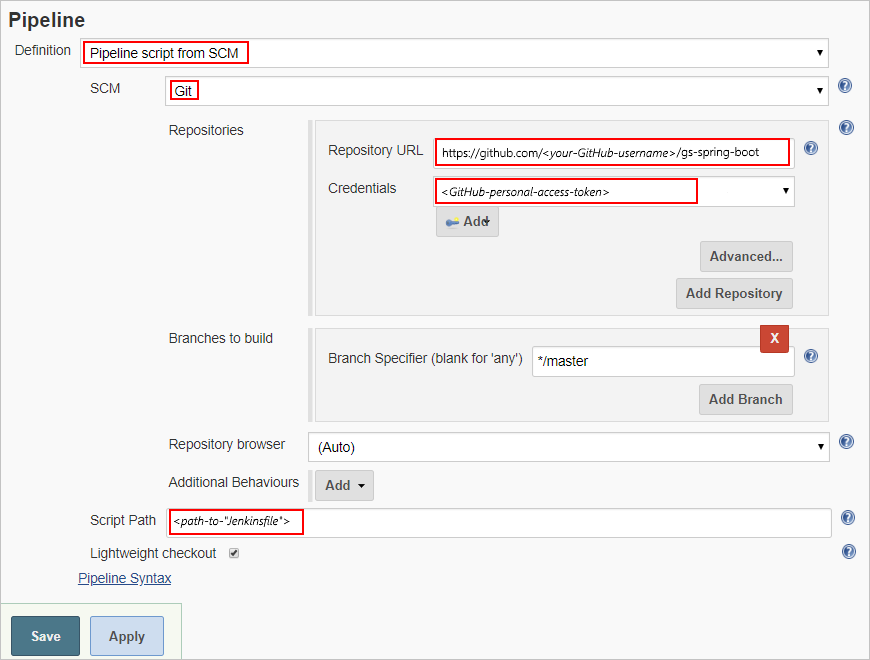

1. When you're done, choose **Save**.

Next, build and deploy your app to Azure App Service. 

## Build and deploy to Azure

1. With the Azure CLI, either from the command 
line or Azure Cloud Shell, create an 
[Azure App Service web app on Linux](/azure/app-service/containers/app-service-linux-intro) 
where Jenkins deploys your web app after finishing a build. 
Make sure your web app has a unique name.

   ```azurecli-interactive
   az group create --name yourWebAppAzureResourceGroupName --location yourAzureRegion
   az appservice plan create --name yourLinuxAppServicePlanName --resource-group yourWebAppAzureResourceGroupName --is-linux
   az webapp create --name yourWebAppName --resource-group yourWebAppAzureResourceGroupName --plan yourLinuxAppServicePlanName --runtime "java|1.8|Tomcat|8.5"
   ```

   For more information about these Azure CLI commands, see these pages:

   * [**`az group create`**](https://docs.microsoft.com/cli/azure/group?view=azure-cli-latest#az-group-create)

   * [**`az appservice plan create`**](https://docs.microsoft.com/cli/azure/appservice/plan?view=azure-cli-latest#az-appservice-plan-create)

   * [**`az webapp create`**](https://docs.microsoft.com/cli/azure/webapp?view=azure-cli-latest#az-webapp-create)

1. In Jenkins, select your pipeline job, and select **Build Now**.

   After the build finishes, Jenkins deploys your app, 
   which is now live on Azure at the publication URL, for example: 

   `http://<your-Java-web-app>.azurewebsites.net`

   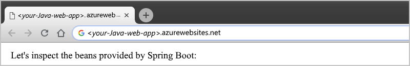

## Push changes and redeploy

1. In your web browser, go to this location in your web app's GitHub fork:

   `complete/src/main/java/Hello/Application.java`
   
1. From the upper-right corner in GitHub, choose **Edit this file**.

1. Make this change to the `commandLineRunner()` method, 
and commit the change to the repo's `master` branch. 
This commit in the `master` branch starts a build in Jenkins. 
   
   ```java
   System.out.println("Let's inspect the beans provided by Spring Boot on Azure");
   ```

1. After the build finishes, and Jenkins redeploys to Azure, 
refresh your app, which now shows your update.

   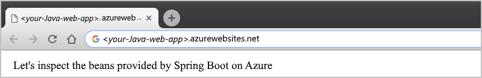

## Troubleshooting the Jenkins plug-in

If you encounter any bugs with the Jenkins plug-ins, 
file an issue in the [Jenkins JIRA](https://issues.jenkins-ci.org/) 
for the specific component.

## Next steps

> [!div class="nextstepaction"]
> [Use Azure VMs as build agents](/azure/jenkins/jenkins-azure-vm-agents)
