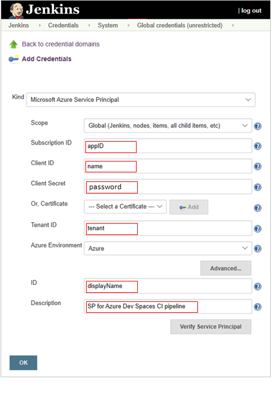
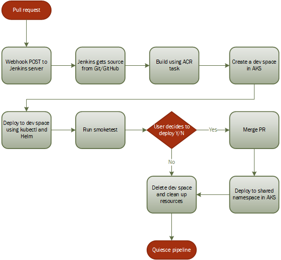
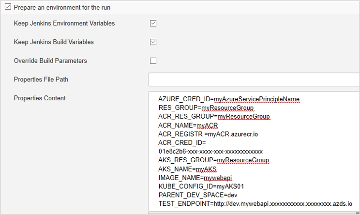

<!-- GMinchAQ, 06/18/19 -->

# Tutorial: Using the Azure Dev Spaces Plugin for Jenkins with Azure Kubenetes Service 

Azure Dev Spaces allows you to test and iteratively develop your microservice application running in Azure Kubernetes Service (AKS) without the need to replicate or mock dependencies. The Azure Dev Spaces plugin for Jenkins helps you use Dev Spaces in your continuous integration and delivery (CI/CD) pipeline.

This tutorial also uses Azure Container Registry (ACR). ACR stores images, and an ACR Task builds Docker and Helm artifacts. Using ACR and ACR Task for artifact generation removes the need for you to install additional software, such as Docker, on your Jenkins server. 

In this tutorial, you'll complete these tasks:

> [!div class="checklist"]
> * Create an Azure Dev Spaces enabled AKS cluster
> * Deploy a multi-service application to AKS
> * Prepare your Jenkins server
> * Use the Azure Dev Spaces plugin in a Jenkins pipeline to preview code changes before merging them into the project

This tutorial assumes intermediate knowledge of core Azure services, AKS, ACR, Azure Dev Spaces, Jenkins [pipelines](https://jenkins.io/doc/book/pipeline/) and plugins, and GitHub. Basic familiarity with supporting tools such as kubectl and Helm is helpful.

## Prerequisites

* An Azure account. If you don’t have an Azure subscription, create a [free account](https://azure.microsoft.com/free/?WT.mc_id=A261C142F) before you begin.

* A GitHub account. If you don't have a GitHub account, create a [free account](https://github.com/) before you begin.

* [Visual Studio Code](https://code.visualstudio.com/download) with the [Azure Dev Spaces](https://marketplace.visualstudio.com/items?itemName=azuredevspaces.azds) extension installed.

* [Azure CLI installed](/cli/azure/install-azure-cli?view=azure-cli-latest), version 2.0.43 or higher.

* A Jenkins master server. If you don't already have a Jenkins master, deploy [Jenkins](https://aka.ms/jenkins-on-azure) on Azure by following the steps in this [quickstart](https://docs.microsoft.com/azure/jenkins/install-jenkins-solution-template). 

* The Jenkins server must have both Helm and kubectl installed and available to the Jenkins account, as explained later in this tutorial.

* VS Code, the VS Code Terminal or WSL, and Bash. 


## Create Azure resources

In this section, you create Azure resources:

* A resource group to contain all of the Auzre resources for this tutorial.
* An [Azure Kubernetes Service](https://docs.microsoft.com/azure/aks/) (AKS) cluster.
* An [Azure container registry](https://docs.microsoft.com/azure/container-registry/) (ACR) to build (using ACR Tasks) and store Docker images.

1. Create a resource group.

    ```bash
    az group create --name MyResourceGroup --location westus2
    ```

2. Create an AKS cluster. Create the AKS cluster in a [region that supports Dev Spaces](../dev-spaces/about.md#supported-regions-and-configurations).

    ```bash
    az aks create --resource-group MyResourceGroup --name MyAKS --location westus2 --kubernetes-version 1.11.9 --enable-addons http_application_routing --generate-ssh-keys --node-count 1 --node-vm-size Standard_D1_v2
    ```

3. Configure AKS to use Dev Spaces.

    ```bash
    az aks use-dev-spaces --resource-group MyResourceGroup --name MyAKS
    ```
    This step installs the `azds` CLI extension.

4. Create a container registry.

    ```bash
    az acr create -n MyACR -g MyResourceGroup --sku Basic --admin-enabled true
    ```

## Deploy sample apps to the AKS cluster

In this section, you set up a dev space and deploy a sample application to the AKS cluster you created in the last section. The application consists of two parts, *webfrontend* and *mywebapi*. Both components are deployed in a dev space. Later in this tutorial, you'll submit a pull request against mywebapi to trigger the CI pipeline in Jenkins.

For more information on using Azure Dev Spaces and multi-service development with Azure Dev Spaces, see [Get started on Azure Dev Spaces with Java](https://docs.microsoft.com/azure/dev-spaces/get-started-java), and [Multi-service development with Azure Dev Spaces](https://docs.microsoft.com/azure/dev-spaces/multi-service-java). Those tutorials provide additional background information not included here.

1. Download the https://github.com/Azure/dev-spaces repo from GitHub.

2. Open the `samples/java/getting-started/webfrontend` folder in VS Code. (You can ignore any default prompts to add debug assets or restore the project.)

3. Update `/src/main/java/com/ms/sample/webfrontend/Application.java` to look like the following:

    ```java
    package com.ms.sample.webfrontend;

    import java.io.*;
    import java.net.*;
    import org.springframework.boot.SpringApplication;
    import org.springframework.boot.autoconfigure.SpringBootApplication;
    import org.springframework.web.bind.annotation.*;

    @SpringBootApplication
    @RestController
    public class Application {
        public static void main(String[] args) {
            SpringApplication.run(Application.class, args);
        }

        @RequestMapping(value = "/greeting", produces = "text/plain")
        public String greeting(@RequestHeader(value = "azds-route-as", required = false) String azdsRouteAs) throws Exception {
            URLConnection conn = new URL("http://mywebapi/").openConnection();
            conn.setRequestProperty("azds-route-as", azdsRouteAs); // propagate dev space routing header
            try (BufferedReader reader = new BufferedReader(new InputStreamReader(conn.getInputStream())))
            {
                return "Hello from webfrontend and " + reader.lines().reduce("\n", String::concat);
            }
        }
    }
    ```

4. Click **View** then **Terminal** to open the Integrated Terminal in VS Code.

5. Run the `azds prep` command to prepare your application to run in a dev space. This command must be run from `dev-spaces/samples/java/getting-started/webfrontend` to prepare your application correctly:

    ```bash
    azds prep --public
    ```

    The Dev Spaces CLI's `azds prep` command generates Docker and Kubernetes assets with default settings. These files persist for the lifetime of the project, and they can be customized:

    * `./Dockerfile` and `./Dockerfile.develop` describe the app's container image, and how the source code is built and runs within the container.
    * A [Helm chart](https://helm.sh/docs/developing_charts/) under `./charts/webfrontend` describes how to deploy the container to Kubernetes.
    * `./azds.yaml` is the Azure Dev Spaces configuration file.

    For more information, see [How Azure Dev Spaces works and is configured](https://docs.microsoft.com/azure/dev-spaces/how-dev-spaces-works).

6. Build and run the application in AKS using the `azds up` command:

    ```bash
    azds up
    ```
    <a name="test_endpoint"></a>Scan the console output for information about the URL that was created by the `up` command. It will be in the form:

    ```bash
    (pending registration) Service 'webfrontend' port 'http' will be available at '<url>'
    Service 'webfrontend' port 80 (TCP) is available at 'http://localhost:<port>'
    ```
    Open this URL in a browser window, and you should see the web app. As the container executes, `stdout` and `stderr` output is streamed to the terminal window.

8. Next, set up and deploy *mywebapi*:

    1. Change directory to `dev-spaces/samples/java/getting-started/mywebapi`

    2. Run

        ```bash
        azds prep
        ```

    3. Run

        ```bash
        azds up -d
        ```

## Prepare Jenkins server

In this section, you prepare the Jenkins server to run the sample CI pipeline.

* Install plugins
* Install Helm and Kubernetes CLI
* Add credentials

### Install plugins

1. Sign in to your Jenkins server. Choose **Manage Jenkins > Manage Plugins**.
2. On the **Available** tab, select the following plugins:
    * [Azure Dev Spaces](https://plugins.jenkins.io/azure-dev-spaces)
    * [Azure Container Registry Tasks](https://plugins.jenkins.io/azure-container-registry-tasks)
    * [Environment Injector](https://plugins.jenkins.io/envinject)
    * [GitHub Integration](https://plugins.jenkins.io/github-pullrequest)

    If these plugins don't appear in the list, check the **Installed** tab to see if they're already installed.

3. To install the plugins, choose **Download now and install after restart**.

4. Restart your Jenkins server to complete the installation.

### Install Helm and kubectl

The sample pipeline uses Helm and kubectl to deploy to the dev space. When Jenkins is installed, it creates an admin account named *jenkins*. Both Helm and kubectl need to be accessible to the jenkins user.

1. Make an SSH connection to the Jenkins master. 

2. Switch to the `jenkins` user:
    ```bash
    sudo su jenkins
    ```

3. Install the Helm CLI. For more information, see [Installing Helm](https://helm.sh/docs/using_helm/#installing-helm).

4. Install kubectl. For more information, see [**az acs kubernetes install-cli**](https://helm.sh/docs/using_helm/#installing-helm).

### Add credentials to Jenkins

1. Jenkins needs an Azure service principal for authenticating and accessing Azure resources. To create the service principal, Refer to the [Create service principal](https://docs.microsoft.com/azure/jenkins/tutorial-jenkins-deploy-web-app-azure-app-service#create-service-principal) section in the Deploy to Azure App Service tutorial. Be sure to save a copy of the output from `create-for-rbac` because you need that information to complete the next step. The output will look something like this:

    ```json
    {
      "appId": "f4150da1-xxx-xxxx-xxx-xxxxxxxxxxxx",
      "displayName": "xxxxxxxjenkinssp",
      "name": "http://xxxxxxxjenkinssp",
      "password": "f6e4d839-xxx-xxxx-xxx-xxxxxxxxxxxx",
      "tenant": "72f988bf--xxx-xxxx-xxx-xxxxxxxxxxxx"
    }
    ```

2. Add a *Microsoft Azure Service Principal* credential type in Jenkins, using the service principal information from the previous step. The names in the screenshot below correspond to the output from `create-for-rbac`.

    The **ID** field is the Jenkins credential name for your service principal. The example uses the value of `displayName` (in this instance, `xxxxxxxjenkinssp`), but you can use any text you want. This credential name is the value for the AZURE_CRED_ID environment variable in the next section.

    

    The **Description** is optional. For more detailed instructions, see [Add service principal to Jenkins](https://docs.microsoft.com/azure/jenkins/tutorial-jenkins-deploy-web-app-azure-app-service#add-service-principal-to-jenkins) section in the Deploy to Azure App Service tutorial. 


3. To show your ACR credentials, run this command:

    ```bash
    az acr credential show -n <yourRegistryName>
    ```

    Make a copy of the JSON output, which should look something like this:

    ```json
    {
      "passwords": [
        {
          "name": "password",
          "value": "vGBP=zzzzzzzzzzzzzzzzzzzzzzzzzzz"
        },
        {
          "name": "password2",
          "value": "zzzzzzzzzzzzzzzzzzzzzzzzzzzzzzzzz"
        }
      ],
      "username": "acr01"
    }
    ```

4. Add a *Username with password* credential type in Jenkins. The **username** is the username from the last step, in this example `acr01`. The **password** is the value for the first password, in this example `vGBP=zzzzzzzzzzzzzzzzzzzzzzzzzzz`. The **ID** of this credential is the value of ACR_CRED_ID.

5. Set up an AKS credential. Add a *Kubernetes configuration (kubeconfig)* credential type in Jenkins (use the option "Enter directly"). To get the access credentials for your AKS cluster, run the following command:

    ```cmd
    az aks get-credentials -g MyResourceGroup -n <yourAKSName> -f -
    ```

   The **ID** this credential is the value of KUBE_CONFIG_ID in the next section.

## Create a pipeline

The scenario selected for the example pipeline is based on a real-world pattern: A pull request triggers a CI pipeline that builds and then deploys the proposed changes to an Azure dev space for testing and review. Depending on the outcome of the review, the changes are either merged and deployed to AKS or discarded. Finally, the dev space is removed.

The Jenkins pipeline configuration and Jenkinsfile define the stages in the CI pipeline. This flowchart shows the pipeline stages and decision points defined by the Jenkinsfile:



1. Download a modified version of the *mywebapi* project from https://github.com/azure-devops/mywebapi. This project contains several files needed to create a pipeline, including the *Jenkinsfile*, *Dockerfiles*, and Helm chart.

2. Log into Jenkins. From the menu on the left, select **Add Item**.

3. Select **Pipeline**, and then enter a name in the **Enter an item name** box. Select **OK**, and then the pipeline configuration screen will automatically open.

4. On the **General** tab, check **Prepare an environment for the run**. 

5. Check **Keep Jenkins Environment Variables** and **Keep Jenkins Build Variables**.

6. In the **Properties Content** box, enter the following environment variables:

    ```
    AZURE_CRED_ID=[your credential ID of service principal]
    RES_GROUP=[your resource group of the function app]
    ACR_RES_GROUP=[your ACR resource group]
    ACR_NAME=[your ACR name]
    ACR_REGISTRY=[your ACR registry url, without http schema]
    ACR_CRED_ID=[your credential id of your ACR account]
    AKS_RES_GROUP=[your AKS resource group]
    AKS_NAME=[your AKS name]
    IMAGE_NAME=[name of Docker image you will push to ACR, without registry prefix]
    KUBE_CONFIG_ID=[your kubeconfig id]
    PARENT_DEV_SPACE=[shared dev space name]
    TEST_ENDPOINT=[your web frontend end point for testing. Should be webfrontend.XXXXXXXXXXXXXXXXXXX.xxxxxx.aksapp.io]
    ```

    Using the sample values given in the preceding sections, the list of environment variables should look something like this:

    

7. Choose **Pipeline script from SCM** in **Pipeline > Definition**.
8. In **SCM**, choose **Git** and then enter your repo URL.
9. In **Branch Specifier**, enter `refs/remotes/origin/${GITHUB_PR_SOURCE_BRANCH}`.
10. Fill in the SCM repo URL and script path "Jenkinsfile".
11. **Lightweight checkout** should be checked.

## Create a pull request to trigger the pipeline

To complete step 3 in this section, you will need to comment part of the Jenkinsfile, otherwise you will get a 404 error when you try to view the new and old versions side by side. By default, when you choose to merge the PR, the previous shared version of mywebapi will be removed and replaced by the new version. Make the following change to the Jenkinsfile before completing step 1:

```Groovy
    if (userInput == true) {
        stage('deploy') {
            // Apply the deployment to shared namespace in AKS using acsDeploy, Helm or kubectl   
        }
        
        stage('Verify') {
            // verify the staging environment is working properly
        }
        
        /* Comment the cleanup stage to allow side by side comparison with the new child dev space

        stage('cleanup') {
            devSpacesCleanup aksName: env.AKS_NAME, 
                azureCredentialsId: env.AZURE_CRED_ID, 
                devSpaceName: devSpaceNamespace, 
                kubeConfigId: env.KUBE_CONFIG_ID, 
                resourceGroupName: env.AKS_RES_GROUP,
                helmReleaseName: releaseName
        }
        */

    } else {
        // Send a notification
    }
```

1. Make a change to `mywebapi/src/main/java/com/ms/sample/mywebapi/Application.java`and then create a pull request. For example:

    ```java
    public String index() {
        return "Hello from mywebapi in my private dev space";
    }
    ```

2. Sign into Jenkins and select the pipeline name, and then choose **Build Now**. 

    You can also set up a *webhook* to automatically trigger the Jenkins pipeline. When a pull request is entered, GitHub issues a POST to Jenkins, triggering the pipeline. For more information about setting up a webhook, see [Connect Jenkins to GitHub](https://github.com/MicrosoftDocs/azure-docs/blob/master/articles/jenkins/tutorial-jenkins-deploy-web-app-azure-app-service.md#connect-jenkins-to-github).

3. Compare changes to the current shared version:

    1. Open your browser and navigate to the shared version `https://webfrontend.XXXXXXXXXXXXXXXXXXX.eastus.aksapp.io`. TEST_ENDPOINT contains the URL.

    2. Open another tab and then enter the PR dev space URL. It will be similar to `https://<yourdevspacename>.s.webfrontend.XXXXXXXXXXXXXXXXXXX.eastus.aksapp.io`. You'll find the link in **Build History > <build#> > Console Output**  for the Jenkins job. Search the page for `aksapp`, or to see only the prefix, search for `azdsprefix`.

 

### Constructing the URL to the child dev space

When you file a pull request, Jenkins creates a child dev space based on the team's shared dev space and runs the code from your pull request in that child dev space. The URL to the child dev space takes the form `http://$env.azdsprefix.<test_endpoint>`. 

**$env.azdsprefix** is set during pipeline execution by the Azure Dev Spaces plugin by **devSpacesCreate**:

```Groovy
stage('create dev space') {
    devSpacesCreate aksName: env.AKS_NAME,
        azureCredentialsId: env.AZURE_CRED_ID,
        kubeconfigId: env.KUBE_CONFIG_ID,
        resourceGroupName: env.AKS_RES_GROUP,
        sharedSpaceName: env.PARENT_DEV_SPACE,
        spaceName: devSpaceNamespace
}
```

The `test_endpoint` is the URL to the webfrontend app you previously deployed using `azds up`in [Deploy sample apps to the AKS cluster, Step 7](#test_endpoint). The value of `$env.TEST_ENDPOINT` is set in the pipeline configuration. 

The following code snippet shows how the child dev space URL is used in the `smoketest` stage. The code checks to see if the child dev space TEST_ENDPOINT is available, and if so, downloads the greeting text to stdout:

```Groovy
stage('smoketest') {
    // CI testing against http://$env.azdsprefix.$env.TEST_ENDPOINT" 
    SLEEP_TIME = 30
    SITE_UP = false
    for (int i = 0; i < 10; i++) {
        sh "sleep ${SLEEP_TIME}"
        code = "0"
        try {
            code = sh returnStdout: true, script: "curl -sL -w '%{http_code}' 'http://$env.azdsprefix.$env.TEST_ENDPOINT/greeting' -o /dev/null"
        } catch (Exception e){
            // ignore
        }
        if (code == "200") {
            sh "curl http://$env.azdsprefix.$env.TEST_ENDPOINT/greeting"
            SITE_UP = true
            break
        }
    }
    if(!SITE_UP) {
        echo "The site has not been up after five minutes"
    }
}
```

## Clean up resources

When you're done using the sample application, clean up Azure resources by deleting the resource group:

```bash
az group delete -y --no-wait -n MyResourceGroup
```

## Next steps

In this article, you learned how to use the Azure Dev Spaces plugin for Jenkins and the Azure Container Registry plugin to build code and deploy to a dev space.

The following list of resources provides more information on Azure Dev Spaces, ACR Tasks, and CI/CD with Jenkins.

Azure Dev Spaces:
* [How Azure Dev Spaces works and is configured](https://docs.microsoft.com/azure/dev-spaces/how-dev-spaces-works)

ACR Tasks:
* [Automate OS and framework patching with ACR Tasks](https://docs.microsoft.com/azure/container-registry/container-registry-tasks-overview)
* [Automatic build on code commit](https://docs.microsoft.com/azure/container-registry/container-registry-tasks-overview)

CI/CD with Jenkins on Azure:
* [Jenkins continuous deployment](https://docs.microsoft.com/azure/aks/jenkins-continuous-deployment)
