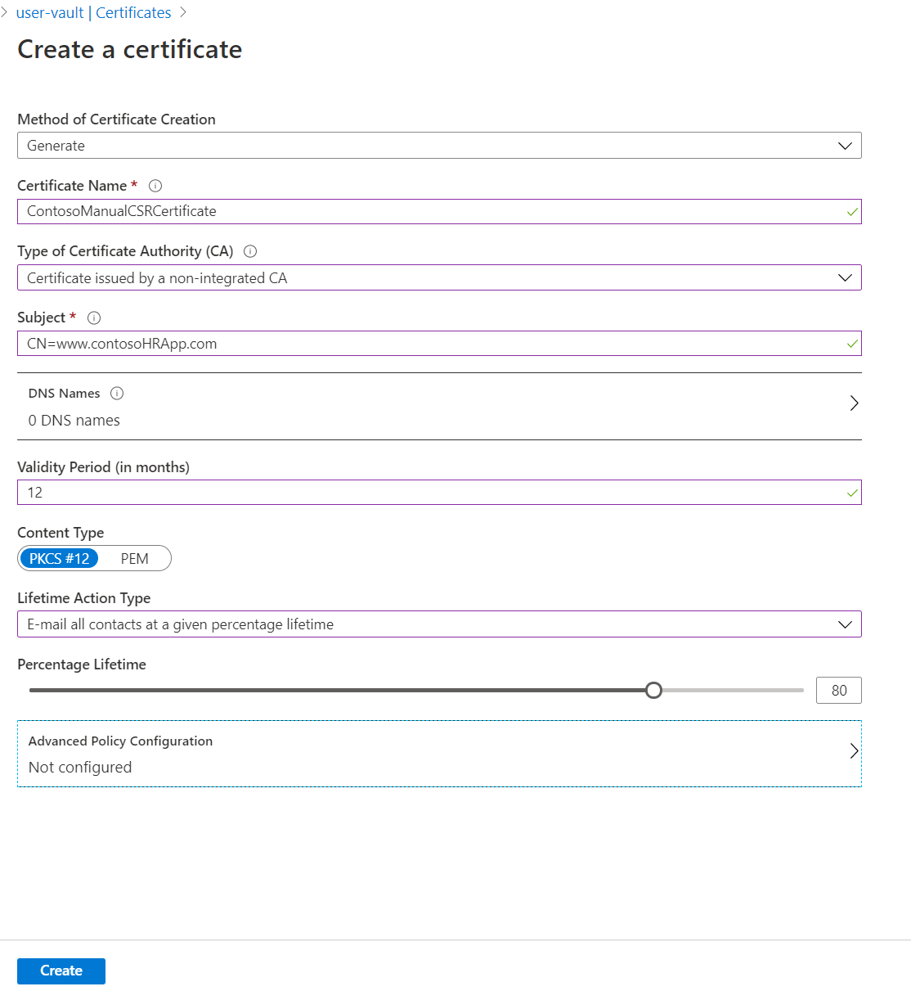
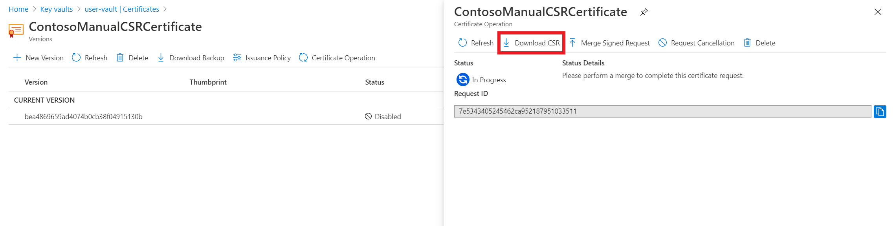

# Create and merge a certificate signing request in Key Vault

Azure Key Vault supports storing digital certificates issued by any certificate authority (CA). It supports creating a certificate signing request (CSR) with a private/public key pair. The CSR can be signed by any CA (an internal enterprise CA or an external public CA). A certificate signing request (CSR) is a message that you send to a CA in order to request a digital certificate.

For more general information about certificates, see [Azure Key Vault certificates](./about-certificates.md).

If you don't have an Azure subscription, create a [free account](https://azure.microsoft.com/free/?WT.mc_id=A261C142F) before you begin.

## Add certificates in Key Vault issued by partnered CAs

Key Vault partners with the following certificate authorities to simplify certificate creation.

|Provider|Certificate type|Configuration setup  
|--------------|----------------------|------------------|  
|DigiCert|Key Vault offers OV or EV SSL certificates with DigiCert| [Integration guide](./how-to-integrate-certificate-authority.md)
|GlobalSign|Key Vault offers OV or EV SSL certificates with GlobalSign| [Integration guide](https://support.globalsign.com/digital-certificates/digital-certificate-installation/generating-and-importing-certificate-microsoft-azure-key-vault)

## Add certificates in Key Vault issued by non-partnered CAs

Follow these steps to add a certificate from CAs that aren't partnered with Key Vault. (For example, GoDaddy isn't a trusted Key Vault CA.)

# [Portal](#tab/azure-portal)

1. Go to the key vault that you want to add the certificate to.
1. On the properties page, select **Certificates**.
1. Select the **Generate/Import** tab.
1. On the **Create a certificate** screen, choose the following values:
    - **Method of Certificate Creation**: Generate.
    - **Certificate Name**: ContosoManualCSRCertificate.
    - **Type of Certificate Authority (CA)**: Certificate issued by a non-integrated CA.
    - **Subject**: `"CN=www.contosoHRApp.com"`.
     > [!NOTE]
     > If you're using a Relative Distinguished Name (RDN) that has a comma (,) in the value, wrap the value that contains the special character in double quotes. 
     >
     > Example entry to **Subject**: `DC=Contoso,OU="Docs,Contoso",CN=www.contosoHRApp.com`
     >
     > In this example, the RDN `OU` contains a value with a comma in the name. The resulting output for `OU` is **Docs, Contoso**.
1. Select the other values as desired, and then select **Create** to add the certificate to the **Certificates** list.

      

1. In the **Certificates** list, select the new certificate. The current state of the certificate is **disabled** because it hasn’t been issued by the CA yet.
1. On the **Certificate Operation** tab, select **Download CSR**.

   

1. Have the CA sign the CSR (.csr).
1. After the request is signed, select **Merge Signed Request** on the **Certificate Operation** tab to add the signed certificate to Key Vault.

The certificate request has now been successfully merged.

# [PowerShell](#tab/azure-powershell)

1. Create a certificate policy. Because the CA chosen in this scenario isn't partnered, **IssuerName** is set to **Unknown** and Key Vault doesn't enroll or renew the certificate.

   ```azure-powershell
   $policy = New-AzKeyVaultCertificatePolicy -SubjectName "CN=www.contosoHRApp.com" -ValidityInMonths 1  -IssuerName Unknown
   ```
     > [!NOTE]
     > If you're using a Relative Distinguished Name (RDN) that has a comma (,) in the value, use single quotes for the full value or value set, and wrap the value that contains the special character in double quotes. 
     >
     >Example entry to **SubjectName**: `$policy = New-AzKeyVaultCertificatePolicy -SubjectName 'OU="Docs,Contoso",DC=Contoso,CN=www.contosoHRApp.com' -ValidityInMonths 1  -IssuerName Unknown`. In this example, the `OU` value reads as **Docs, Contoso**. This format works for all values that contain a comma.
     > 
     > In this example, the RDN `OU` contains a value with a comma in the name. The resulting output for `OU` is **Docs, Contoso**.

1. Create the CSR.

   ```azure-powershell
   $csr = Add-AzKeyVaultCertificate -VaultName ContosoKV -Name ContosoManualCSRCertificate -CertificatePolicy $policy
   $csr.CertificateSigningRequest
   ```

1. Have the CA sign the CSR. The `$csr.CertificateSigningRequest` is the base encoded CSR for the certificate. You can dump this blob into the issuer’s certificate request website. This step varies from CA to CA. Look up your CA’s guidelines on how to execute this step. You can also use tools such as certreq or openssl to get the CSR signed and complete the process of generating a certificate.

1. Merge the signed request in Key Vault. After the certificate request has been signed, you can merge it with the initial private/public key pair created in Azure Key Vault.

    ```azure-powershell-interactive
    Import-AzKeyVaultCertificate -VaultName ContosoKV -Name ContosoManualCSRCertificate -FilePath C:\test\OutputCertificateFile.cer
    ```

The certificate request has now been successfully merged.

---

## Add more information to the CSR

If you want to add more information when creating the CSR, define it in **SubjectName**. You might want to add information such as:
- Country/region
- City/locality
- State/province
- Organization
- Organizational unit

Example

   ```azure-powershell
   SubjectName="CN = learn.microsoft.com, OU = Microsoft Corporation, O = Microsoft Corporation, L = Redmond, S = WA, C = US"
   ```

> [!NOTE]
> If you're requesting a Domain Validation (DV) certificate with additional information, the CA might reject the request if it can't validate all the information in the request. The additional information might be more appropriate if you're requesting an Organization Validation (OV) certificate.

## FAQs

- How do I monitor or manage my CSR?

     See [Monitor and manage certificate creation](./create-certificate-scenarios.md).

- What if I see **Error type 'The public key of the end-entity certificate in the specified X.509 certificate content does not match the public part of the specified private key. Please check if certificate is valid'**?

     This error occurs if you aren't merging the signed CSR with the same CSR request you initiated. Each new CSR that you create has a private key, which has to match when you merge the signed request.

- When a CSR is merged, will it merge the entire chain?

     Yes, it will merge the entire chain, provided the user has brought back a .p7b file to merge.

- What if the certificate issued is in disabled status in the Azure portal?

     View the **Certificate Operation** tab to review the error message for that certificate.

- What if I see **Error type 'The subject name provided is not a valid X500 name'**?

     This error might occur if **SubjectName** includes any special characters. See notes in the Azure portal and PowerShell instructions.

- Error type **The CSR used to get your certificate has already been used. Please try to generate a new certificate with a new CSR.**
     Go to 'Advanced Policy' section of the certificate and check if 'reuse key on renewal' option is turned off.
---

## Next steps

- [Authentication, requests, and responses](../general/authentication-requests-and-responses.md)
- [Key Vault Developer's Guide](../general/developers-guide.md)
- [Azure Key Vault REST API reference](/rest/api/keyvault)
- [Vaults - Create or Update](/rest/api/keyvault/keyvault/vaults/create-or-update)
- [Vaults - Update Access Policy](/rest/api/keyvault/keyvault/vaults/update-access-policy)
