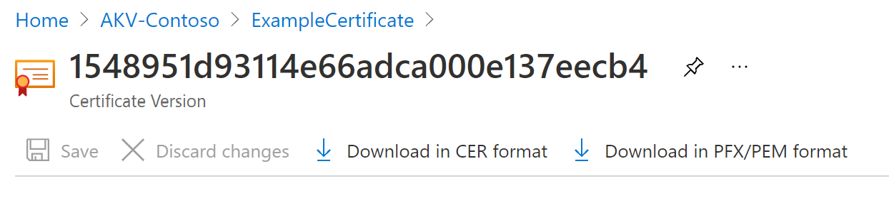

# Export certificates from Azure Key Vault

Learn how to export certificates from Azure Key Vault. You can export certificates by using the Azure CLI, Azure PowerShell, or the Azure portal. 

## About Azure Key Vault certificates

Azure Key Vault allows you to easily provision, manage, and deploy digital certificates for your network. It also enables secure communications for applications. See [Azure Key Vault certificates](./about-certificates.md) for more information.

### Composition of a certificate

When a Key Vault certificate is created, an addressable *key* and *secret* are created that have the same name. The Key Vault key allows key operations. The Key Vault secret allows retrieval of the certificate value as a secret. A Key Vault certificate also contains public x509 certificate metadata. Go to [Composition of a certificate](./about-certificates.md#composition-of-a-certificate) for more information.

### Exportable and non-exportable keys

After a Key Vault certificate is created, you can retrieve it from the addressable secret with the private key. Retrieve the certificate in PFX or PEM format.

- **Exportable**: The policy used to create the certificate indicates the key is exportable.
- **Non-exportable**: The policy used to create the certificate indicates the key is non-exportable. In this case, the private key isn't part of the value when it's retrieved as a secret.

Supported keytypes: RSA, RSA-HSM, EC, EC-HSM, oct (listed [here](/rest/api/keyvault/createcertificate/createcertificate#jsonwebkeytype))
Exportable is only allowed with RSA, EC. HSM keys would be non-exportable.

See [About Azure Key Vault certificates](./about-certificates.md#exportable-or-non-exportable-key) for more information.

## Export stored certificates

You can export stored certificates in Azure Key Vault by using the Azure CLI, Azure PowerShell, or the Azure portal.

> [!NOTE]
> Only require a certificate password when you import the certificate in the key vault. Key Vault doesn't save the associated password. When you export the certificate, the password is blank.

# [Azure CLI](#tab/azure-cli)

Use the following command in the Azure CLI to download the **public portion** of a Key Vault certificate.

```azurecli
az keyvault certificate download --file
                                 [--encoding {DER, PEM}]
                                 [--id]
                                 [--name]
                                 [--subscription]
                                 [--vault-name]
                                 [--version]
```

View [examples and parameter definitions](/cli/azure/keyvault/certificate#az_keyvault_certificate_download) for more information.

Downloading as certificate means getting the public portion. If you want both the private key and public metadata then you can download it as secret.

```azurecli
az keyvault secret download -–file {nameofcert.pfx}
                            [--encoding {ascii, base64, hex, utf-16be, utf-16le, utf-8}]
                            [--id]
                            [--name]
                            [--subscription]
                            [--vault-name]
                            [--version]
```

For more information, see [parameter definitions](/cli/azure/keyvault/secret#az_keyvault_secret_download).

# [PowerShell](#tab/azure-powershell)

Use this command in Azure PowerShell to get the certificate named **TestCert01** from the key vault named **ContosoKV01**. To download the certificate as a PFX file, run following command. These commands access **SecretId**, and then save the content as a PFX file.

```azurepowershell
$cert = Get-AzKeyVaultCertificate -VaultName "ContosoKV01" -Name "TestCert01"
$secret = Get-AzKeyVaultSecret -VaultName "ContosoKV01" -Name $cert.Name
$secretValueText = '';
$ssPtr = [System.Runtime.InteropServices.Marshal]::SecureStringToBSTR($secret.SecretValue)
try {
    $secretValueText = [System.Runtime.InteropServices.Marshal]::PtrToStringBSTR($ssPtr)
} finally {
    [System.Runtime.InteropServices.Marshal]::ZeroFreeBSTR($ssPtr)
}
$secretByte = [Convert]::FromBase64String($secretValueText)
$x509Cert = new-object System.Security.Cryptography.X509Certificates.X509Certificate2
$x509Cert.Import($secretByte, "", "Exportable,PersistKeySet")
$type = [System.Security.Cryptography.X509Certificates.X509ContentType]::Pfx
$pfxFileByte = $x509Cert.Export($type, $password)

# Write to a file
[System.IO.File]::WriteAllBytes("KeyVault.pfx", $pfxFileByte)
```

This command exports the entire chain of certificates with private key (i.e. the same as it was imported). The certificate is password protected.
For more information on the **Get-AzKeyVaultCertificate** command and parameters, see [Get-AzKeyVaultCertificate - Example 2](/powershell/module/az.keyvault/Get-AzKeyVaultCertificate).

# [Portal](#tab/azure-portal)

On the Azure portal, after you create/import a certificate on the **Certificate** blade, you get a notification that the certificate is successfully created. Select the certificate and the current version to see the option to download.

To download the certificate, select **Download in CER format** or **Download in PFX/PEM format**.



**Export Azure App Service certificates**

Azure App Service certificates are a convenient way to purchase SSL certificates. You can assign them to Azure Apps from within the portal. After you import them, the App Service certificates are located under **secrets**.

For more information, see the steps to [export Azure App Service certificates](https://social.technet.microsoft.com/wiki/contents/articles/37431.exporting-azure-app-service-certificates.aspx).

---

## Read more
* [Various certificate file types and definitions](/archive/blogs/kaushal/various-ssltls-certificate-file-typesextensions)
