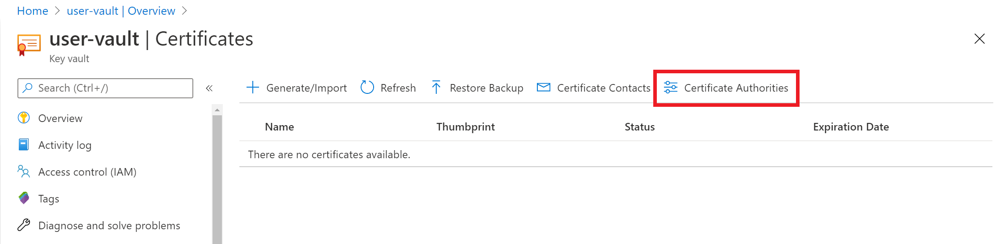
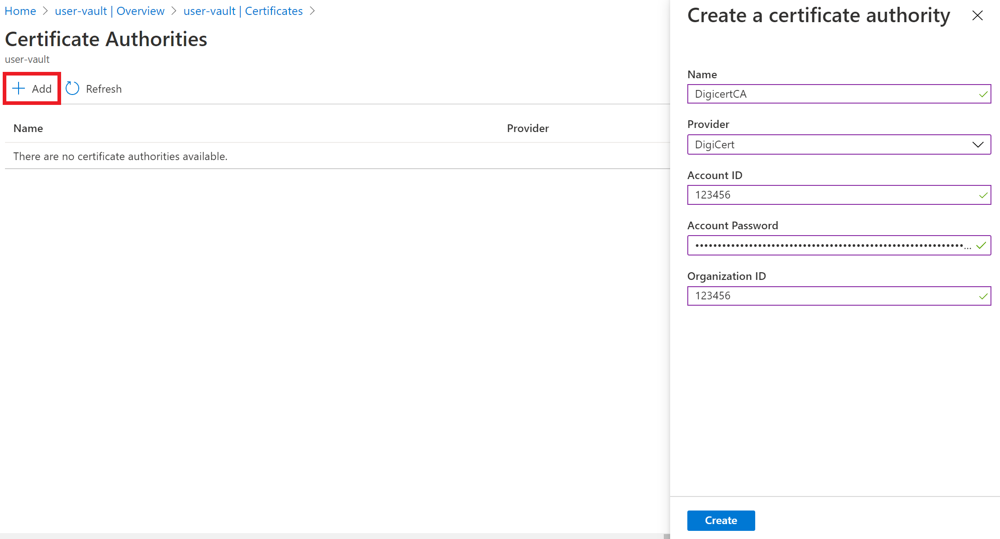
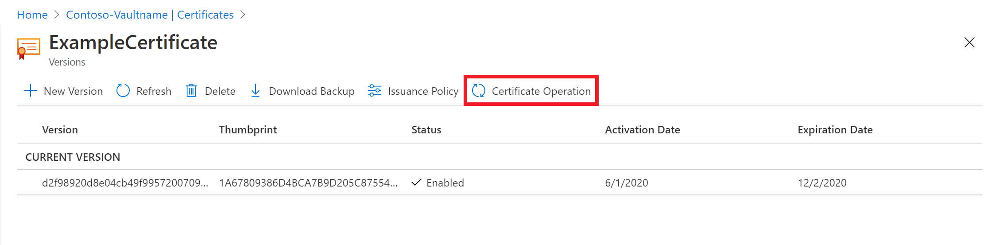

# Integrating Key Vault with DigiCert Certificate Authority

Azure Key Vault allows you to easily provision, manage, and deploy digital certificates for your network and to enable secure communications for applications. A Digital certificate is an electronic credential to establish proof of identity in an electronic transaction. 

Azure key vault users can generate DigiCert certificates directly from their Key Vault. Key Vault would ensure end-to-end certificate lifecycle management for those certificates issued by DigiCert through Key Vault’s trusted partnership with DigiCert Certificate Authority.

For more general information about Certificates, see [Azure Key Vault Certificates](./about-certificates.md).

If you don't have an Azure subscription, create a [free account](https://azure.microsoft.com/free/?WT.mc_id=A261C142F) before you begin.

## Prerequisites

To complete this guide, you must have the following resources.
* A key vault. You can use an existing key vault, or create a new one by following the steps in one of these quickstarts:
   - [Create a key vault with the Azure CLI](../general/quick-create-cli.md)
   - [Create a key vault with Azure PowerShell](../general/quick-create-powershell.md)
   - [Create a key vault with the Azure portal](../general/quick-create-portal.md).
*	You need to activate DigiCert CertCentral account. [Sign up](https://www.digicert.com/account/signup/) for your CertCentral account.
*	Administrator level permissions in your accounts.


### Before you begin

Make sure you have the following information handy from your DigiCert CertCentral account:
-	CertCentral Account ID
-	Organization ID
-	API key

## Adding Certificate Authority in Key Vault 
After gathering above information from DigiCert CertCentral account, you can now add DigiCert to Certificate Authority list in the key vault.

### Azure portal

1.	To add DigiCert certificate authority, navigate to the key vault you want to add DigiCert. 
2.	On the Key Vault properties pages, select **Certificates**.
3.	Select **Certificate Authorities** tab.

4.	Select **Add** option.
 
5.	On the **Create a certificate Authority** screen choose the following values:
    - 	**Name**: Add an identifiable Issuer name. Example DigicertCA
    - 	**Provider**: Select DigiCert from the menu.
    - 	**Account ID**: Enter your DigiCert CertCentral Account ID
    - 	**Account Password**: Enter the API key you generated in your DigiCert CertCentral Account
    - 	**Organization ID**: Enter OrgID gathered from DigiCert CertCentral Account 
    - 	Click **Create**.
   
6.	You will see that DigicertCA has now been added in Certificate Authorities list.


### Azure PowerShell

Azure PowerShell is used to create and manage Azure resources using commands or scripts. Azure hosts Azure Cloud Shell, an interactive shell environment that you can use through your Azure portal in the browser itself.

If you choose to install and use PowerShell locally, this tutorial requires Azure PowerShell module version 1.0.0 or later. Type `$PSVersionTable.PSVersion` to find the version. If you need to upgrade, see [Install Azure PowerShell module](/powershell/azure/install-az-ps). If you are running PowerShell locally, you also need to run `Login-AzAccount` to create a connection with Azure.

```azurepowershell-interactive
Login-AzAccount
```

1.  Create a **resource group**

Create an Azure resource group with [New-AzResourceGroup](/powershell/module/az.resources/new-azresourcegroup). A resource group is a logical container into which Azure resources are deployed and managed. 

```azurepowershell-interactive
New-AzResourceGroup -Name ContosoResourceGroup -Location EastUS
```

2. Create a **Key Vault**

You must use a unique name for your key vault. Here "Contoso-Vaultname" is the name for Key Vault throughout this guide.

- **Vault name** Contoso-Vaultname.
- **Resource group name** ContosoResourceGroup.
- **Location** EastUS.

```azurepowershell-interactive
New-AzKeyVault -Name 'Contoso-Vaultname' -ResourceGroupName 'ContosoResourceGroup' -Location 'EastUS'
```

3. Define variables for information gathered from DigiCert CertCentral account.

- Define **Account ID** variable
- Define **Org ID** variable
- Define **API Key** variable

```azurepowershell-interactive
$accountId = "myDigiCertCertCentralAccountID"
$org = New-AzKeyVaultCertificateOrganizationDetail -Id OrganizationIDfromDigiCertAccount
$secureApiKey = ConvertTo-SecureString DigiCertCertCentralAPIKey -AsPlainText –Force
```

4. Set **Issuer**. This will add Digicert as a Certificate Authority in the key vault. To learn more about the parameters, [read here](/powershell/module/az.keyvault/Set-AzKeyVaultCertificateIssuer)
```azurepowershell-interactive
Set-AzKeyVaultCertificateIssuer -VaultName "Contoso-Vaultname" -Name "TestIssuer01" -IssuerProvider DigiCert -AccountId $accountId -ApiKey $secureApiKey -OrganizationDetails $org -PassThru
```

5. **Setting Policy for the certificate and issuing certificate** from DigiCert directly inside Key Vault.

```azurepowershell-interactive
$Policy = New-AzKeyVaultCertificatePolicy -SecretContentType "application/x-pkcs12" -SubjectName "CN=contoso.com" -IssuerName "TestIssuer01" -ValidityInMonths 12 -RenewAtNumberOfDaysBeforeExpiry 60
Add-AzKeyVaultCertificate -VaultName "Contoso-Vaultname" -Name "ExampleCertificate" -CertificatePolicy $Policy
```

Certificate has now been successfully issued by Digicert CA inside specified Key Vault through this integration.

## Troubleshoot

If the certificate issued is in 'disabled' status in the Azure portal, proceed to view the **Certificate Operation** to review the DigiCert error message for that certificate.

 

Error message 'Please perform a merge to complete this certificate request.'
   You would need to merge the CSR signed by the CA to complete this request. Learn more [here](./create-certificate-signing-request.md)

For more information, see the [Certificate operations in the Key Vault REST API reference](/rest/api/keyvault). For information on establishing permissions, see [Vaults - Create or Update](/rest/api/keyvault/vaults/createorupdate) and [Vaults - Update Access Policy](/rest/api/keyvault/vaults/updateaccesspolicy).

## Frequently asked questions

- Can I generate a digicert wildcard certificate through KeyVault? 
   Yes. It would depend upon how you have configured your digicert account.
- How can I create **OV-SSL or EV-SSL** certificate with DigiCert? 
   Key vault supports creating OV and EV SSL certificates. When creating a certificate, click on Advanced Policy Configuration, then specify the Certificate type. Values supported are : OV-SSL, EV-SSL
   
   You would be able to create this type of certificate in key vault if your Digicert account allows. For this type of certificate, the validation is performed by DigiCert and their support team would be able to best help you with the solution, if validation fails. You can add additional information when creating a certificate by defining them in subjectName.

Example
    ```SubjectName="CN = docs.microsoft.com, OU = Microsoft Corporation, O = Microsoft Corporation, L = Redmond, S = WA, C = US"
    ```
   
- Is there a time delay in creating digicert certificate through integration vs acquiring certificate through digicert directly?
   No. When creating a certificate, it is the process of verification which may take time and that verification is dependent on process DigiCert follows.


## Next steps

- [Authentication, requests, and responses](../general/authentication-requests-and-responses.md)
- [Key Vault Developer's Guide](../general/developers-guide.md)