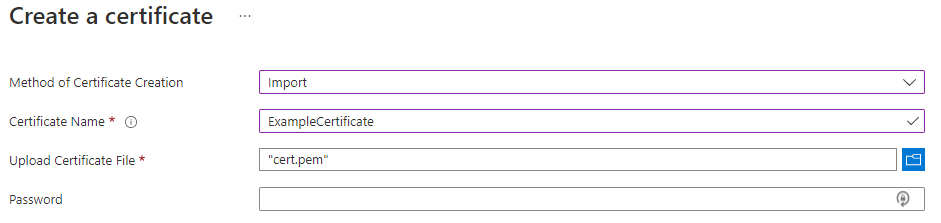

# Tutorial: Import a certificate in Azure Key Vault

Azure Key Vault is a cloud service that provides a secure store for secrets. You can securely store keys, passwords, certificates, and other secrets. Azure key vaults may be created and managed through the Azure portal. In this tutorial, you create a key vault, then use it to import a certificate. For more information on Key Vault, review the [Overview](../general/overview.md).

The tutorial shows you how to:

> [!div class="checklist"]
> * Create a key vault.
> * Import a certificate in Key Vault using the portal.
> * Import a certificate in Key Vault using the CLI.
> * Import a certificate in Key Vault using PowerShell.


Before you begin, read [Key Vault basic concepts](../general/basic-concepts.md). 

If you don't have an Azure subscription, create a [free account](https://azure.microsoft.com/free/?WT.mc_id=A261C142F) before you begin.

## Sign in to Azure

Sign in to the Azure portal at https://portal.azure.com.

## Create a vault

1. From the Azure portal menu, or from the **Home** page, select **Create a resource**.
2. In the Search box, enter **Key Vault**.
3. From the results list, choose **Key Vault**.
4. On the Key Vault section, choose **Create**.
5. On the **Create key vault** section provide the following information:
    - **Name**: A unique name is required. For this quickstart, we use **Example-Vault**. 
    - **Subscription**: Choose a subscription.
    - Under **Resource Group**, choose **Create new** and enter a resource group name.
    - In the **Location** pull-down menu, choose a location.
    - Leave the other options to their defaults.
6. After providing the information above, select **Create**.

Take note of the two properties listed below:

* **Vault Name**: In the example, this is **Example-Vault**. You will use this name for other steps.
* **Vault URI**: In the example, this is https://example-vault.vault.azure.net/. Applications that use your vault through its REST API must use this URI.

At this point, your Azure account is the only one authorized to perform operations on this new vault.


## Import a certificate to Key Vault

To import a certificate to the vault, you need to have a PEM or PFX certificate file to be on disk. In this case, we will import a certificate with file name called **ExampleCertificate**.

> [!IMPORTANT]
> In Azure Key Vault, supported certificate formats are PFX and PEM. 
> - .pem file format contains one or more X509 certificate files.
> - .pfx file format is an archive file format for storing several cryptographic objects in a single file i.e. server certificate (issued for your domain), a matching private key, and may optionally include an intermediate CA.  

1. On the Key Vault properties pages, select **Certificates**.
2. Click on **Generate/Import**.
3. On the **Create a certificate** screen choose the following values:
    - **Method of Certificate Creation**: Import.
    - **Certificate Name**: ExampleCertificate.
    - **Upload Certificate File**: select the certificate file from disk
    - **Password** : If you are uploading a password protected certificate file, provide that password here. Otherwise, leave it blank. Once the certificate file is successfully imported, key vault will remove that password.
4. Click **Create**.



By adding a certificate using **Import** method, Azure Key vault will automatically populate certificate parameters (i.e. validity period, Issuer name, activation date etc.).

Once you receive the message that the certificate has been successfully imported, you may click on it on the list to view its properties. 


## Import a certificate using Azure CLI

Import a certificate into a specified key vault. To 
import an existing valid certificate, containing a private key, into Azure Key Vault, the file to be imported can be in either PFX or PEM format. If the certificate is in PEM format, the PEM file must contain the key as well as x509 certificates. This operation requires the certificates/import permission.

```azurecli
az keyvault certificate import --file
                               --name
                               --vault-name
                               [--disabled {false, true}]
                               [--only-show-errors]
                               [--password]
                               [--policy]
                               [--subscription]
                               [--tags]
```

Learn more about the [parameters](/cli/azure/keyvault/certificate#az_keyvault_certificate_import).

After importing the certificate, you can view the certificate using [Certificate show](/cli/azure/keyvault/certificate#az_keyvault_certificate_show)


```azurecli
az keyvault certificate show [--id]
                             [--name]
                             [--only-show-errors]
                             [--subscription]
                             [--vault-name]
                             [--version]
```

Now, you have created a Key vault, imported a certificate and viewed Certificate's properties.

## Import a certificate using Azure PowerShell

```
Import-AzureKeyVaultCertificate
      [-VaultName] <String>
      [-Name] <String>
      -FilePath <String>
      [-Password <SecureString>]
      [-Tag <Hashtable>]
      [-DefaultProfile <IAzureContextContainer>]
      [-WhatIf]
      [-Confirm]
      [<CommonParameters>]
```

Learn more about the [parameters](/powershell/module/azurerm.keyvault/import-azurekeyvaultcertificate?).


## Clean up resources

Other Key Vault quickstarts and tutorials build upon this quickstart. If you plan to continue on to work with subsequent quickstarts and tutorials, you may wish to leave these resources in place.
When no longer needed, delete the resource group, which deletes the Key Vault and related resources. To delete the resource group through the portal:

1. Enter the name of your resource group in the Search box at the top of the portal. When you see the resource group used in this quickstart in the search results, select it.
2. Select **Delete resource group**.
3. In the **TYPE THE RESOURCE GROUP NAME:** box type in the name of the resource group and select **Delete**.


## Next steps

In this tutorial, you created a Key Vault and imported a certificate in it. To learn more about Key Vault and how to integrate it with your applications, continue on to the articles below.

- Read more about [Managing certificate creation in Azure Key Vault](./create-certificate-scenarios.md)
- See examples of [Importing Certificates Using REST APIs](/rest/api/keyvault/importcertificate/importcertificate)
- Review the [Key Vault security overview](../general/security-overview.md)