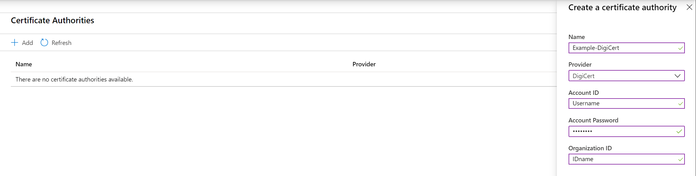
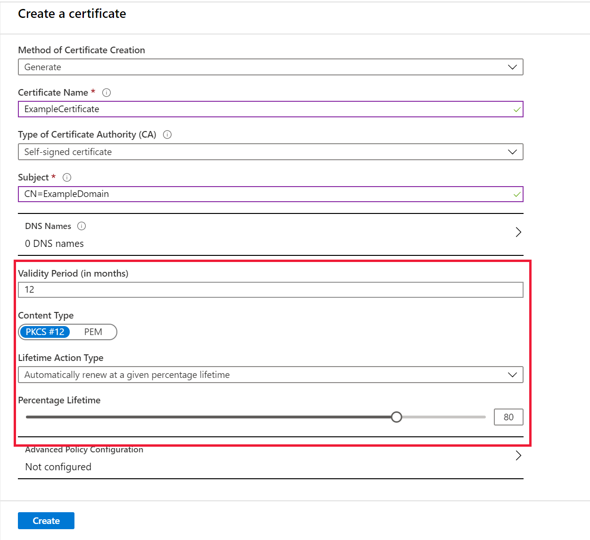
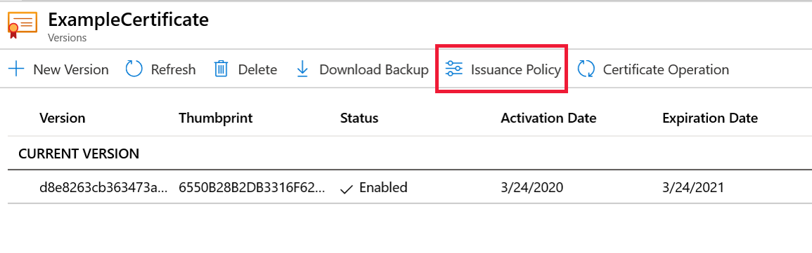
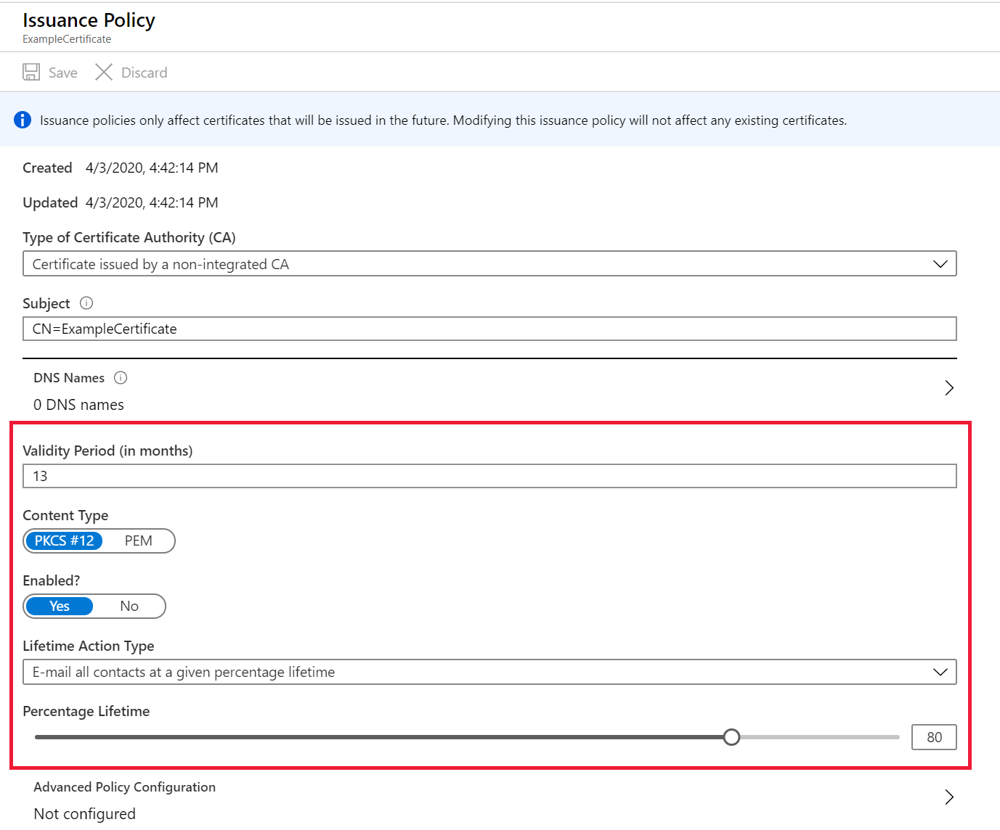

# Tutorial: Configure certificate auto-rotation in Key Vault

You can easily provision, manage, and deploy digital certificates by using Azure Key Vault. The certificates can be public and private Secure Sockets Layer (SSL)/Transport Layer Security (TLS) certificates signed by a certificate authority (CA), or a self-signed certificate. Key Vault can also request and renew certificates through partnerships with CAs, providing a robust solution for certificate lifecycle management. In this tutorial, you will update a certificate's validity period, auto-rotation frequency, and CA attributes.

The tutorial shows you how to:

> [!div class="checklist"]
> * Manage a certificate by using the Azure portal.
> * Add a CA provider account.
> * Update the certificate's validity period.
> * Update the certificate's auto-rotation frequency.
> * Update the certificate's attributes by using Azure PowerShell.

Before you begin, read [Key Vault basic concepts](../general/basic-concepts.md).

If you don't have an Azure subscription, create a [free account](https://azure.microsoft.com/free/?WT.mc_id=A261C142F) before you begin.

## Sign in to Azure

Sign in to the Azure portal at https://portal.azure.com.

## Create a vault

Create an Azure Key Vault using [Azure portal](../general/quick-create-portal.md), [Azure CLI](../general/quick-create-cli.md), or [Azure PowerShell](../general/quick-create-powershell.md). In the example, the key vault name is **Example-Vault**.


## Create a certificate in Key Vault

Create a certificate or import a certificate into the key vault (see [Steps to create a certificate in Key Vault](../secrets/quick-create-portal.md)). In this case, you'll work on a certificate called **ExampleCertificate**.

## Update certificate lifecycle attributes

In Azure Key Vault, you can update a certificate's lifecycle attributes both at the time of certificate creation or after.

A certificate created in Key Vault can be:

- A self-signed certificate.
- A certificate created with a CA that's partnered with Key Vault.
- A certificate with a CA that isn't partnered with Key Vault.

The following CAs are currently partnered providers with Key Vault:

- DigiCert: Key Vault offers OV TLS/SSL certificates.
- GlobalSign: Key Vault offers OV TLS/SSL certificates.

Key Vault auto-rotates certificates through established partnerships with CAs. Because Key Vault automatically requests and renews certificates through the partnership, auto-rotation capability is not applicable for certificates created with CAs that are not partnered with Key Vault.

> [!NOTE]
> An account admin for a CA provider creates credentials that Key Vault uses to create, renew, and use TLS/SSL certificates.

>

### Update certificate lifecycle attributes at the time of creation

1. On the Key Vault properties pages, select **Certificates**.
1. Select **Generate/Import**.
1. On the **Create a certificate** screen, update the following values:

   - **Validity Period**: Enter the value (in  months). Creating short-lived certificates is a recommended security practice. By default, the validity value of a newly created certificate is 12 months.
   - **Lifetime Action Type**: Select the certificate's auto-renewal and alerting action and then update **percentage lifetime** or **Number of days before expiry**. By default, a certificate's auto-renewal is set at 80 percent of its lifetime. From the drop-down menu, select one of the following options.

      |  Automatically renew at a given time| Email all contacts at a given time |
      |-----------|------|
      |Selecting this option will *turn on* autorotation. | Selecting this option will *not* auto-rotate but will only alert the contacts.|
      
      You can learn about [setting up Email contact here](https://docs.microsoft.com/azure/key-vault/certificates/overview-renew-certificate#get-notified-about-certificate-expiration)

1. Select **Create**.



### Update lifecycle attributes of a stored certificate

1. Select the key vault.
1. On the Key Vault properties pages, select **Certificates**.
1. Select the certificate you want to update. In this case, you'll work on a certificate called **ExampleCertificate**.
1. Select **Issuance Policy** from the top menu bar.

   

1. On the **Issuance Policy** screen, update the following values:

   - **Validity Period**: Update the value (in  months).
   - **Lifetime Action Type**: Select the certificate's auto-renewal and alerting action and then update the **percentage lifetime** or **Number of days before expiry**.

   

1. Select **Save**.

> [!IMPORTANT]
> Changing the Lifetime Action Type for a certificate will record modifications for the existing certificates immediately.


### Update certificate attributes by using PowerShell

```azurepowershell


Set-AzureKeyVaultCertificatePolicy -VaultName $vaultName 
                                   -Name $certificateName 
                                   -RenewAtNumberOfDaysBeforeExpiry [276 or appropriate calculated value]
```

> [!TIP]
> To modify the renewal policy for a list of certificates, enter `File.csv`​ containing
>  `VaultName,CertName` as in the following example:
​<br/>
>  `vault1,Cert1`​ <br/>
>  `vault2,Cert2`​
>
>  ```azurepowershell
>  $file = Import-CSV C:\Users\myfolder\ReadCSVUsingPowershell\File.csv ​
> foreach($line in $file)​
> {​
> Set-AzureKeyVaultCertificatePolicy -VaultName $vaultName -Name $certificateName -RenewAtNumberOfDaysBeforeExpiry [276 or appropriate calculated value]
> }
>  ```
> 
To learn more about the parameters, see [az keyvault certificate](/cli/azure/keyvault/certificate#az-keyvault-certificate-set-attributes).

## Clean up resources

Other Key Vault tutorials build upon this tutorial. If you plan to work with these tutorials, you might want to leave these existing resources in place.
When you no longer need them, delete the resource group, which deletes the key vault and related resources.

To delete the resource group by using the portal:

1. Enter the name of your resource group in the **Search** box at the top of the portal. When the resource group used in this quickstart appears in the search results, select it.
1. Select **Delete resource group**.
1. In the **TYPE THE RESOURCE GROUP NAME:** box, type the name of the resource group and then select **Delete**.


## Next steps

In this tutorial, you updated a certificate's lifecycle attributes. To learn more about Key Vault and how to integrate it with your applications, continue on to the following articles:

- Read more about [Managing certificate creation in Azure Key Vault](./create-certificate-scenarios.md).
- Review the [Key Vault Overview](../general/overview.md).
