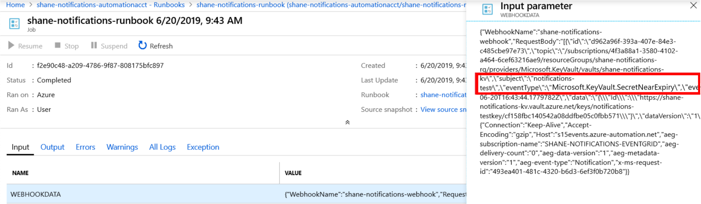

# How to: Route Key Vault keys events to Automation Runbook (preview)

Key Vault integration with Azure Event Grid enables users to be notified when the status of a secret stored in key vault has changed. For an overview of the feature, see [Monitoring Key Vault with Azure Event Grid](event-grid-overview.md).

This guide will show you how to receive Key Vault notifications through Azure Event Grid, and how to respond to status changes with Azure Automation.

## Prerequisites

- An Azure Subscription. If you don't have an Azure subscription, create a [free account](https://azure.microsoft.com/free/?WT.mc_id=A261C142F) before you begin.
- The Azure CLI installed on your machine. See [Install the Azure CLI](/cli/azure/install-azure-cli?view=azure-cli-latest).
- A key vault in your Azure Subscription. You can quickly create a new key vault by following the steps in [Set and retrieve a secret from Azure Key Vault using Azure CLI](quick-create-cli.md)


## Concepts

Event Grid allows you to select an Azure Resource, such as a key vault, to subscribe to and monitor for pre-defined "events". When an event triggers, the result is sent to an endpoint. Thw endpoint is a URL that is set up to receive an HTTP POST request from Event Grid.

In this guide, Event Grid will be subscribed to the key vault as a "topic resource". When one of the keys in the key vault is about to expire, Event Grid is notified of the status change and makes an HTTP POST to the endpoint. A web hook then triggers a Azure Automation logic application, called a "runbook", which execute a PowerShell script. The script programmatically generate a new version of the key.


## Configure the Azure CLI

Open the Azure CLI Command Prompt Window and type in the following commands:

```console
az cloud set --name AzureCloud
```

Sign in to your Azure account using the Azure CLI command [az login](/cli/azure/reference-index?view=azure-cli-latest#az-login).

```console
az login
```

If necessary, set your subscription using the Azure CLI command [az account set](/cli/azure/account?view=azure-cli-latest#az-account-set). To see a list of subscriptions affiliated with your account, use [az account list](/cli/azure/account?view=azure-cli-latest#az-account-list).

```console
az account set -s <your-subscription-id>
```

Register the Microsoft.KeyVault resource provider with the Azure CLI command [az register provider](/cli/azure/provider?view=azure-cli-latest#az-provider-register).

```console
az provider register --namespace Microsoft.KeyVault
```

## Create an Azure Automation Account

Next 

1.  Go to portal.azure.com and log in to your subscription

1.  In the search box, type in 'Automation Accounts'

1.  Under the "Services" Section of the drop-down from the search bar, select Automation Accounts.

1.  Click Add 

    

1.  Fill the required information in the "Add Automation Account" Blade and select Create

1.  Wait for your automation account to be created.

## Create a Runbook and Webhook


1.  Select the automation account you created in step 1.

1.  Select "Runbooks" under the Process Automation section

1.  Click the "Create a runbook"

1.  Name your runbook and select "PowerShell" as the runbook type

1.  Click on the runbook you created, and select the "Edit" Button

1.  Enter the following code (for testing purposes) and click the "Publish" button. This will output the result of the POST request received.

    
```azurepowershell
param
(
[Parameter (Mandatory = $false)]
[object] $WebhookData
)

#If runbook was called from Webhook, WebhookData will not be null.
if ($WebhookData) {
#Write-Output "WebhookData <$WebhookData>"
$WebhookDataRequestBody = $WebhookData.RequestBody
Write-Output $WebhookDataRequestBody    
}
else
{
# Error
write-Error "No input data found." 
}
```


1.  Select "Webhooks" from the resources section of the runbook you just published

1.  Click "Add Webhook"

    

1.  Select "Create new Webhook"

1. Name the webhook, set an expiration date, and copy the URL

    a.  Please note that you cannot view the URL after you create it. Make sure you copy to clipboard and save it in a secure location where you can access it for the remainder of this guide.

1. Select Ok, and Click Create

    a.  You may need to click into the "parameters and run settings" option and select ok before the Create button will be enabled. You don't need to enter any parameters.

    

## Create an Event Grid Subscription

1.  Open the Azure Portal using the following link: https://ms.portal.azure.com/?Microsoft_Azure_KeyVault_ShowEvents=true&Microsoft_Azure_EventGrid_publisherPreview=true

1.  Go to your key vault and select the "Events" tab

    a.  If you cannot see the Events tab, make sure that you are using the preview version of the portal (see the link above).

    

1.  Click the "+ Event Subscription" button

1.  Create a descriptive name for the subscription

1.  Choose "Event Grid Schema"

1.  The topic resource should be the key vault you want monitored for status changes

1.  Under event types, choose the specific event types for each secret type you want to monitor. (Default and recommended setting is all)

1.  Select Webhook for endpoint type

1.  When you click select an endpoint, a new context pane will open on the portal. In this field, paste the webhook URL that you created in Step 3 Task 10.

1.  Select Confirm Selection on this context pane

1.  Select Create

    

## Test and Verify

> [!NOTE]
> This test assumes that you have subscribed to the new-version notification for keys in Step 4.
>
> This test assumes that you have the necessary privileges to create a new version of a key in a key vault.


1.  Go to your key vault on the Azure Portal

1.  Create a new key for testing purposes name the key and keep the remaining parameters in their default settings.

1.  Select the key that you have created and create a new version of the
    key.

1.  Now navigate to the events tab in your key vault.

1.  Click on the event grid subscription you created.

1.  Under metrics, see if an event was captured.

    1.  This validates that event grid successfully captured the status change of the key in your key vault.

    

1.  Now go to your azure automation account on the Azure Portal

1.  Select the "Runbooks" tab, and click on the runbook you created

1.  Select the "Webhooks" tab, and look at the "last triggered" timestamp, confirm that this is the same time as when you created the new key version (within 60 seconds).

    1.  This validates that event grid made a POST to the webhook with the event details of the status change in your key vault, and the webhook was triggered.

    

1. Now go back to your Runbook, and select the "Overview" Tab.

1. Look at the Recent Jobs list and you should see that a job was created, and that the status is complete.

    1.  This validates that the webhook triggered the runbook to start executing its script.

    

1. You can drill down even further by selecting the recent job and looking at the actual POST request that was sent from event grid to the webhook.

1. Examine the JSON and make sure that the parameters for your key vault and event type are correct.

    

1. If the "event type" parameter in the JSON object matches the event which occurred in the key vault (in this example, Microsoft.KeyVault.KeyNewVersionCreated) the test was successful.

### So Now What?

Congratulations! If you have followed all the steps above, you are now ready to programmatically respond to status changes of secrets stored in your key vault.

-   If have been using a polling-based system to look for status changes of secrets in your key vaults, migrate to using this notification feature.

-   Replace the test script in your runbook with code to programmatically renew your secrets when they are about to expire.

-   Stay connected with the User Voice forum and get notified when additional notification features become available.

## Troubleshooting

### Unable to create subscription

Reregister Event Grid and Key Vault is registered in your subscription resource providers. See [Azure resource providers and types](../azure-resource-manager/resource-manager-supported-services.md).

## Next steps

- Learn more about [Azure Key Vault](key-vault-overview.md]
- Learn more about [Event Grid](../event-grid/overview.md)
- Learn more about [Azure Automation](../automation/index.yml)
