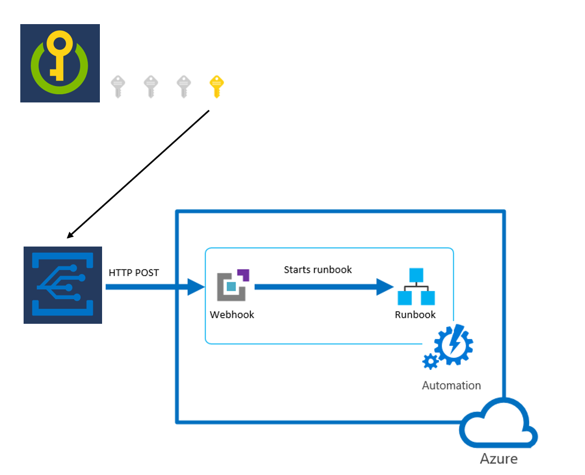
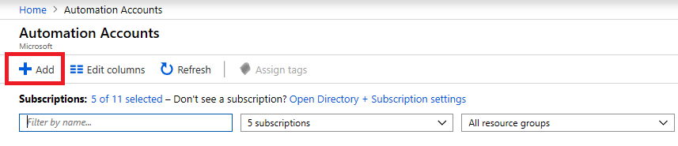
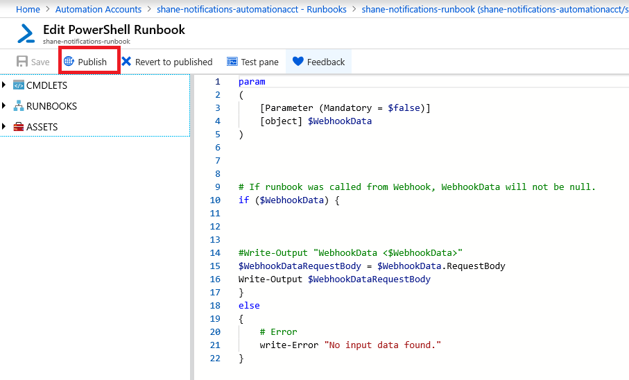
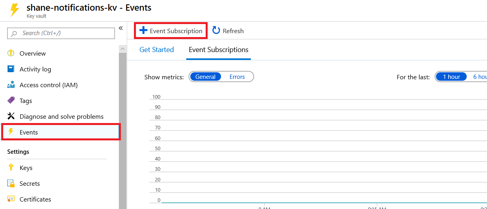
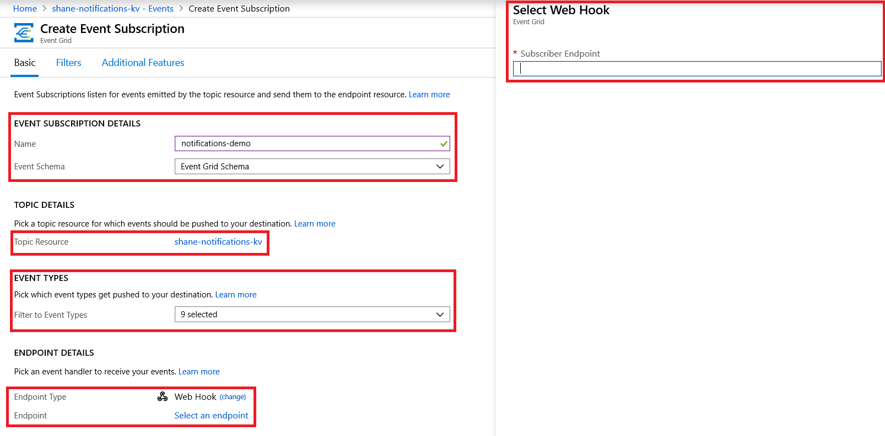
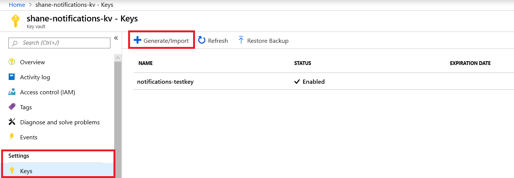
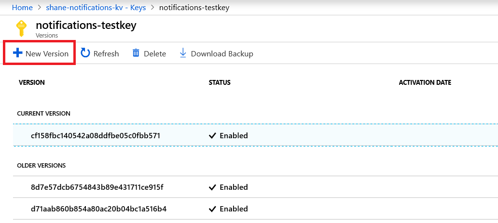
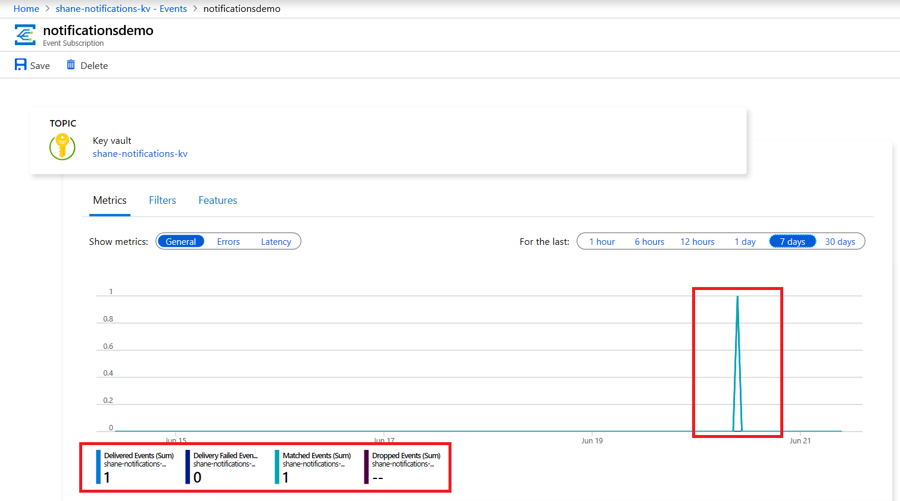
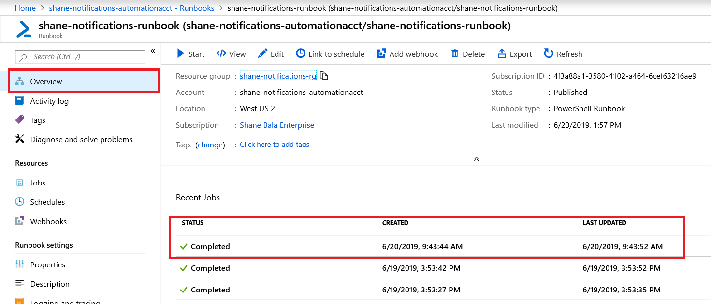

# Receive and respond to key vault notifications with Azure Event Grid (preview)

Azure Key Vault integration with Azure Event Grid (currently in preview) enables user notification when the status of a secret stored in a key vault has changed. For an overview of this feature, see [Monitoring Key Vault with Event Grid](event-grid-overview.md).

This guide describes how to receive Key Vault notifications through Event Grid, and how to respond to status changes through Azure Automation.

## Prerequisites

- An Azure subscription. If you don't have an Azure subscription, create a [free account](https://azure.microsoft.com/free/?WT.mc_id=A261C142F) before you begin.
- A key vault in your Azure Subscription. You can quickly create a new key vault by following the steps in [Set and retrieve a secret from Azure Key Vault using Azure CLI](quick-create-cli.md).

## Concepts

Event Grid is an eventing service for the cloud. By following the steps in this guide, you'll subscribe to events for Key Vault and route events to Automation. When one of the secrets in the key vault is about to expire, Event Grid is notified of the status change and makes an HTTP POST to the endpoint. A web hook then triggers an Automation execution of a PowerShell script.



## Create an Automation account

Create an Automation account through the [Azure portal](https://portal.azure.com):

1.  Go to portal.azure.com and log in to your subscription.

1.  In the search box, enter **Automation Accounts**.

1.  Under the **Services** section of the drop-down list on the search bar, select **Automation Accounts**.

1.  Select **Add**.

    

1.  Enter the required information in the **Add Automation Account** pane and then select **Create**.

## Create a runbook

After your Automation account is ready, create a runbook.


1.  Select the Automation account you just created.

1.  Select **Runbooks** under **Process Automation**.

1.  Select **Create a runbook**.

1.  Name your runbook and select **PowerShell** as the runbook type.

1.  Select the runbook you created and then select the **Edit** button.

1.  Enter the following code (for testing purposes) and select the **Publish** button. This action returns the result of the POST request received.

```azurepowershell
param
(
[Parameter (Mandatory = $false)]
[object] $WebhookData
)

#If runbook was called from Webhook, WebhookData will not be null.
if ($WebhookData) {

#rotate secret:
#generate new secret version in key vault
#update db/service with generated secret

#Write-Output "WebhookData <$WebhookData>"
Write-Output $WebhookData.RequestBody
}
else
{
# Error
write-Error "No input data found." 
}
```



## Create a webhook

Create a webhook to trigger your newly created runbook.

1.  Select **Webhooks** from the **Resources** section of the runbook you just published.

1.  Select **Add Webhook**.

    

1.  Select **Create new Webhook**.

1. Name the webhook, set an expiration date, and copy the URL.

    > [!IMPORTANT] 
    > You can't view the URL after you create it. Make sure you save a copy in a secure location where you can access it for the remainder of this guide.

1. Select **Parameters and run settings** and then select **OK**. Don't enter any parameters. This will enable the **Create** button.

1. Select **OK** and then select **Create**.

    

## Create an Event Grid subscription

Create an Event Grid subscription through the [Azure portal](https://portal.azure.com).

1.  Open the [Azure portal](https://portal.azure.com/?Microsoft_Azure_KeyVault_ShowEvents=true&Microsoft_Azure_EventGrid_publisherPreview=true).

1.  Go to your key vault and select the **Events** tab. If you can't see it, make sure you're using the [preview version of the portal](https://ms.portal.azure.com/?Microsoft_Azure_KeyVault_ShowEvents=true&Microsoft_Azure_EventGrid_publisherPreview=true).

    

1.  Select the **Event Subscription** button.

1.  Create a descriptive name for the subscription.

1.  Choose **Event Grid Schema**.

1.  **Topic Resource** should be the key vault you want to monitor for status changes.

1.  For **Filter to Event Types**, leave all options selected (**9 selected**).

1.  For **Endpoint Type**, select **Webhook**.

1.  Choose **Select an endpoint**. In the new context pane, paste the webhook URL from the [Create a webhook](#create-a-webhook) step into the **Subscriber Endpoint** field.

1.  Select **Confirm Selection** on the context pane.

1.  Select **Create**.

    

## Test and verify

Verify that your Event Grid subscription is properly configured. This test assumes you have subscribed to the "Secret New Version Created" notification in the [Create an Event Grid subscription](#create-an-event-grid-subscription), and that you have the necessary permissions to create a new version of a secret in a key vault.





1.  Go to your key vault on the Azure portal.

1.  Create a new secret. For testing purposes, set the expiration to date to the next day.

1.  On the **Events** tab in your key vault, select the Event Grid subscription you created.

1.  Under **Metrics**, check whether an event was captured. Two events are expected: SecretNewVersion and SecretNearExpiry. These events validate that Event Grid successfully captured the status change of the secret in your key vault.

    

1.  Go to your Automation account.

1.  Select the **Runbooks** tab, and then select the runbook you created.

1.  Select the **Webhooks** tab, and confirm that the "last triggered" time stamp is within 60 seconds of when you created the new secret. This result confirms that Event Grid made a POST to the webhook with the event details of the status change in your key vault and that the webhook was triggered.

    

1. Return to your runbook and select the **Overview** tab.

1. Look at the **Recent Jobs** list. You should see that a job was created and that the status is complete. This confirms that the webhook triggered the runbook to start executing its script.

    

1. Select the recent job and look at the POST request that was sent from Event Grid to the webhook. Examine the JSON and make sure that the parameters for your key vault and event type are correct. If the "event type" parameter in the JSON object matches the event that occurred in the key vault (in this example, Microsoft.KeyVault.SecretNearExpiry), the test was successful.

## Troubleshooting

### You can't create an event subscription

Reregister Event Grid and the key vault provider in your Azure subscription resource providers. See [Azure resource providers and types](../azure-resource-manager/management/resource-providers-and-types.md).

## Next steps

Congratulations! If you've correctly followed all these steps, you're now ready to programmatically respond to status changes of secrets stored in your key vault.

If you've been using a polling-based system to search for status changes of secrets in your key vaults, you can now start using this notification feature. You can also replace the test script in your runbook with code to programmatically renew your secrets when they're about to expire.

Learn more:


- Overview: [Monitoring Key Vault with Azure Event Grid (preview)](event-grid-overview.md)
- How to: [Receive email when a key vault secret changes](event-grid-logicapps.md)
- [Azure Event Grid event schema for Azure Key Vault (preview)](../event-grid/event-schema-key-vault.md)
- [Azure Key Vault overview](key-vault-overview.md)
- [Azure Event Grid overview](../event-grid/overview.md)
- [Azure Automation overview](../automation/index.yml)
