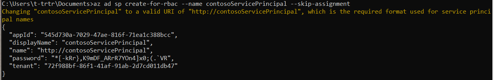
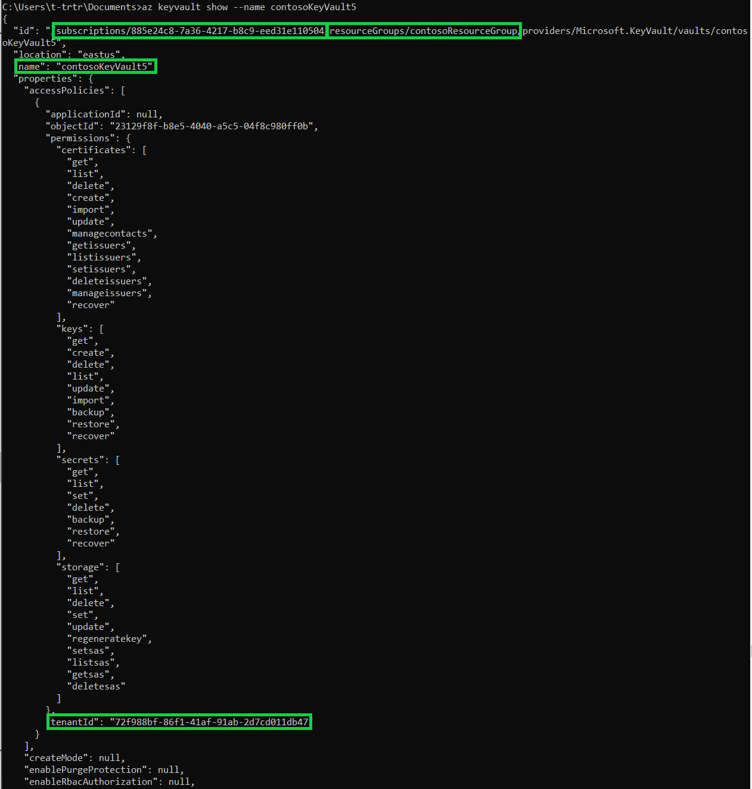
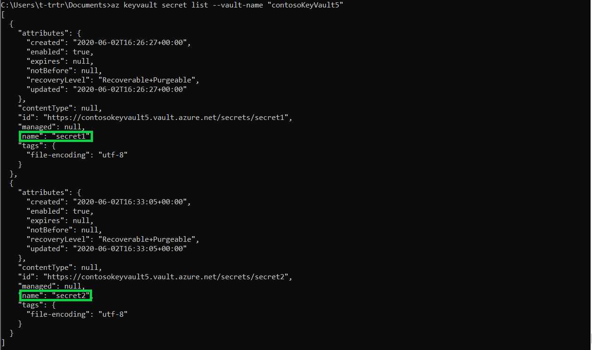
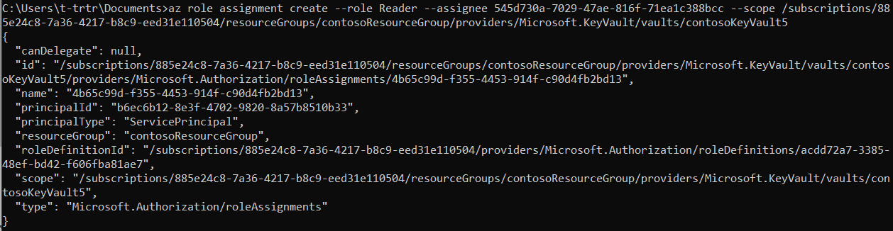
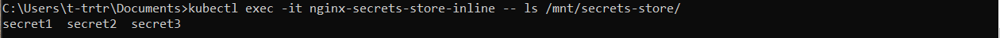
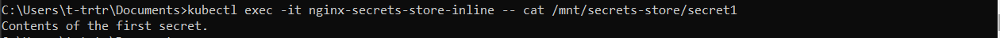

# Tutorial: <do something with X> 

In this tutorial, you will access and retrieve secrets from Azure Key Vault using the Secrets Store CSI Driver to then mount into Kubernetes pods.

In this tutorial, you learn how to:

> [!div class="checklist"]
> * Create a service principal
> * Deploy an Azure Kubernetes Service cluster
> * Install Helm and Secrets Store CSI Driver
> * Create an Azure Key Vault and set secrets
> * Create your own SecretProviderClass Object
> * Deploy your Kubernetes Resources with mounted secrets from Key Vault

## Prerequisites
Before you start this tutorial, install the [Azure CLI](https://docs.microsoft.com/cli/azure/install-azure-cli-windows?view=azure-cli-latest).

## Create a service principal

We are going to create a service principal first because the Kubernetes cluster will sometimes throw an error when trying to create one without a pre-existing service principal linked.

```azurecli
az ad sp create-for-rbac --name contosoServicePrincipal --skip-assignment
```
This operation returns a series of key/values pairs:



Copy down the appID and password. You will need these credentials later.

## Deploy an Azure Kubernetes Service cluster using Azure CLI

You do not need to use Azure Cloud Shell, your Command Prompt (Terminal) with Azure CLI installed will do. Please follow this [guide](https://docs.microsoft.com/azure/aks/kubernetes-walkthrough) and complete the following sections: Create a resource group, Create AKS cluster, and Connect to the cluster.

1. Set your PATH environment variable to the “kubectl.exe” file that was downloaded.
1. Check your Kubernetes version:
    ```azurecli
    kubectl version
    ```
    Will output the client and server Version. The client version is the "kubectl.exe" you installed while the server version is the Azure Kubernetes Services that your cluster is running on.
1. Ensure that your Kubernetes version is either v1.16.0 or greater:
    ```azurecli
    az aks upgrade --kubernetes-version 1.16.9 --name contosoAKSCluster --resource-group contosoResourceGroup
    ```
    This will upgrade both the Kubernetes cluster and the node pool. It may take a couple minutes to execute.

## Install Helm and Secrets Store CSI Driver

You will need to install [Helm](https://helm.sh/docs/intro/install/) in order to install the Secrets Store CSI (Container Storage Interface) driver.

The [Secrets Store CSI](https://github.com/Azure/secrets-store-csi-driver-provider-azure/blob/master/charts/csi-secrets-store-provider-azure/README.md) driver interface allows you to get secret content(s) stored in an Azure Key Vault instance and use the driver interface to mount those secret content(s) into Kubernetes pods.

1. Check the Helm version and ensure that it is v3 or greater:
    ```azurecli
    helm version
    ```
1. Install the Secrets Store CSI driver and the Azure Key Vault provider for the driver:
    ```azurecli
    helm repo add csi-secrets-store-provider-azure https://raw.githubusercontent.com/Azure/secrets-store-csi-driver-provider-azure/master/charts

    helm install csi-secrets-store-provider-azure/csi-secrets-store-provider-azure --generate-name
    ```

## Create an Azure Key Vault and set secrets

Please follow this [guide](https://docs.microsoft.com/azure/key-vault/secrets/quick-create-cli) to create your own Key Vault and set your secrets.

Note: You do not need to use the Azure Cloud Shell or create a new resource group. Using the resource group created earlier for the Kubernetes cluster is fine.

## Create your own SecretProviderClass Object

Use this [template](https://github.com/Azure/secrets-store-csi-driver-provider-azure/blob/master/examples/v1alpha1_secretproviderclass.yaml) provided to create your own custom SecretProviderClass Object to provide provider-specific parameters for the Secrets Store CSI driver. This will provide identity access to your Key Vault.

Using the sample SecretProviderClass YAML file provided. You are going to fill in the missing parameters. The following need to be filled out:

1.	**userAssignedIdentityID:** Client ID of Service Principal
1.	**keyvaultName:** Name of Key Vault
1.	**objects:** This object will contain all of the secret content you want to mount
    1.	**objectName:** Name of secret content
    1.	**objectType:** Object type (secret, key, certificate)
1.	**resourceGroup:** Name of resource group
1.	**subscriptionId:** Subscription ID of the Key Vault
1.	**tenantID:** Tenant ID (i.e. Directory ID) of the Key Vault

Below is the updated template, please download it as a .yaml file and fill in the corresponding fields with the relevant information:

```yaml
apiVersion: secrets-store.csi.x-k8s.io/v1alpha1
kind: SecretProviderClass
metadata:
  name: azure-kvname
spec:
  provider: azure
  parameters:
    usePodIdentity: "false"         		  # [OPTIONAL] if not provided, will default to "false"
    useVMManagedIdentity: "false"             # [OPTIONAL] if not provided, will default to "false"
    userAssignedIdentityID: "servicePrincipalClientID"       # [REQUIRED if using a Service Principal] use the client id to specify which user assigned managed identity to use. If using a user assigned identity as the VM's managed identity, then specify the identity's client id. If empty, then defaults to use the system assigned identity on the VM
                                                             #     az ad sp show --id http://contosoServicePrincipal --query appId -o tsv
                                                             #     the above command will return the Client ID of your service principal
    keyvaultName: "keyVaultName"              # [REQUIRED] the name of the Key Vault
                                              #     az keyvault show --name contosoKeyVault5
                                              #     the above command will displays the Key Vault metadata, which includes the subscription ID, resource group name, Key Vault 
    cloudName: ""          			          # [OPTIONAL for Azure] if not provided, azure environment will default to AzurePublicCloud
    objects:  |
      array:
        - |
          objectName: secret1                 # [REQUIRED] object name
                                              #     az keyvault secret list --vault-name “contosoKeyVault5”
                                              #     the above command will display a list of secret names from your Key Vault
          objectType: secret                  # [REQUIRED] object types: secret, key or cert
          objectVersion: ""                   # [OPTIONAL] object versions, default to latest if empty
        - |
          objectName: secret2
          objectType: secret
          objectVersion: ""
    resourceGroup: "resourceGroupName"        # [REQUIRED] the resource group name of the Key Vault
    subscriptionId: "subscriptionID"          # [REQUIRED] the subscription ID of the Key Vault
    tenantId: "tenantID"                      # [REQUIRED] the tenant ID of the Key Vault
```


## Assign your service principal 

To get the secrets from your Key Vault, you need to give permission to your service principal to do so.

1. Assign service principal to existing Key Vault:
    ```azurecli
        az role assignment create --role Reader --assignee $AZURE_CLIENT_ID --scope /subscriptions/$SUBID/resourcegroups/$KEYVAULT_RESOURCE_GROUP/providers/Microsoft.KeyVault/vaults/$KEYVAULT_NAME
    ```

1. Give service principal permission to get secrets:
    ```azurecli
    az keyvault set-policy -n $KEYVAULT_NAME --secret-permissions get --spn $AZURE_CLIENT_ID
    ```
Now that you have configured your Service Principal to have permission to read secrets from your Key Vault. You will now add your Service Principal credentials as a Kubernetes secrets accessible by the Secrets Store CSI driver:

```azurecli
    kubectl create secret generic secrets-store-creds --from-literal clientid=<AZURE_CLIENT_ID> --from-literal clientsecret=<AZURE_CLIENT_SECRET>
```

Note: If you receive an error later on when deploying the Kubernetes pod about an invalid Client Secret ID. You may have an older Client Secret ID that was expired or reset. To resolve this, delete your secrets “secrets-store-creds” and create a new one with the current Client Secret ID. Run the command below to delete your “secrets-store-creds”:
```azurecli
    kubectl delete secrets secrets-store-creds
```

If you forgot your service principal's Client Secret ID, you can reset it using the following command:

```azurecli
az ad sp credential reset --name contosoServicePrincipal --credential-description "APClientSecret" --query password -o tsv
```

## Deploy your Kubernetes Resources with mounted secrets from Key Vault

1. The command below will configure your SecretProviderClass object:
    ```azurecli
    kubectl apply -f secretProviderClass.yaml
    ```
1. The command below will deploy your Kubernetes pods with the SecretProviderClass and the secrets-store-creds that you configured. Here is the template for [linux](https://github.com/Azure/secrets-store-csi-driver-provider-azure/blob/master/examples/nginx-pod-secrets-store-inline-volume-secretproviderclass.yaml) and [windows](https://github.com/Azure/secrets-store-csi-driver-provider-azure/blob/master/examples/windows-pod-secrets-store-inline-volume-secret-providerclass.yaml) deployment.
    ```azurecli
    kubectl apply -f updateDeployment.yaml
    ```
1. To display the pods that you have deployed:
    ```azurecli
    kubectl get pods
    ```
1. To check the status of your pod, use the following command:
    ```azurecli
    kubectl describe pod/nameOfYourPod
    ```


You should see that you pod is in the “Running” state. For your “Events” at the bottom, you should see something similar all the types of events to the left are classified as “Normal.”
Once you have verified that the pod has been deployed, you can validate that your pod has the secrets from your Key Vault.
To display all the secrets that the pod has:
```azurecli
kubectl exec -it nginx-secrets-store-inline -- ls /mnt/secrets-store/
```

To get content out of a specific secret:
```azurecli
kubectl exec -it nginx-secrets-store-inline -- cat /mnt/secrets-store/secret1
```

You are done. Congratulations.


## Next steps

Make sure your Key Vault is recoverable:
> [!div class="nextstepaction"]
> [Turn on soft delete](https://docs.microsoft.com/azure/key-vault/general/soft-delete-clid)

