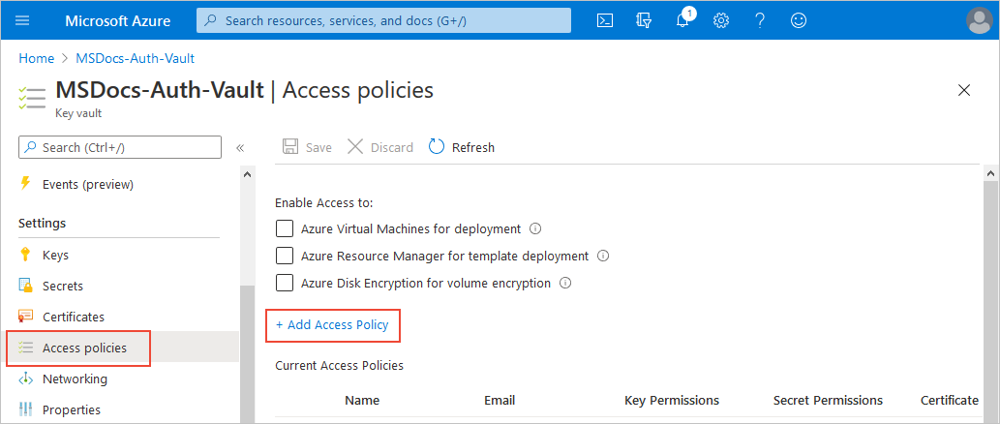
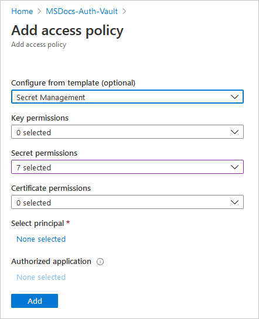
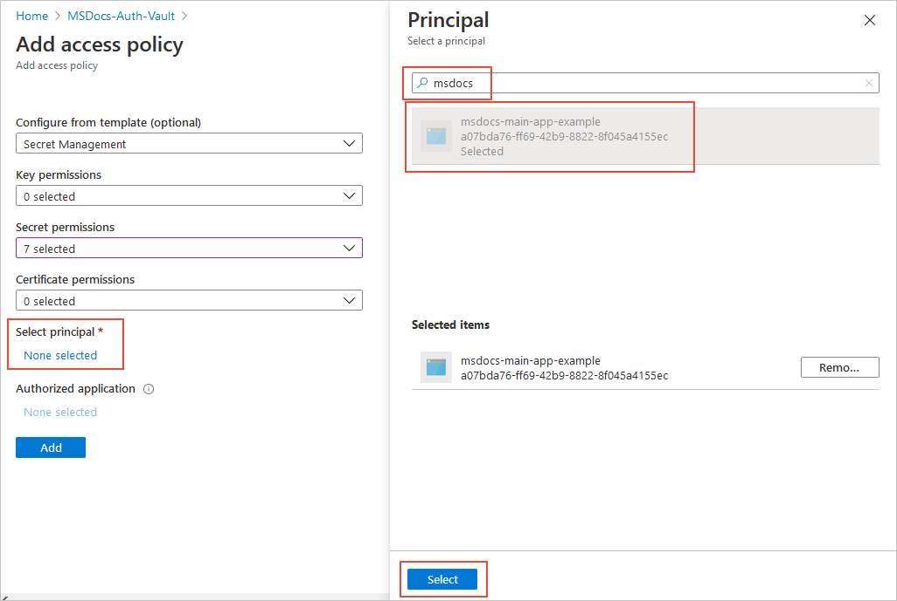
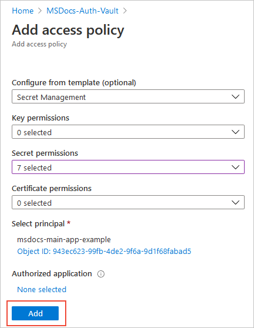
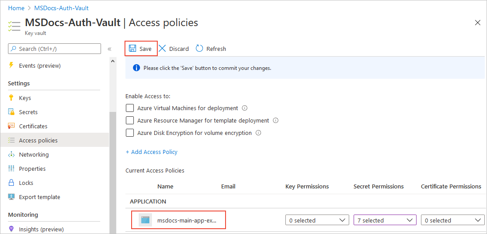

# Assign a Key Vault access policy using the Azure portal

A Key Vault access policy determines whether a given security principal, namely a user, application or user group, can perform different operations on Key Vault [secrets](../secrets/index.yml), [keys](../keys/index.yml), and [certificates](../certificates/index.yml). You can assign access policies using the Azure portal (this article), the [Azure CLI](assign-access-policy-cli.md), or [Azure PowerShell](assign-access-policy-powershell.md).

[!INCLUDE [key-vault-access-policy-limits.md](../../../includes/key-vault-access-policy-limits.md)]

For more information on creating groups in Azure Active Directory through the Azure portal, see [Create a basic group and add members](../../active-directory/fundamentals/active-directory-groups-create-azure-portal.md)

## Assign an access policy

1.	In the [Azure portal](https://portal.azure.com), navigate to the Key Vault resource. 

1.	Under **Settings**, select **Access policies**, then select **Add Access Policy**:

	

1.	Select the permissions you want under **Certificate permissions**, **Key permissions**, and **Secret permissions**. You can also select a template that contains common permission combinations:

	

1. Under **Select principal**, choose the **None selected** link to open the **Principal** selection pane. Enter the name of the user, app or service principal in the search field, select the appropriate result, then choose **Select**.

	

    If you're using a managed identity for the app, search for and select the name of the app itself. (For more information on managed identity and service principals, see [Key Vault authentication - app identity and service principals](authentication.md#app-identity-and-security-principals).)
 
1.	Back in the **Add access policy** pane, select **Add** to save the access policy.

	

1. Back on the **Access policies** page, verify that your access policy is listed under **Current Access Policies**, then select **Save**. Access policies aren't applied until you save them.

	

## Next steps

- [Azure Key Vault security: Identity and access management](security-overview.md#identity-management)
- [Secure your key vault](security-overview.md).
- [Azure Key Vault developer's guide](developers-guide.md)