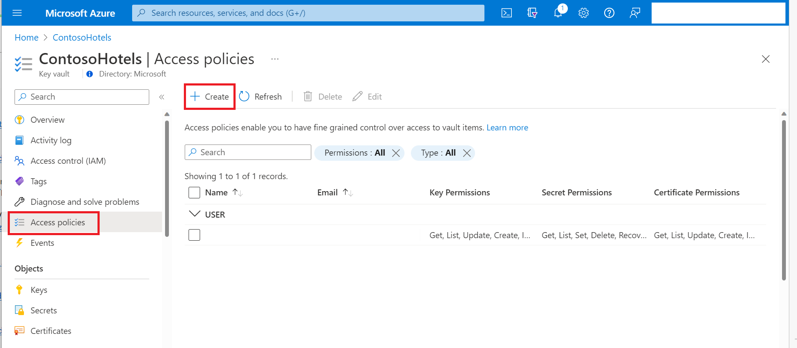
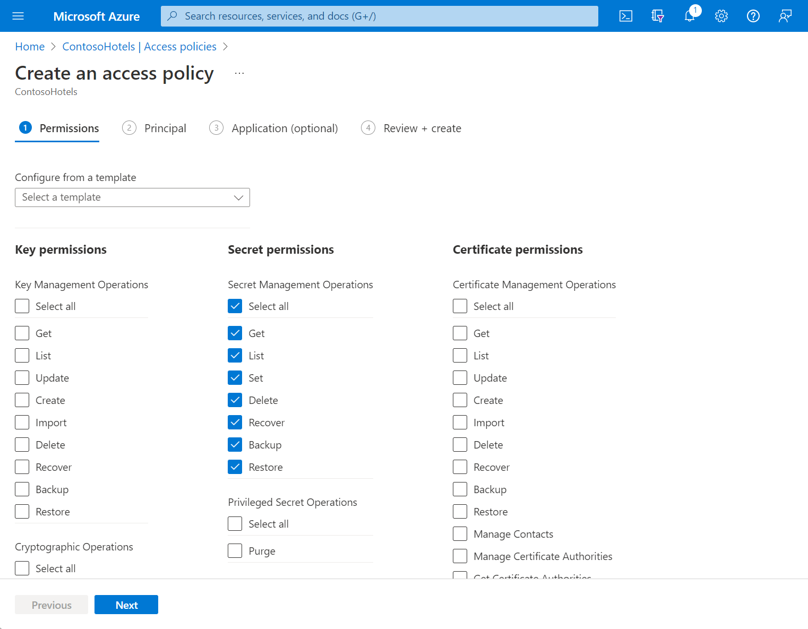
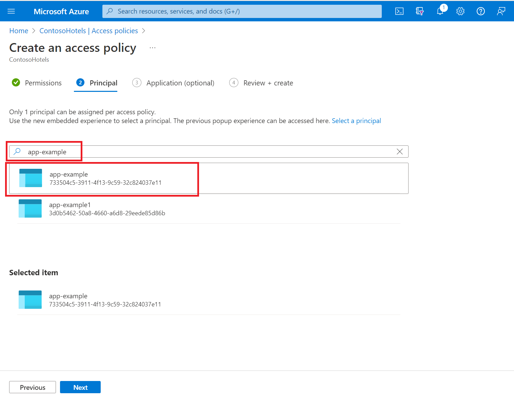
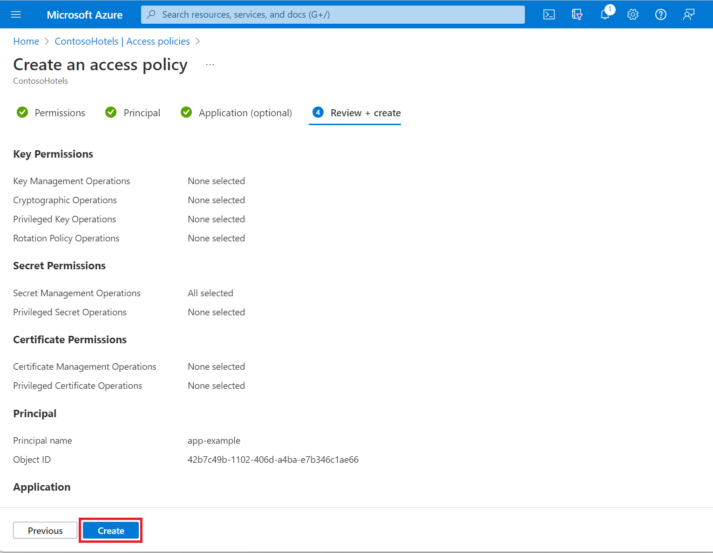
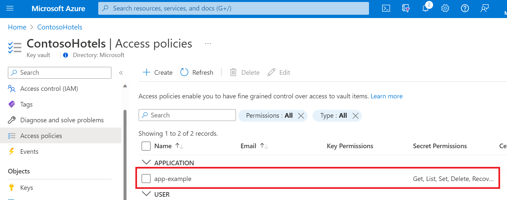

# Assign a Key Vault access policy (legacy)

A Key Vault access policy determines whether a given security principal, namely a user, application or user group, can perform different operations on Key Vault [secrets](../secrets/index.yml), [keys](../keys/index.yml), and [certificates](../certificates/index.yml). You can assign access policies using the [Azure portal](assign-access-policy-portal.md), the Azure CLI, or [Azure PowerShell](assign-access-policy-powershell.md).

[!INCLUDE [key-vault-access-policy-limits.md](../../../includes/key-vault-access-policy-limits.md)]

# [Azure portal](#tab/azure-portal)

## Assign an access policy

1.	In the [Azure portal](https://portal.azure.com), navigate to the Key Vault resource. 

1.	Select **Access policies**, then select **Create**:

	

1.	Select the permissions you want under **Key permissions**, **Secret permissions**, and **Certificate permissions**. 

	

1. Under the **Principal** selection pane, enter the name of the user, app or service principal in the search field and select the appropriate result.

	

    If you're using a managed identity for the app, search for and select the name of the app itself. (For more information on security principals, see [Key Vault authentication](authentication.md).
 
1.	Review the access policy changes and select **Create** to save the access policy.

	

1. Back on the **Access policies** page, verify that your access policy is listed. 

	

# [Azure CLI](#tab/azure-cli)

For more information on creating groups in Azure Active Directory using the Azure CLI, see [az ad group create](/cli/azure/ad/group#az-ad-group-create) and [az ad group member add](/cli/azure/ad/group/member#az-ad-group-member-add).

## Configure the Azure CLI and sign in

1. To run Azure CLI commands locally, install the [Azure CLI](/cli/azure/install-azure-cli).
 
    To run commands directly in the cloud, use the [Azure Cloud Shell](../../cloud-shell/overview.md).

1. Local CLI only: sign in to Azure using `az login`:

    ```azurecli
    az login
    ```

    The `az login` command opens a browser window to gather credentials if needed.

## Acquire the object ID

Determine the object ID of the application, group, or user to which you want to assign the access policy:

- Applications and other service principals: use the [az ad sp list](/cli/azure/ad/sp#az-ad-sp-list) command to retrieve your service principals. Examine the output of the command to determine the object ID of the security principal to which you want to assign the access policy.

    ```azurecli-interactive
    az ad sp list --show-mine
    ```

- Groups: use the [az ad group list](/cli/azure/ad/group#az-ad-group-list) command, filtering the results with the `--display-name` parameter:

     ```azurecli-interactive
    az ad group list --display-name <search-string>
    ```

- Users: use the [az ad user show](/cli/azure/ad/user#az-ad-user-show) command, passing the user's email address in the `--id` parameter:

    ```azurecli-interactive
    az ad user show --id <email-address-of-user>
    ```

## Assign the access policy
    
Use the [az keyvault set-policy](/cli/azure/keyvault#az-keyvault-set-policy) command to assign the desired permissions:

```azurecli-interactive
az keyvault set-policy --name myKeyVault --object-id <object-id> --secret-permissions <secret-permissions> --key-permissions <key-permissions> --certificate-permissions <certificate-permissions>
```

Replace `<object-id>` with the object ID of your security principal.

You need only include `--secret-permissions`, `--key-permissions`, and `--certificate-permissions` when assigning permissions to those particular types. The allowable values for `<secret-permissions>`, `<key-permissions>`, and `<certificate-permissions>` are given in the [az keyvault set-policy](/cli/azure/keyvault#az-keyvault-set-policy) documentation.

# [Azure PowerShell](#tab/azure-powershell)

For more information on creating groups in Azure Active Directory using Azure PowerShell, see [New-AzureADGroup](/powershell/module/azuread/new-azureadgroup) and [Add-AzADGroupMember](/powershell/module/az.resources/add-azadgroupmember).

## Configure PowerShell and sign-in

1. To run commands locally, install [Azure PowerShell](/powershell/azure/) if you haven't already.

    To run commands directly in the cloud, use the [Azure Cloud Shell](../../cloud-shell/overview.md).

1. Local PowerShell only:

    1. Install the [Azure Active Directory PowerShell module](https://www.powershellgallery.com/packages/AzureAD).

    1. Sign in to Azure:

        ```azurepowershell-interactive
        Connect-AzAccount
        ```
    
## Acquire the object ID

Determine the object ID of the application, group, or user to which you want to assign the access policy:

- Applications and other service principals: use the [Get-AzADServicePrincipal](/powershell/module/az.resources/get-azadserviceprincipal) cmdlet with the `-SearchString` parameter to filter results to the name of the desired service principal:

    ```azurepowershell-interactive
    Get-AzADServicePrincipal -SearchString <search-string>
    ```

- Groups: use the [Get-AzADGroup](/powershell/module/az.resources/get-azadgroup) cmdlet with the `-SearchString` parameter to filter results to the name of the desired group:

    ```azurepowershell-interactive
    Get-AzADGroup -SearchString <search-string>
    ```
    
    In the output, the object ID is listed as `Id`.

- Users: use the [Get-AzADUser](/powershell/module/az.resources/get-azaduser) cmdlet, passing the user's email address to the `-UserPrincipalName` parameter.

    ```azurepowershell-interactive
     Get-AzAdUser -UserPrincipalName <email-address-of-user>
    ```

    In the output, the object ID is listed as `Id`.

## Assign the access policy

Use the [Set-AzKeyVaultAccessPolicy](/powershell/module/az.keyvault/set-azkeyvaultaccesspolicy) cmdlet to assign the access policy:

```azurepowershell-interactive
Set-AzKeyVaultAccessPolicy -VaultName <key-vault-name> -ObjectId <Id> -PermissionsToSecrets <secrets-permissions> -PermissionsToKeys <keys-permissions> -PermissionsToCertificates <certificate-permissions    
```

You need only include `-PermissionsToSecrets`, `-PermissionsToKeys`, and `-PermissionsToCertificates` when assigning permissions to those particular types. The allowable values for `<secret-permissions>`, `<key-permissions>`, and `<certificate-permissions>` are given in the [Set-AzKeyVaultAccessPolicy - Parameters](/powershell/module/az.keyvault/set-azkeyvaultaccesspolicy#parameters) documentation.

---

## Next steps

- [Azure Key Vault security](security-features.md)
- [Azure Key Vault developer's guide](developers-guide.md)
