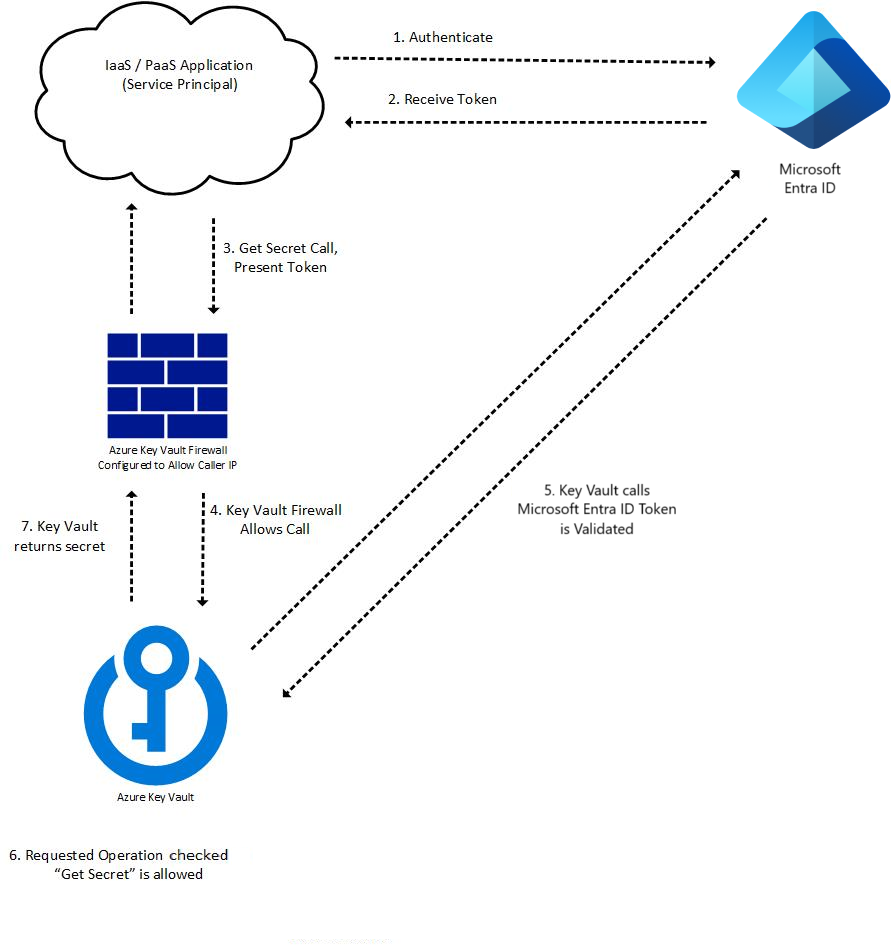

# Authentication in Azure Key Vault

Authentication with Key Vault works in conjunction with [Azure Active Directory (Azure AD)](../../active-directory/fundamentals/active-directory-whatis.md), which is responsible for authenticating the identity of any given **security principal**.

A security principal is an object that represents a user, group, service, or application that's requesting access to Azure resources. Azure assigns a unique **object ID** to every security principal.

* A **user** security principal identifies an individual who has a profile in Azure Active Directory.

* A **group** security principal identifies a set of users created in Azure Active Directory. Any roles or permissions assigned to the group are granted to all of the users within the group.

* A **service principal** is a type of security principal that identifies an application or service, which is to say, a piece of code rather than a user or group. A service principal's object ID acts like its username; the service principal's **client secret** acts like its password.

For applications, there are two ways to obtain a service principal:

* Recommended: enable a system-assigned **managed identity** for the application.

    With managed identity, Azure internally manages the application's service principal and automatically authenticates the application with other Azure services. Managed identity is available for applications deployed to a variety of services.

    For more information, see the [Managed identity overview](../../active-directory/managed-identities-azure-resources/overview.md). Also see [Azure services that support managed identity](../../active-directory/managed-identities-azure-resources/services-support-managed-identities.md), which links to articles that describe how to enable managed identity for specific services (such as App Service, Azure Functions, Virtual Machines, etc.).

* If you cannot use managed identity, you instead **register** the application with your Azure AD tenant, as described on [Quickstart: Register an application with the Azure identity platform](../../active-directory/develop/quickstart-register-app.md). Registration also creates a second application object that identifies the app across all tenants.

## Configure the Key Vault firewall

By default, Key Vault allows access to resources through public IP addresses. For greater security, you can also restrict access to specific IP ranges, service endpoints, virtual networks, or private endpoints.

For more information, see [Access Azure Key Vault behind a firewall](./access-behind-firewall.md).

## The Key Vault request operation flow with authentication

Key Vault authentication occurs as part of every request operation on Key Vault. Once token is retrieved, it can be reused for subsequent calls. Authentication flow example:

1. A token requests to authenticate with Azure AD, for example:
    * An Azure resource such as a virtual machine or App Service application with a managed identity contacts the REST endpoint to get an access token.
    * A user logs into the Azure portal using a username and password.

1. If authentication with Azure AD is successful, the security principal is granted an OAuth token.

1. A call to the Key Vault REST API through the Key Vault's endpoint (URI).

1. Key Vault Firewall checks the following criteria. If any criterion is met, the call is allowed. Otherwise the call is blocked and a forbidden response is returned.

    * The firewall is disabled and the public endpoint of Key Vault is reachable from the public internet.
    * The caller is a [Key Vault Trusted Service](./overview-vnet-service-endpoints.md#trusted-services), allowing it to bypass the firewall.
    * The caller is listed in the firewall by IP address, virtual network, or service endpoint.
    * The caller can reach Key Vault over a configured private link connection.    

1. If the firewall allows the call, Key Vault calls Azure AD to validate the security principal’s access token.

1. Key Vault checks if the security principal has the necessary permission for requested operation. If not, Key Vault returns a forbidden response.

1. Key Vault carries out the requested operation and returns the result.

The following diagram illustrates the process for an application calling a Key Vault "Get Secret" API:

> [!NOTE]
> Key Vault SDK clients for secrets, certificates, and keys make an additional call to Key Vault without access token,  which results in 401 response to retrieve tenant information. For more information see [Authentication, requests and responses](authentication-requests-and-responses.md)

## Authentication to Key Vault in application code

Key Vault SDK is using Azure Identity client library, which allows seamless authentication to Key Vault across environments with same code

**Azure Identity client libraries**

| .NET | Python | Java | JavaScript |
|--|--|--|--|
|[Azure Identity SDK .NET](/dotnet/api/overview/azure/identity-readme)|[Azure Identity SDK Python](/python/api/overview/azure/identity-readme)|[Azure Identity SDK Java](/java/api/overview/azure/identity-readme)|[Azure Identity SDK JavaScript](/javascript/api/overview/azure/identity-readme)|   

More information about best practices and developer examples, see [Authenticate to Key Vault in code](developers-guide.md#authenticate-to-key-vault-in-code)

## Next Steps

- [Key Vault developer's guide](developers-guide.md)
- [Assign a Key Vault access policy using the Azure portal](assign-access-policy-portal.md)
- [Assign Azure RBAC role to Key Vault](rbac-guide.md)
- [Key Vault access policy troubleshooting](troubleshooting-access-issues.md)
- [Key Vault REST API error codes](rest-error-codes.md)

- [What is Azure role-based access control (Azure RBAC)?](../../role-based-access-control/overview.md)
