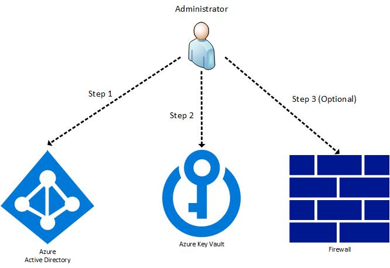
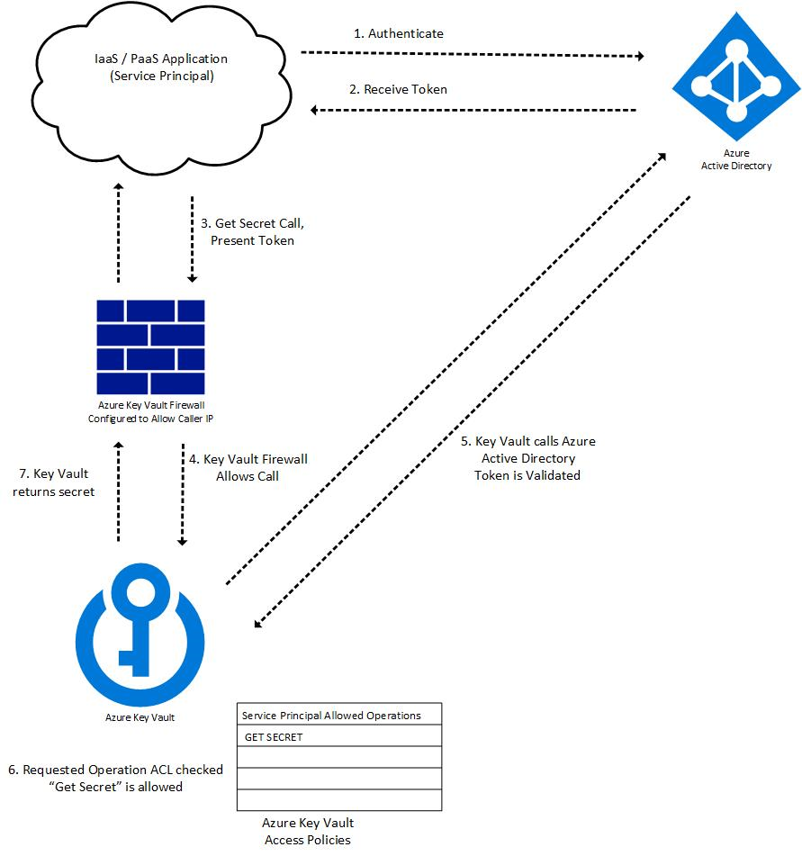
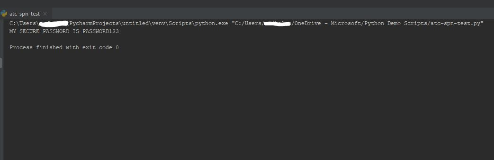

# Authenticate to Azure Key Vault

## Overview

Azure Key Vault is a secrets management solution that allows you to centralize the storage of application secrets and control their distribution. Azure Key Vault eliminates the need to store credentials in applications. Your application can authenticate to key vault to retrieve the required credentials. This document will cover the basics of authentication to key vault.

This document will help you understand how key vault authentication works. This document will explain the authentication flow, show you how to grant access to your key vault, and includes a tutorial to retrieve a stored secret in key vault from a sample python application.

This document will cover:

* Key Concepts
* Security Principal Registration
* Understanding Key Vault authentication flow
* Grant a service principal access to Key Vault
* Tutorial (Python)

## Key Concepts

### Azure Active Directory Concepts

* Azure Active Directory (AAD) - Azure Active Directory (Azure AD) is Microsoft’s cloud-based identity and access management service, which helps your employees sign in and access resources

* Role Definition - A role definition is a collection of permissions.  AAD has standard roles (Owner, Contributor, or Reader) that contain levels of permissions to perform operations like read, write, and delete on an Azure resource. Roles can also be custom definitions created by users with specific granular permissions.

* Application Registration - When you register an Azure AD application, two objects are created in your Azure AD tenant, an application object and a service principal object. Consider the application object as the global representation of your application for use across all tenants, and the service principal as the local representation for use in a specific tenant.

### Security Principal Concepts

* Security Principal - A security principal is an object that represents a user, group, service principal, or managed identity that is requesting access to Azure resources.

* User - An individual who has a profile in Azure Active Directory.

* Group - A set of users created in Azure Active Directory. When you assign a role to a group, all users within that group have that role.

* Service principal - A security identity used by applications or services to access specific Azure resources. You can think of it as a user identity (username and password or certificate) for an application.

* Managed Identity - An identity in Azure Active Directory that is automatically managed by Azure.

* Object ID (Client ID) - a unique identifier generated by Azure AD that is tied to a service principal during its initial provisioning.

## Security Principal Registration

1. Administrator registers a user or application (service principal) in Azure Active Directory.

2. Administrator creates an Azure Key Vault and configures access policies (ACLs).

3. (Optional) Administrator configures the Azure Key Vault Firewall.



## Understand the Key Vault authentication flow

1. A service principal makes a call to authenticate to AAD this can happen in several ways:
    * A user can log into the Azure portal using a username and password.
    * An application uses a client ID and presents a client secret or client certificate to AAD
    * An Azure resource such as a virtual machine has an assigned MSI and contacts the IMDS REST endpoint to get an access token.

2. If authentication to AAD is successful, the service principal will be granted an OAuth token.
3. The service principal makes a call to Key Vault.
4. Azure Key Vault Firewall determines whether to allow the call.
    * Scenario 1: Key Vault Firewall is disabled, public endpoint (URI) of key vault is reachable from the public internet. Call is allowed.
    * Scenario 2: Caller is an Azure Key Vault trusted service. Certain Azure services can bypass the key vault firewall if the option is selected. [Key Vault Trusted Service List](https://docs.microsoft.com/azure/key-vault/general/overview-vnet-service-endpoints#trusted-services)
    * Scenario 3: Caller is listed in the Azure Key Vault firewall by IP address, virtual network, or service endpoint.
    * Scenario 4: Caller can reach Azure Key Vault over a configured private link connection.
    * Scenario 5: Caller is not authorized and a forbidden response is returned.
5. Key Vault makes a call to AAD to validate the service principal’s access token.
6. Key Vault checks if the service principal has sufficient access policy permissions to perform the requested operation, in this example, the operation is get secret.
7. Key Vault provides the secret to the service principal.



## Grant a service principal access to Key Vault

1. Create a service principal if you don't already have one. [Create a Service Principal](https://docs.microsoft.com/azure/active-directory/develop/howto-create-service-principal-portal)
2. Add a role assignment to your service principal in the Azure Key Vault IAM settings. You can add pre-assigned roles of Owner, Contributor, or Reader. You can also create custom roles for your service principal. You should follow the principal of least privilege and only provide the minimum access necessary for your service principal. 
3.	Configure the key vault firewall. You can keep the key vault firewall disabled and allow access from the public internet (less secure, easier to configure). You can also restrict access to specific IP ranges, service endpoints, virtual networks, or private endpoints (more secure).
4.	Add an access policy for your service principal, this is a list of operations that your service principal can perform on the key vault. You should use the principal of least-privilege and limit the operations that the service principal can perform. However, if you do not provide sufficient permissions, your service principal will be denied access.

## Tutorial

In this tutorial you will learn how to set up a service principal to authenticate to key vault and retrieve a secret. 

### Part 1:  Create a Service Principal in the Azure portal

1. Log in to the Azure portal
1. Search for Azure Active Directory
1. Click the “App Registrations” Tab
1. Click “+ New Registration”
1. Create a name for the service principal
1. Select Register

At this point you have a registered service principal. You can view it by selecting “App Registrations”. Your service principal will now be assigned a client ID GUID, think of this as a “username” for your service principal. Now we need to create a “password” for your service principal, you can use a client secret or a client certificate. Note, using a client secret for authentication is not secure and should only be used for testing purposes. This tutorial will show you how to use a client certificate.

### Part 2: Create a client certificate for your service principal

1. Create a certificate

    * Option 1: Create a certificate using [OpenSSL](https://www.openssl.org/) (for test purposes only, do not use self-signed certificates in production)

    ```console
    openssl req -x509 -newkey rsa:4096 -keyout key.pem -out cert.pem -days 365
    ```

    * Option 2: Create a certificate using key vault. [Create a certificate in Azure Key Vault](https://docs.microsoft.com/azure/key-vault/certificates/certificate-scenarios#creating-your-first-key-vault-certificate)

1. Download the certificate in the PEM format
1. Log in to the Azure portal and navigate to Azure Active Directory
1. Click "App Registrations"
1. Select the service principal you created in Part 1.
1. Click on the “Certificates and Secrets” tab of your service principal
1. Upload the certificate using the "Upload Certificate" button

### Part 3: Configure an Azure Key Vault

1. Create an Azure Key Vault [Link](https://docs.microsoft.com/azure/key-vault/secrets/quick-create-portal#create-a-vault)

2. Configure Key Vault IAM permissions
    1. Navigate to your key vault
    1. Select the “Access Control (IAM)” tab
    1. Click Add Role Assignment
    1. Select “Contributor” role from the dropdown
    1. Enter the name or client ID of the service principal you created
    1. Click “View Role Assignments” to confirm your service principal is listed

3. Configure Key Vault Access Policy permissions
    1. Navigate to your key vault
    1. Select the “Access Policies” tab under “Settings”
    1. Select the “+ Add Access Policy” link
    1. Under the Secret Permissions dropdown check “Get” and “List” permissions.
    1. Select your service principal by name or client ID.
    1. Select “Add”
    1. Select “Save”

4. Create a secret in your key vault.
    1. Navigate to your key vault
    1. Click the “Secrets” tab under Settings
    1. Click “+ Generate/Import”
    1. Create a name for the secret, in this example, I will name the secret “test”
    1. Create a value for the secret, in this example, I will set a value of “password123”

Now, when you run code from your local machine, your can authenticate to key vault by getting an access token by presenting the client ID and a path to the certificate.

### Part 4: Retrieve the secret from your Azure Key Vault in an application (Python)

Use the following code sample to test whether your application can retrieve a secret from your key vault using the service principal you configured. 

```python
from azure.keyvault.secrets import SecretClient
from azure.identity import CertificateCredential


tenant_id = ""                                             ##ENTER AZURE TENANT ID
vault_url = "https://{VAULT NAME}.vault.azure.net/"        ##ENTER THE URL OF YOUR KEY VAULT
client_id = ""                                             ##ENTER CLIENT ID OF SERVICE PRINCIPAL
cert_path = r"C:\Users\{USERNAME}\{PATH}\{CERT_NAME}.pem"  ##ENTER PATH TO CERTIFICATE

def main():

    #AUTHENTICATION TO AAD USING CLIENT ID AND CLIENT CERTIFICATE
    token = CertificateCredential(tenant_id= tenant_id, client_id=client_id, certificate_path=cert_path)

    #AUTHENTICATION TO KEY VAULT PRESENTING AAD TOKEN
    client = SecretClient(vault_url=vault_url, credential=token)

    #CALL TO KEY VAULT TO GET SECRET
    secret = client.get_secret('{SECRET_NAME}')            ##ENTER NAME OF SECRET IN KEY VAULT

    #GET PLAINTEXT OF SECRET
    print(secret.value)

#CALL MAIN()
if __name__ == "__main__":
    main()
```




## Next Steps

1. Learn how to troubleshoot key vault authentication errors. [Key Vault Troubleshooting Guide](https://docs.microsoft.com/azure/key-vault/general/rest-error-codes)
