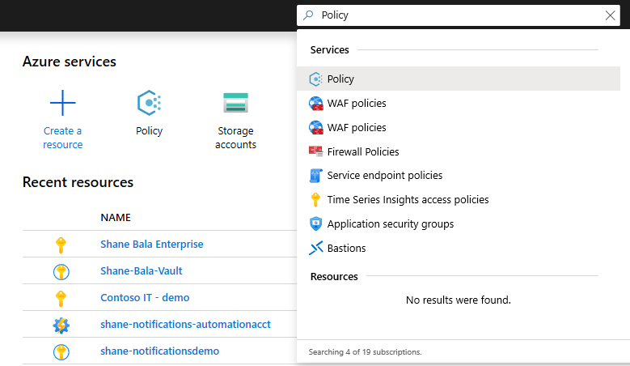
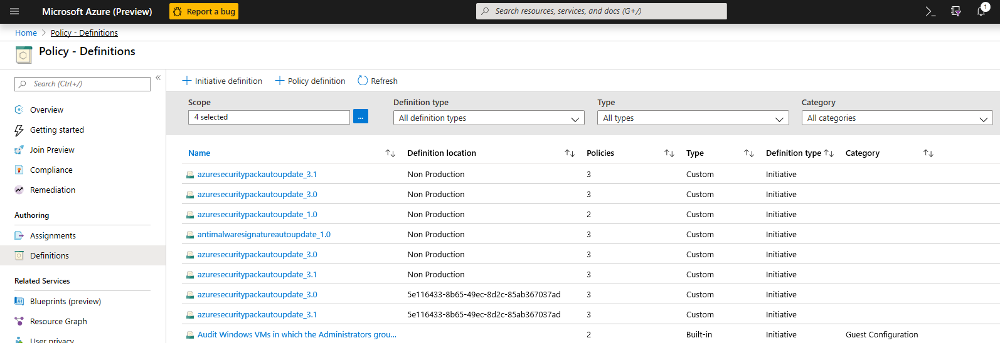
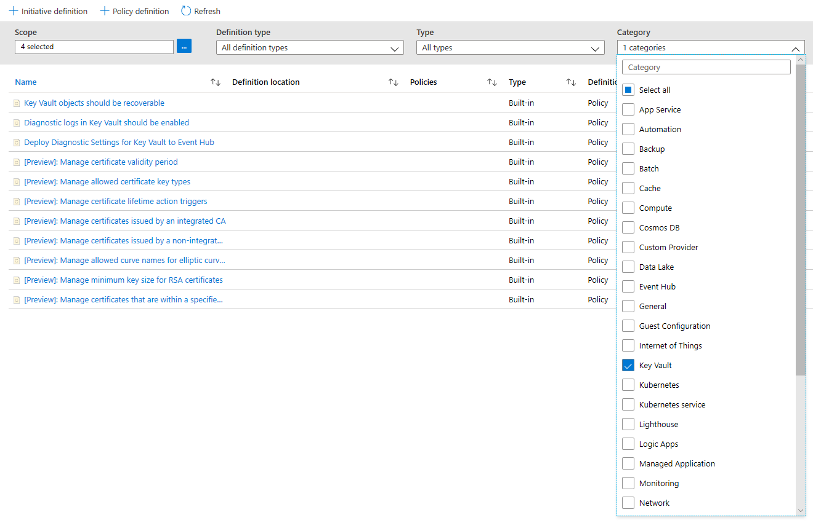
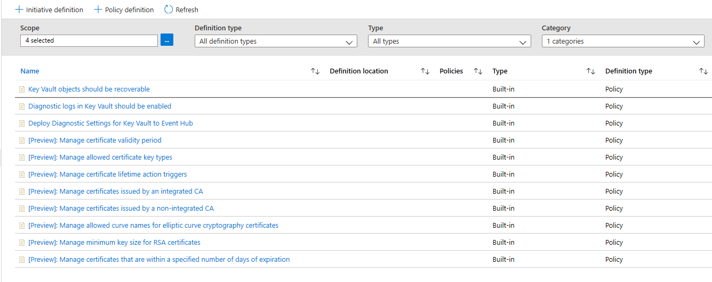
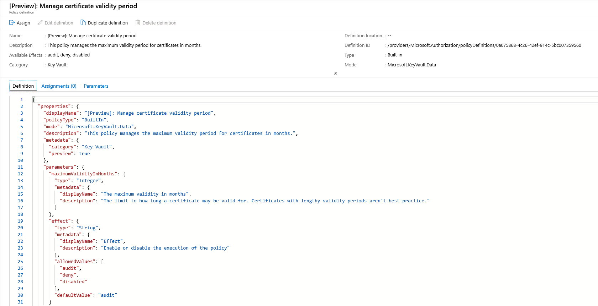
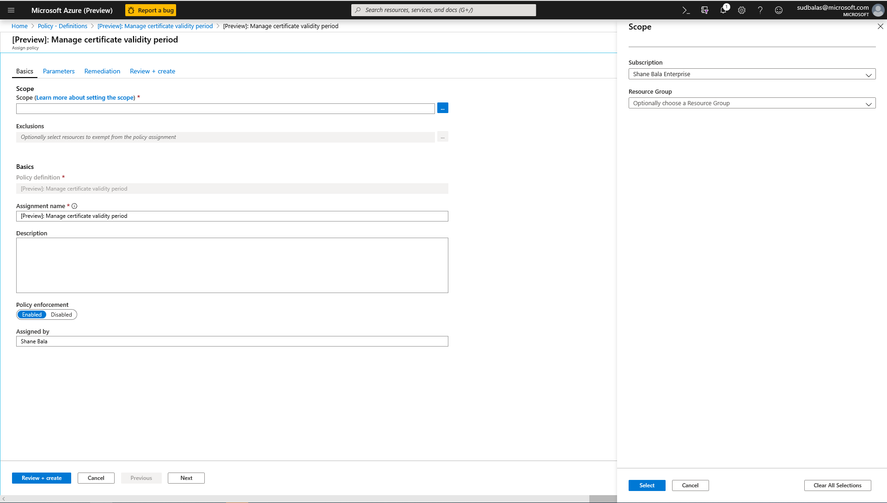
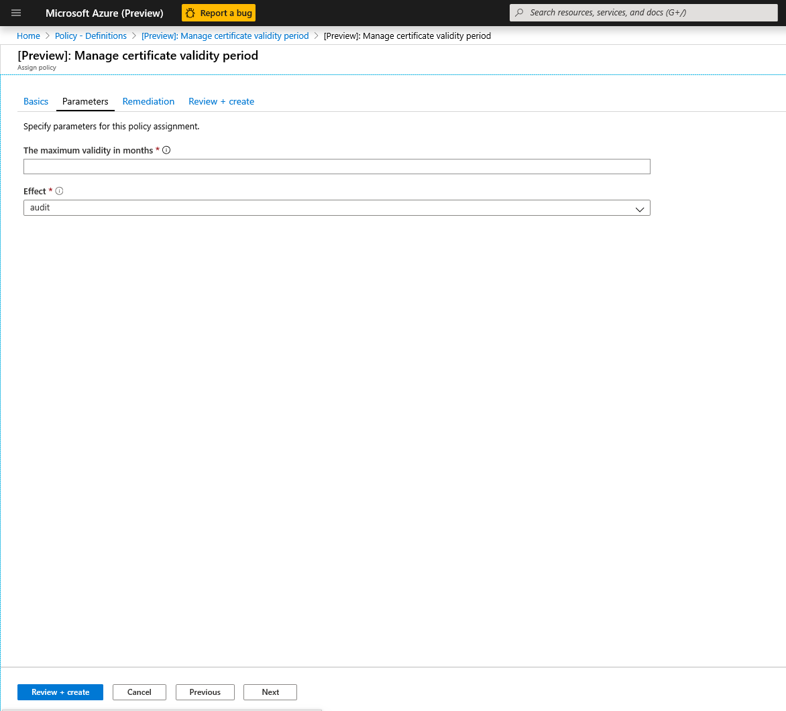
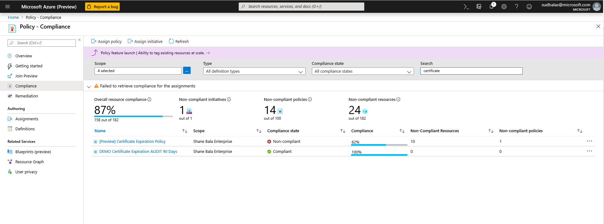
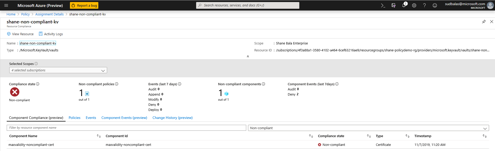
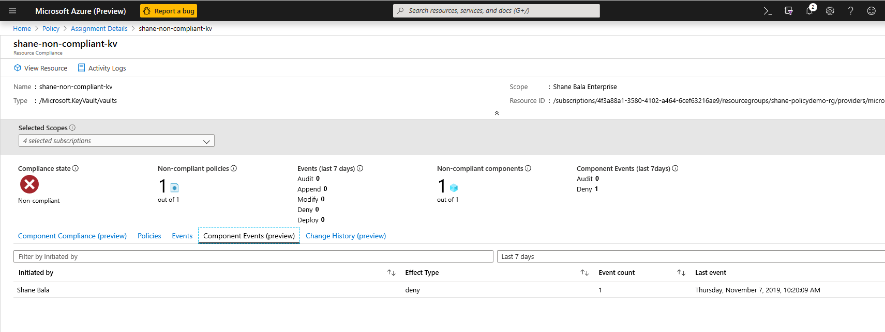

# Integrate Azure Key Vault with Azure Policy

[Azure Policy](../../governance/policy/index.yml) is a governance tool that gives users the ability to audit and manage their Azure environment at scale. Azure Policy provides the ability to place guardrails on Azure resources to ensure they're compliant with assigned policy rules. It allows users to perform audit, real-time enforcement, and remediation of their Azure environment. The results of audits performed by policy will be available to users in a compliance dashboard where they'll be able to see a drill down of which resources and components are compliant and which aren't.  For more information, see the [Overview of the Azure Policy service](../../governance/policy/overview.md).

Example Usage Scenarios:

- You want to improve the security posture of your company by implementing requirements around minimum key sizes and maximum validity periods of certificates in your company's key vaults but you don't know which teams will be compliant and which aren't.
- You currently don't have a solution to perform an audit across your organization, or you're conducting manual audits of your environment by asking individual teams within your organization to report their compliance. You're looking for a way to automate this task, perform audits in real time, and guarantee the accuracy of the audit.
- You want to enforce your company security policies and stop individuals from creating self-signed certificates, but you don't have an automated way to block their creation.
- You want to relax some requirements for your test teams, but you want to maintain tight controls over your production environment. You need a simple automated way to separate enforcement of your resources.
- You want to be sure that you can roll-back enforcement of new policies in the event of a live-site issue. You need a one-click solution to turn off enforcement of the policy.
- You're relying on a 3rd party solution for auditing your environment and you want to use an internal Microsoft offering.

## Types of policy effects and guidance

When enforcing a policy, you can determine its effect over the resulting evaluation. Each policy definition allows you to choose one of multiple effects. Therefore, policy enforcement may behave differently depending on the type of operation you're evaluating. In general, the effects for policies that integrate with Key Vault include:

- [**Audit**](../../governance/policy/concepts/effects.md#audit): when the effect of a policy is set to `Audit`, the policy won't cause any breaking changes to your environment. It will only alert you to components such as certificates that don't comply with the policy definitions within a specified scope, by marking these components as non-compliant in the policy compliance dashboard. Audit is default if no policy effect is selected.

- [**Deny**](../../governance/policy/concepts/effects.md#deny): when the effect of a policy is set to `Deny`, the policy will block the creation of new components such as certificates as well as block new versions of existing components that don't comply with the policy definition. Existing non-compliant resources within a key vault aren't affected. The 'audit' capabilities will continue to operate.

- [**Disabled**](../../governance/policy/concepts/effects.md#disabled): when the effect of a policy is set to `Disabled`, the policy will still be evaluated but enforcement won't take effect, thus being compliant for the condition with `Disabled` effect. This is useful to disable the policy for a specific condition as opposed to all conditions.
 
- [**Modify**](../../governance/policy/concepts/effects.md#modify): when the effect of a policy is set to `Modify`, you can perform addition of resource tags, such as adding the `Deny` tag to  a network. This is useful to disable access to a public network for Azure Key Vault managed HSM. It's necessary to [configure a manage identity](../../governance/policy/how-to/remediate-resources.md?tabs=azure-portal#configure-the-managed-identity) for the policy definition via the `roleDefinitionIds` parameter to utilize the `Modify` effect.

- [**DeployIfNotExists**](../../governance/policy/concepts/effects.md#deployifnotexists): when the effect of a policy is set to `DeployIfNotExists`, a deployment template is executed when the condition is met. This can be used to configure diagnostic settings for Key Vault to log analytics workspace. It's necessary to [configure a manage identity](../../governance/policy/how-to/remediate-resources.md?tabs=azure-portal#configure-the-managed-identity) for the policy definition via the `roleDefinitionIds` parameter to utilize the `DeployIfNotExists` effect.

- [**AuditIfNotExists**](../../governance/policy/concepts/effects.md#deployifnotexists): when the effect of a policy is set to `AuditIfNotExists`, you can identify resources that lack the properties specified in the details of the policy condition. This is useful to identify key vaults that have no resource logs enabled. It's necessary to [configure a manage identity](../../governance/policy/how-to/remediate-resources.md?tabs=azure-portal#configure-the-managed-identity) for the policy definition via the `roleDefinitionIds` parameter to utilize the `DeployIfNotExists` effect.

## Available Built-In Policy Definitions

Predetermined policies, referred to as 'built-ins', facilitate governance over your key vaults so you don't have to write custom policies in JSON format to enforce commonly used rules associated with best security practices. Even though built-ins are predetermined, certain policies require you to define parameters. For example, by defining the effect of the policy, you can audit the key vault and its objects before enforcing a deny operation to prevent outages. Current built-ins for Azure Key Vault are categorized in four major groups: key vault, certificates, keys, and secrets management. Within each category, policies are grouped towards driving specific security goals.

### Key Vaults

#### Access Control

Using the Azure Policy service, you can govern the migration to the RBAC permission model across your vaults. Learn more at [Migrate from vault access policy to an Azure role-based access control permission model](../general/rbac-migration.md) 

| Policy | Effects |
|--|--|
| [Azure Key Vault should use RBAC permission model](https://portal.azure.com/#blade/Microsoft_Azure_Policy/PolicyDetailBlade/definitionId/%2Fproviders%2FMicrosoft.Authorization%2FpolicyDefinitions%2F12d4fa5e-1f9f-4c21-97a9-b99b3c6611b5) | Audit _(Default)_, Deny, Disabled |

#### Network Access

Reduce the risk of data leakage by restricting public network access, enabling [Azure Private Link](https://azure.microsoft.com/products/private-link/) connections,  creating private DNS zones to override DNS resolution for a private endpoint, and enabling [firewall protection](network-security.md) so that the key vault isn't accessible by default to any public IP.

| Policy | Effects |
|--|--|
| [Azure Key Vault should disable public network access](https://portal.azure.com/#blade/Microsoft_Azure_Policy/PolicyDetailBlade/definitionId/%2Fproviders%2FMicrosoft.Authorization%2FpolicyDefinitions%2F405c5871-3e91-4644-8a63-58e19d68ff5b) | Audit _(Default)_, Deny, Disabled |
| [**[Preview]** Azure Key Vault Managed HSM should disable public network access](https://portal.azure.com/#blade/Microsoft_Azure_Policy/PolicyDetailBlade/definitionId/%2Fproviders%2FMicrosoft.Authorization%2FpolicyDefinitions%2F19ea9d63-adee-4431-a95e-1913c6c1c75f) | Audit _(Default)_, Deny, Disabled
| [**[Preview]**: Configure Key Vault Managed HSMs to disable public network access](https://portal.azure.com/#blade/Microsoft_Azure_Policy/PolicyDetailBlade/definitionId/%2Fproviders%2FMicrosoft.Authorization%2FpolicyDefinitions%2F84d327c3-164a-4685-b453-900478614456) | Modify _(Default)_, Disabled
| [**[Preview]**: Azure Key Vaults should use private link](https://portal.azure.com/#blade/Microsoft_Azure_Policy/PolicyDetailBlade/definitionId/%2Fproviders%2FMicrosoft.Authorization%2FpolicyDefinitions%2Fa6abeaec-4d90-4a02-805f-6b26c4d3fbe9) | Audit _(Default)_, Deny, Disabled
| [**[Preview]**: Azure Key Vault Managed HSMs should use private link](https://portal.azure.com/#blade/Microsoft_Azure_Policy/PolicyDetailBlade/definitionId/%2Fproviders%2FMicrosoft.Authorization%2FpolicyDefinitions%2F59fee2f4-d439-4f1b-9b9a-982e1474bfd8) | Audit _(Default)_, Disabled
| [**[Preview]**: Configure Azure Key Vaults with private endpoints](https://portal.azure.com/#blade/Microsoft_Azure_Policy/PolicyDetailBlade/definitionId/%2Fproviders%2FMicrosoft.Authorization%2FpolicyDefinitions%2F9d4fad1f-5189-4a42-b29e-cf7929c6b6df) | DeployIfNotExists _(Default)_, Disabled
| [**[Preview]**: Configure Azure Key Vault Managed HSMs with private endpoints](https://portal.azure.com/#blade/Microsoft_Azure_Policy/PolicyDetailBlade/definitionId/%2Fproviders%2FMicrosoft.Authorization%2FpolicyDefinitions%2Fd1d6d8bb-cc7c-420f-8c7d-6f6f5279a844) | DeployIfNotExists _(Default)_, Disabled
| [**[Preview]**: Configure Azure Key Vaults to use private DNS zones](https://portal.azure.com/#blade/Microsoft_Azure_Policy/PolicyDetailBlade/definitionId/%2Fproviders%2FMicrosoft.Authorization%2FpolicyDefinitions%2Fac673a9a-f77d-4846-b2d8-a57f8e1c01d4) | DeployIfNotExists _(Default)_, Disabled
| [Key Vaults should have firewall enabled](https://portal.azure.com/#blade/Microsoft_Azure_Policy/PolicyDetailBlade/definitionId/%2Fproviders%2FMicrosoft.Authorization%2FpolicyDefinitions%2F55615ac9-af46-4a59-874e-391cc3dfb490) | Audit _(Default)_, Deny, Disabled
| [Configure Key Vaults to enable firewall](https://portal.azure.com/#blade/Microsoft_Azure_Policy/PolicyDetailBlade/definitionId/%2Fproviders%2FMicrosoft.Authorization%2FpolicyDefinitions%2Fac673a9a-f77d-4846-b2d8-a57f8e1c01dc) | Modify _(Default)_, Disabled

#### Deletion Protection

Prevent permanent data loss of your key vault and its objects by enabling [soft-delete and purge protection](soft-delete-overview.md). While soft-delete allows you to recover an accidentally deleted key vault for a configurable retention period, purge protection protects you from insider attacks by enforcing a mandatory retention period for soft-deleted key vaults. Purge protection can only be enabled once soft-delete is enabled. No one inside your organization or Microsoft will be able to purge your key vaults during the soft delete retention period.

| Policy | Effects |
|--|--|
| [Key Vaults should have soft delete enabled](https://portal.azure.com/#blade/Microsoft_Azure_Policy/PolicyDetailBlade/definitionId/%2Fproviders%2FMicrosoft.Authorization%2FpolicyDefinitions%2F1e66c121-a66a-4b1f-9b83-0fd99bf0fc2d) | Audit _(Default)_, Deny, Disabled
| [Key Vaults should have purge protection enabled](https://portal.azure.com/#blade/Microsoft_Azure_Policy/PolicyDetailBlade/definitionId/%2Fproviders%2FMicrosoft.Authorization%2FpolicyDefinitions%2F0b60c0b2-2dc2-4e1c-b5c9-abbed971de53) | Audit _(Default)_, Deny, Disabled
| [Azure Key Vault Managed HSMs should have purge protection enabled](https://portal.azure.com/#blade/Microsoft_Azure_Policy/PolicyDetailBlade/definitionId/%2Fproviders%2FMicrosoft.Authorization%2FpolicyDefinitions%2Fc39ba22d-4428-4149-b981-70acb31fc383) | Audit _(Default)_, Deny, Disabled

#### Diagnostics

Drive the enabling of resource logs to recreate activity trails to use for investigation purposes when a security incident occurs or when your network is compromised.

| Policy | Effects |
|--|--|
| [Deploy diagnostic settings for Key Vaults to an Event Hub](https://portal.azure.com/#blade/Microsoft_Azure_Policy/PolicyDetailBlade/definitionId/%2Fproviders%2FMicrosoft.Authorization%2FpolicyDefinitions%2Fed7c8c13-51e7-49d1-8a43-8490431a0da2) | DeployIfNotExists _(Default)_
| [Deploy - Configure diagnostic settings for Key Vault managed HSMs to an Event Hub](https://portal.azure.com/#blade/Microsoft_Azure_Policy/PolicyDetailBlade/definitionId/%2Fproviders%2FMicrosoft.Authorization%2FpolicyDefinitions%2Fa6d2c800-5230-4a40-bff3-8268b4987d42) | DeployIfNotExists _(Default)_, Disabled
| [Deploy - Configure diagnostic settings for Key Vaults to Log Analytics workspace](https://portal.azure.com/#blade/Microsoft_Azure_Policy/PolicyDetailBlade/definitionId/%2Fproviders%2FMicrosoft.Authorization%2FpolicyDefinitions%2F951af2fa-529b-416e-ab6e-066fd85ac459) | DeployIfNotExists _(Default)_, Disabled
| [Resource logs in Key Vaults should be enabled](https://portal.azure.com/#blade/Microsoft_Azure_Policy/PolicyDetailBlade/definitionId/%2Fproviders%2FMicrosoft.Authorization%2FpolicyDefinitions%2Fcf820ca0-f99e-4f3e-84fb-66e913812d21) | AuditIfNotExists _(Default)_, Disabled
| [Resource logs in Key Vault managed HSMs should be enabled](https://portal.azure.com/#blade/Microsoft_Azure_Policy/PolicyDetailBlade/definitionId/%2Fproviders%2FMicrosoft.Authorization%2FpolicyDefinitions%2Fa2a5b911-5617-447e-a49e-59dbe0e0434b) | AuditIfNotExists _(Default)_, Disabled

### Certificates

#### Lifecycle of Certificates

Promote the use of short-lived certificates to mitigate undetected attacks, by minimizing the time-frame of ongoing damage and reducing the value of the certificate to attackers. When implementing short-lived certificates it is recommended to regularly monitor their expiration date to avoid outages, so that they can be rotated adequately before expiration. You can also control the lifetime action specified for certificates that are either within a certain number of days of their expiration or have reached a certain percentage of their usable life.

| Policy | Effects |
|--|--|
| [**[Preview]**: Certificates should have the specified maximum validity period](https://portal.azure.com/#blade/Microsoft_Azure_Policy/PolicyDetailBlade/definitionId/%2Fproviders%2FMicrosoft.Authorization%2FpolicyDefinitions%2F0a075868-4c26-42ef-914c-5bc007359560) | Effects: Audit (_Default_), Deny, Disabled
| [**[Preview]**: Certificates should not expire within the specified number of days](https://portal.azure.com/#blade/Microsoft_Azure_Policy/PolicyDetailBlade/definitionId/%2Fproviders%2FMicrosoft.Authorization%2FpolicyDefinitions%2Ff772fb64-8e40-40ad-87bc-7706e1949427) | Effects: Audit (_Default_), Deny, Disabled
| [Certificates should have the specified lifetime action triggers](https://portal.azure.com/#blade/Microsoft_Azure_Policy/PolicyDetailBlade/definitionId/%2Fproviders%2FMicrosoft.Authorization%2FpolicyDefinitions%2F12ef42cb-9903-4e39-9c26-422d29570417) | Effects: Audit (_Default_), Deny, Disabled

> [!NOTE]
> It's recommended to apply [the certificate expiration policy](https://portal.azure.com/#blade/Microsoft_Azure_Policy/PolicyDetailBlade/definitionId/%2Fproviders%2FMicrosoft.Authorization%2FpolicyDefinitions%2Ff772fb64-8e40-40ad-87bc-7706e1949427) multiple times with different expiration thresholds, for example, at 180, 90, 60, and 30-day thresholds.

#### Certificate Authority

Audit or enforce the selection of a specific certificate authority to issue your certificates either relying on one of Azure Key Vault's integrated certificate authorities (Digicert or GlobalSign), or a non-integrated certificate authority of your preference. You can also audit or deny the creation of self-signed certificates.

| Policy | Effects |
|--|--|
| [Certificates should be issued by the specified integrated certificate authority](https://portal.azure.com/#blade/Microsoft_Azure_Policy/PolicyDetailBlade/definitionId/%2Fproviders%2FMicrosoft.Authorization%2FpolicyDefinitions%2F8e826246-c976-48f6-b03e-619bb92b3d82) | Audit (_Default_), Deny, Disabled
| [Certificates should be issued by the specified non-integrated certificate authority](https://portal.azure.com/#blade/Microsoft_Azure_Policy/PolicyDetailBlade/definitionId/%2Fproviders%2FMicrosoft.Authorization%2FpolicyDefinitions%2Fa22f4a40-01d3-4c7d-8071-da157eeff341) | Audit (_Default_), Deny, Disabled

#### Certificate Attributes

Restrict the type of your key vault's certificates to be RSA, ECC, or HSM-backed. If you use elliptic curve cryptography or ECC certificates, you can customize and select curve names such as P-256, P-256K, P-384, and P-521. If you use RSA certificates, you can choose a minimum key size for your certificates to be 2048 bits, 3072 bits, or 4096 bits.

| Policy | Effects |
|--|--|
| [Certificates should use allowed key types](https://portal.azure.com/#blade/Microsoft_Azure_Policy/PolicyDetailBlade/definitionId/%2Fproviders%2FMicrosoft.Authorization%2FpolicyDefinitions%2F1151cede-290b-4ba0-8b38-0ad145ac888f) | Audit (_Default_), Deny, Disabled
| [Certificates using elliptic curve cryptography should have allowed curve names](https://portal.azure.com/#blade/Microsoft_Azure_Policy/PolicyDetailBlade/definitionId/%2Fproviders%2FMicrosoft.Authorization%2FpolicyDefinitions%2Fbd78111f-4953-4367-9fd5-7e08808b54bf) | Audit (_Default_), Deny, Disabled
| [Certificates using RSA cryptography should have the specified minimum key size](https://portal.azure.com/#blade/Microsoft_Azure_Policy/PolicyDetailBlade/definitionId/%2Fproviders%2FMicrosoft.Authorization%2FpolicyDefinitions%2Fcee51871-e572-4576-855c-047c820360f0) | Audit (_Default_), Deny, Disabled

### Keys

#### HSM-backed keys

An HSM is a hardware security module that stores keys. An HSM provides a physical layer of protection for cryptographic keys. The cryptographic key can't leave a physical HSM which provides a greater level of security than a software key. Some organizations have compliance requirements that mandate the use of HSM keys. You can use this policy to audit any keys stored in your Key Vault that isn't HSM backed. You can also use this policy to block the creation of new keys that aren't HSM backed. This policy will apply to all key types, including RSA and ECC.

| Policy | Effects |
|--|--|
| [Keys should be backed by a hardware security module (HSM)](https://portal.azure.com/#blade/Microsoft_Azure_Policy/PolicyDetailBlade/definitionId/%2Fproviders%2FMicrosoft.Authorization%2FpolicyDefinitions%2F587c79fe-dd04-4a5e-9d0b-f89598c7261b) | Audit (_Default_), Deny, Disabled

#### Lifecycle of Keys

With lifecycle management built-ins you can flag or block keys that don't have an expiration date, get alerts whenever delays in key rotation may result in an outage, prevent the creation of new keys that are close to their expiration date, limit the lifetime and active status of keys to drive key rotation, and preventing keys from being active for more than a specified number of days.

| Policy | Effects |
|--|--|
| [Keys should have a rotation policy ensuring that their rotation is scheduled within the specified number of days after creation](https://ms.portal.azure.com/#view/Microsoft_Azure_Policy/PolicyDetailBlade/definitionId/%2Fproviders%2FMicrosoft.Authorization%2FpolicyDefinitions%2Fd8cf8476-a2ec-4916-896e-992351803c44) | Audit (_Default_), Disabled
| [Key Vault keys should have an expiration date](https://portal.azure.com/#blade/Microsoft_Azure_Policy/PolicyDetailBlade/definitionId/%2Fproviders%2FMicrosoft.Authorization%2FpolicyDefinitions%2F152b15f7-8e1f-4c1f-ab71-8c010ba5dbc0) | Audit (_Default_), Deny, Disabled
| [**[Preview]**: Managed HSM keys should have an expiration date](https://portal.azure.com/#blade/Microsoft_Azure_Policy/PolicyDetailBlade/definitionId/%2Fproviders%2FMicrosoft.Authorization%2FpolicyDefinitions%2F1d478a74-21ba-4b9f-9d8f-8e6fced0eec5) | Audit (_Default_), Deny, Disabled
| [Keys should have more than the specified number of days before expiration](https://portal.azure.com/#blade/Microsoft_Azure_Policy/PolicyDetailBlade/definitionId/%2Fproviders%2FMicrosoft.Authorization%2FpolicyDefinitions%2F5ff38825-c5d8-47c5-b70e-069a21955146) | Audit (_Default_), Deny, Disabled
| [**[Preview]**: Azure Key Vault Managed HSM Keys should have more than the specified number of days before expiration](https://portal.azure.com/#blade/Microsoft_Azure_Policy/PolicyDetailBlade/definitionId/%2Fproviders%2FMicrosoft.Authorization%2FpolicyDefinitions%2Fad27588c-0198-4c84-81ef-08efd0274653) | Audit (_Default_), Deny, Disabled
| [Keys should have the specified maximum validity period](https://portal.azure.com/#blade/Microsoft_Azure_Policy/PolicyDetailBlade/definitionId/%2Fproviders%2FMicrosoft.Authorization%2FpolicyDefinitions%2F49a22571-d204-4c91-a7b6-09b1a586fbc9) | Audit (_Default_), Deny, Disabled
| [Keys should not be active for longer than the specified number of days](https://portal.azure.com/#blade/Microsoft_Azure_Policy/PolicyDetailBlade/definitionId/%2Fproviders%2FMicrosoft.Authorization%2FpolicyDefinitions%2Fc26e4b24-cf98-4c67-b48b-5a25c4c69eb9) | Audit (_Default_), Deny, Disabled

> [!IMPORTANT]
> **If your key has an activation date set**, [the policy above](https://portal.azure.com/#blade/Microsoft_Azure_Policy/PolicyDetailBlade/definitionId/%2Fproviders%2FMicrosoft.Authorization%2FpolicyDefinitions%2Fc26e4b24-cf98-4c67-b48b-5a25c4c69eb9) will calculate the number of days that have elapsed from the **activation date** of the key to the current date. If the number of days exceeds the threshold you set, the key will be marked as non-compliant with the policy. **If your key does not have an activation date set**, the policy will calculate the number of days that have elapsed from the **creation date** of the key to the current date. If the number of days exceeds the threshold you set, the key will be marked as non-compliant with the policy.

#### Key Attributes

Restrict the type of your Key Vault's keys to be RSA, ECC, or HSM-backed. If you use elliptic curve cryptography or ECC keys, you can customize and select curve names such as P-256, P-256K, P-384, and P-521. If you use RSA keys, you can mandate the use of a minimum key size for current and new keys to be 2048 bits, 3072 bits, or 4096 bits. Keep in mind that using RSA keys with smaller key sizes isn't a secure design practice, thus it is recommended to block the creation of new keys that don't meet the minimum size requirement.

| Policy | Effects |
|--|--|
| [Keys should be the specified cryptographic type RSA or EC](https://portal.azure.com/#blade/Microsoft_Azure_Policy/PolicyDetailBlade/definitionId/%2Fproviders%2FMicrosoft.Authorization%2FpolicyDefinitions%2F75c4f823-d65c-4f29-a733-01d0077fdbcb) | Audit (_Default_), Deny, Disabled
| [Keys using elliptic curve cryptography should have the specified curve names](https://portal.azure.com/#blade/Microsoft_Azure_Policy/PolicyDetailBlade/definitionId/%2Fproviders%2FMicrosoft.Authorization%2FpolicyDefinitions%2Fff25f3c8-b739-4538-9d07-3d6d25cfb255) | Audit (_Default_), Deny, Disabled
| [**[Preview]**: Azure Key Vault Managed HSM keys using elliptic curve cryptography should have the specified curve names](https://portal.azure.com/#blade/Microsoft_Azure_Policy/PolicyDetailBlade/definitionId/%2Fproviders%2FMicrosoft.Authorization%2FpolicyDefinitions%2Fe58fd0c1-feac-4d12-92db-0a7e9421f53e) | Audit (_Default_), Deny, Disabled
| [Keys using RSA cryptography should have a specified minimum key size](https://portal.azure.com/#blade/Microsoft_Azure_Policy/PolicyDetailBlade/definitionId/%2Fproviders%2FMicrosoft.Authorization%2FpolicyDefinitions%2F82067dbb-e53b-4e06-b631-546d197452d9) | Audit (_Default_), Deny, Disabled
| [**[Preview]**: Azure Key Vault Managed HSM keys using RSA cryptography should have a specified minimum key size](https://portal.azure.com/#blade/Microsoft_Azure_Policy/PolicyDetailBlade/definitionId/%2Fproviders%2FMicrosoft.Authorization%2FpolicyDefinitions%2F86810a98-8e91-4a44-8386-ec66d0de5d57) | Audit (_Default_), Deny, Disabled

### Secrets

#### Lifecycle of Secrets

With lifecycle management built-ins you can flag or block secrets that don't have an expiration date, get alerts whenever delays in secret rotation may result in an outage, prevent the creation of new keys that are close to their expiration date, limit the lifetime and active status of keys to drive key rotation, and preventing keys from being active for more than a specified number of days.

| Policy | Effects |
|--|--|
| [Secrets should have an expiration date](https://portal.azure.com/#blade/Microsoft_Azure_Policy/PolicyDetailBlade/definitionId/%2Fproviders%2FMicrosoft.Authorization%2FpolicyDefinitions%2F75262d3e-ba4a-4f43-85f8-9f72c090e5e3) | Audit (_Default_), Deny, Disabled
| [Secrets should have more than the specified number of days before expiration](https://portal.azure.com/#blade/Microsoft_Azure_Policy/PolicyDetailBlade/definitionId/%2Fproviders%2FMicrosoft.Authorization%2FpolicyDefinitions%2Fb0eb591a-5e70-4534-a8bf-04b9c489584a) | Audit (_Default_), Deny, Disabled
| [Secrets should have the specified maximum validity period](https://portal.azure.com/#blade/Microsoft_Azure_Policy/PolicyDetailBlade/definitionId/%2Fproviders%2FMicrosoft.Authorization%2FpolicyDefinitions%2F342e8053-e12e-4c44-be01-c3c2f318400f) | Audit (_Default_), Deny, Disabled
| [Secrets should not be active for longer than the specified number of days](https://portal.azure.com/#blade/Microsoft_Azure_Policy/PolicyDetailBlade/definitionId/%2Fproviders%2FMicrosoft.Authorization%2FpolicyDefinitions%2Fe8d99835-8a06-45ae-a8e0-87a91941ccfe) | Audit (_Default_), Deny, Disabled

> [!IMPORTANT]
> **If your secret has an activation date set**, [the policy above](https://portal.azure.com/#blade/Microsoft_Azure_Policy/PolicyDetailBlade/definitionId/%2Fproviders%2FMicrosoft.Authorization%2FpolicyDefinitions%2Fe8d99835-8a06-45ae-a8e0-87a91941ccfe) will calculate the number of days that have elapsed from the **activation date** of the secret to the current date. If the number of days exceeds the threshold you set, the secret will be marked as non-compliant with the policy. **If your secret does not have an activation date set**, this policy will calculate the number of days that have elapsed from the **creation date** of the secret to the current date. If the number of days exceeds the threshold you set, the secret will be marked as non-compliant with the policy.

#### Secret Attributes

Any plain text or encoded file can be stored as an Azure key vault secret. However, your organization may want to set different rotation policies and restrictions on passwords, connection strings, or certificates stored as keys. A content type tag can help a user see what is stored in a secret object without reading the value of the secret. You can audit secrets that don't have a content type tag set or prevent new secrets from being created if they don't have a content type tag set.

| Policy | Effects |
|--|--|
| [Secrets should have content type set](https://portal.azure.com/#blade/Microsoft_Azure_Policy/PolicyDetailBlade/definitionId/%2Fproviders%2FMicrosoft.Authorization%2FpolicyDefinitions%2F75262d3e-ba4a-4f43-85f8-9f72c090e5e3) | Audit (_Default_), Deny, Disabled

## Example Scenario

You manage a key vault used by multiple teams that contains 100 certificates, and you want to make sure that none of the certificates in the key vault are valid for longer than 2 years.

1. You assign the **Certificates should have the specified maximum validity period** policy, specify that the maximum validity period of a certificate is 24 months, and set the effect of the policy to "audit". 
1. You view the [compliance report on the Azure portal](#view-compliance-results), and discover that 20 certificates are non-compliant and valid for > 2 years, and the remaining certificates are compliant. 
1. You contact the owners of these certificates and communicate the new security requirement that certificates can't be valid for longer than 2 years. Some teams respond and 15 of the certificates were renewed with a maximum validity period of 2 years or less. Other teams don't respond, and you still have 5 non-compliant certificates in your key vault.
1. You change the effect of the policy you assigned to "deny". The 5 non-compliant certificates aren't revoked, and they continue to function. However, they can't be renewed with a validity period that is greater than 2 years. 

## Enabling and managing a key vault policy through the Azure portal

### Select a Policy Definition

1. Log in to the Azure portal.
1. Search "Policy" in the Search Bar and Select **Policy**.

    

1. In the Policy window, select **Definitions**.

    

1. In the Category Filter, Unselect **Select All** and select **Key Vault**. 

    

1. Now you should be able to see all the policies available for Public Preview, for Azure Key Vault. Make sure you have read and understood the policy guidance section above and select a policy you want to assign to a scope.  

    

### Assign a Policy to a Scope 

1. Select a policy you wish to apply, in this example, the **Manage Certificate Validity Period** policy is shown. Click the assign button in the top-left corner.

    
  
1. Select the subscription where you want the policy to be applied. You can choose to restrict the scope to only a single resource group within a subscription. If you want to apply the policy to the entire subscription and exclude some resource groups, you can also configure an exclusion list. Set the policy enforcement selector to **Enabled** if you want the effect of the policy (audit or deny) to occur or **Disabled** to turn the effect (audit or deny) off. 

    

1. Click on the parameters tab at the top of the screen in order to specify the maximum validity period in months that you want. If you need to input the parameters, you can uncheck 'Only show parameters that need input or review' option. Select **audit** or **deny** for the effect of the policy following the guidance in the sections above. Then select the review + create button. 

    

### View Compliance Results

1. Go back to the Policy blade and select the compliance tab. Click on the policy assignment you wish to view compliance results for.

    

1. From this page you can filter results by compliant or non-compliant vaults. Here you can see a list of non-compliant key vaults within the scope of the policy assignment. A vault is considered non-compliant if any of the components (certificates) in the vault are non-compliant. You can select an individual vault to view the individual non-compliant components (certificates). 

    

1. View the name of the components within a vault that are non-compliant

    

1. If you need to check whether users are being denied the ability to create resources within the key vault, you can click on the **Component Events (preview)** tab to view a summary of denied certificate operations with the requestor and timestamps of requests.

    

## Feature Limitations

Assigning a policy with a "deny" effect may take up to 30 mins (average case) and 1 hour (worst case) to start denying the creation of non-compliant resources. The delay refers to following scenarios -
1. A new policy is assigned.
2. An existing policy assignment is modified.
3. A new KeyVault (resource) is created in a scope with existing policies.

The policy evaluation of existing components in a vault may take up to 1 hour (average case) and 2 hours (worst case) before compliance results are viewable in the portal UI.

If the compliance results show up as "Not Started" it may be due to the following reasons:

- The policy valuation hasn't completed yet. Initial evaluation latency can take up to 2 hours in the worst-case scenario.
- There are no key vaults in the scope of the policy assignment.
- There are no key vaults with certificates within the scope of the policy assignment.

> [!NOTE]
> Azure Policy [Resource Provider modes](../../governance/policy/concepts/definition-structure.md#resource-provider-modes), such as those for Azure Key Vault, provide information about compliance on the [Component Compliance](../../governance/policy/how-to/get-compliance-data.md#component-compliance)
> page.

## Next Steps

- [Logging and frequently asked questions for Azure policy for Key Vault](troubleshoot-azure-policy-for-key-vault.md)
- Learn more about the [Azure Policy service](../../governance/policy/overview.md)
- See Key Vault samples: [Key Vault built-in policy definitions](../../governance/policy/samples/built-in-policies.md#key-vault)
- Learn about [Microsoft cloud security benchmark on Key Vault](/security/benchmark/azure/baselines/key-vault-security-baseline)
