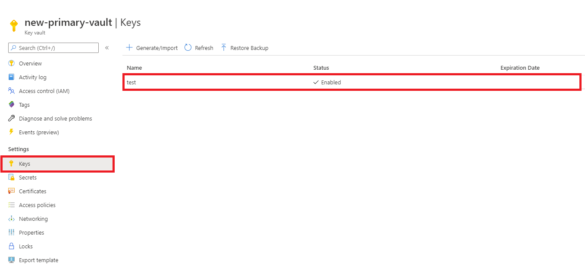
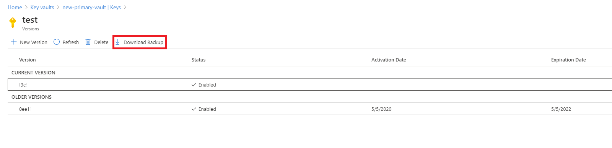

# Azure Key Vault backup and restore

This document shows you how to back up secrets, keys, and certificates stored in your key vault. A backup is intended to provide you with an offline copy of all your secrets in the unlikely event that you lose access to your key vault.

## Overview

Azure Key Vault automatically provides features to help you maintain availability and prevent data loss. Back up secrets only if you have a critical business justification. Backing up secrets in your key vault may introduce operational challenges such as maintaining multiple sets of logs, permissions, and backups when secrets expire or rotate.

Key Vault maintains availability in disaster scenarios and will automatically fail over requests to a paired region without any intervention from a user. For more information, see [Azure Key Vault availability and redundancy](./disaster-recovery-guidance.md).

If you want protection against accidental or malicious deletion of your secrets, configure soft-delete and purge protection features on your key vault. For more information, see [Azure Key Vault soft-delete overview](./soft-delete-overview.md).

## Limitations

> [!IMPORTANT]
> Key Vault does not support the ability to backup more than 500 past versions of a key, secret, or certificate object. Attempting to backup a key, secret, or certificate object may result in an error. It is not possible to delete previous versions of a key, secret, or certificate.

Key Vault doesn't currently provide a way to back up an entire key vault in a single operation. Any attempt to use the commands listed in this document to do an automated backup of a key vault may result in errors and won't be supported by Microsoft or the Azure Key Vault team. 

Also consider the following consequences:

* Backing up secrets that have multiple versions might cause time-out errors.
* A backup creates a point-in-time snapshot. Secrets might renew during a backup, causing a mismatch of encryption keys.
* If you exceed key vault service limits for requests per second, your key vault will be throttled, and the backup will fail.

## Design considerations

When you back up a key vault object, such as a secret, key, or certificate, the backup operation will download the object as an encrypted blob. This blob can't be decrypted outside of Azure. To get usable data from this blob, you must restore the blob into a key vault within the same Azure subscription and [Azure geography](https://azure.microsoft.com/global-infrastructure/geographies/).

## Prerequisites

To back up a key vault object, you must have: 

* Contributor-level or higher permissions on an Azure subscription.
* A primary key vault that contains the secrets you want to back up.
* A secondary key vault where secrets will be restored.

## Back up and restore from the Azure portal

Follow the steps in this section to back up and restore objects by using the Azure portal.

### Back up

1. Go to the Azure portal.
2. Select your key vault.
3. Go to the object (secret, key, or certificate) you want to back up.

    

4. Select the object.
5. Select **Download Backup**.

    
    
6. Select **Download**.

    
    
7. Store the encrypted blob in a secure location.

### Restore

1. Go to the Azure portal.
2. Select your key vault.
3. Go to the type of object (secret, key, or certificate) you want to restore.
4. Select **Restore Backup**.

    
    
5. Go to the location where you stored the encrypted blob.
6. Select **OK**.

## Back up and restore from the Azure CLI or Azure PowerShell

# [Azure CLI](#tab/azure-cli)
```azurecli
## Log in to Azure
az login

## Set your subscription
az account set --subscription {AZURE SUBSCRIPTION ID}

## Register Key Vault as a provider
az provider register -n Microsoft.KeyVault

## Back up a certificate in Key Vault
az keyvault certificate backup --file {File Path} --name {Certificate Name} --vault-name {Key Vault Name} --subscription {SUBSCRIPTION ID}

## Back up a key in Key Vault
az keyvault key backup --file {File Path} --name {Key Name} --vault-name {Key Vault Name} --subscription {SUBSCRIPTION ID}

## Back up a secret in Key Vault
az keyvault secret backup --file {File Path} --name {Secret Name} --vault-name {Key Vault Name} --subscription {SUBSCRIPTION ID}

## Restore a certificate in Key Vault
az keyvault certificate restore --file {File Path} --vault-name {Key Vault Name} --subscription {SUBSCRIPTION ID}

## Restore a key in Key Vault
az keyvault key restore --file {File Path} --vault-name {Key Vault Name} --subscription {SUBSCRIPTION ID}

## Restore a secret in Key Vault
az keyvault secret restore --file {File Path} --vault-name {Key Vault Name} --subscription {SUBSCRIPTION ID}
```
# [Azure PowerShell](#tab/powershell)

```azurepowershell
## Log in to Azure
Connect-AzAccount

## Set your subscription
Set-AzContext -Subscription '{AZURE SUBSCRIPTION ID}'

## Back up a certificate in Key Vault
Backup-AzKeyVaultCertificate -VaultName '{Key Vault Name}' -Name '{Certificate Name}'

## Back up a key in Key Vault
Backup-AzKeyVaultKey -VaultName '{Key Vault Name}' -Name '{Key Name}'

## Back up a secret in Key Vault
Backup-AzKeyVaultSecret -VaultName '{Key Vault Name}' -Name '{Secret Name}'

## Restore a certificate in Key Vault
Restore-AzKeyVaultCertificate -VaultName '{Key Vault Name}' -InputFile '{File Path}'

## Restore a key in Key Vault
Restore-AzKeyVaultKey -VaultName '{Key Vault Name}' -InputFile '{File Path}'

## Restore a secret in Key Vault
Restore-AzKeyVaultSecret -VaultName '{Key Vault Name}' -InputFile '{File Path}'
```
---

## Next steps


- [Move an Azure key vault across regions](move-region.md)
- [Enable Key Vault logging](howto-logging.md) for Key Vault
