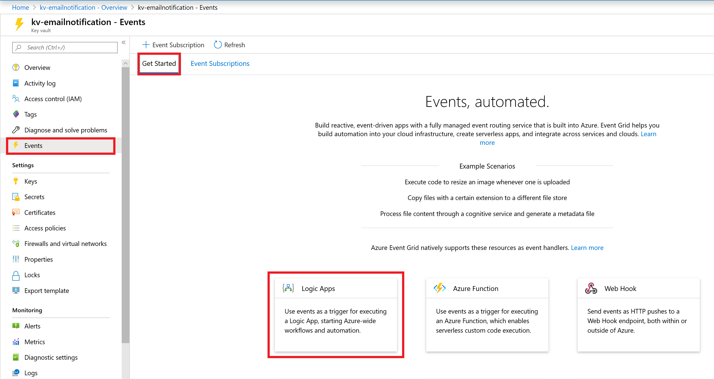
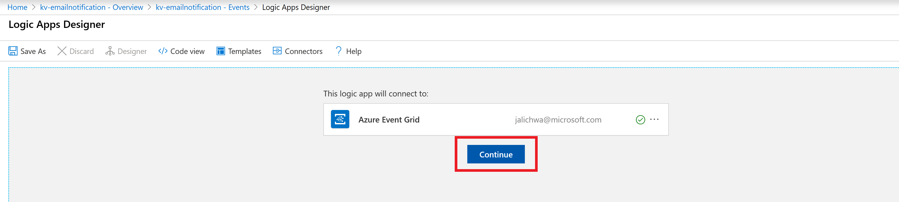
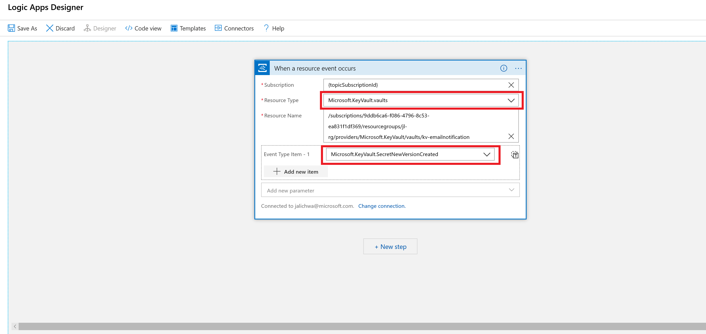
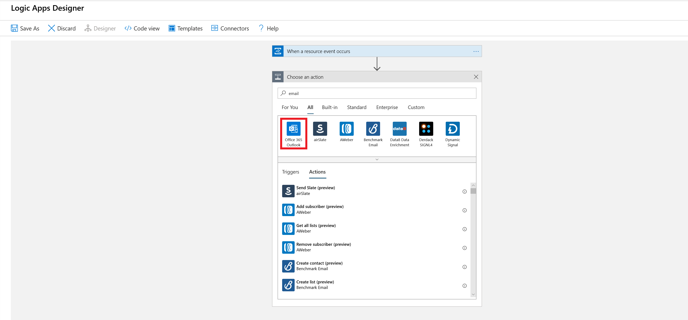
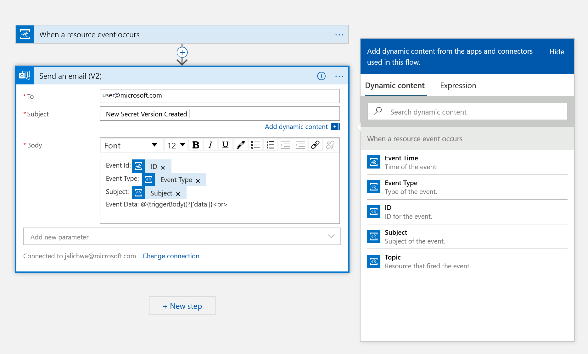
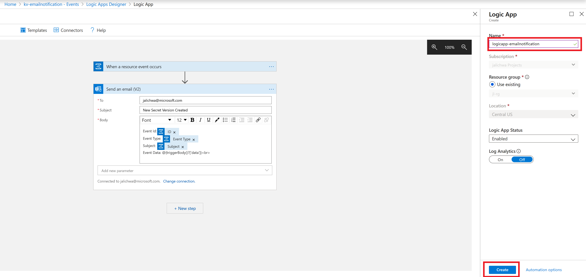
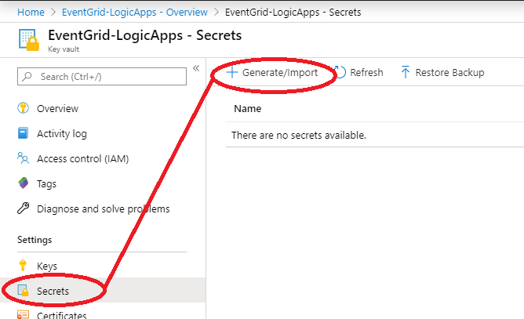

# Use Logic Apps to receive email about status changes of key vault secrets

In this guide you will learn how to respond to Azure Key Vault events that are received via [Azure Event Grid](../../event-grid/index.yml) by using [Azure Logic Apps](../../logic-apps/index.yml). By the end, you will have an Azure logic app set up to send a notification email every time a secret is created in Azure Key Vault.

For an overview of Azure Key Vault / Azure Event Grid integration, see [Monitoring Key Vault with Azure Event Grid (preview)](event-grid-overview.md).

## Prerequisites

- An email account from any email provider that is supported by Azure Logic Apps (such as Office 365 Outlook). This email account is used to send the event notifications. For a complete list of supported Logic App connectors, see the [Connectors overview](/connectors)
- An Azure subscription. If you don't have an Azure subscription, create a [free account](https://azure.microsoft.com/free/?WT.mc_id=A261C142F) before you begin.
- A key vault in your Azure Subscription. You can quickly create a new key vault by following the steps in [Set and retrieve a secret from Azure Key Vault using Azure CLI](../secrets/quick-create-cli.md).

## Create a Logic App via Event Grid

First, create Logic App with event grid handler and subscribe to Azure Key Vault "SecretNewVersionCreated" events.

To create an Azure Event Grid subscription, follow these steps:

1. In the Azure portal, go to your key vault, select **Events > Get Started** and click **Logic Apps**

    
    

1. On **Logic Apps Designer** validate the connection and click **Continue** 
 
    

1. On the **When a a resource event occurs** screen, do the following:
    - Leave **Subscription** and **Resource Name** as default.
    - Select **Microsoft.KeyVault.vaults** for the **Resource Type**.
    - Select **Microsoft.KeyVault.SecretNewVersionCreated** for **Event Type Item - 1**.

    

1. Select **+ New Step** This will open a window to Choose an action.
1. Search for **Email**. Based on your email provider, find and select the matching connector. This tutorial uses **Office 365 Outlook**. The steps for other email providers are similar.
1. Select the **Send an email (V2)** action.

   

1. Build your email template:
    - **To:** Enter the email address to receive the notification emails. For this tutorial, use an email account that you can access for testing.
    - **Subject** and **Body**: Write the text for your email. Select JSON properties from the selector tool to include dynamic content based on event data. You can retrieve the data of the event using `@{triggerBody()?['Data']}`.

    Your email template may look like this example.

    

8. Click **Save as**.
9. Enter a **name** for new logic app and click **Create**.
    
    

## Test and verify

1.  Go to your key vault on the Azure portal and select **Events > Event Subscriptions**.  Verify that a new subscription created
    
    

1.  Go to your key vault, select **Secrets**, and select **+ Generate/Import**. Create a new secret for testing purposes name the key and keep the remaining parameters in their default settings.

    

1. On the **Create a secret** screen provide any name, any value, and select **Create**.

When the secret is created, an email will be received at the configured addresses.

## Next steps

- Overview: [Monitoring Key Vault with Azure Event Grid (preview)](event-grid-overview.md)
- How to: [Route key vault notifications to Azure Automation](event-grid-tutorial.md).
- [Azure Event Grid event schema for Azure Key Vault (preview)](../../event-grid/event-schema-key-vault.md)
- Learn more about [Azure Event Grid](../../event-grid/index.yml).
- Learn more about the [Logic Apps feature of Azure App Service](../../logic-apps/index.yml).
