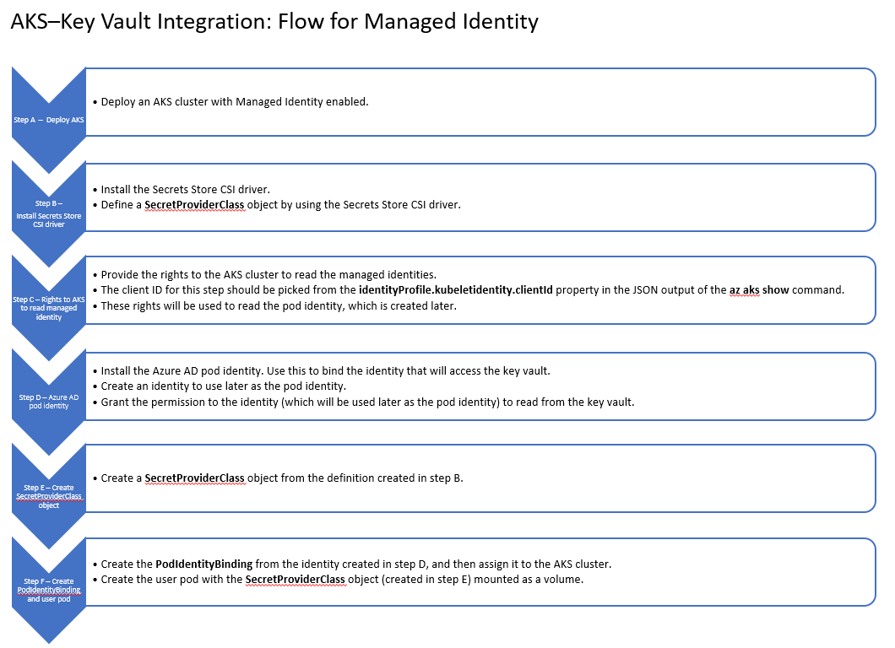

# Tutorial: Configure and run the Azure Key Vault provider for the Secrets Store CSI driver on Kubernetes

> [!IMPORTANT]
> Secrets Store CSI Driver is an open source project that is not supported by Azure technical support. Please report all feedback and issues related to CSI Driver Key Vault integration on the CSI driver [github](https://github.com/kubernetes-sigs/secrets-store-csi-driver). This tool is provided for users to self-install into clusters and gather feedback from our community.

In this tutorial, you access and retrieve secrets from your Azure key vault by using the Secrets Store Container Storage Interface (CSI) driver to mount the secrets into Kubernetes pods as a volume.

In this tutorial, you learn how to:

> [!div class="checklist"]
> * Use managed identities.
> * Deploy an Azure Kubernetes Service (AKS) cluster by using the Azure CLI.
> * Install Helm, the Secrets Store CSI driver and Azure Key Vault Provider for the CSI driver.
> * Create an Azure key vault and set your secrets.
> * Create your own SecretProviderClass object.
> * Deploy your pod with mounted secrets from your key vault.

## Prerequisites

* If you don't have an Azure subscription, create a [free account](https://azure.microsoft.com/free/?WT.mc_id=A261C142F) before you begin.

* Before you start this tutorial, install the [Azure CLI](/cli/azure/install-azure-cli-windows).

This tutorial assumes you're running Azure Kubernetes Service on Linux nodes.

## Use managed identities

This diagram illustrates the AKS–Key Vault integration flow for Managed Identity:



## Deploy an Azure Kubernetes Service (AKS) cluster by using the Azure CLI

You don't need to use Azure Cloud Shell. Your command prompt (terminal) with the Azure CLI installed will suffice. 

Complete the "Create a resource group," "Create AKS cluster," and "Connect to the cluster" sections in [Deploy an Azure Kubernetes Service cluster by using the Azure CLI](../../aks/kubernetes-walkthrough.md). 

> [!NOTE] 
> If you plan to use pod identity, the recommended network plugin is `azure`. Refer to [doc](https://azure.github.io/aad-pod-identity/docs/configure/aad_pod_identity_on_kubenet/) for more details. Create the Kubernetes cluster, as shown in the following command:
>
> ```azurecli
> az aks create -n contosoAKSCluster -g contosoResourceGroup --kubernetes-version 1.16.9 --node-count 1 --enable-managed-identity
> ```

1. [Set your PATH environment variable](https://www.java.com/en/download/help/path.xml) to the *kubectl.exe* file that you downloaded.
2. Check your Kubernetes version by using the following command, which outputs the client and server version. The client version is the *kubectl.exe* file that you installed, and the server version is the Azure Kubernetes Services (AKS) that your cluster is running on.
    ```azurecli
    kubectl version
    ```
3. Ensure that your Kubernetes version is 1.16.0 or later. For windows clusters, ensure your Kubernetes version is 1.18.0 or later. The following command upgrades both the Kubernetes cluster and the node pool. The command might take a couple of minutes to execute. In this example, the resource group is *contosoResourceGroup*, and the Kubernetes cluster is *contosoAKSCluster*.
    ```azurecli
    az aks upgrade --kubernetes-version 1.16.9 --name contosoAKSCluster --resource-group contosoResourceGroup
    ```
4. To display the metadata of the AKS cluster that you've created, use the following command. Copy the **principalId**, **clientId**, **subscriptionId**, and **nodeResourceGroup** for later use. If the AKS cluster was not created with managed identities enabled, the **principalId** and **clientId** will be null. 

    ```azurecli
    az aks show --name contosoAKSCluster --resource-group contosoResourceGroup
    ```

    The output shows both parameters highlighted:
    
    
    
    
## Install Helm and the Secrets Store CSI driver
> [!NOTE]
> Below installation works only on AKS on Linux. For more information about Secrets Store CSI driver installation, see [Azure Key Vault Provider for Secrets Store CSI Driver](https://azure.github.io/secrets-store-csi-driver-provider-azure/getting-started/installation/) 

To install the Secrets Store CSI driver and Azure Key Vault provider, you first need to install [Helm](https://helm.sh/docs/intro/install/).

With the [Secrets Store CSI](https://azure.github.io/secrets-store-csi-driver-provider-azure/) driver interface, you can get the secrets that are stored in your Azure Key Vault instance and then use the driver interface to mount the secret contents into Kubernetes pods.

1. Check to ensure that the Helm version is v3 or later:
    ```azurecli
    helm version
    ```
1. Install the Secrets Store CSI driver and the Azure Key Vault provider for the driver:
    ```azurecli
    helm repo add csi-secrets-store-provider-azure https://raw.githubusercontent.com/Azure/secrets-store-csi-driver-provider-azure/master/charts

    helm install csi-secrets-store-provider-azure/csi-secrets-store-provider-azure --generate-name
    ```
> [!NOTE] 
> If you plan to use the Secrets Store CSI Driver and Azure Key Vault provider on windows nodes, enable the driver and provider on windows nodes using the [helm configuration values](https://github.com/Azure/secrets-store-csi-driver-provider-azure/tree/master/charts/csi-secrets-store-provider-azure#configuration)

## Create an Azure key vault and set your secrets

To create your own key vault and set your secrets, follow the instructions in [Set and retrieve a secret from Azure Key Vault by using the Azure CLI](../secrets/quick-create-cli.md).

> [!NOTE] 
> You don't need to use Azure Cloud Shell or create a new resource group. You can use the resource group that you created earlier for the Kubernetes cluster.

## Create your own SecretProviderClass object

To create your own custom SecretProviderClass object with provider-specific parameters for the Secrets Store CSI driver, [use this template](https://github.com/Azure/secrets-store-csi-driver-provider-azure/blob/master/examples/service-principal/v1alpha1_secretproviderclass_service_principal.yaml). This object will provide identity access to your key vault.

In the sample SecretProviderClass YAML file, fill in the missing parameters. The following parameters are required:

* **keyvaultName**: The name of your key vault
* **objects**: list of all the secret contents you want to mount
    * **objectName**: The name of the secret content
    * **objectType**: The object type (secret, key, certificate)
* **tenantID**: The tenant ID, or directory ID, of your key vault

Documentation of all required fields and supported configurations is available here: [Link](https://azure.github.io/secrets-store-csi-driver-provider-azure/getting-started/usage/#create-your-own-secretproviderclass-object)

The updated template is shown in the following code. Download it as a YAML file, and fill in the required fields. In this example, the key vault is **contosoKeyVault5**. It has two secrets, **secret1** and **secret2**.

> [!NOTE] 
> If you're using pod identities, set the **usePodIdentity** value as *true*, and set the **userAssignedIdentityID** value as a pair of quotation marks (**""**). 
> If you're using managed identities, set the **useVMManagedIdentity** value as *true*, and set the **userAssignedIdentityID** value as clientID of user-assigned identity.

```yaml
apiVersion: secrets-store.csi.x-k8s.io/v1alpha1
kind: SecretProviderClass
metadata:
  name: azure-kvname
spec:
  provider: azure
  parameters:
    usePodIdentity: "false"                                                 # [OPTIONAL] if not provided, will default to "false". Set to "true" if using pod identities.
    useVMManagedIdentity: "false"                                           # [OPTIONAL] if not provided, will default to "false". Set to "true" if using managed identities.
    userAssignedIdentityID: "<clientID of user-assigned managed identity"   # [OPTIONAL] If you're using managed identities, use the client id to specify which user-assigned managed identity to use. If the value is empty, it defaults to use the system-assigned identity on the VM
    keyvaultName: "contosoKeyVault5"                                        # [REQUIRED] the name of the key vault
                                                                            #     az keyvault show --name contosoKeyVault5
                                                                            #     the preceding command will display the key vault metadata, which includes the subscription ID, resource group name, key vault 
    cloudName: ""                                                           # [OPTIONAL] if not provided, Azure environment will default to AzurePublicCloud
    objects:  |
      array:
        - |
          objectName: secret1                                               # [REQUIRED] object name
                                                                            #     az keyvault secret list --vault-name "contosoKeyVault5"
                                                                            #     the above command will display a list of secret names from your key vault
          objectType: secret                                                # [REQUIRED] object types: secret, key, or cert
          objectVersion: ""                                                 # [OPTIONAL] object versions, default to latest if empty
        - |
          objectName: secret2
          objectType: secret
          objectVersion: ""
    tenantId: "tenantID"                                                    # [REQUIRED] the tenant ID of the key vault
```
The following image shows the console output for **az keyvault show --name contosoKeyVault5** with the relevant highlighted metadata:


## Install Azure Active Directory (Azure AD) Pod Identity

1. Assign specific roles to the AKS cluster you've created. 

    Documentation for all required role assignments with Azure Active Directory (Azure AD) pod identity are available here: [Link](https://azure.github.io/aad-pod-identity/docs/getting-started/role-assignment/)

    ```azurecli
    VAULT_RESOURCE_GROUP=contosoResourceGroup
    NODE_RESOURCE_GROUP=contosoResourceGroup
    
    az role assignment create --role "Managed Identity Operator" --assignee $clientId --scope /subscriptions/<SUBID>/resourcegroups/$VAULT_RESOURCE_GROUP
    
    az role assignment create --role "Managed Identity Operator" --assignee $clientId --scope /subscriptions/<SUBID>/resourcegroups/$NODE_RESOURCE_GROUP
    
    az role assignment create --role "Virtual Machine Contributor" --assignee $clientId --scope /subscriptions/<SUBID>/resourcegroups/$NODE_RESOURCE_GROUP
    ```

2. Install the Azure Active Directory (Azure AD) identity into AKS.

    > [!NOTE] 
    > If using an AKS cluster with kubenet network plugin, review this [doc](https://azure.github.io/aad-pod-identity/docs/configure/aad_pod_identity_on_kubenet/) on how to deploy pod identity in the cluster.

    ```azurecli
    helm repo add aad-pod-identity https://raw.githubusercontent.com/Azure/aad-pod-identity/master/charts

    helm install pod-identity aad-pod-identity/aad-pod-identity
    ```

3. Create an User-Assigned managed identity. In the output, copy the **clientId** for later use.
    ```azurecli
    az identity create -g $resourceGroupName -n $identityName
    ```

4. Grant the identity permissions to get secrets from your key vault. Use the **clientId** from the User-assigned managed identity.
    ```azurecli
    az keyvault set-policy -n contosoKeyVault5 --secret-permissions get --spn $clientId
    az keyvault set-policy -n contosoKeyVault5 --key-permissions get --spn $clientId
    az keyvault set-policy -n contosoKeyVault5 --certificate-permissions get --spn $clientId
    ```

## Deploy your pod with mounted secrets from your key vault

To configure your SecretProviderClass object, run the following command:
```azurecli
kubectl apply -f secretProviderClass.yaml
```

### Use managed identities

If you're using pod identities, create an *AzureIdentity* in your cluster that references the identity that you created earlier. Then, create an *AzureIdentityBinding* that references the AzureIdentity you created. Fill out the parameters in the following template, and then save it as *podIdentityAndBinding.yaml*.  

```yml
apiVersion: aadpodidentity.k8s.io/v1
kind: AzureIdentity
metadata:
    name: azureIdentityName                 # The name of your Azure identity
spec:
    type: 0                                 # Set type: 0 for managed identity
    resourceID: /subscriptions/<SUBID>/resourcegroups/<RESOURCEGROUP>/providers/Microsoft.ManagedIdentity/userAssignedIdentities/<AZUREIDENTITYNAME>
    clientID: "<managed identity clientID>"   # The clientId of the User-assigned managed identity that you created earlier
---
apiVersion: aadpodidentity.k8s.io/v1
kind: AzureIdentityBinding
metadata:
    name: azure-pod-identity-binding
spec:
    azureIdentity: "azureIdentityName"      # The name of your Azure identity
    selector: azure-pod-identity-binding-selector
```
    
Run the following command to configure the binding:

```azurecli
kubectl apply -f podIdentityAndBinding.yaml
```

Next, you deploy the pod. The following code is the deployment YAML file, which uses the pod identity binding from the preceding step. Save this file as *podBindingDeployment.yaml*.

```yml
apiVersion: v1
kind: Pod
metadata:
  name: nginx-secrets-store-inline
  labels:
    aadpodidbinding: azure-pod-identity-binding-selector # The selector defined in AzureIdentityBinding in the previous step
spec:
  containers:
    - name: nginx
      image: nginx
      volumeMounts:
        - name: secrets-store-inline
          mountPath: "/mnt/secrets-store"
          readOnly: true
  volumes:
    - name: secrets-store-inline
      csi:
        driver: secrets-store.csi.k8s.io
        readOnly: true
        volumeAttributes:
          secretProviderClass: azure-kvname
```

Run the following command to deploy your pod:

```azurecli
kubectl apply -f podBindingDeployment.yaml
```

### Check the pod status and secret content 

To display the pods that you've deployed, run the following command:
```azurecli
kubectl get pods
```

To check the status of your pod, run the following command:
```azurecli
kubectl describe pod/nginx-secrets-store-inline
```


In the output window, the deployed pod should be in the *Running* state. In the **Events** section at the bottom, all event types are displayed as *Normal*.

After you've verified that the pod is running, you can verify that the pod contains the secrets from your key vault.

To display all the secrets that are contained in the pod, run the following command:
```azurecli
kubectl exec nginx-secrets-store-inline -- ls /mnt/secrets-store/
```

To display the contents of a specific secret, run the following command:
```azurecli
kubectl exec nginx-secrets-store-inline -- cat /mnt/secrets-store/secret1
```

Verify that the contents of the secret are displayed.

## Resources
- [About Azure Key Vault](overview.md)
- [Azure Key Vault developer's guide](developers-guide.md)
- [CSI Secrets Driver](https://azure.github.io/secrets-store-csi-driver-provider-azure/)

