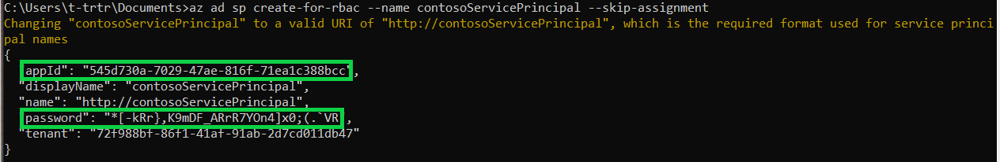
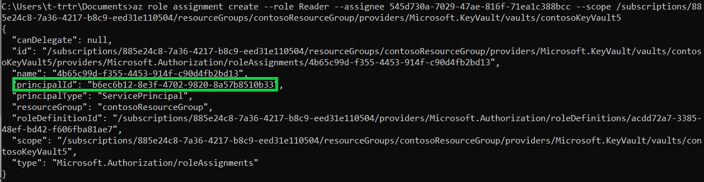
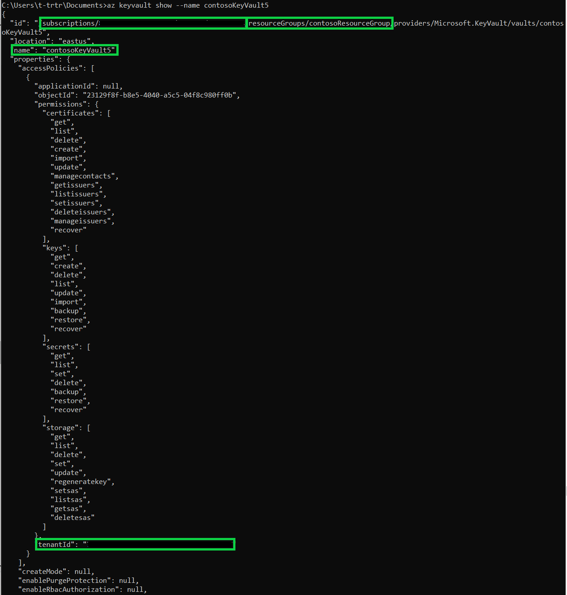
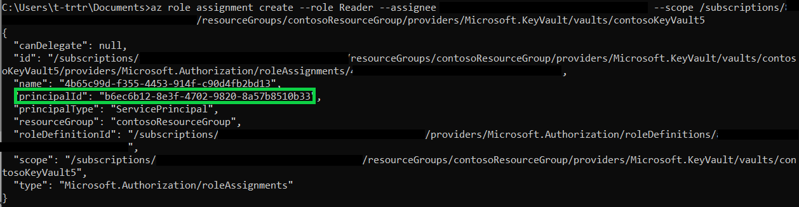
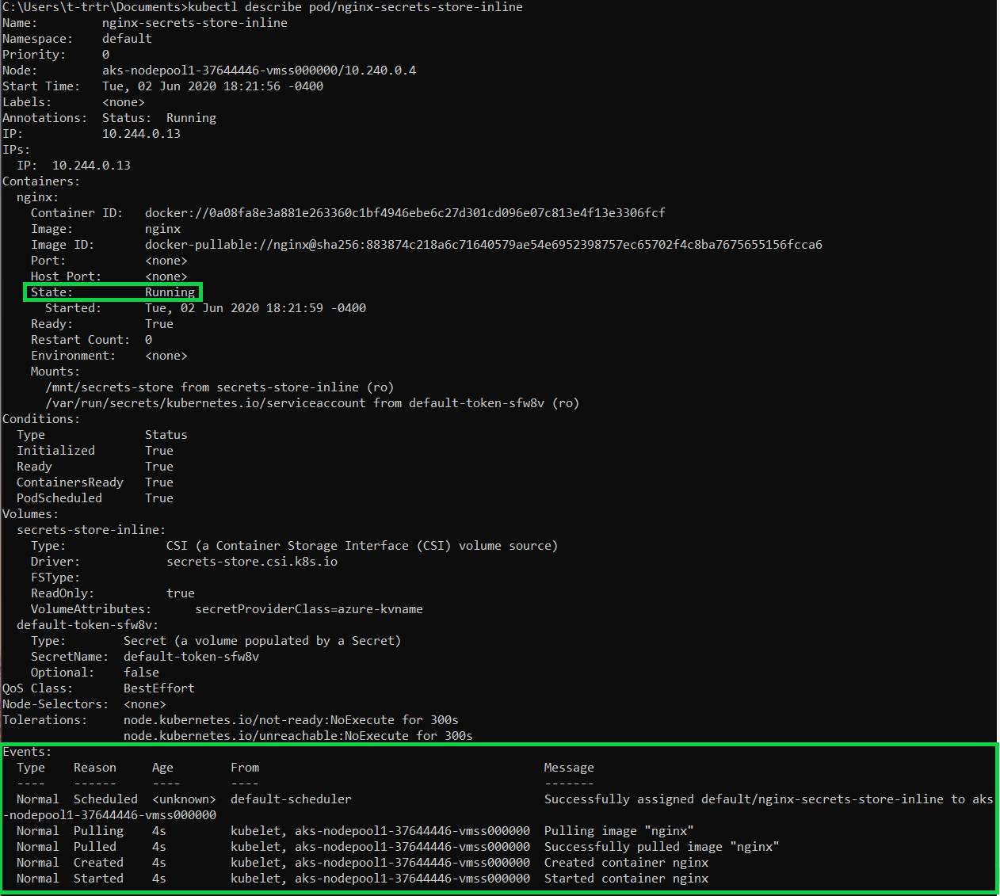

# Tutorial: Configure and run the Azure Key Vault provider for Secret Store CSI driver on Kubernetes

In this tutorial, you'll access and retrieve secrets from Azure Key Vault using the Secrets Store CSI (Container Storage Interface) driver to then mount into Kubernetes pods.

In this tutorial, you learn how to:

> [!div class="checklist"]
> * Create a service principal or use managed identities
> * Deploy an Azure Kubernetes Service cluster using Azure CLI
> * Install Helm and Secrets Store CSI Driver
> * Create an Azure Key Vault and set secrets
> * Create your own SecretProviderClass Object
> * Assign your service principal or use managed identities
> * Deploy your pod with mounted secrets from Key Vault

## Prerequisites

If you don't have an Azure subscription, create a [free account](https://azure.microsoft.com/free/?WT.mc_id=A261C142F) before you begin.

Before you start this tutorial, install the [Azure CLI](https://docs.microsoft.com/cli/azure/install-azure-cli-windows?view=azure-cli-latest).

## Create a service principal or use managed identities

If you plan to use managed identities, you can move on to the next section.

Create a service principal to control what resources can be accessed from your Azure Key Vault. This service principal's access is restricted by the roles assigned to it. This feature gives you control over how the service principal can manage your secrets. In the example below, the name of the service principal is **contosoServicePrincipal**.

```azurecli
az ad sp create-for-rbac --name contosoServicePrincipal --skip-assignment
```
This operation returns a series of key/values pairs:



Copy down the **appID** and **password**. You'll need these credentials later.


## Deploy an Azure Kubernetes Service cluster using Azure CLI

You don't need to use Azure Cloud Shell, your Command Prompt (Terminal) with Azure CLI installed will do. 

Follow this [guide](https://docs.microsoft.com/azure/aks/kubernetes-walkthrough) and complete the following sections: **Create a resource group**, **Create AKS cluster**, and **Connect to the cluster**.

**Note:** If you plan to use pod identity instead of a service principal. Make sure to enable it when creating the Kubernetes cluster, as shown below:

```azurecli
az aks create -n contosoAKSCluster -g contosoResourceGroup --kubernetes-version 1.16.9 --node-count 1 --enable-managed-identity
```

1. [Set your PATH environment variable](https://www.java.com/en/download/help/path.xml) to the “kubectl.exe” file that was downloaded.
1. Check your Kubernetes version using the command below. This command will output the client and server version. The client version is the "kubectl.exe" you installed while the server version is the Azure Kubernetes Services that your cluster is running on.
    ```azurecli
    kubectl version
    ```
1. Ensure that your Kubernetes version is either **v1.16.0** or greater. This command will upgrade both the Kubernetes cluster and the node pool. It may take a couple minutes to execute. In this example, the resource group is **contosoResourceGroup** and the Kubernetes cluster is **contosoAKSCluster**.
    ```azurecli
    az aks upgrade --kubernetes-version 1.16.9 --name contosoAKSCluster --resource-group contosoResourceGroup
    ```
1. Display the metadata of the AKS cluster you've created using the command below. Copy down the **principalId**, **clientId**, **subscriptionId**, and **nodeResourceGroup**.
    ```azurecli
    az aks show --name contosoAKSCluster --resource-group contosoResourceGroup
    ```

    This is the output with both parameters highlighted.
    
    
    
    
## Install Helm and Secrets Store CSI Driver

You'll need to install [Helm](https://helm.sh/docs/intro/install/) to install the Secrets Store CSI driver.

The [Secrets Store CSI](https://github.com/Azure/secrets-store-csi-driver-provider-azure/blob/master/charts/csi-secrets-store-provider-azure/README.md) driver interface allows you to get secret content(s) stored in an Azure Key Vault instance and use the driver interface to mount those secret content(s) into Kubernetes pods.

1. Check the Helm version and ensure that it's v3 or greater:
    ```azurecli
    helm version
    ```
1. Install the Secrets Store CSI driver and the Azure Key Vault provider for the driver:
    ```azurecli
    helm repo add csi-secrets-store-provider-azure https://raw.githubusercontent.com/Azure/secrets-store-csi-driver-provider-azure/master/charts

    helm install csi-secrets-store-provider-azure/csi-secrets-store-provider-azure --generate-name
    ```

## Create an Azure Key Vault and set secrets

Follow this [guide](https://docs.microsoft.com/azure/key-vault/secrets/quick-create-cli) to create your own Key Vault and set your secrets.

**Note:** You don't need to use the Azure Cloud Shell or create a new resource group. Using the resource group created earlier for the Kubernetes cluster is fine.

## Create your own SecretProviderClass Object

Use this [template](https://github.com/Azure/secrets-store-csi-driver-provider-azure/blob/master/examples/v1alpha1_secretproviderclass.yaml) provided to create your own custom SecretProviderClass Object to provide provider-specific parameters for the Secrets Store CSI driver. This object will provide identity access to your Key Vault.

Using the sample SecretProviderClass YAML file provided. You're going to fill in the missing parameters. The following parameters are required:

1.	**userAssignedIdentityID:** Client ID of Service Principal
1.	**keyvaultName:** Name of Key Vault
1.	**objects:** This object will contain all of the secret content you want to mount
    1.	**objectName:** Name of secret content
    1.	**objectType:** Object type (secret, key, certificate)
1.	**resourceGroup:** Name of resource group
1.	**subscriptionId:** Subscription ID of the Key Vault
1.	**tenantID:** Tenant ID (that is, Directory ID) of the Key Vault

Below is the updated template, download it as a .yaml file and fill in the corresponding required fields. In this example, the Key Vault is **contosoKeyVault5** and has two secrets, **secret1** and **secret2**.

**Note:** If you are using managed identities, the field **usePodIdentity** needs to be **true** and leave the field **userAssignedIdentityID** with just quotes **""**. 

```yaml
apiVersion: secrets-store.csi.x-k8s.io/v1alpha1
kind: SecretProviderClass
metadata:
  name: azure-kvname
spec:
  provider: azure
  parameters:
    usePodIdentity: "false"         		  # [REQUIRED] Set to "true" if using managed identities
    useVMManagedIdentity: "false"             # [OPTIONAL] if not provided, will default to "false"
    userAssignedIdentityID: "servicePrincipalClientID"       # [REQUIRED] If using a Service Principal, use the client id to specify which user assigned managed identity to use. If using a user assigned identity as the VM's managed identity, then specify the identity's client id. If empty, then defaults to use the system assigned identity on the VM
                                                             #     az ad sp show --id http://contosoServicePrincipal --query appId -o tsv
                                                             #     the above command will return the Client ID of your service principal
    keyvaultName: "contosoKeyVault5"          # [REQUIRED] the name of the Key Vault
                                              #     az keyvault show --name contosoKeyVault5
                                              #     the above command will displays the Key Vault metadata, which includes the subscription ID, resource group name, Key Vault 
    cloudName: ""          			          # [OPTIONAL for Azure] if not provided, azure environment will default to AzurePublicCloud
    objects:  |
      array:
        - |
          objectName: secret1                 # [REQUIRED] object name
                                              #     az keyvault secret list --vault-name “contosoKeyVault5”
                                              #     the above command will display a list of secret names from your Key Vault
          objectType: secret                  # [REQUIRED] object types: secret, key or cert
          objectVersion: ""                   # [OPTIONAL] object versions, default to latest if empty
        - |
          objectName: secret2
          objectType: secret
          objectVersion: ""
    resourceGroup: "contosoResourceGroup"     # [REQUIRED] the resource group name of the Key Vault
    subscriptionId: "subscriptionID"          # [REQUIRED] the subscription ID of the Key Vault
    tenantId: "tenantID"                      # [REQUIRED] the tenant ID of the Key Vault
```
Below is the console output for "az keyvault show --name contosoKeyVault5" with the relevant highlighted metadata:



## Assign your service principal or use managed identities

### Using Service Principal

If using a service principal. You'll need to give permission to your service principal to access your Key Vault and retrieve secrets. Assign the **"Reader"** role and give the service principal permission to **"get"** secrets from your Key Vault by completing the steps below:

1. Assign service principal to existing Key Vault. The **$AZURE_CLIENT_ID** parameter is the **appId** you copied down after you created your service principal.
    ```azurecli
    az role assignment create --role Reader --assignee $AZURE_CLIENT_ID --scope /subscriptions/$SUBID/resourcegroups/$KEYVAULT_RESOURCE_GROUP/providers/Microsoft.KeyVault/vaults/$KEYVAULT_NAME
    ```

    Below is the output of the command: 

    

1. Give service principal permission to get secrets:
    ```azurecli
    az keyvault set-policy -n $KEYVAULT_NAME --secret-permissions get --spn $AZURE_CLIENT_ID
    ```

1. Now that you've configured your Service Principal to have permission to read secrets from your Key Vault. The **$AZURE_CLIENT_SECRET** is the **password** of your service principal. Add your service principal credentials as a Kubernetes secret accessible by the Secrets Store CSI driver:
    ```azurecli
    kubectl create secret generic secrets-store-creds --from-literal clientid=$AZURE_CLIENT_ID --from-literal clientsecret=$AZURE_CLIENT_SECRET
    ```

**Note:** If you receive an error later on when deploying the Kubernetes pod about an invalid Client Secret ID. You may have an older Client Secret ID that was expired or reset. To resolve this issue, delete your secrets “secrets-store-creds” and create a new one with the current Client Secret ID. Run the command below to delete your “secrets-store-creds”:
```azurecli
kubectl delete secrets secrets-store-creds
```

If you forgot your service principal's Client Secret ID, you can reset it using the following command:

```azurecli
az ad sp credential reset --name contosoServicePrincipal --credential-description "APClientSecret" --query password -o tsv
```

### Using Managed Identities

If using managed identities, assign specific roles to the AKS cluster you've created. 
1. To create/list/read a user-assigned managed identity, your AKS cluster needs to be assigned the [Managed Identity Contributor](https://docs.microsoft.com/azure/role-based-access-control/built-in-roles#managed-identity-contributor) role. Make sure the **$clientId** is of the Kubernetes cluster's.

    ```azurecli
    az role assignment create --role "Managed Identity Contributor" --assignee $clientId --scope /subscriptions/$SUBID/resourcegroups/$NODE_RESOURCE_GROUP
    
    az role assignment create --role "Virtual Machine Contributor" --assignee $clientId --scope /subscriptions/$SUBID/resourcegroups/$NODE_RESOURCE_GROUP
    ```

1. Install the Azure Active Directory (AAD) Identity into AKS.
    ```azurecli
    helm repo add aad-pod-identity https://raw.githubusercontent.com/Azure/aad-pod-identity/master/charts

    helm install pod-identity aad-pod-identity/aad-pod-identity
    ```

1. Create an AAD identity. Copy down the **clientId** and **principalId**.
    ```azurecli
    az identity create -g $resourceGroupName -n $identityName
    ```

1. Assign the reader role to the AAD Identity you've just created for your Key Vault. Then give the Identity permission to get secrets from your Key Vault. You're going to use the **clientId** and **principalId** from the Azure Identity you just created.
    ```azurecli
    az role assignment create --role "Reader" --assignee $principalId --scope /subscriptions/XXXXXXXX-XXXX-XXXX-XXXX-XXXXXXXXXXXX/resourceGroups/contosoResourceGroup/providers/Microsoft.KeyVault/vaults/contosoKeyVault5

    az keyvault set-policy -n contosoKeyVault5 --secret-permissions get --spn $clientId
    ```

## Deploy your pod with mounted secrets from Key Vault

The command below will configure your SecretProviderClass object:
```azurecli
kubectl apply -f secretProviderClass.yaml
```

### Using Service Principal

If using a service principal. The command below will deploy your Kubernetes pods with the SecretProviderClass and the secrets-store-creds that you configured. Here is the template for [linux](https://github.com/Azure/secrets-store-csi-driver-provider-azure/blob/master/examples/nginx-pod-secrets-store-inline-volume-secretproviderclass.yaml) and [windows](https://github.com/Azure/secrets-store-csi-driver-provider-azure/blob/master/examples/windows-pod-secrets-store-inline-volume-secret-providerclass.yaml) deployment.
```azurecli
kubectl apply -f updateDeployment.yaml
```

### Using Managed Identities

If using managed identities. You'll create an **AzureIdentity** in your cluster that will reference the identity you've created earlier. Then, create an **AzureIdentityBinding** that will reference the **AzureIdentity** you created. Use the template below, fill out the corresponding parameters, and save it as **podIdentityAndBinding.yaml**.  
```yml
apiVersion: aadpodidentity.k8s.io/v1
kind: AzureIdentity
metadata:
    name: "azureIdentityName"               # The name of your Azure Idenity
spec:
    type: 0                                 # Set type: 0 for Managed Service Identity
    resourceID: /subscriptions/<SUBID>/resourcegroups/<RESOURCEGROUP>/providers/Microsoft.ManagedIdentity/userAssignedIdentities/<AZUREIDENTITYNAME>
    clientID: "managedIdentityClientId"     # The clientId of your Azure Identity that you created earlier
---
apiVersion: aadpodidentity.k8s.io/v1
kind: AzureIdentityBinding
metadata:
    name: azure-pod-identity-binding
spec:
    azureIdentity: "azureIdentityName"      # The name of your Azure Idenity
    selector: azure-pod-identity-binding-selector
```
    
Run the following command to execute the binding:

```azurecli
kubectl apply -f podIdentityAndBinding.yaml
```

Next is the actual deployment of the pod. Below is the deployment YAML file which will use the pod identity binding from the last step. Save this file as **podBindingDeployment.yaml**.

```yml
kind: Pod
apiVersion: v1
metadata:
    name: nginx-secrets-store-inline
    labels:
    aadpodidbinding: azure-pod-identity-binding-selector
spec:
    containers:
    - name: nginx
        image: nginx
        volumeMounts:
        - name: secrets-store-inline
        mountPath: "/mnt/secrets-store"
        readOnly: true
    volumes:
    - name: secrets-store-inline
        csi:
        driver: secrets-store.csi.k8s.io
        readOnly: true
        volumeAttributes:
            secretProviderClass: azure-kvname
```

Run the following command to deploy your pod:

```azurecli
kubectl apply -f podBindingDeployment.yaml
```
### Check status and secret content 
To display the pods that you've deployed:
```azurecli
kubectl get pods
```

To check the status of your pod, use the following command:
```azurecli
kubectl describe pod/nginx-secrets-store-inline
```



The deployed pod should be in the “Running” state. In the “Events” section at the bottom, all the types of events to the left are classified as “Normal.”
Once you've verified the pod is running, you can verify your pod has the secrets from your Key Vault.

To display all the secrets that the pod has:
```azurecli
kubectl exec -it nginx-secrets-store-inline -- ls /mnt/secrets-store/
```

To get content out of a specific secret:
```azurecli
kubectl exec -it nginx-secrets-store-inline -- cat /mnt/secrets-store/secret1
```

Verify the content of the secret displayed.

## Next steps

Make sure your Key Vault is recoverable:
> [!div class="nextstepaction"]
> [Turn on soft delete](https://docs.microsoft.com/azure/key-vault/general/soft-delete-clid)
