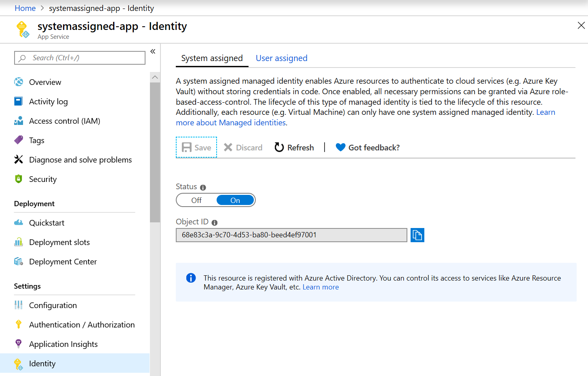
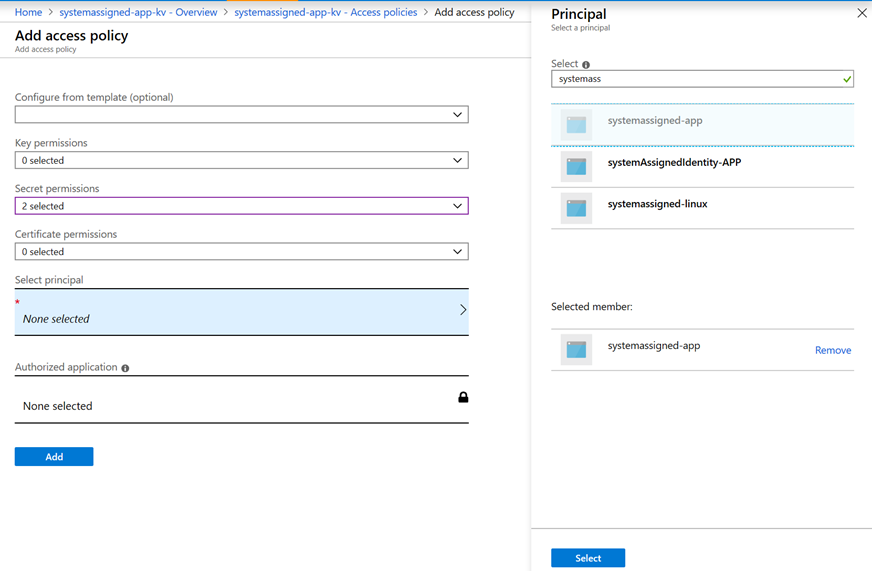

# Provide Key Vault authentication with a managed identity

A managed identity from Azure Active Directory allows your app to easily access other Azure AD-protected resources. The identity is managed by the Azure platform and does not require you to provision or rotate any secrets. For more information, see [Managed identities for Azure resources](../../active-directory/managed-identities-azure-resources/overview.md). 

This article shows you how to create a managed identity for an App Service application and use it to access Azure Key Vault. For applications hosted in Azure VMs, see [Use a Windows VM system-assigned managed identity to access Azure Key Vault](../../active-directory/managed-identities-azure-resources/tutorial-windows-vm-access-nonaad.md).


[!INCLUDE [cloud-shell-try-it.md](../../../includes/cloud-shell-try-it.md)]

## Prerequisites 

To complete this guide, you must have the following resources. 

- A key vault. You can use an existing key vault, or create a new one by following the steps in one of these quickstarts:
   - [Create a key vault with the Azure CLI](../secrets/quick-create-cli.md)
   - [Create a key vault with Azure PowerShell](../secrets/quick-create-powershell.md)
   - [Create a key vault with the Azure portal](../secrets/quick-create-portal.md).
- An existing App Service application to which to grant key vault access. You can quickly create one by following the steps in the [App Service documentation](../../app-service/overview.md).
- [Azure CLI](/cli/azure/install-azure-cli?view=azure-cli-latest) or [Azure PowerShell](/powershell/azure/overview). Alternatively, you can use the [Azure portal](https://portal.azure.com).


## Adding a system-assigned identity 

First, you must add a system-assigned identity to an application. 
 
### Azure portal 

To set up a managed identity in the portal, you will first create an application as normal and then enable the feature. 

1. If using a function app, navigate to **Platform features**. For other app types, scroll down to the **Settings** group in the left navigation. 

1. Select **Managed identity**. 

1. Within the **System assigned** tab, switch **Status** to **On**. Click **Save**. 

	

### Azure CLI

This quickstart requires the Azure CLI version 2.0.4 or later. Run `az --version` to find your current version. If you need to install or upgrade, see [Install the Azure CLI](/cli/azure/install-azure-cli?view=azure-cli-latest). 

To sign in with Azure CLI, use the [az login](/cli/azure/reference-index?view=azure-cli-latest#az-login) command:

```azurecli-interactive
az login
```

For more information on login options with the Azure CLI, see [Sign in with Azure CLI](/cli/azure/authenticate-azure-cli?view=azure-cli-latest). 

To create the identity for this application, use the Azure CLI [az webapp identity assign](/cli/azure/webapp/identity?view=azure-cli-latest#az-webapp-identity-assign) command or [az functionapp identity assign](/cli/azure/functionapp/identity?view=azure-cli-latest#az-functionapp-identity-assign) command:


```azurecli-interactive
az webapp identity assign --name myApp --resource-group myResourceGroup
```

```azurecli-interactive
az functionapp identity assign --name myApp --resource-group myResourceGroup
```

Make a note of the `PrincipalId`, which will be needed in next section.

```json
{
  "principalId": "xxxxxxxx-xxxx-xxxx-xxxx-xxxxxxxxxxxx",
  "tenantId": "xxxxxxxx-xxxx-xxxx-xxxx-xxxxxxxxxxxx",
  "type": "SystemAssigned"
}
```
## Grant your app access to Key Vault 

### Azure portal

1.	Navigate to Key Vault resource. 

1.	Select **Access policies** and click **Add Access Policy**. 

1.	In **Secret permissions**, select **Get, List**. 

1.	Choose **Select Principal**, and in the search field enter the name of the app.  Select the app in the result list and click **Select**. 

1.	Click **Add** to finish adding the new access policy.

	

### Azure CLI

To grant your application access to your key vault, use the Azure CLI [az keyvault set-policy](/cli/azure/keyvault?view=azure-cli-latest#az-keyvault-set-policy) command, supplying the **ObjectId** parameter with the **principalId** you noted above.

```azurecli-interactive
az keyvault set-policy --name myKeyVault --object-id <PrincipalId> --secret-permissions get list 
```

## Next steps

- [Azure Key Vault security: Identity and access management](overview-security.md#identity-and-access-management)
- [Provide Key Vault authentication with an access control policy](group-permissions-for-apps.md)
- [Secure your key vault](secure-your-key-vault.md)).
- [Azure Key Vault developer's guide](developers-guide.md)
- Review [Azure Key Vault best practices](best-practices.md)