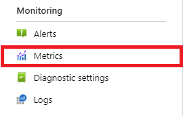
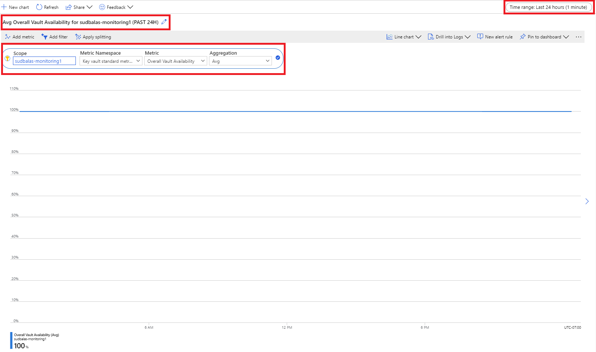
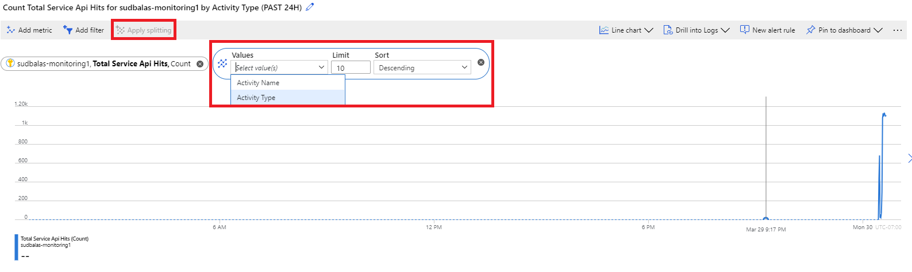
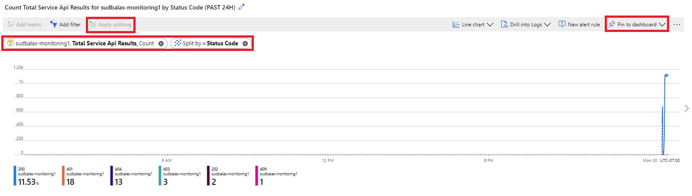
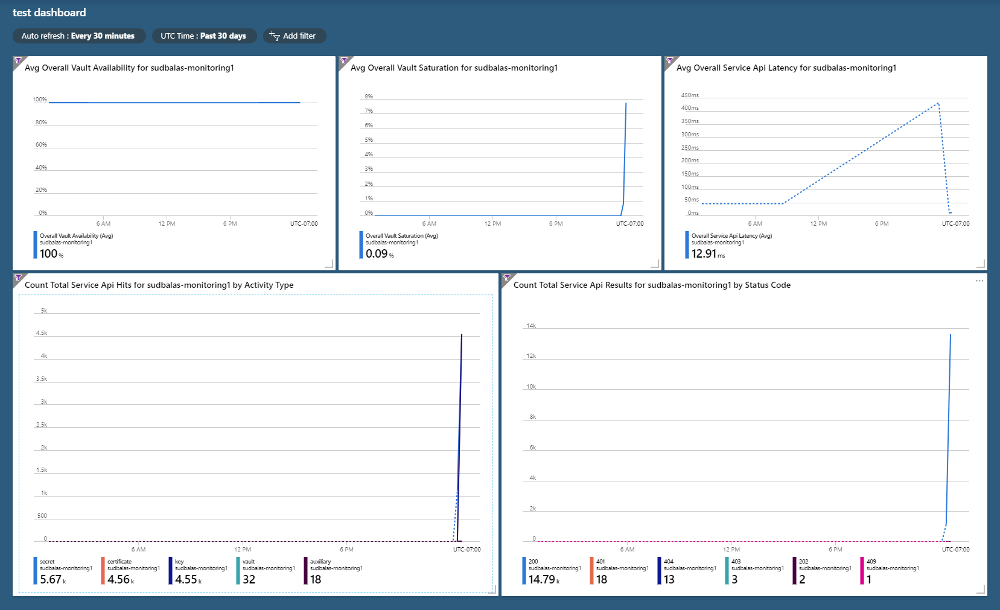

# Monitoring Key Vault

When you have critical applications and business processes relying on Azure resources, you want to monitor those resources for their availability, performance, and operation.

This article describes the monitoring data generated by Key Vault. Key Vault uses [Azure Monitor](/azure/azure-monitor/overview). If you are unfamiliar with the features of Azure Monitor common to all Azure services that use it, read [Monitoring Azure resources with Azure Monitor](/azure/azure-monitor/essentials/monitor-azure-resource).

## Monitoring overview page in Azure portal
<!-- OPTIONAL. Please keep headings in this order -->
<!-- If you don't have an over page, remove this section. If you keep it, edit it if there are any unique charges if your service has significant monitoring beyond Azure Monitor. -->

The **Overview** page in the Azure portal for each *[Service resource]* includes *[provide a description of the data in the Overview page.]*.


## *Key Vault* insights

<!-- OPTIONAL SECTION.  Only include if your service has an "insight" associated with it. Examples of insights include
  - CosmosDB https://docs.microsoft.com/azure/azure-monitor/insights/cosmosdb-insights-overview
  - If you still aren't sure, contact azmondocs@microsoft.com.>
-->

Some services in Azure have a special focused pre-built monitoring dashboard in the Azure portal that provides a starting point for monitoring your service. These special dashboards are called "insights".

Key Vault insights provides comprehensive monitoring of your key vaults by delivering a unified view of your Key Vault requests, performance, failures, and latency. For full details, see [Monitoring your key vault service with Key Vault insights](../../azure-monitor/insights/key-vault-insights-overview.md).

## Overview

Once you have started to use key vault to store your production secrets, it is important to monitor the health of your key vault to make sure your service operates as intended. As you start to scale your service the number of requests sent to your key vault will rise. This has a potential to increase the latency of your requests and in extreme cases, cause your requests to be throttled which will impact the performance of your service. You also need to be alerted if your key vault is sending an unusual number of error codes, so you can be quickly notified of any access policy or firewall configuration issues. 
This document will cover the following topics:

+ Basic Key Vault metrics to monitor
+ How to configure metrics and create a dashboard
+ How to create alerts at specified thresholds

Azure Monitor for Key Vault combines both logs and metrics to provide a global monitoring solution. [Learn more about Azure Monitor for Key Vault here](../../azure-monitor/insights/key-vault-insights-overview.md#introduction-to-key-vault-insights)

## Basic Key Vault metrics to monitor

+ Vault Availability  
+ Vault Saturation
+ Service API Latency
+ Total Service API Hits (Filter by Activity Type)
+ Error Codes (Filter by Status Code)

**Vault Availability** -  This metric should always be at 100% this is an important metric to monitor, since it can quickly show you if your key vault experienced an outage. 

**Vault Saturation** – The number of requests per second that a key vault can serve is based on the type of operation being performed. Some vault operations have a lower requests-per-second threshold. This metric aggregates the total usage of your key vault across all operation types to come up with a percentage value that indicates your current key vault usage. For a full list of key vault service limits, see the following document. [Azure Key Vault Service Limits](service-limits.md)

**Service API Latency** - This metric shows the average latency of calls to key vault, measured at the service. It does not include time consumed by client or by the network between client and service.

**Total API Hits** - This metric shows all of the calls made to your key vault. This will help you identify which applications are calling your key vault. 

**Error Codes** – This metric will show you if your key vault is experiencing an unusual amount of errors. For a full list of error codes and troubleshooting guidance, see the following document. [Azure Key Vault REST API Error Codes](rest-error-codes.md)

## How to configure metrics and create a dashboard

1. Login to the Azure portal
2. Navigate to your Key Vault
3. Select **Metrics** under **Monitoring** 

> [!div class="mx-imgBorder"]
> 

4. Update the title of the chart to what you want to see on your dashboard. 
5. Select the scope. In this example we will select a single key vault. 
6. Select the Metric **Overall Vault Availability** and Aggregation **Avg** 
7. Update the time range to the Last 24 Hours and update the time granularity to 1 minute. 

> [!div class="mx-imgBorder"]
> 

8. Repeat the steps above for the Vault Saturation and Service API Latency metrics. Select **Pin to Dashboard** to save your metrics into a dashboard. 

> [!IMPORTANT]
> Select "Pin to Dashboard" and save every metric you configure. If you leave the page and return to it without saving, your configuration changes will be lost. 

9. To monitor all of the types of operations on the key vault, use the **Total Service API Hits** Metric, and Select **Apply Splitting by Activity Type**

> [!div class="mx-imgBorder"]
> 

10. To monitor for error codes on the key vault, use the **Total Service API Results** Metric, and Select **Apply Splitting by Activity Type**

> [!div class="mx-imgBorder"]
> 

Now you will have a dashboard that looks like this. You can click the 3 dots on the top right of each tile and you can rearrange and resize the tiles as you need. 

Once you save and publish the dashboard, it will create a new resource in your Azure subscription. You will be able to see it at anytime by searching for "shared dashboard". 

> [!div class="mx-imgBorder"]
> 

## How to configure alerts on your Key Vault 

This section will show you how to configure alerts on your key vault so you can alert your team to take action immediately if your key vault is in an unhealthy state. You can configure alerts that send an email, preferably to a team DL, fire an event grid notification, or call or text a phone number. You can also choose static alerts based on a fixed value, or a dynamic alert that will alert you if a monitored metric exceeds the average limit of your key vault a certain number of times within a defined time range. 

> [!IMPORTANT]
> Please note it can take up to 10 minutes for newly configured alerts to start sending notifications. 

### Configure an action group 

An action group is a configurable list of notifications and properties.

1. Login to the Azure portal
2. Search for **Alerts** in the search box
3. Select **Manage Actions**

> [!div class="mx-imgBorder"]
> 

4. Select **+ Add Action Group**

> [!div class="mx-imgBorder"]
> 

5. Choose the **Action Type** for your Action Group. In this example, we will create an email alert.

> [!div class="mx-imgBorder"]
> 

> [!div class="mx-imgBorder"]
> 

6. Click **OK** at the bottom of the page. You have successfully created an action group. 

Now that you have configured an action group, we will configure the the key vault alert thresholds. 

### Configure alert thresholds 

1. Select your key vault resource in the Azure portal and select **Alerts** under **Monitoring**

> [!div class="mx-imgBorder"]
> 

2. Select **New Alert Rule**

> [!div class="mx-imgBorder"]
> 

3. Select the scope of your alert rule. You can select a single vault or multiple. 

> [!IMPORTANT]
> Please note that when you are selecting multiple vaults for the scope of your alerts,  all selected vaults must be in the same region. You will have to configure separate alert rules for vaults in different regions. 

> [!div class="mx-imgBorder"]
> 

4. Select the conditions for your alerts. You can choose any of the following signals and define your logic for alerting. The Key Vault team recommends configuring the following alerting thresholds. 

    + Key Vault Availability drops below 100% (Static Threshold)
    + Key Vault Latency is greater than 500ms (Static Threshold)
    + Overall Vault Saturation is greater than 75% (Static Threshold)
    + Overall Vault Saturation exceeds average (Dynamic Threshold)
    + Total Error Codes higher than average (Dynamic Threshold)

> [!div class="mx-imgBorder"]
> 

### Example 1: Configuring a static alert threshold for latency

Select **Overall Service API Latency** as the signal name
> [!div class="mx-imgBorder"]
> 

Please see the following configuration parameters.

+ Set the Threshold to **Static** 
+ Set the Operator to **Greater Than**
+ Set the Aggregation Type to **Average**
+ Set the Threshold Value to **500**
+ Set Aggregation Period to **5 minutes**
+ Set the Evaluation Frequency to **1 minute**
+ Select **Done**  

> [!div class="mx-imgBorder"]
> 

### Example 2: Configuring a dynamic alert threshold for vault saturation 

When you use a dynamic alert, you will be able to see historical data of the key vault you have selected. The blue area represents the average usage of your key vault. The red area shows spikes that would have triggered an alert provided other criteria in the alert configuration are met. The red dots show instances of violations where the criteria for the alert was met during the aggregated time window. You can set an alert to fire after a certain number of violations within a set time. If you don't want to include past data, there is an option to exclude old data below in advanced settings. 

> [!div class="mx-imgBorder"]
> 

Please see the following configuration parameters.

+ Set the Threshold to **Dynamic** 
+ Set the Operator to **Greater Than**
+ Set the Aggregation Type to **Average**
+ Set the Threshold Sensitivity to **Medium**
+ Set Aggregation Period to **5 minutes**
+ Set the Evaluation Frequency to **1 minute**
+ **Optional** Configure Advanced Settings 
+ Select **Done**

> [!div class="mx-imgBorder"]
> 

5. Add the action group that you have configured

> [!div class="mx-imgBorder"]
> 

6. Enable the alert and assign a severity

> [!div class="mx-imgBorder"]
> 

7. Create the alert 

### Example email alert 

> [!div class="mx-imgBorder"]
> 

## Next steps

Congratulations, you have now successfully created a monitoring dashboard and configured alerts for your key vault! 
Once you have followed all of the steps above, you should receive email alerts when your key vault meets the alert criteria you configured. An example is shown below. Use the tools you have set up in this article to actively monitor the health of your key vault.

---
title: Monitoring Azure Key Vault
description: Start here to learn how to monitor Azure Key Vault
author: msmbaldwin
ms.author: mbaldwin
ms.service: key-vault
ms.subservice: general
ms.topic: how-to
ms.custom: subject-monitoring
ms.date: 06/01/2021
---

<!-- VERSION 2.2
Template for the main monitoring article for Azure services. 
Keep the required sections and add/modify any content for any information specific to your service. 
This article should be in your TOC with the name *monitor-[TODO-replace-with-service-name].md* and the TOC title "Monitor [TODO-replace-with-service-name]". 
Put accompanying reference information into an article in the Reference section of your TOC with the name *monitor-[service-name]-reference.md* and the TOC title "Monitoring data". 
Keep the headings in this order. 
-->

<!-- IMPORTANT STEP 1.  Do a search and replace of [TODO-replace-with-service-name] with the name of your service. That will make the template easier to read -->

# Monitoring Key Vault
<!-- REQUIRED. Please keep headings in this order -->
<!-- Most services can use this section unchanged. Add to it if there are any unique charges if your service has significant monitoring beyond Azure Monitor. -->

When you have critical applications and business processes relying on Azure resources, you want to monitor those resources for their availability, performance, and operation.

This article describes the monitoring data generated by Key Vault. Key Vault uses [Azure Monitor](/azure/azure-monitor/overview). If you are unfamiliar with the features of Azure Monitor common to all Azure services that use it, read [Monitoring Azure resources with Azure Monitor](/azure/azure-monitor/essentials/monitor-azure-resource).


<!-- Optional diagram showing monitoring for your service. If you need help creating one, contact robb@microsoft.com -->

## Monitoring overview page in Azure portal
<!-- OPTIONAL. Please keep headings in this order -->
<!-- If you don't have an over page, remove this section. If you keep it, edit it if there are any unique charges if your service has significant monitoring beyond Azure Monitor. -->

The **Overview** page in the Azure portal for each *[Service resource]* includes *[provide a description of the data in the Overview page.]*.


## *Key Vault* insights

<!-- OPTIONAL SECTION.  Only include if your service has an "insight" associated with it. Examples of insights include
  - CosmosDB https://docs.microsoft.com/azure/azure-monitor/insights/cosmosdb-insights-overview
  - If you still aren't sure, contact azmondocs@microsoft.com.>
-->

Some services in Azure have a special focused pre-built monitoring dashboard in the Azure portal that provides a starting point for monitoring your service. These special dashboards are called "insights".

Key Vault insights provides comprehensive monitoring of your key vaults by delivering a unified view of your Key Vault requests, performance, failures, and latency. For full details, see [Monitoring your key vault service with Key Vault insights](../../azure-monitor/insights/key-vault-insights-overview.md).

## Monitoring data 

<!-- REQUIRED. Please keep headings in this order -->
Key Vault collects the same kinds of monitoring data as other Azure resources that are described in [Monitoring data from Azure resources](/azure/azure-monitor/insights/monitor-azure-resource#monitoring-data-from-Azure-resources). 

See [Monitoring *Key Vault* data reference](monitor-key-vault-reference.md) for detailed information on the metrics and logs metrics created by Key Vault.

<!-- If your service has additional non-Azure Monitor monitoring data then outline and refer to that here. Also include that information in the data reference as appropriate. -->

## Collection and routing

<!-- REQUIRED. Please keep headings in this order -->

Platform metrics and the Activity log are collected and stored automatically, but can be routed to other locations by using a diagnostic setting.  

Resource Logs are not collected and stored until you create a diagnostic setting and route them to one or more locations.

<!-- Include any additional information on collecting logs.  The number of things that diagnostics settings control is expanding -->

See [Create diagnostic setting to collect platform logs and metrics in Azure](/azure/azure-monitor/platform/diagnostic-settings) for the detailed process for creating a diagnostic setting using the Azure portal, CLI, or PowerShell. When you create a diagnostic setting, you specify which categories of logs to collect. The categories for *Key Vault* are listed in [Key Vault monitoring data reference](monitor-key-vault-reference.md#resource-logs).

<!-- OPTIONAL: Add specific examples of configuration for this service. For example, CLI and PowerShell commands for creating diagnostic setting. Ideally, customers should set up a policy to automatically turn on collection for services. Azure monitor has Resource Manager template examples you can point to. See https://docs.microsoft.com/azure/azure-monitor/samples/resource-manager-diagnostic-settings.  Contact azmondocs@microsoft.com if you have questions.   -->

The metrics and logs you can collect are discussed in the following sections.

## Analyzing metrics

<!-- REQUIRED. Please keep headings in this order 
If you don't support metrics, say so. Some services may be only onboarded to logs -->

You can analyze metrics for *Key Vault* with metrics from other Azure services using metrics explorer by opening **Metrics** from the **Azure Monitor** menu. See [Getting started with Azure Metrics Explorer](/azure/azure-monitor/platform/metrics-getting-started) for details on using this tool. 

<!-- Point to the list of metrics available in your monitor-key-vault-reference article. -->
For a list of the platform metrics collected for Key Vault, see [Monitoring *[service-name]* data reference metrics](monitor-key-vault-reference.md#metrics)  

<!-- REQUIRED for services that use a Guest OS. That includes agent based services like Virtual Machines, Service Fabric, Cloud Services, and perhaps others. Delete the section otherwise -->
Guest OS metrics must be collected by agents running on the virtual machines hosting your service. <!-- Add additional information as appropriate -->. For more information, see [Overview of Azure Monitor agents](/azure/azure-monitor/platform/agents-overview)  

For reference, you can see a list of [all resource metrics supported in Azure Monitor](../../azure-monitor/platform/metrics-supported.md).

<!--  Optional: Call out additional information to help your customers. For example, you can include additional information here about how to use metrics explorer specifically for your service. Remember that the UI is subject to change quite often so you will need to maintain these screenshots yourself if you add them in. -->

## Analyzing logs

<!-- REQUIRED. Please keep headings in this order
If you don't support resource logs, say so. Some services may be only onboarded to metrics and the activity log. -->

Data in Azure Monitor Logs is stored in tables where each table has its own set of unique properties.  

All resource logs in Azure Monitor have the same fields followed by service-specific fields. The common schema is outlined in [Azure Monitor resource log schema](https://docs.microsoft.com/azure/azure-monitor/platform/diagnostic-logs-schema#top-level-resource-logs-schema) The schema for [service name] resource logs is found in the [Key Vault Data Reference](monitor-key-vault-reference.md#schemas) 

The [Activity log](/azure/azure-monitor/platform/activity-log) is a type of platform log in Azure that provides insight into subscription-level events. You can view it independently or route it to Azure Monitor Logs, where you can do much more complex queries using Log Analytics.  

For a list of the types of resource logs collected for Key Vault, see [Monitoring Key Vault data reference](monitor-key-vault-reference.md#resource-logs)  

For a list of the tables used by Azure Monitor Logs and queryable by Log Analytics, see [Monitoring Key Vault data reference](monitor-key-vault-reference.md##azure-monitor-logs-tables)  

<!--  Optional: Call out additional information to help your customers. For example, you can include additional information here about log usage or what logs are most important. Remember that the UI is subject to change quite often so you will need to maintain these screenshots yourself if you add them in. -->

### Sample Kusto queries

<!-- REQUIRED if you support logs. Please keep headings in this order -->
<!-- Add sample Log Analytics Kusto queries for your service. -->

> [!IMPORTANT]
> When you select **Logs** from the [service-name] menu, Log Analytics is opened with the query scope set to the current [Service resource]. This means that log queries will only include data from that resource. If you want to run a query that includes data from other [resource] or data from other Azure services, select **Logs** from the **Azure Monitor** menu. See [Log query scope and time range in Azure Monitor Log Analytics](/azure/azure-monitor/log-query/scope/) for details.

<!-- REQUIRED: Include queries that are helpful for figuring out the health and state of your service. Ideally, use some of these queries in the alerts section. It's possible that some of your queries may be in the Log Analytics UI (sample or example queries). Check if so.  -->

Following are queries that you can use to help you monitor your [Service] resource. 

<!-- Put in a code section here. -->  
```Kusto
   
```

## Alerts

<!-- SUGGESTED: Include useful alerts on metrics, logs, log conditions or activity log. Ask your PMs if you don't know. 
This information is the BIGGEST request we get in Azure Monitor so do not avoid it long term. People don't know what to monitor for best results. Be prescriptive  
-->

Azure Monitor alerts proactively notify you when important conditions are found in your monitoring data. They allow you to identify and address issues in your system before your customers notice them. You can set alerts on [metrics](/azure/azure-monitor/platform/alerts-metric-overview), [logs](/azure/azure-monitor/platform/alerts-unified-log), and the [activity log](/azure/azure-monitor/platform/activity-log-alerts). Different types of alerts have benefits and drawbacks

<!-- only include next line if applications run on your service and work with App Insights. --> If you are creating or running an application which run on <*service*> [Azure Monitor Application Insights](/azure/azure-monitor/overview#application-insights) may offer additional types of alerts.
<!-- end -->

The following table lists common and recommended alert rules for [service-name].

<!-- Fill in the table with metric and log alerts that would be valuable for your service. Change the format as necessary to make it more readable -->
| Alert type | Condition | Description  |
|:---|:---|:---|
| | | |
| | | |

## Next steps

<!-- Add additional links. You can change the wording of these and add more if useful.   -->

- See [Monitoring [service-name] data reference](monitor-key-vault-reference.md) for a reference of the metrics, logs, and other important values created by [service name].
*>.
- See [Monitoring Azure resources with Azure Monitor](/azure/azure-monitor/insights/monitor-azure-resource) for details on monitoring Azure resources.