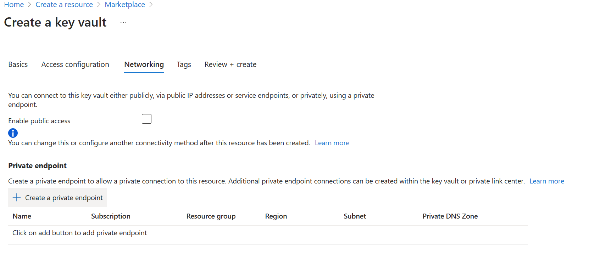
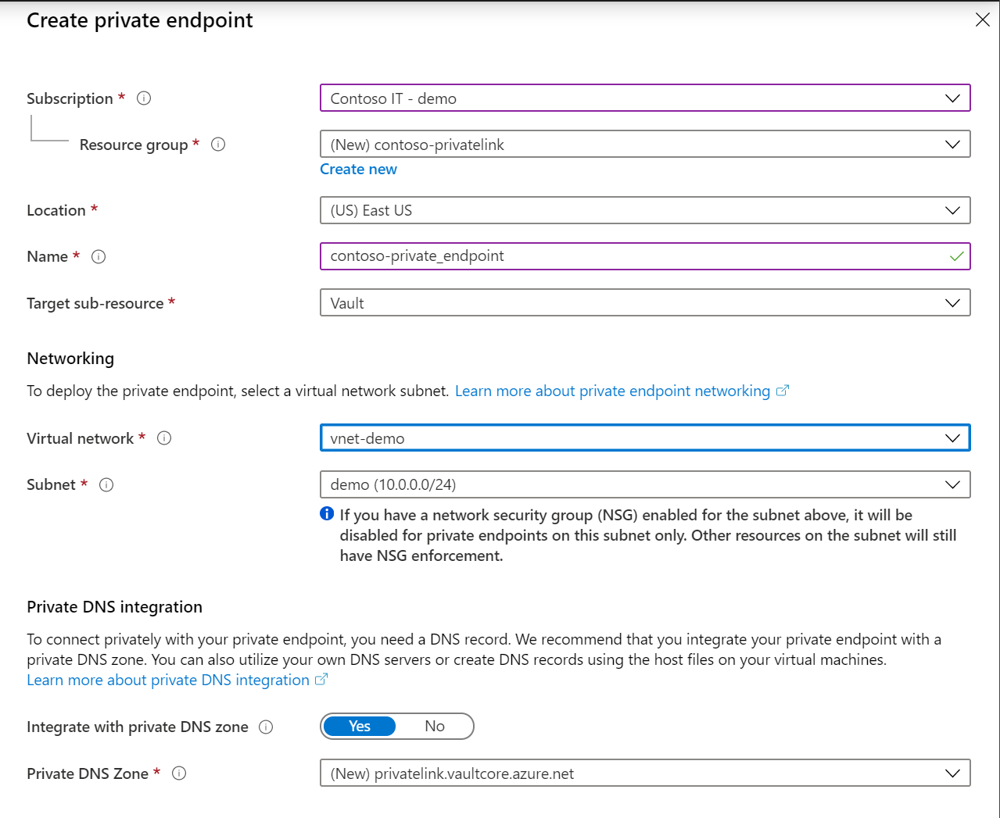
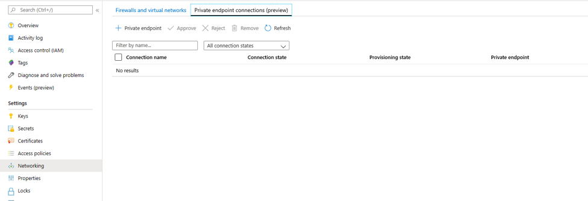
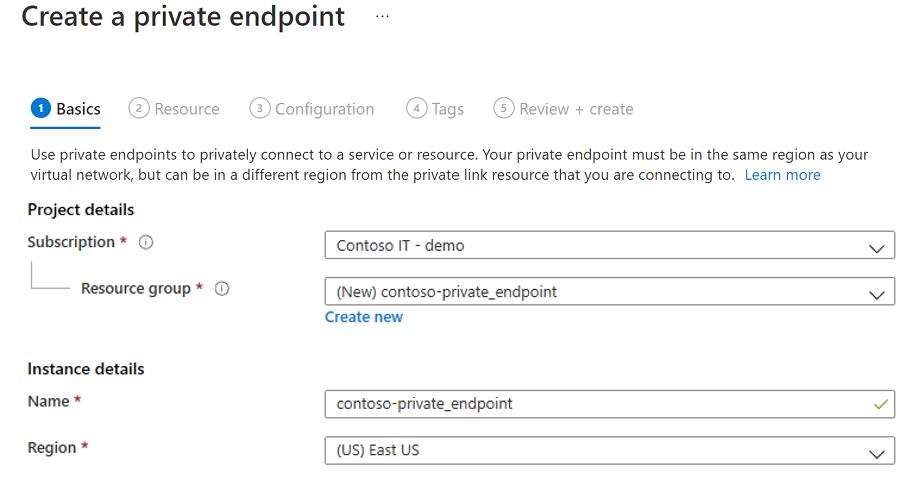
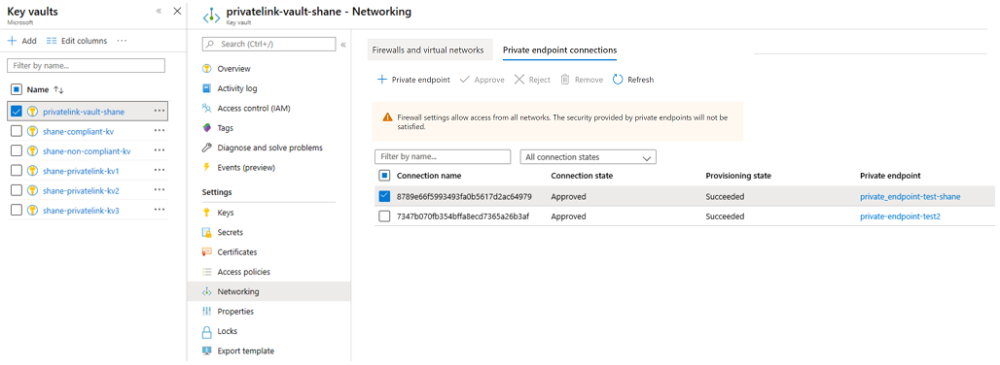

# Integrate Key Vault with Azure Private Link

Azure Private Link Service enables you to access Azure Services (for example, Azure Key Vault, Azure Storage, and Azure Cosmos DB) and Azure hosted customer/partner services over a Private Endpoint in your virtual network.

An Azure Private Endpoint is a network interface that connects you privately and securely to a service powered by Azure Private Link. The private endpoint uses a private IP address from your VNet, effectively bringing the service into your VNet. All traffic to the service can be routed through the private endpoint, so no gateways, NAT devices, ExpressRoute or VPN connections, or public IP addresses are needed. Traffic between your virtual network and the service traverses over the Microsoft backbone network, eliminating exposure from the public Internet. You can connect to an instance of an Azure resource, giving you the highest level of granularity in access control.

For more information, see [What is Azure Private Link?](../../private-link/private-link-overview.md)

## Prerequisites

To integrate a key vault with Azure Private Link, you'll need:

- A key vault.
- An Azure virtual network.
- A subnet in the virtual network.
- Owner or contributor permissions for both the key vault and the virtual network.

Your private endpoint and virtual network must be in the same region. When you select a region for the private endpoint using the portal, it will automatically filter only virtual networks that are in that region. Your key vault can be in a different region.

Your private endpoint uses a private IP address in your virtual network.

# [Azure portal](#tab/portal)

## Establish a private link connection to Key Vault using the Azure portal

First, create a virtual network by following the steps in [Create a virtual network using the Azure portal](../../virtual-network/quick-create-portal.md)

You can then either create a new key vault, or establish a private link connection to an existing key vault.

### Create a new key vault and establish a private link connection

You can create a new key vault with the [Azure portal](../general/quick-create-portal.md), [Azure CLI](../general/quick-create-cli.md), or [Azure PowerShell](../general/quick-create-powershell.md).

After configuring the key vault basics, select the Networking tab and follow these steps:

1. Disable public access by toggling off the radio button.
1. Select the "+ Create a private endpoint" Button to add a private endpoint.

    

1. In the "Location" field of the Create Private Endpoint Blade, select the region in which your virtual network is located. 
1. In the "Name" field, create a descriptive name that will allow you to identify this private endpoint. 
1. Select the virtual network and subnet you want this private endpoint to be created in from the dropdown menu. 
1. Leave the "integrate with the private zone DNS" option unchanged.  
1. Select "Ok".

    

You'll now be able to see the configured private endpoint. You can now delete and edit this private endpoint.
Select the "Review + Create" button and create the key vault. It will take 5-10 minutes for the deployment to complete.

### Establish a private link connection to an existing key vault

If you already have a key vault, you can create a private link connection by following these steps:

1. Sign in to the Azure portal.
1. In the search bar, type in "key vaults".
1. Select the key vault from the list to which you want to add a private endpoint.
1. Select the "Networking" tab under Settings.
1. Select the "Private endpoint connections" tab at the top of the page.
1. Select the "+ Create" button at the top of the page.

    
    

1. Under "Project Details", select the Resource Group that contains the virtual network that you created as a prerequisite for this tutorial. Under "Instance details", enter "myPrivateEndpoint" as the Name, and select the same location as the virtual network that you created as a prerequisite for this tutorial.

    You can choose to create a private endpoint for any Azure resource in using this blade. You can either use the dropdown menus to select a resource type and select a resource in your directory, or you can connect to any Azure resource using a resource ID. Leave the "integrate with the private zone DNS" option unchanged.  

1. Advance to the "Resources" blade. For "Resource type", select "Microsoft.KeyVault/vaults"; for "Resource", select the key vault you created as a prerequisite for this tutorial. "Target sub-resource" will auto-populate with "vault".
1. Advance to the "Virtual Network". Select the virtual network and subnet that you created as a prerequisite for this tutorial.
1. Advance through the "DNS" and "Tags" blades, accepting the defaults.
1. On the "Review + Create" blade, select "Create".

When you create a private endpoint, the connection must be approved. If the resource for which you're creating a private endpoint is in your directory, you'll be able to approve the connection request provided you have sufficient permissions; if you're connecting to an Azure resource in another directory, you must wait for the owner of that resource to approve your connection request.

There are four provisioning states:

| Service action | Service consumer private endpoint state | Description |
|--|--|--|
| None | Pending | Connection is created manually and is pending approval from the Private Link resource owner. |
| Approve | Approved | Connection was automatically or manually approved and is ready to be used. |
| Reject | Rejected | Connection was rejected by the private link resource owner. |
| Remove | Disconnected | Connection was removed by the private link resource owner, the private endpoint becomes informative and should be deleted for cleanup. |

### How to manage a private endpoint connection to Key Vault using the Azure portal 

1. Log in to the Azure portal.
1. In the search bar, type in "key vaults"
1. Select the key vault that you want to manage.
1. Select the "Networking" tab.
1. If there are any connections that are pending, you'll see a connection listed with "Pending" in the provisioning state. 
1. Select the private endpoint you wish to approve
1. Select the approve button.
1. If there are any private endpoint connections you want to reject, whether it's a pending request or existing connection, select the connection and select the "Reject" button.

    

# [Azure CLI](#tab/cli)

## Establish a private link connection to Key Vault using CLI (Initial Setup)

```azurecli
az login                                                         # Login to Azure CLI
az account set --subscription {SUBSCRIPTION ID}                  # Select your Azure Subscription
az group create -n {RESOURCE GROUP} -l {REGION}                  # Create a new Resource Group
az provider register -n Microsoft.KeyVault                       # Register KeyVault as a provider
az keyvault create -n {VAULT NAME} -g {RG} -l {REGION}           # Create a Key Vault
az keyvault update -n {VAULT NAME} -g {RG} --default-action deny # Turn on Key Vault Firewall
az network vnet create -g {RG} -n {vNet NAME} -location {REGION} # Create a Virtual Network

    # Create a Subnet
az network vnet subnet create -g {RG} --vnet-name {vNet NAME} --name {subnet NAME} --address-prefixes {addressPrefix}

    # Disable Virtual Network Policies
az network vnet subnet update --name {subnet NAME} --resource-group {RG} --vnet-name {vNet NAME} --disable-private-endpoint-network-policies true

    # Create a Private DNS Zone
az network private-dns zone create --resource-group {RG} --name privatelink.vaultcore.azure.net

    # Link the Private DNS Zone to the Virtual Network
az network private-dns link vnet create --resource-group {RG} --virtual-network {vNet NAME} --zone-name privatelink.vaultcore.azure.net --name {dnsZoneLinkName} --registration-enabled true

```

### Create a Private Endpoint (Automatically Approve) 
```azurecli
az network private-endpoint create --resource-group {RG} --vnet-name {vNet NAME} --subnet {subnet NAME} --name {Private Endpoint Name}  --private-connection-resource-id "/subscriptions/{AZURE SUBSCRIPTION ID}/resourceGroups/{RG}/providers/Microsoft.KeyVault/vaults/{KEY VAULT NAME}" --group-ids vault --connection-name {Private Link Connection Name} --location {AZURE REGION}
```

### Create a Private Endpoint (Manually Request Approval) 
```azurecli
az network private-endpoint create --resource-group {RG} --vnet-name {vNet NAME} --subnet {subnet NAME} --name {Private Endpoint Name}  --private-connection-resource-id "/subscriptions/{AZURE SUBSCRIPTION ID}/resourceGroups/{RG}/providers/Microsoft.KeyVault/vaults/{KEY VAULT NAME}" --group-ids vault --connection-name {Private Link Connection Name} --location {AZURE REGION} --manual-request
```

### Manage Private Link Connections

```azurecli
# Show Connection Status
az network private-endpoint show --resource-group {RG} --name {Private Endpoint Name}

# Approve a Private Link Connection Request
az keyvault private-endpoint-connection approve --approval-description {"OPTIONAL DESCRIPTION"} --resource-group {RG} --vault-name {KEY VAULT NAME} –name {PRIVATE LINK CONNECTION NAME}

# Deny a Private Link Connection Request
az keyvault private-endpoint-connection reject --rejection-description {"OPTIONAL DESCRIPTION"} --resource-group {RG} --vault-name {KEY VAULT NAME} –name {PRIVATE LINK CONNECTION NAME}

# Delete a Private Link Connection Request
az keyvault private-endpoint-connection delete --resource-group {RG} --vault-name {KEY VAULT NAME} --name {PRIVATE LINK CONNECTION NAME}
```

### Add Private DNS Records
```azurecli
# Determine the Private Endpoint IP address
az network private-endpoint show -g {RG} -n {PE NAME}      # look for the property networkInterfaces then id; the value must be placed on {PE NIC} below.
az network nic show --ids {PE NIC}                         # look for the property ipConfigurations then privateIpAddress; the value must be placed on {NIC IP} below.

# https://learn.microsoft.com/azure/dns/private-dns-getstarted-cli#create-an-additional-dns-record
az network private-dns zone list -g {RG}
az network private-dns record-set a add-record -g {RG} -z "privatelink.vaultcore.azure.net" -n {KEY VAULT NAME} -a {NIC IP}
az network private-dns record-set list -g {RG} -z "privatelink.vaultcore.azure.net"

# From home/public network, you wil get a public IP. If inside a vnet with private zone, nslookup will resolve to the private ip.
nslookup {KEY VAULT NAME}.vault.azure.net
nslookup {KEY VAULT NAME}.privatelink.vaultcore.azure.net
```

---

## Validate that the private link connection works

You should validate that the resources within the same subnet of the private endpoint resource are connecting to your key vault over a private IP address, and that they have the correct private DNS zone integration.

First, create a virtual machine by following the steps in [Create a Windows virtual machine in the Azure portal](../../virtual-machines/windows/quick-create-portal.md)

In the "Networking" tab:

1. Specify Virtual network and Subnet. You can create a new virtual network or select an existing one. If selecting an existing one, make sure the region matches.
1. Specify a Public IP resource.
1. In the "NIC network security group", select "None".
1. In the "Load balancing", select "No".

Open the command line and run the following command:

```console
nslookup <your-key-vault-name>.vault.azure.net
```

If you run the ns lookup command to resolve the IP address of a key vault over a public endpoint, you'll see a result that looks like this:

```console
c:\ >nslookup <your-key-vault-name>.vault.azure.net

Non-authoritative answer:
Name:    
Address:  (public IP address)
Aliases:  <your-key-vault-name>.vault.azure.net
```

If you run the ns lookup command to resolve the IP address of a key vault over a private endpoint, you'll see a result that looks like this:

```console
c:\ >nslookup your_vault_name.vault.azure.net

Non-authoritative answer:
Name:    
Address:  10.1.0.5 (private IP address)
Aliases:  <your-key-vault-name>.vault.azure.net
          <your-key-vault-name>.privatelink.vaultcore.azure.net
```

## Troubleshooting Guide

* Check to make sure the private endpoint is in the approved state. 
    1. You can check and fix this in Azure portal. Open the Key Vault resource, and select the Networking option. 
    2. Then select the Private endpoint connections tab. 
    3. Make sure connection state is Approved and provisioning state is Succeeded. 
    4. You may also navigate to the private endpoint resource and review same properties there, and double-check that the virtual network matches the one you're using.

* Check to make sure you have a Private DNS Zone resource. 
    1. You must have a Private DNS Zone resource with the exact name: privatelink.vaultcore.azure.net. 
    2. To learn how to set this up please see the following link. [Private DNS Zones](../../dns/private-dns-privatednszone.md)
    
* Check to make sure the Private DNS Zone is linked to the Virtual Network. This may be the issue if you're still getting the public IP address returned. 
    1. If the Private Zone DNS isn't linked to the virtual network, the DNS query originating from the virtual network will return the public IP address of the key vault. 
    2. Navigate to the Private DNS Zone resource in the Azure portal and select the virtual network links option. 
    4. The virtual network that will perform calls to the key vault must be listed. 
    5. If it's not there, add it. 
    6. For detailed steps, see the following document [Link Virtual Network to Private DNS Zone](../../dns/private-dns-getstarted-portal.md#link-the-virtual-network)

* Check to make sure the Private DNS Zone isn't missing an A record for the key vault. 
    1. Navigate to the Private DNS Zone page. 
    2. Select Overview and check if there's an A record with the simple name of your key vault (i.e. fabrikam). Don't specify any suffix.
    3. Make sure you check the spelling, and either create or fix the A record. You can use a TTL of 600 (10 mins).
    4. Make sure you specify the correct private IP address. 

* Check to make sure the A record has the correct IP Address. 
    1. You can confirm the IP address by opening the Private Endpoint resource in Azure portal.
    2. Navigate to the Microsoft.Network/privateEndpoints resource, in the Azure portal (not the Key Vault resource)
    3. In the overview page look for Network interface and select that link. 
    4. The link will show the Overview of the NIC resource, which contains the property Private IP address. 
    5. Verify that this is the correct IP address that is specified in the A record.

* If you're connecting from an on-premises resource to a Key Vault, ensure you have all required conditional forwarders in the on-premises environment enabled.
    1. Review [Azure Private Endpoint DNS configuration](../../private-link/private-endpoint-dns.md#azure-services-dns-zone-configuration) for the zones needed, and make sure you have conditional forwarders for both `vault.azure.net` and `vaultcore.azure.net` on your on-premises DNS.
    2. Ensure that you have conditional forwarders for those zones that route to an [Azure Private DNS Resolver](../../dns/dns-private-resolver-overview.md) or some other DNS platform with access to Azure resolution.

## Limitations and Design Considerations

**Limits**: See [Azure Private Link limits](../../azure-resource-manager/management/azure-subscription-service-limits.md#private-link-limits)

**Pricing**: See [Azure Private Link pricing](https://azure.microsoft.com/pricing/details/private-link/).

**Limitations**: See [Azure Private Link service: Limitations](../../private-link/private-link-service-overview.md#limitations)

## Next Steps

- Learn more about [Azure Private Link](../../private-link/private-link-service-overview.md)
- Learn more about [Azure Key Vault](overview.md)
