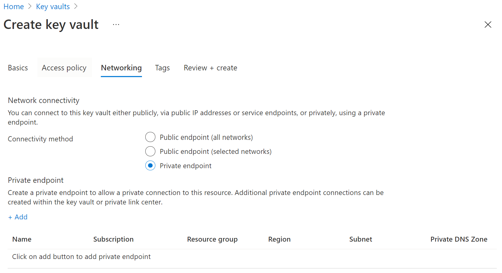

# Integrate Key Vault with Azure Private Link

Azure Private Link Service enables you to access Azure Services (for example, Azure Key Vault, Azure Storage, and Azure Cosmos DB) and Azure hosted customer/partner services over a Private Endpoint in your virtual network.

An Azure Private Endpoint is a network interface that connects you privately and securely to a service powered by Azure Private Link. The private endpoint uses a private IP address from your VNet, effectively bringing the service into your VNet. All traffic to the service can be routed through the private endpoint, so no gateways, NAT devices, ExpressRoute or VPN connections, or public IP addresses are needed. Traffic between your virtual network and the service traverses over the Microsoft backbone network, eliminating exposure from the public Internet. You can connect to an instance of an Azure resource, giving you the highest level of granularity in access control.

For more information, see [What is Azure Private Link?](../../private-link/private-link-overview.md)

## Prerequisites

To integrate a key vault with Azure Private Link, you will need the following:

- A key vault.
- An Azure virtual network.
- A subnet in the virtual network.
- Owner or contributor permissions for both the key vault and the virtual network.

Your private endpoint and virtual network must be in the same region. When you select a region for the private endpoint using the portal, it will automatically filter only virtual networks that are in that region. Your key vault can be in a different region.

Your private endpoint uses a private IP address in your virtual network.

## Establish a private link connection to Key Vault using the Azure portal 

First, create a virtual network by following the steps in [Create a virtual network using the Azure portal](../../virtual-network/quick-create-portal.md)

You can then either create a new key vault, or establish a private link connection to an existing key vault.

### Create a new key vault and establish a private link connection

You can create a new key Vault by following the steps in [Set and retrieve a secret from Azure Key Vault using the Azure portal](../secrets/quick-create-portal.md)

After configuring the key vault basics, select the Networking tab and follow these steps:

1. Select the Private Endpoint radio button in the Networking tab.
1. Click the "+ Add" Button to add a private endpoint.

    
 
1. In the "Location" field of the Create Private Endpoint Blade, select the region in which your virtual network is located. 
1. In the "Name" field, create a descriptive name that will allow you to identify this private endpoint. 
1. Select the virtual network and subnet you want this private endpoint to be created in from the dropdown menu. 
1. Leave the "integrate with the private zone DNS" option unchanged.  
1. Select "Ok".

    
 
You will now be able to see the configured private endpoint. You now have the option to delete and edit this private endpoint. 
Select the "Review + Create" button and create the key vault. It will take 5-10 minutes for the deployment to complete. 

### Establish a private link connection to an existing key vault

If you already have a key vault, you can create a private link connection by following these steps:

1. Sign in to the Azure portal. 
1. In the search bar, type in "key vaults"
1. Select the key vault from the list to which you want to add a private endpoint.
1. Select the "Networking" tab under Settings
1. Select the Private endpoint connections tab at the top of the page
1. Select the "+ Private Endpoint" button at the top of the page.

    
    

You can choose to create a private endpoint for any Azure resource in using this blade. You can either use the dropdown menus to select a resource type and select a resource in your directory, or you can connect to any Azure resource using a resource ID. Leave the "integrate with the private zone DNS" option unchanged.  


## Establish a private link connection to Key Vault using CLI

### Login to Azure CLI
```console
az login 
```
### Select your Azure Subscription 
```console
az account set --subscription {AZURE SUBSCRIPTION ID}
```
### Create a new Resource Group 
```console
az group create -n {RG} -l {AZURE REGION}
```
### Register Microsoft.KeyVault as a provider 
```console
az provider register -n Microsoft.KeyVault
```
### Create a new Key Vault
```console
az keyvault create --name {KEY VAULT NAME} --resource-group {RG} --location {AZURE REGION}
```
### Turn on Key Vault Firewall
```console
az keyvault update --name {KEY VAULT NAME} --resource-group {RG} --default-action deny
```
### Create a Virtual Network
```console
az network vnet create --resource-group {RG} --name {vNet NAME} --location {AZURE REGION}
```
### Add a subnet
```console
az network vnet subnet create --resource-group {RG} --vnet-name {vNet NAME} --name {subnet NAME} --address-prefixes {addressPrefix}
```
### Disable Virtual Network Policies 
```console
az network vnet subnet update --name {subnet NAME} --resource-group {RG} --vnet-name {vNet NAME} --disable-private-endpoint-network-policies true
```
### Add a Private DNS Zone 
```console
az network private-dns zone create --resource-group {RG} --name privatelink.vaultcore.azure.net
```
### Link Private DNS Zone to Virtual Network 
```console
az network private-dns link vnet create --resource-group {RG} --virtual-network {vNet NAME} --zone-name privatelink.vaultcore.azure.net --name {dnsZoneLinkName} --registration-enabled true
```
### Create a Private Endpoint (Automatically Approve) 
```console
az network private-endpoint create --resource-group {RG} --vnet-name {vNet NAME} --subnet {subnet NAME} --name {Private Endpoint Name}  --private-connection-resource-id "/subscriptions/{AZURE SUBSCRIPTION ID}/resourceGroups/{RG}/providers/Microsoft.KeyVault/vaults/ {KEY VAULT NAME}" --group-ids vault --connection-name {Private Link Connection Name} --location {AZURE REGION}
```
### Create a Private Endpoint (Manually Request Approval) 
```console
az network private-endpoint create --resource-group {RG} --vnet-name {vNet NAME} --subnet {subnet NAME} --name {Private Endpoint Name}  --private-connection-resource-id "/subscriptions/{AZURE SUBSCRIPTION ID}/resourceGroups/{RG}/providers/Microsoft.KeyVault/vaults/ {KEY VAULT NAME}" --group-ids vault --connection-name {Private Link Connection Name} --location {AZURE REGION} --manual-request
```
### Show Connection Status 
```console
az network private-endpoint show --resource-group {RG} --name {Private Endpoint Name}
```
## Manage private link connection

When you create a private endpoint, the connection must be approved. If the resource for which you are creating a private endpoint is in your directory, you will be able to approve the connection request provided you have sufficient permissions; if you are connecting to an Azure resource in another directory, you must wait for the owner of that resource to approve your connection request.

There are four provisioning states:

| Service provide action | Service consumer private endpoint state | Description |
|--|--|--|
| None | Pending | Connection is created manually and is pending approval from the Private Link resource owner. |
| Approve | Approved | Connection was automatically or manually approved and is ready to be used. |
| Reject | Rejected | Connection was rejected by the private link resource owner. |
| Remove | Disconnected | Connection was removed by the private link resource owner, the private endpoint becomes informative and should be deleted for cleanup. |
 
###  How to manage a private endpoint connection to Key Vault using the Azure portal 

1. Log in to the Azure portal.
1. In the search bar, type in "key vaults"
1. Select the key vault that you want to manage.
1. Select the "Networking" tab.
1. If there are any connections that are pending, you will see a connection listed with "Pending" in the provisioning state. 
1. Select the private endpoint you wish to approve
1. Select the approve button.
1. If there are any private endpoint connections you want to reject, whether it is a pending request or existing connection, select the connection and click the "Reject" button.

    

##  How to manage a private endpoint connection to Key Vault using Azure CLI

### Approve a Private Link Connection Request
```console
az keyvault private-endpoint-connection approve --approval-description {"OPTIONAL DESCRIPTION"} --resource-group {RG} --vault-name {KEY VAULT NAME} –name {PRIVATE LINK CONNECTION NAME}
```

### Deny a Private Link Connection Request
```console
az keyvault private-endpoint-connection reject --rejection-description {"OPTIONAL DESCRIPTION"} --resource-group {RG} --vault-name {KEY VAULT NAME} –name {PRIVATE LINK CONNECTION NAME}
```

### Delete a Private Link Connection Request
```console
az keyvault private-endpoint-connection delete --resource-group {RG} --vault-name {KEY VAULT NAME} --name {PRIVATE LINK CONNECTION NAME}
```

## Validate that the private link connection works

You should validate that the resources within the same subnet of the private endpoint resource are connecting to your key vault over a private IP address, and that they have the correct private DNS zone integration.

First, create a virtual machine by following the steps in [Create a Windows virtual machine in the Azure portal](../../virtual-machines/windows/quick-create-portal.md)

In the "Networking" tab:

1. Specify Virtual network and Subnet. You can create a new virtual network or select an existing one. If selecting an existing one, make sure the region matches.
1. Specify a Public IP resource.
1. In the "NIC network security group", select "None".
1. In the "Load balancing", select "No".

Open the command line and run the following command:

```console
nslookup <your-key-vault-name>.vault.azure.net
```

If you run the ns lookup command to resolve the IP address of a key vault over a public endpoint, you will see a result that looks like this:

```console
c:\ >nslookup <your-key-vault-name>.vault.azure.net

Non-authoritative answer:
Name:    
Address:  (public IP address)
Aliases:  <your-key-vault-name>.vault.azure.net
```

If you run the ns lookup command to resolve the IP address of a key vault over a private endpoint, you will see a result that looks like this:

```console
c:\ >nslookup your_vault_name.vault.azure.net

Non-authoritative answer:
Name:    
Address:  10.1.0.5 (private IP address)
Aliases:  <your-key-vault-name>.vault.azure.net
          <your-key-vault-name>.privatelink.vaultcore.azure.net
```

## Limitations and Design Considerations

> [!NOTE]
> The number of key vaults with private endpoints enabled per subscription is an adjustable limit. The limit shown below is the default limit. If you would like to request a limit increase for your service, please send an email to akv-privatelink@microsoft.com. We will approve these requests on a case by case basis.

**Pricing**: For pricing information, see [Azure Private Link pricing](https://azure.microsoft.com/pricing/details/private-link/).

**Limitations**:  Private Endpoint for Azure Key Vault is only available in Azure public regions.

**Maximum Number of Private Endpoints per Key Vault**: 64.

**Default Number of Key Vaults with Private Endpoints per Subscription**: 400.

For more, see [Azure Private Link service: Limitations](../../private-link/private-link-service-overview.md#limitations)

## Next Steps

- Learn more about [Azure Private Link](../../private-link/private-link-service-overview.md)
- Learn more about [Azure Key Vault](overview.md)
