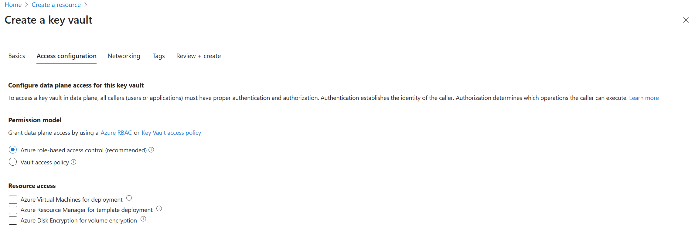
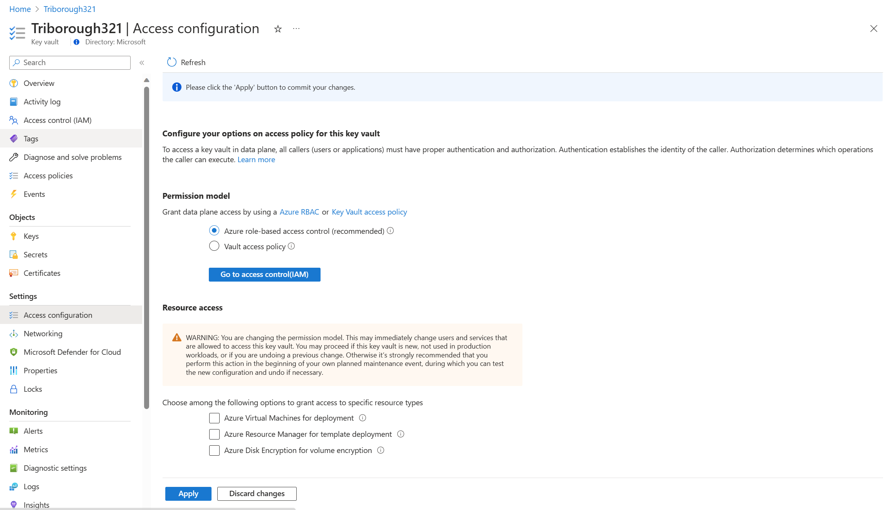
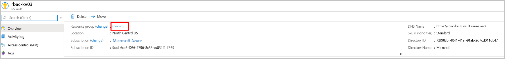
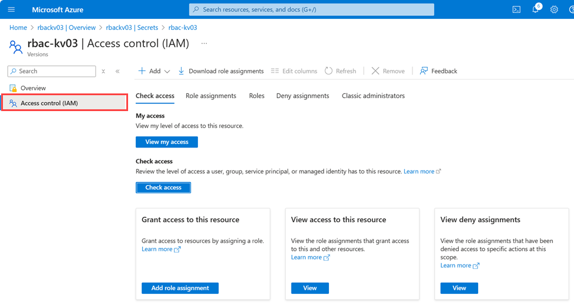
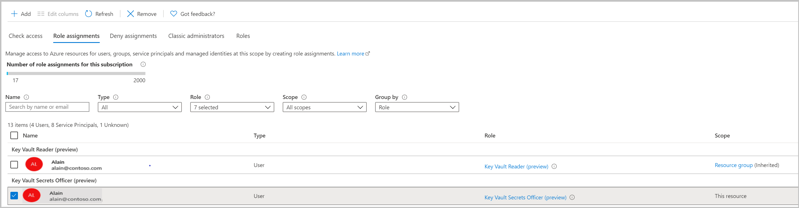
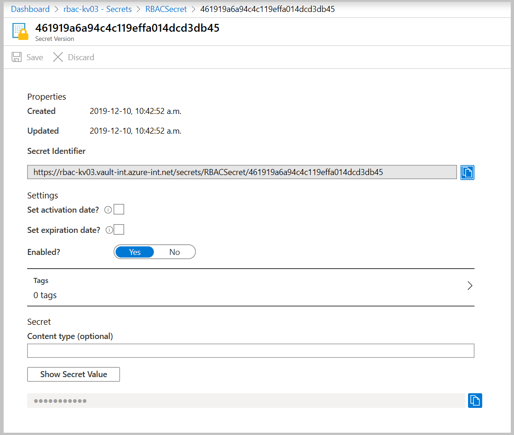
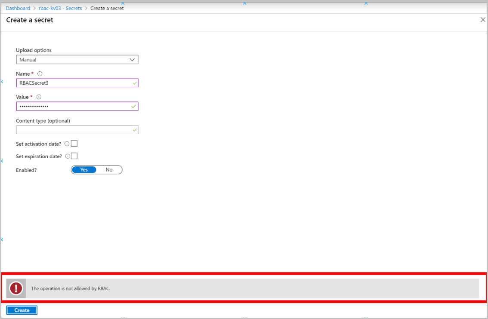
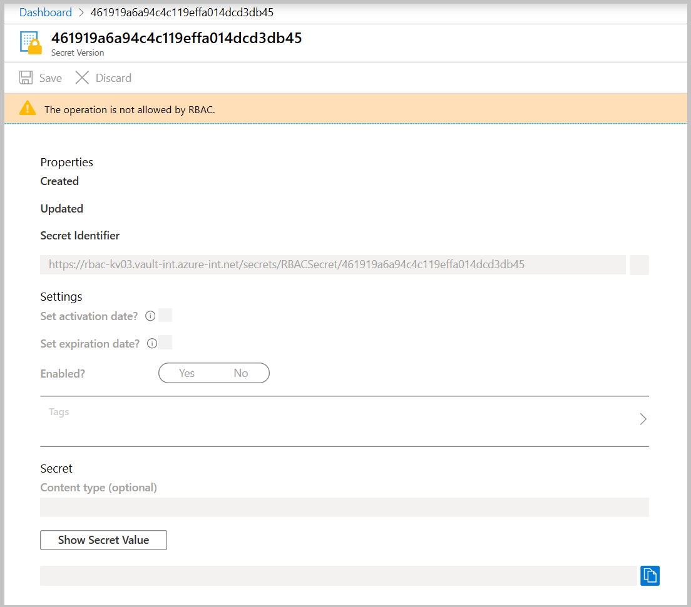

# Provide access to Key Vault keys, certificates, and secrets with an Azure role-based access control

> [!NOTE]
> Key Vault resource provider supports two resource types: **vaults** and **managed HSMs**. Access control described in this article only applies to **vaults**. To learn more about access control for managed HSM, see [Managed HSM access control](../managed-hsm/access-control.md).

> [!NOTE]
> Azure App Service certificate configuration through Azure Portal does not support Key Vault RBAC permission model. You can use Azure PowerShell, Azure CLI, ARM template deployments with **Key Vault Certificate User** role assignment for App Service global identity, for example Microsoft Azure App Service' in public cloud.

Azure role-based access control (Azure RBAC) is an authorization system built on [Azure Resource Manager](../../azure-resource-manager/management/overview.md) that provides fine-grained access management of Azure resources.

Azure RBAC allows users to manage Key, Secrets, and Certificates permissions. It provides one place to manage all permissions across all key vaults.

The Azure RBAC model allows users to set permissions on different scope levels: management group, subscription, resource group, or individual resources.  Azure RBAC for key vault also allows users to have separate permissions on individual keys, secrets, and certificates

For more information, see [Azure role-based access control (Azure RBAC)](../../role-based-access-control/overview.md).

## Best Practices for individual keys, secrets, and certificates role assignments

Our recommendation is to use a vault per application per environment
(Development, Pre-Production, and Production) with roles assigned at Key Vault scope.

Assigning roles on individual keys, secrets and certificates should be avoided. Exceptions to general guidance:

- Scenarios where individual secrets must be shared between multiple applications, for example, one application needs to access data from the other application

More about Azure Key Vault management guidelines, see:

- [Azure Key Vault best practices](best-practices.md)
- [Azure Key Vault service limits](service-limits.md)

## Azure built-in roles for Key Vault data plane operations

> [!NOTE]
> The `Key Vault Contributor` role is for management plane operations only to manage key vaults. It does not allow access to keys, secrets and certificates.

| Built-in role | Description | ID |
| --- | --- | --- |
| Key Vault Administrator| Perform all data plane operations on a key vault and  all objects in it, including certificates, keys, and secrets. Cannot manage key vault resources or manage role assignments. Only works for key vaults that use the 'Azure role-based access control' permission model. | 00482a5a-887f-4fb3-b363-3b7fe8e74483 |
| Key Vault Reader | Read metadata of key vaults and its certificates, keys, and secrets. Cannot read sensitive values such as secret contents or key material. Only works for key vaults that use the 'Azure role-based access control' permission model. | 21090545-7ca7-4776-b22c-e363652d74d2 |
| Key Vault Certificates Officer | Perform any action on the certificates of a key vault, except manage permissions. Only works for key vaults that use the 'Azure role-based access control' permission model. | a4417e6f-fecd-4de8-b567-7b0420556985 |
| Key Vault Certificate User | Read entire certificate contents including secret and key portion. Only works for key vaults that use the 'Azure role-based access control' permission model. | db79e9a7-68ee-4b58-9aeb-b90e7c24fcba |
| Key Vault Crypto Officer | Perform any action on the keys of a key vault, except manage permissions. Only works for key vaults that use the 'Azure role-based access control' permission model. | 14b46e9e-c2b7-41b4-b07b-48a6ebf60603 |
| Key Vault Crypto Service Encryption User | Read metadata of keys and perform wrap/unwrap operations. Only works for key vaults that use the 'Azure role-based access control' permission model. | e147488a-f6f5-4113-8e2d-b22465e65bf6 |
| Key Vault Crypto User  | Perform cryptographic operations using keys. Only works for key vaults that use the 'Azure role-based access control' permission model. | 12338af0-0e69-4776-bea7-57ae8d297424 |
| Key Vault Crypto Service Release User | Release keys for [Azure Confidential Computing](../../confidential-computing/concept-skr-attestation.md) and equivalent environments. Only works for key vaults that use the 'Azure role-based access control' permission model.
| Key Vault Secrets Officer| Perform any action on the secrets of a key vault, except manage permissions. Only works for key vaults that use the 'Azure role-based access control' permission model. | b86a8fe4-44ce-4948-aee5-eccb2c155cd7 |
| Key Vault Secrets User | Read secret contents including secret portion of a certificate with private key. Only works for key vaults that use the 'Azure role-based access control' permission model. | 4633458b-17de-408a-b874-0445c86b69e6 |

For more information about Azure built-in roles definitions, see [Azure built-in roles](../../role-based-access-control/built-in-roles.md).

### Managing built-in Key Vault data plane role assignments

| Built-in role | Description | ID |
| --- | --- | --- |
| Key Vault Data Access Administrator | Manage access to Azure Key Vault by adding or removing role assignments for the Key Vault Administrator, Key Vault Certificates Officer, Key Vault Crypto Officer, Key Vault Crypto Service Encryption User, Key Vault Crypto User, Key Vault Reader, Key Vault Secrets Officer, or Key Vault Secrets User roles. Includes an ABAC condition to constrain role assignments. | 8b54135c-b56d-4d72-a534-26097cfdc8d8 |

## Using Azure RBAC secret, key, and certificate permissions with Key Vault

The new Azure RBAC permission model for key vault provides alternative to the vault access policy permissions model. 

### Prerequisites

You must have an Azure subscription. If you don't, you can create a [free account](https://azure.microsoft.com/free/?WT.mc_id=A261C142F) before you begin.

To add role assignments, you must have `Microsoft.Authorization/roleAssignments/write` and `Microsoft.Authorization/roleAssignments/delete` permissions, such as [Key Vault Data Access Administrator](../../role-based-access-control/built-in-roles.md#key-vault-data-access-administrator), [User Access Administrator](../../role-based-access-control/built-in-roles.md#user-access-administrator),or [Owner](../../role-based-access-control/built-in-roles.md#owner).

### Enable Azure RBAC permissions on Key Vault

> [!NOTE]
> Changing permission model requires 'Microsoft.Authorization/roleAssignments/write' permission, which is part of [Owner](../../role-based-access-control/built-in-roles.md#owner) and [User Access Administrator](../../role-based-access-control/built-in-roles.md#user-access-administrator) roles. Classic subscription administrator roles like 'Service Administrator' and 'Co-Administrator' are not supported.

1.  Enable Azure RBAC permissions on new key vault:

    

2.  Enable Azure RBAC permissions on existing key vault:

    

> [!IMPORTANT]
> Setting Azure RBAC permission model invalidates all access policies permissions. It can cause outages when equivalent Azure roles aren't assigned.

### Assign role

> [!Note]
> It's recommended to use the unique role ID instead of the role name in scripts. Therefore, if a role is renamed, your scripts would continue to work. In this document role name is used only for readability.

Run the following command to create a role assignment:

# [Azure CLI](#tab/azure-cli)
```azurecli
az role assignment create --role <role_name_or_id> --assignee <assignee> --scope <scope>
```

For full details, see [Assign Azure roles using Azure CLI](../../role-based-access-control/role-assignments-cli.md).

# [Azure PowerShell](#tab/azurepowershell)

```azurepowershell
#Assign by User Principal Name
New-AzRoleAssignment -RoleDefinitionName <role_name> -SignInName <assignee_upn> -Scope <scope>

#Assign by Service Principal ApplicationId
New-AzRoleAssignment -RoleDefinitionName Reader -ApplicationId <applicationId> -Scope <scope>
```

For full details, see [Assign Azure roles using Azure PowerShell](../../role-based-access-control/role-assignments-powershell.md).

---

To assign roles using the Azure portal, see [Assign Azure roles using the Azure portal](../../role-based-access-control/role-assignments-portal.md).  In the Azure portal, the Azure role assignments screen is available for all resources on the Access control (IAM) tab.

### Resource group scope role assignment

1. Go to the Resource Group that contains your key vault.

    

1. Select **Access control (IAM)**.

1. Select **Add** > **Add role assignment** to open the Add role assignment page.

1. Assign the following role. For detailed steps, see [Assign Azure roles using the Azure portal](../../role-based-access-control/role-assignments-portal.md).
    
    | Setting | Value |
    | --- | --- |
    | Role | "Key Vault Reader" |
    | Assign access to | Current user |
    | Members | Search by email address |

    


# [Azure CLI](#tab/azure-cli)
```azurecli
az role assignment create --role "Key Vault Reader" --assignee {i.e user@microsoft.com} --scope /subscriptions/{subscriptionid}/resourcegroups/{resource-group-name}
```

For full details, see [Assign Azure roles using Azure CLI](../../role-based-access-control/role-assignments-cli.md).

# [Azure PowerShell](#tab/azurepowershell)

```azurepowershell
#Assign by User Principal Name
New-AzRoleAssignment -RoleDefinitionName 'Key Vault Reader' -SignInName {i.e user@microsoft.com} -Scope /subscriptions/{subscriptionid}/resourcegroups/{resource-group-name}

#Assign by Service Principal ApplicationId
New-AzRoleAssignment -RoleDefinitionName 'Key Vault Reader' -ApplicationId {i.e 8ee5237a-816b-4a72-b605-446970e5f156} -Scope /subscriptions/{subscriptionid}/resourcegroups/{resource-group-name}
```
For full details, see [Assign Azure roles using Azure PowerShell](../../role-based-access-control/role-assignments-powershell.md).

---

Above role assignment provides ability to list key vault objects in key vault.

### Key Vault scope role assignment

1. Go to Key Vault \> Access control (IAM) tab
1. Select **Add** > **Add role assignment** to open the Add role assignment page.

1. Assign the following role. For detailed steps, see [Assign Azure roles using the Azure portal](../../role-based-access-control/role-assignments-portal.md).
    
    | Setting | Value |
    | --- | --- |
    | Role | "Key Vault Secrets Officer" |
    | Assign access to | Current user |
    | Members | Search by email address |

    


# [Azure CLI](#tab/azure-cli)
```azurecli
az role assignment create --role "Key Vault Secrets Officer" --assignee {i.e jalichwa@microsoft.com} --scope /subscriptions/{subscriptionid}/resourcegroups/{resource-group-name}/providers/Microsoft.KeyVault/vaults/{key-vault-name}
```

For full details, see [Assign Azure roles using Azure CLI](../../role-based-access-control/role-assignments-cli.md).

# [Azure PowerShell](#tab/azurepowershell)

```azurepowershell
#Assign by User Principal Name
New-AzRoleAssignment -RoleDefinitionName 'Key Vault Secrets Officer' -SignInName {i.e user@microsoft.com} -Scope /subscriptions/{subscriptionid}/resourcegroups/{resource-group-name}/providers/Microsoft.KeyVault/vaults/{key-vault-name}

#Assign by Service Principal ApplicationId
New-AzRoleAssignment -RoleDefinitionName 'Key Vault Secrets Officer' -ApplicationId {i.e 8ee5237a-816b-4a72-b605-446970e5f156} -Scope /subscriptions/{subscriptionid}/resourcegroups/{resource-group-name}/providers/Microsoft.KeyVault/vaults/{key-vault-name}
```

For full details, see [Assign Azure roles using Azure PowerShell](../../role-based-access-control/role-assignments-powershell.md).

---

### Secret scope role assignment

> [!NOTE]
> Key vault secret, certificate, key scope role assignments should only be used for limited scenarios described [here](rbac-guide.md?i#best-practices-for-individual-keys-secrets-and-certificates-role-assignments) to comply with security best practices.

1. Open a previously created secret.

1. Click the Access control(IAM) tab

    

1. Select **Add** > **Add role assignment** to open the Add role assignment page.

1. Assign the following role. For detailed steps, see [Assign Azure roles using the Azure portal](../../role-based-access-control/role-assignments-portal.md).
    
    | Setting | Value |
    | --- | --- |
    | Role | "Key Vault Secrets Officer" |
    | Assign access to | Current user |
    | Members | Search by email address |

    


# [Azure CLI](#tab/azure-cli)
```azurecli
az role assignment create --role "Key Vault Secrets Officer" --assignee {i.e user@microsoft.com} --scope /subscriptions/{subscriptionid}/resourcegroups/{resource-group-name}/providers/Microsoft.KeyVault/vaults/{key-vault-name}/secrets/RBACSecret
```

For full details, see [Assign Azure roles using Azure CLI](../../role-based-access-control/role-assignments-cli.md).

# [Azure PowerShell](#tab/azurepowershell)

```azurepowershell
#Assign by User Principal Name
New-AzRoleAssignment -RoleDefinitionName 'Key Vault Secrets Officer' -SignInName {i.e user@microsoft.com} -Scope /subscriptions/{subscriptionid}/resourcegroups/{resource-group-name}/providers/Microsoft.KeyVault/vaults/{key-vault-name}/secrets/RBACSecret

#Assign by Service Principal ApplicationId
New-AzRoleAssignment -RoleDefinitionName 'Key Vault Secrets Officer' -ApplicationId {i.e 8ee5237a-816b-4a72-b605-446970e5f156} -Scope /subscriptions/{subscriptionid}/resourcegroups/{resource-group-name}/providers/Microsoft.KeyVault/vaults/{key-vault-name}/secrets/RBACSecret
```

For full details, see [Assign Azure roles using Azure PowerShell](../../role-based-access-control/role-assignments-powershell.md).

---

### Test and verify

> [!NOTE]
> Browsers use caching and page refresh is required after removing role assignments.<br>
> Allow several minutes for role assignments to refresh

1. Validate adding new secret without "Key Vault Secrets Officer" role on key vault level.

   1. Go to key vault Access control (IAM) tab and remove "Key Vault Secrets Officer" role assignment for this resource.

      

   1. Navigate to previously created secret. You can see all secret properties.

      

   1. Create new secret ( Secrets \> +Generate/Import) should show this error:

      

1. Validate secret editing without "Key Vault Secret Officer" role on secret level.

   1. Go to previously created secret Access Control (IAM) tab
    and remove "Key Vault Secrets Officer" role assignment for
    this resource.

   1. Navigate to previously created secret. You can see secret properties.

      

1. Validate secrets read without reader role on key vault level.

   1. Go to key vault resource group Access control (IAM) tab and remove "Key Vault Reader" role assignment.

   1. Navigating to key vault's Secrets tab should show this error:

      

### Creating custom roles 

[az role definition create command](/cli/azure/role/definition#az-role-definition-create)

# [Azure CLI](#tab/azure-cli)
```azurecli
az role definition create --role-definition '{ \
   "Name": "Backup Keys Operator", \
   "Description": "Perform key backup/restore operations", \
    "Actions": [ 
    ], \
    "DataActions": [ \
        "Microsoft.KeyVault/vaults/keys/read ", \
        "Microsoft.KeyVault/vaults/keys/backup/action", \
         "Microsoft.KeyVault/vaults/keys/restore/action" \
    ], \
    "NotDataActions": [ 
   ], \
    "AssignableScopes": ["/subscriptions/{subscriptionId}"] \
}'
```
# [Azure PowerShell](#tab/azurepowershell)

```azurepowershell
$roleDefinition = @"
{ 
   "Name": "Backup Keys Operator", 
   "Description": "Perform key backup/restore operations", 
    "Actions": [ 
    ], 
    "DataActions": [ 
        "Microsoft.KeyVault/vaults/keys/read ", 
        "Microsoft.KeyVault/vaults/keys/backup/action", 
         "Microsoft.KeyVault/vaults/keys/restore/action" 
    ], 
    "NotDataActions": [ 
   ], 
    "AssignableScopes": ["/subscriptions/{subscriptionId}"] 
}
"@

$roleDefinition | Out-File role.json

New-AzRoleDefinition -InputFile role.json
```
---

For more Information about how to create custom roles, see:

[Azure custom roles](../../role-based-access-control/custom-roles.md)

## Frequently Asked Questions:

### Can I use Key Vault role-based access control (RBAC) permission model object-scope assignments to provide isolation for application teams within Key Vault?
No. RBAC permission model allows you to assign access to individual objects in Key Vault to user or application, but any administrative operations like network access control, monitoring, and objects management require vault level permissions, which will then expose secure information to operators across application teams.

## Learn more

- [Azure RBAC Overview](../../role-based-access-control/overview.md)
- [Assign Azure roles using the Azure portal](../../role-based-access-control/role-assignments-portal.md)
- [Custom Roles Tutorial](../../role-based-access-control/tutorial-custom-role-cli.md)
- [Azure Key Vault best practices](best-practices.md)
