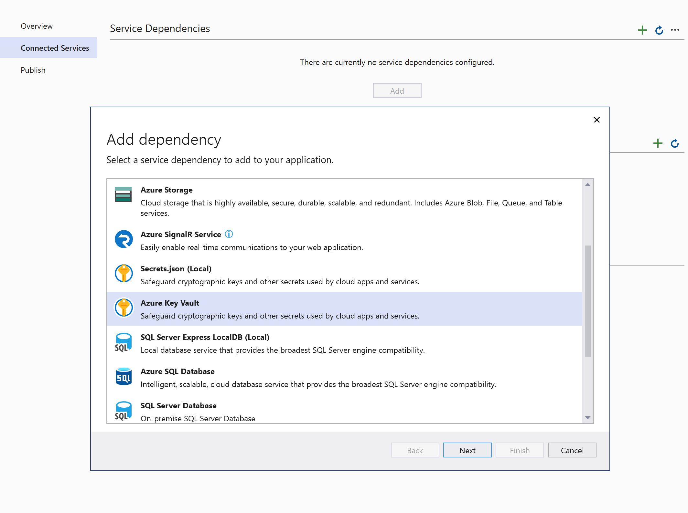
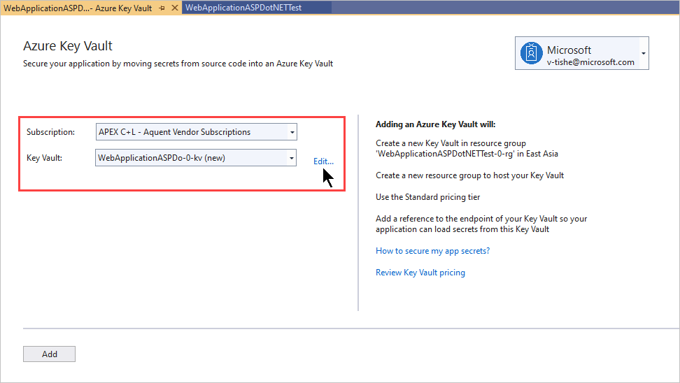
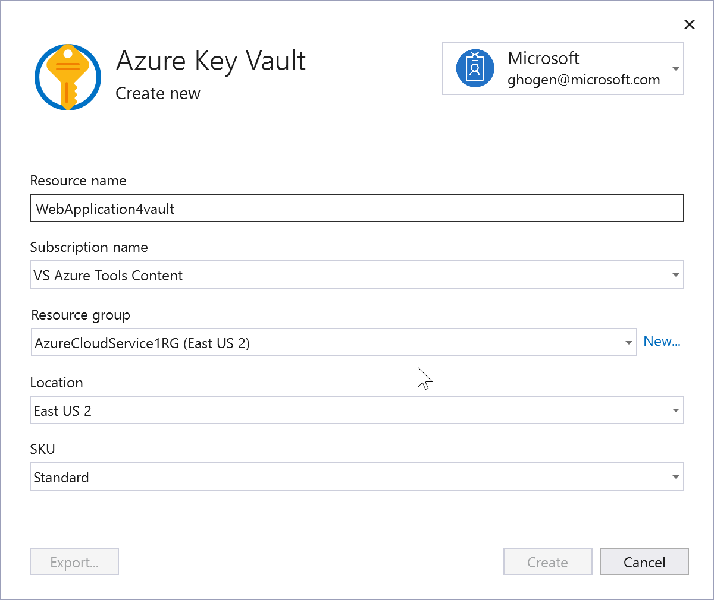
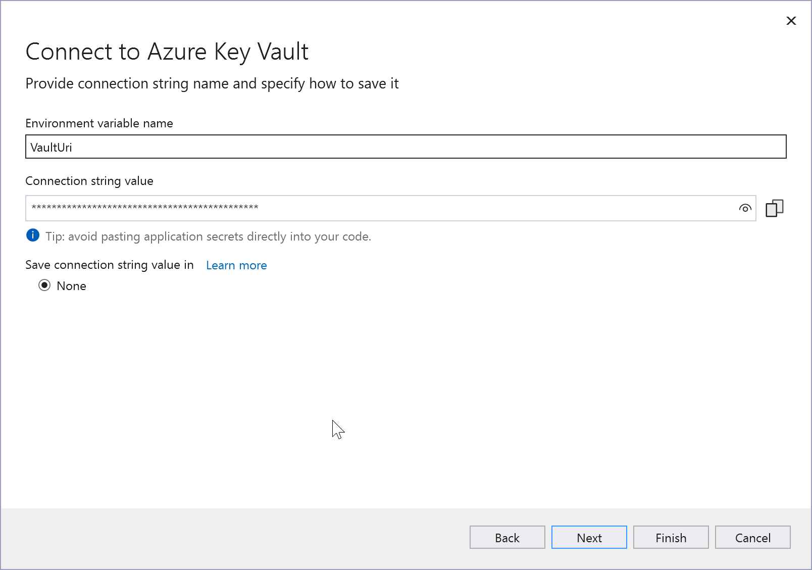

# Add Key Vault to your web application by using Visual Studio Connected Services

In this tutorial, you will learn how to easily add everything you need to start using Azure Key Vault to manage your secrets for web projects in Visual Studio, whether you are using ASP.NET Core or any type of ASP.NET project. By using the Connected Services feature in Visual Studio, you can have Visual Studio automatically add all the NuGet packages and configuration settings you need to connect to Key Vault in Azure.

For details on the changes that Connected Services makes in your project to enable Key Vault, see [Key Vault Connected Service - What happened to my ASP.NET project](#how-your-aspnet-framework-project-is-modified) or [Key Vault Connected Service - What happened to my ASP.NET Core project](#how-your-aspnet-core-project-is-modified).

## Prerequisites

- **An Azure subscription**. If you don't have a subscription, sign up for a [free account](https://azure.microsoft.com/pricing/free-trial/).
- **Visual Studio 2019 version 16.3** or later [Download it now](https://aka.ms/vsdownload?utm_source=mscom&utm_campaign=msdocs).

## Add Key Vault support to your project

Before you begin, make sure that you're signed into Visual Studio. Sign in with the same account that you use for your Azure subscription. Then open an ASP.NET 4.7.1 or later, or ASP.NET Core web project, and do the following steps. The steps shown are for Visual Studio 2022 version 17.4. The flow might be slightly different for other versions of Visual Studio.

1. In **Solution Explorer**, right-click the project that you want to add the Key Vault support to, and choose **Add** > **Connected Service**. Under **Service Dependencies**, choose the **+** icon.
   The Connected Service page appears with services you can add to your project.
1. In the menu of available services, choose **Azure Key Vault** and click **Next**.

   

1. Select the subscription you want to use, and then if you already have a Key Vault you want to use, select it and click **Next**.

   

1. If you don't have an existing Key Vault, click on **Create new Key Vault**. You'll be asked to provide the resource group, location, and SKU.

   

1. In the **Configure Key Vault** screen, you can change the name of the environment variable.

   

1. Click **Next** to review a summary of the changes and then **Finish**.

Now, connection to Key Vault is established and you can access your secrets in code. If you just created a new key vault, test it by creating a secret that you can reference in code. You can create a secret by using the [Azure portal](../secrets/quick-create-portal.md), [PowerShell](../secrets/quick-create-powershell.md), or the [Azure CLI](../secrets/quick-create-cli.md).

See code examples of working with secrets at [Azure Key Vault Secrets client library for .NET - Code examples](../secrets/quick-create-net.md?tabs=azure-cli#code-examples).

## Troubleshooting

If your Key Vault is running on a different Microsoft account than the one you're logged in to Visual Studio (for example, the Key Vault is running on your work account, but Visual Studio is using your private account) you get an error in your Program.cs file, that Visual Studio can't get access to the Key Vault. To fix this issue:

1. Go to the [Azure portal](https://portal.azure.com) and open your Key Vault.

1. Choose **Access policies**, then **Add Access Policy**, and choose the account you are logged in with as Principal.

1. In Visual Studio, choose **File** > **Account Settings**.
Select **Add an account** from the **All account** section. Sign in with the account you have chosen as Principal of your access policy.

1. Choose **Tools** > **Options**, and look for **Azure Service Authentication**. Then select the account you just added to Visual Studio.

Now, when you debug your application, Visual Studio connects to the account your Key Vault is located on.

## How your ASP.NET Core project is modified

This section identifies the exact changes made to an ASP.NET project when adding the Key Vault connected service using Visual Studio.

### Added references for ASP.NET Core

Affects the project file .NET references and NuGet package references.

| Type | Reference |
| --- | --- |
| NuGet | Microsoft.AspNetCore.AzureKeyVault.HostingStartup |

### Added files for ASP.NET Core

- `ConnectedService.json` added, which records some information about the Connected Service provider, version, and a link the documentation.

### Project file changes for ASP.NET Core

- Added the Connected Services ItemGroup and `ConnectedServices.json` file.

### launchsettings.json changes for ASP.NET Core

- Added the following environment variable entries to both the IIS Express profile and the profile that matches your web project name:

    ```json
      "environmentVariables": {
        "ASPNETCORE_HOSTINGSTARTUP__KEYVAULT__CONFIGURATIONENABLED": "true",
        "ASPNETCORE_HOSTINGSTARTUP__KEYVAULT__CONFIGURATIONVAULT": "<your keyvault URL>"
      }
    ```

### Changes on Azure for ASP.NET Core

- Created a resource group (or used an existing one).
- Created a Key Vault in the specified resource group.

## How your ASP.NET Framework project is modified

This section identifies the exact changes made to an ASP.NET project when adding the Key Vault connected service using Visual Studio.

### Added references for ASP.NET Framework

Affects the project file .NET references and `packages.config` (NuGet references).

| Type | Reference |
| --- | --- |
| .NET; NuGet | Azure.Identity |
| .NET; NuGet | Azure.Security.KeyVault.Keys |
| .NET; NuGet | Azure.Security.KeyVault.Secrets |

> [!IMPORTANT] 
> By default Azure.Identity 1.1.1 is installed, which does not support Visual Studio Credential. You can update package reference manually to 1.2+ use Visual Studio Credential.

### Added files for ASP.NET Framework

- `ConnectedService.json` added, which records some information about the Connected Service provider, version, and a link to the documentation.

### Project file changes for ASP.NET Framework

- Added the Connected Services ItemGroup and ConnectedServices.json file.
- References to the .NET assemblies described in the [Added references](#added-references-for-aspnet-framework) section.

## Next steps

If you followed this tutorial, your Key Vault permissions are set up to run with your own Azure subscription, but that might not be desirable for a production scenario. You can create a managed identity to manage Key Vault access for your app. See [How to Authenticate to Key Vault](./authentication.md) and [Assign a Key Vault access policy](./assign-access-policy-portal.md).

Learn more about Key Vault development by reading the [Key Vault Developer's Guide](developers-guide.md).

If your goal is to store configuration for an ASP.NET Core app in an Azure Key Vault, see [Azure Key Vault configuration provider in ASP.NET Core](/aspnet/core/security/key-vault-configuration).

