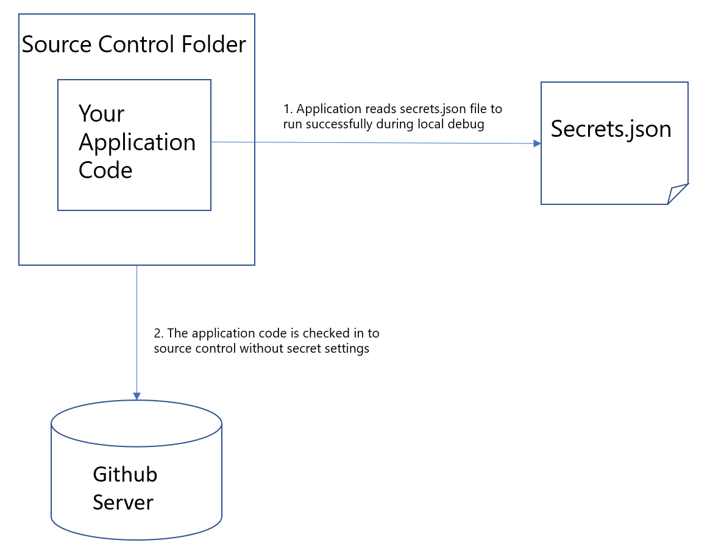
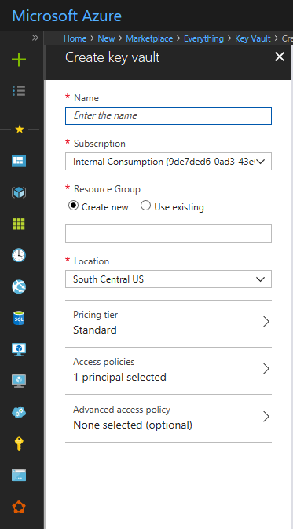
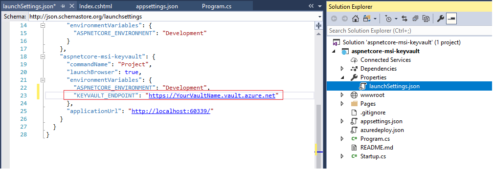

# Securely save secret application settings for a web application

## Overview
This article describes how to securely save secret application configuration settings for Azure applications.

Traditionally all web application configuration settings are saved in configuration files such as Web.config. This practice leads to checking in secret settings such as Cloud credentials to public source control systems like GitHub. Meanwhile, it could be hard to follow security best practice because of the overhead required to change source code and reconfigure development settings.

To make sure the development process is secure, tooling and framework libraries are created to save application secret settings securely with minimal or no source code change.

## ASP.NET and .NET Core applications

### Save secret settings in User Secret store that is outside of source control folder
If you are doing a quick prototype or you don't have internet access, start with moving your secret settings outside of source control folder to User Secret store. User Secret store is a file saved under user profiler folder, so secrets are not checked in to source control. The following diagram demonstrates how [User Secret](/aspnet/core/security/app-secrets?tabs=visual-studio) works.



If you are running .NET core console application, use Key Vault to save your secret securely.

### Save secret settings in Azure Key Vault
If you are developing a project and need to share source code securely, use [Azure Key Vault](https://azure.microsoft.com/services/key-vault/).

1. Create a Key Vault in your Azure subscription. Fill out all required fields on the UI and click *Create* on the bottom of the blade

    

2. Grant you and your team members access to the Key Vault. If you have a large team, you can create an [Azure Active Directory group](../../active-directory/fundamentals/active-directory-groups-create-azure-portal.md) and add that security group access to the Key Vault. In the *Secret Permissions* dropdown, check *Get* and *List* under *Secret Management Operations*.
If you already have your web app created, grant the web app access to the Key Vault so it can access the key vault without storing secret configuration in App Settings or files. Search for your web app by its name and add it the same way you grant users access.

    

3. Add your secret to Key Vault on the Azure portal. For nested configuration settings, replace ':' with '--' so the Key Vault secret name is valid. ':' is not allowed to be in the name of a Key Vault secret.

    

    > [!NOTE]
    > Prior to Visual Studio 2017 V15.6 we used to recommend installing the Azure Services Authentication extension for Visual Studio. But it is deprecated now as the functionality is integrated within the Visual Studio . Hence if you are on an older version of visual Studio 2017 , we suggest you to update to at least VS 2017 15.6 or up so that you can use this functionality natively and access the Key-vault from using the Visual Studio sign-in Identity itself.
    >

4. Log in to Azure using the CLI, you can type:

    ```azurecli
    az login
    ```

5. Add the following NuGet packages to your project:

    ```
    Azure.Identity
    Azure.Extensions.AspNetCore.Configuration.Secrets
    ```
6. Add the following code to Program.cs file:

    ```csharp
    public static IHostBuilder CreateHostBuilder(string[] args) =>
             Host.CreateDefaultBuilder(args)
                .ConfigureAppConfiguration((ctx, builder) =>
                {
                    var keyVaultEndpoint = GetKeyVaultEndpoint();
                    if (!string.IsNullOrEmpty(keyVaultEndpoint))
                    {
                        builder.AddAzureKeyVault(new Uri(keyVaultEndpoint), new DefaultAzureCredential(), new KeyVaultSecretManager());
                    }
                })
                .ConfigureWebHostDefaults(webBuilder =>
                {
                    webBuilder.UseStartup<Startup>();
                });

        private static string GetKeyVaultEndpoint() => Environment.GetEnvironmentVariable("KEYVAULT_ENDPOINT");
    ```

7. Add your Key Vault URL to launchsettings.json file. The environment variable name *KEYVAULT_ENDPOINT* is defined in the code you added in step 7.

    

8. Start debugging the project. It should run successfully.

## ASP.NET and .NET applications

.NET 4.7.1 supports Key Vault and Secret configuration builders, which ensures secrets can be moved outside of source control folder without code changes.
To proceed, [download .NET 4.7.1](https://www.microsoft.com/download/details.aspx?id=56115) and migrate your application if it's using an older version of .NET framework.

### Save secret settings in a secret file that is outside of source control folder
If you are writing a quick prototype and don't want to provision Azure resources, go with this option.

1. Right click on the project and select **Manage User Secrets**. This will install a NuGet package **Microsoft.Configuration.ConfigurationBuilders.UserSecrets** , create a file for saving secret settings outside of web.config file, and add a section **ConfigBuilders** in the web.config file.

2. Put secret settings under root element. below is an example

    ```xml
    <?xml version="1.0" encoding="utf-8"?>
    <root>
      <secrets ver="1.0">
        <secret name="secret" value="foo"/>
        <secret name="secret1" value="foo_one" />
        <secret name="secret2" value="foo_two" />
      </secrets>
    </root>
    ```

3. Specify appSettings section is using the secret configuration builder. Make sure there is an entry for the secret setting with a dummy value.

    ```xml
        <appSettings configBuilders="Secrets">
            <add key="webpages:Version" value="3.0.0.0" />
            <add key="webpages:Enabled" value="false" />
            <add key="ClientValidationEnabled" value="true" />
            <add key="UnobtrusiveJavaScriptEnabled" value="true" />
            <add key="secret" value="" />
        </appSettings>
    ```

5. Debug your app. It should run successfully.

### Save secret settings in an Azure Key Vault
Follow instructions from ASP.NET core section to configure a Key Vault for your project.

1. Install the following NuGet package to your project
   ```
   Microsoft.Configuration.ConfigurationBuilders.Azure
   ```

2. Define Key Vault configuration builder in Web.config. Put this section before *appSettings* section. Replace *vaultName* to be the Key Vault name if your Key Vault is in global Azure, or full URI if you are using Sovereign cloud.

    ```xml
     <configBuilders>
        <builders>
            <add name="Secrets" userSecretsId="695823c3-6921-4458-b60b-2b82bbd39b8d" type="Microsoft.Configuration.ConfigurationBuilders.UserSecretsConfigBuilder, Microsoft.Configuration.ConfigurationBuilders.UserSecrets, Version=2.0.0.0, Culture=neutral, PublicKeyToken=31bf3856ad364e35" />
            <add name="AzureKeyVault" vaultName="[VaultName]" type="Microsoft.Configuration.ConfigurationBuilders.AzureKeyVaultConfigBuilder, Microsoft.Configuration.ConfigurationBuilders.Azure, Version=2.0.0.0, Culture=neutral, PublicKeyToken=31bf3856ad364e35" />
        </builders>
      </configBuilders>
    ```
3. Specify appSettings section is using the Key Vault configuration builder. Make sure there is any entry for the secret setting with a dummy value.

   ```xml
   <appSettings configBuilders="AzureKeyVault">
       <add key="webpages:Version" value="3.0.0.0" />
       <add key="webpages:Enabled" value="false" />
       <add key="ClientValidationEnabled" value="true" />
       <add key="UnobtrusiveJavaScriptEnabled" value="true" />
       <add key="secret" value="" />
   </appSettings>
   ```

4. Start debugging the project. It should run successfully.