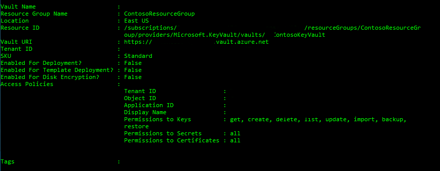

# Get started with Azure Key Vault
This article helps you get started with Azure Key Vault using PowerShell and walks you through the following activities:
- How to create a hardened container (a vault) in Azure.
- How to use KeyVault to store and manage cryptographic keys and secrets in Azure.
- How an application can use that key or password.

Azure Key Vault is available in most regions. For more information, see the [Key Vault pricing page](https://azure.microsoft.com/pricing/details/key-vault/).

For Cross-Platform Command-Line Interface instructions, see [this equivalent tutorial](key-vault-manage-with-cli2.md).

## Requirements
Before you move forward with the article confirm that you have:

- **An Azure subscription**. If you do not have one, you can sign up for a [free account](https://azure.microsoft.com/free/).
- **Azure PowerShell**, **minimum version of 1.1.0**. To install Azure PowerShell and associate it with your Azure subscription, see [How to install and configure Azure PowerShell](/powershell/azure/overview). If you have already installed Azure PowerShell and do not know the version, from the Azure PowerShell console, type `(Get-Module azure -ListAvailable).Version`. When you have Azure PowerShell version 0.9.1 through 0.9.8 installed, you can still use this tutorial with some minor changes. For example, you must use the `Switch-AzureMode AzureResourceManager` command and some of the Azure Key Vault commands have changed. For a list of the Key Vault cmdlets for versions 0.9.1 through 0.9.8, see [Azure Key Vault Cmdlets](/powershell/module/azurerm.keyvault/#key_vault).
- **An application that can be configured to use Key Vault**. A sample application is available from the [Microsoft Download Center](http://www.microsoft.com/download/details.aspx?id=45343). For instructions, see the accompanying **Readme** file.

>[!NOTE]
This article assumes a basic understanding of PowerShell and Azure. For more information on PowerShell, see [Getting started with Windows PowerShell](https://technet.microsoft.com/library/hh857337.aspx).

To get detailed help for any cmdlet that you see in this tutorial, use the **Get-Help** cmdlet.

```powershell-interactive
Get-Help <cmdlet-name> -Detailed
```
    
For example, to get help for the **Connect-AzureRmAccount** cmdlet, type:

```PowerShell
Get-Help Connect-AzureRmAccount -Detailed
```

You can also read the following articles to get familiar with Azure Resource Manager deployment model in Azure PowerShell:

* [How to install and configure Azure PowerShell](/powershell/azure/overview)
* [Using Azure PowerShell with Resource Manager](../powershell-azure-resource-manager.md)

## <a id="connect"></a>Connect to your subscriptions
Start an Azure PowerShell session and sign in to your Azure account with the following command:  

```PowerShell
Connect-AzureRmAccount
```

>[!NOTE]
 If you are using a specific instance of Azure use the -Environment parameter. For example: 
 ```powershell
 Connect-AzureRmAccount –Environment (Get-AzureRmEnvironment –Name AzureUSGovernment)
 ```

In the pop-up browser window, enter your Azure account user name and password. Azure PowerShell gets all the subscriptions that are associated with this account and by default, uses the first one.

If you have multiple subscriptions and want to specify a specific one to use for Azure Key Vault, type the following to see the subscriptions for your account:

```powershell
Get-AzureRmSubscription
```

Then, to specify the subscription to use, type:

```powershell
Set-AzureRmContext -SubscriptionId <subscription ID>
```

For more information about configuring Azure PowerShell, see [How to install and configure Azure PowerShell](/powershell/azure/overview).

## <a id="resource"></a>Create a new resource group
When you use Azure Resource Manager, all related resources are created inside a resource group. We will create a new resource group named **ContosoResourceGroup** for this tutorial:

```powershell
New-AzureRmResourceGroup –Name 'ContosoResourceGroup' –Location 'East US'
```

## <a id="vault"></a>Create a key vault
Use the [New-AzureRmKeyVault](/powershell/module/azurerm.keyvault/new-azurermkeyvault) cmdlet to create a key vault. This cmdlet has three mandatory parameters: a **resource group name**, a **key vault name**, and the **geographic location**.

For example, if you use:
- Vault name of **ContosoKeyVault**.
- Resource group name of **ContosoResourceGroup**.
- The location of **East US**.

you would type:

```powershell
New-AzureRmKeyVault -VaultName 'ContosoKeyVault' -ResourceGroupName 'ContosoResourceGroup' -Location 'East US'
```


The output of this cmdlet shows properties of the key vault that you created. The two most important properties are:

* **Vault Name**: In the example, this is **ContosoKeyVault**. You will use this name for other Key Vault cmdlets.
* **Vault URI**: In the example, this is https://contosokeyvault.vault.azure.net/. Applications that use your vault through its REST API must use this URI.

Your Azure account is now authorized to perform any operations on this key vault. As yet, nobody else is.

> [!NOTE]
> When you try to create your new key vault you may see the error **The subscription is not registered to use namespace 'Microsoft.KeyVault'**. If that message appears run `Register-AzureRmResourceProvider -ProviderNamespace "Microsoft.KeyVault"`. After the registration successfully completes, you can rerun the New-AzureRmKeyVault command. For more information, see [Register-AzureRmResourceProvider](/powershell/module/azurerm.resources/register-azurermresourceprovider).
>
>

## <a id="add"></a>Add a key or secret to the key vault
There are a couple of different ways that you may need to interact with Key Vault and keys or secrets.

### Azure Key Vault generates a software protected key

If you want Azure Key Vault to create a software-protected key for you, use the [Add-AzureKeyVaultKey](/powershell/module/azurerm.keyvault/add-azurekeyvaultkey) cmdlet, and type:

```powershell
$key = Add-AzureKeyVaultKey -VaultName 'ContosoKeyVault' -Name 'ContosoFirstKey' -Destination 'Software'
```
to view the URI for this key type:
```powershell
$key.id
```

You can reference a key that you created or uploaded to Azure Key Vault by using its URI. To get the current version you can use **https://ContosoKeyVault.vault.azure.net/keys/ContosoFirstKey**  and use **https://ContosoKeyVault.vault.azure.net/keys/ContosoFirstKey/cgacf4f763ar42ffb0a1gca546aygd87** to get this specific version.  

### Importing an existing PFX file into Azure Key Vault

In the case of existing keys stored in a pfx file that you want to upload to Azure Key Vault the steps are different. For example:
- If you have an existing software-protected key in a .PFX file
- The pfx file is named softkey.pfx 
- The file is stored in the C drive.

You can type:

```powershell
$securepfxpwd = ConvertTo-SecureString –String '123' –AsPlainText –Force  // This stores the password 123 in the variable $securepfxpwd
```

Then type the following to import the key from the .PFX file, which protects the key by software in the Key Vault service:

```powershell
$key = Add-AzureKeyVaultKey -VaultName 'ContosoKeyVault' -Name 'ContosoImportedPFX' -KeyFilePath 'c:\softkey.pfx' -KeyFilePassword $securepfxpwd
```

To display the URI for this key, type:

```powershell
$Key.id
```
To view your key, type: 

```powershell
Get-AzureKeyVaultKey –VaultName 'ContosoKeyVault'
```
If you want to view the properties of the PFX file on the portal you would see something similar to the image shown below.


### To add a secret to Azure Key Vault

To add a secret to the vault, which is a password named SQLPassword and has the value of Pa$$w0rd to Azure Key Vault, first convert the value of Pa$$w0rd to a secure string by typing:

```powershell    
$secretvalue = ConvertTo-SecureString 'Pa$$w0rd' -AsPlainText -Force
```

Then, type:

```powershell
$secret = Set-AzureKeyVaultSecret -VaultName 'ContosoKeyVault' -Name 'SQLPassword' -SecretValue $secretvalue
```


You can now reference this password that you added to Azure Key Vault, by using its URI. Use **https://ContosoVault.vault.azure.net/secrets/SQLPassword** to always get the current version, and use **https://ContosoVault.vault.azure.net/secrets/SQLPassword/90018dbb96a84117a0d2847ef8e7189d** to get this specific version.

To display the URI for this secret, type:

```powershell
$secret.Id
```
To view your secret, type: `Get-AzureKeyVaultSecret –VaultName 'ContosoKeyVault'`
Or alternatively you may view the secret on the portal.


To view the value contained in the secret as plain text:
```powershell
(get-azurekeyvaultsecret -vaultName "Contosokeyvault" -name "SQLPassword").SecretValueText
```
Now, your key vault and key or secret is ready for applications to use. You must authorize applications to use them.  

## <a id="register"></a>Register an application with Azure Active Directory
This step would usually be done by a developer, on a separate computer. It is not specific to Azure Key Vault. For detailed steps on registering an application with Azure Active Directory you should review the article titled [Integrating applications with Azure Active Directory](../active-directory/develop/quickstart-v1-integrate-apps-with-azure-ad.md) or [Use portal to create an Azure Active Directory application and service principal that can access resources](../azure-resource-manager/resource-group-create-service-principal-portal.md)

> [!IMPORTANT]
> To complete the tutorial, your account, the vault, and the application that you will register in this step must all be in the same Azure directory.


Applications that use a key vault must authenticate by using a token from Azure Active Directory. To do this, the owner of the application must first register the application in their Azure Active Directory. At the end of registration, the application owner gets the following values:

- An **Application ID** 
- An **authentication key** (also known as the shared secret). 

The application must present both these values to Azure Active Directory, to get a token. How the application is configured to do this depends on the application. For the [Key Vault sample application](https://www.microsoft.com/download/details.aspx?id=45343), the application owner sets these values in the app.config file.


To register the application in Azure Active Directory:

1. Sign in to the [Azure portal](https://portal.azure.com).
2. On the left, click **App registrations**. If you don't see app registrations you click on **more services** and find it there.  
>[!NOTE]
You must select the same directory that contains the Azure subscription with which you created your key vault. 
3. Click **New application registration**.
4. On the **Create** blade provide a name for your application, and then select **WEB APPLICATION AND/OR WEB API** (the default) and specify the **SIGN-ON URL** for your web application. If you don't have this information at this time, you can make it up for this step (for example, you could specify http://test1.contoso.com ). It does not matter if these sites exist. 

    
    >[!WARNING]
    Make sure that you chose **WEB APPLICATION AND/OR WEB API** if you did not you will not see the **keys** option under settings.

5. Click the **Create** button.
6. When the app registration is completed you can see the list of registered apps. Find the app that you just registered and click on it.
7. Click on the **Registered app** blade copy the **Application ID**
8. Click on **All settings**
9. On the **Settings** blade click on **keys**
9. Type in a description in the **Key description** box and select a duration, and then click **SAVE**. The page refreshes and now shows a key value. 
10. You will use the **Application ID** and the **Key** information in the next step to set permissions on your vault.

## <a id="authorize"></a>Authorize the application to use the key or secret
There are two ways to authorize the application to access the key or secret in the vault.

### Using PowerShell
To use PowerShell, use the [Set-AzureRmKeyVaultAccessPolicy](/powershell/module/azurerm.keyvault/set-azurermkeyvaultaccesspolicy) cmdlet.

For example, if your vault name is **ContosoKeyVault** and the application you want to authorize has a client ID of 8f8c4bbd-485b-45fd-98f7-ec6300b7b4ed, and you want to authorize the application to decrypt and sign with keys in your vault, run the following:

```powershell
Set-AzureRmKeyVaultAccessPolicy -VaultName 'ContosoKeyVault' -ServicePrincipalName 8f8c4bbd-485b-45fd-98f7-ec6300b7b4ed -PermissionsToKeys decrypt,sign
```

If you want to authorize that same application to read secrets in your vault, run the following:

```powershell
Set-AzureRmKeyVaultAccessPolicy -VaultName 'ContosoKeyVault' -ServicePrincipalName 8f8c4bbd-485b-45fd-98f7-ec6300b7b4ed -PermissionsToSecrets Get
```
### Using the Azure portal
To change the authorization of an application to use keys or secrets:
1. Select **Access Policies** from the Key Vault resource blade
2. Click the [+ Add new] button at the top of the blade
3. Click **Select Principal** to select the application you created earlier
4. From the **Key permissions** drop down, select "Decrypt" and "Sign" to authorize the application to decrypt and sign with keys in your vault
5. From the **Secret permissions** drop-down, select "Get" to allow the application to read secrets in the vault

## <a id="HSM"></a>Working with a hardware security module (HSM)
For added assurance, you can import or generate keys in hardware security modules (HSMs) that never leave the HSM boundary. The HSMs are FIPS 140-2 Level 2 validated. If this requirement doesn't apply to you, skip this section and go to [Delete the key vault and associated keys and secrets](#delete).

To create these HSM-protected keys, you must use the [Azure Key Vault Premium service tier to support HSM-protected keys](https://azure.microsoft.com/pricing/details/key-vault/). In addition, note that this functionality is not available for Azure China.

When you create the key vault, add the **-SKU** parameter:

```powershell
New-AzureRmKeyVault -VaultName 'ContosoKeyVaultHSM' -ResourceGroupName 'ContosoResourceGroup' -Location 'East US' -SKU 'Premium'
```


You can add software-protected keys (as shown earlier) and HSM-protected keys to this key vault. To create an HSM-protected key, set the **-Destination** parameter to 'HSM':

```powershell
$key = Add-AzureKeyVaultKey -VaultName 'ContosoKeyVaultHSM' -Name 'ContosoFirstHSMKey' -Destination 'HSM'
```

You can use the following command to import a key from a .PFX file on your computer. This command imports the key into HSMs in the Key Vault service:

```powershell
$key = Add-AzureKeyVaultKey -VaultName 'ContosoKeyVaultHSM' -Name 'ContosoFirstHSMKey' -KeyFilePath 'c:\softkey.pfx' -KeyFilePassword $securepfxpwd -Destination 'HSM'
```

The next command imports a “bring your own key" (BYOK) package. This scenario lets you generate your key in your local HSM, and transfer it to HSMs in the Key Vault service, without the key leaving the HSM boundary:

```powershell
$key = Add-AzureKeyVaultKey -VaultName 'ContosoKeyVaultHSM' -Name 'ContosoFirstHSMKey' -KeyFilePath 'c:\ITByok.byok' -Destination 'HSM'
```

For more detailed instructions about how to generate this BYOK package, see [How to generate and transfer HSM-protected keys for Azure Key Vault](key-vault-hsm-protected-keys.md).

## <a id="delete"></a>Delete the key vault and associated keys and secrets
If you no longer need the key vault and the key or secret that it contains, you can delete the key vault by using the [Remove-AzureRmKeyVault](/powershell/module/azurerm.keyvault/remove-azurermkeyvault) cmdlet:

```powershell
Remove-AzureRmKeyVault -VaultName 'ContosoKeyVault'
```

Or, you can delete an entire Azure resource group, which includes the key vault and any other resources that you included in that group:

```powershell
Remove-AzureRmResourceGroup -ResourceGroupName 'ContosoResourceGroup'
```

## <a id="other"></a>Other Azure PowerShell Cmdlets
Other commands that you might find useful for managing Azure Key Vault:

- `$Keys = Get-AzureKeyVaultKey -VaultName 'ContosoKeyVault'`: This command gets a tabular display of all keys and selected properties.
- `$Keys[0]`: This command displays a full list of properties for the specified key
- `Get-AzureKeyVaultSecret`: This command lists a tabular display of all secret names and selected properties.
- `Remove-AzureKeyVaultKey -VaultName 'ContosoKeyVault' -Name 'ContosoFirstKey'`: Example how to remove a specific key.
- `Remove-AzureKeyVaultSecret -VaultName 'ContosoKeyVault' -Name 'SQLPassword'`: Example how to remove a specific secret.

## Next steps

- For overview information about Azure Key Vault, see [What is Azure Key Vault?](key-vault-whatis.md)
- To see how your key vault is being used, see [Azure Key Vault Logging](key-vault-logging.md).
- For a follow-up tutorial that uses Azure Key Vault in a web application, see [Use Azure Key Vault from a Web Application](key-vault-use-from-web-application.md).
- For programming references, see [the Azure Key Vault developer's guide](key-vault-developers-guide.md).
- For a list of the latest Azure PowerShell cmdlets for Azure Key Vault, see [Azure Key Vault Cmdlets](/powershell/module/azurerm.keyvault/#key_vault).
