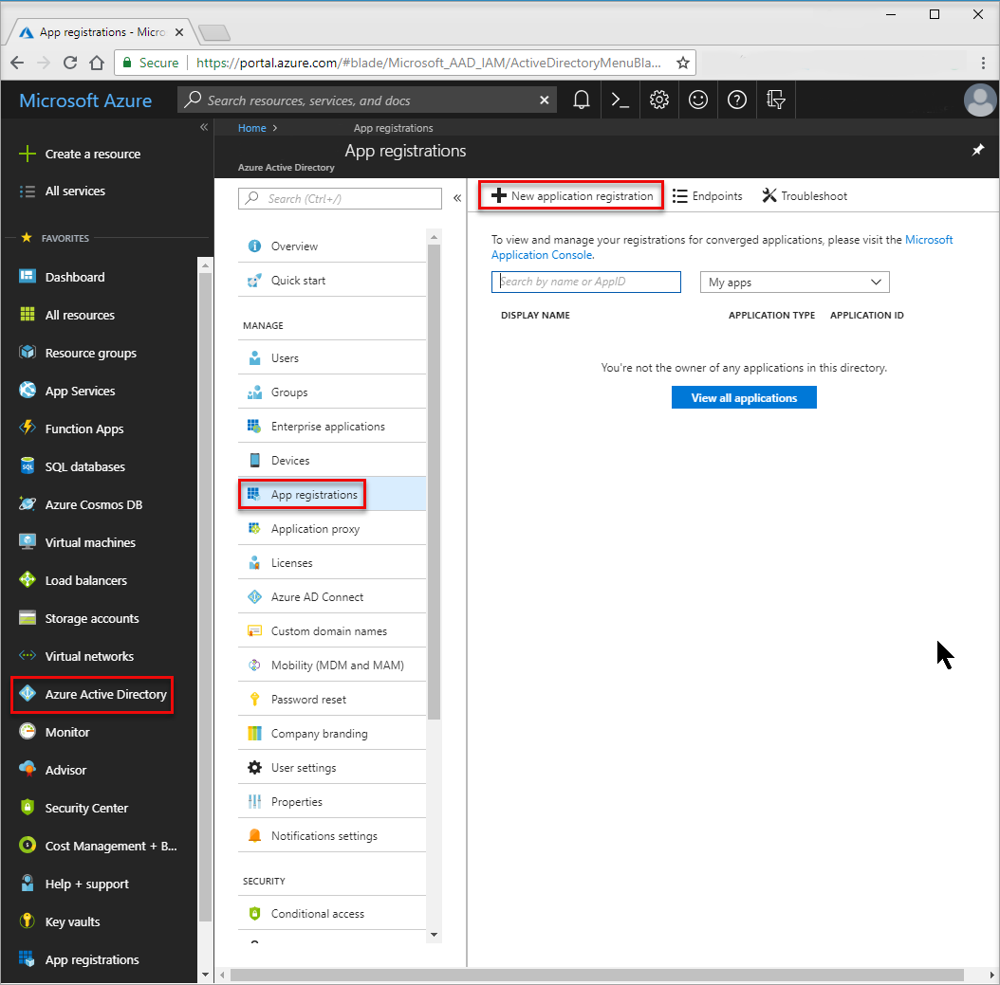
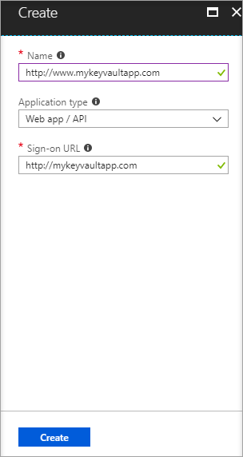
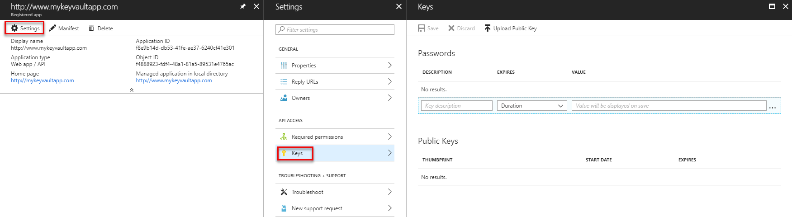

---
title: Set up Azure Key Vault with end-to-end key rotation and auditing | Microsoft Docs
description: Use this how-to to help you get set up with key rotation and monitoring key vault logs.
services: key-vault
documentationcenter: ''
author: barclayn
manager: mbaldwin
tags: ''

ms.assetid: 9cd7e15e-23b8-41c0-a10a-06e6207ed157
ms.service: key-vault
ms.workload: identity
ms.tgt_pltfrm: na
ms.devlang: na
ms.topic: conceptual
ms.date: 06/12/2018
ms.author: barclayn

---
# Set up Azure Key Vault with key rotation and auditing

## Introduction

After you have a key vault, you can start using it to store keys and secrets. Your applications no longer need to persist your keys or secrets, but can request them from the vault as needed. This allows you to update keys and secrets without affecting the behavior of your application, which opens up a breadth of possibilities around your key and secret management.

>[!IMPORTANT]
> The examples in this article are provided for illustration purposes only. They are not intended for production use. 

This article walks through:

- An example of using Azure Key Vault to store a secret. In this tutorial, the secret stored is the Azure Storage Account key accessed by an application. 
- It also demonstrates implementation of a scheduled rotation of that storage account key.
- It demonstrates how to monitor the key vault audit logs and raise alerts when unexpected requests are made.

> [!NOTE]
> This tutorial is not intended to explain in detail the initial setup of your key vault. For this information, see [Get started with Azure Key Vault](key-vault-get-started.md). For Cross-Platform Command-Line Interface instructions, see [Manage Key Vault using CLI](key-vault-manage-with-cli2.md).
>
>

## Set up Key Vault

To enable an application to retrieve a secret from Key Vault, you must first create the secret and upload it to your vault. This can be accomplished by starting an Azure PowerShell session and signing in to your Azure account with the following command:

```powershell
Connect-AzureRmAccount
```

In the pop-up browser window, enter your Azure account user name and password. PowerShell will get all the subscriptions that are associated with this account. PowerShell uses the first one by default.

If you have multiple subscriptions, you might have to specify the one that was used to create your key vault. Enter the following to see the subscriptions for your account:

```powershell
Get-AzureRmSubscription
```

To specify the subscription that's associated with the key vault you will be logging, enter:

```powershell
Set-AzureRmContext -SubscriptionId <subscriptionID>
```

Because this article demonstrates storing a storage account key as a secret, you must get that storage account key.

```powershell
Get-AzureRmStorageAccountKey -ResourceGroupName <resourceGroupName> -Name <storageAccountName>
```

After retrieving your secret (in this case, your storage account key), you must convert that to a secure string and then create a secret with that value in your key vault.

```powershell
$secretvalue = ConvertTo-SecureString <storageAccountKey> -AsPlainText -Force

Set-AzureKeyVaultSecret -VaultName <vaultName> -Name <secretName> -SecretValue $secretvalue
```

Next, get the URI for the secret you created. This is used in a later step when you call the key vault to retrieve your secret. Run the following PowerShell command and make note of the ID value, which is the secret URI:

```powershell
Get-AzureKeyVaultSecret –VaultName <vaultName>
```

## Set up the application

Now that you have a secret stored, you can use code to retrieve and use it. There are a few steps required to achieve this. The first and most important step is registering your application with Azure Active Directory and then telling Key Vault your application information so that it can allow requests from your application.

> [!NOTE]
> Your application must be created on the same Azure Active Directory tenant as your key vault.
>
>

1. Navigate to Azure Active Directory.
2. Choose **App registrations** 
3. Choose **New application registration** to add an application to your Azure Active Directory.

    

4. In the **Create** section Leave the application type as **WEB APPLICATION AND/OR WEB API** and give your application a name. Give your application a **SIGN-ON URL**. This can be anything you want for this demo.

    

5. After the application is added to Azure Active Directory, you will be brought into the application page. Select **Settings**  and then select properties. Copy the **Application ID** value. It will be needed in later steps.

Next, generate a key for your application so it can interact with your Azure Active Directory. You can create a key under by navigating to the **Keys** section under **Settings**. Make note of the newly generated key from your Azure Active Directory application for use in a later step. Notice that the key will not be available after you navigate out of this section. 



Before establishing any calls from your application into the key vault, you must tell the key vault about your application and its permissions. The following command takes the vault name and the application ID from your Azure Active Directory app and grants
**Get** access to your key vault for the application.

```powershell
Set-AzureRmKeyVaultAccessPolicy -VaultName <vaultName> -ServicePrincipalName <clientIDfromAzureAD> -PermissionsToSecrets Get
```

At this point, you are ready to start building your application calls. In your application, you must install the NuGet packages required to interact with Azure Key Vault and Azure Active Directory. From the Visual Studio Package Manager console, enter the following commands. At the writing of this article, the current version of the Azure Active Directory package is 3.10.305231913, so you might want to confirm the latest version and update accordingly.

```powershell
Install-Package Microsoft.IdentityModel.Clients.ActiveDirectory -Version 3.10.305231913

Install-Package Microsoft.Azure.KeyVault
```

In your application code, create a class to hold the method for your Azure Active Directory authentication. In this example, that class is called **Utils**. Add the following using statement:

```csharp
using Microsoft.IdentityModel.Clients.ActiveDirectory;
```

Next, add the following method to retrieve the JWT token from Azure Active Directory. For maintainability, you may want to move the hard-coded string values into your web or application configuration.

```csharp
public async static Task<string> GetToken(string authority, string resource, string scope)
{
    var authContext = new AuthenticationContext(authority);

    ClientCredential clientCred = new ClientCredential("<AzureADApplicationClientID>","<AzureADApplicationClientKey>");

    AuthenticationResult result = await authContext.AcquireTokenAsync(resource, clientCred);

    if (result == null)

    throw new InvalidOperationException("Failed to obtain the JWT token");

    return result.AccessToken;
}
```

Add the necessary code to call Key Vault and retrieve your secret value. First you must add the following using statement:

```csharp
using Microsoft.Azure.KeyVault;
```

Add the method calls to invoke Key Vault and retrieve your secret. In this method, you provide the secret URI that you saved in a previous step. Note the use of the **GetToken** method from the **Utils** class created previously.

```csharp
var kv = new KeyVaultClient(new KeyVaultClient.AuthenticationCallback(Utils.GetToken));

var sec = kv.GetSecretAsync(<SecretID>).Result.Value;
```

When you run your application, you should now be authenticating to Azure Active Directory and then retrieving your secret value from Azure Key Vault.

## Key rotation using Azure Automation

There are various options for implementing a rotation strategy for values you store as Azure Key Vault secrets. Secrets can be rotated as part of a manual process, they may be rotated programmatically by using API calls, or they may be rotated by way of an Automation script. For the purposes of this article, you will be using Azure PowerShell combined with Azure Automation to change an Azure Storage Account access key. You will then update a key vault secret with that new key.

To allow Azure Automation to set secret values in your key vault, you must get the client ID for the connection named AzureRunAsConnection, which was created when you established your Azure Automation instance. You can find this ID by choosing **Assets** from your Azure Automation instance. From there, you choose **Connections** and then select the **AzureRunAsConnection** service principle. Take note of the **Application ID**.


In **Assets**, choose **Modules**. From **Modules**, select **Gallery**, and then search for and **Import** updated versions of each of the following modules:

    Azure
    Azure.Storage
    AzureRM.Profile
    AzureRM.KeyVault
    AzureRM.Automation
    AzureRM.Storage


> [!NOTE]
> At the writing of this article, only the previously noted modules needed to be updated for the following script. If you find that your automation job is failing, confirm that you have imported all necessary modules and their dependencies.
>
>

After you have retrieved the application ID for your Azure Automation connection, you must tell your key vault that this application has access to update secrets in your vault. This can be accomplished with the following PowerShell command:

```powershell
Set-AzureRmKeyVaultAccessPolicy -VaultName <vaultName> -ServicePrincipalName <applicationIDfromAzureAutomation> -PermissionsToSecrets Set
```

Next, select **Runbooks** under your Azure Automation instance, and then select **Add a Runbook**. Select **Quick Create**. Name your runbook and select **PowerShell** as the runbook type. You have the option to add a description. Finally, click **Create**.


Paste the following PowerShell script in the editor pane for your new runbook:

```powershell
$connectionName = "AzureRunAsConnection"
try
{
    # Get the connection "AzureRunAsConnection "
    $servicePrincipalConnection=Get-AutomationConnection -Name $connectionName         

    "Logging in to Azure..."
    Connect-AzureRmAccount `
        -ServicePrincipal `
        -TenantId $servicePrincipalConnection.TenantId `
        -ApplicationId $servicePrincipalConnection.ApplicationId `
        -CertificateThumbprint $servicePrincipalConnection.CertificateThumbprint
    "Login complete."
}
catch {
    if (!$servicePrincipalConnection)
    {
        $ErrorMessage = "Connection $connectionName not found."
        throw $ErrorMessage
    } else{
        Write-Error -Message $_.Exception
        throw $_.Exception
    }
}

#Optionally you may set the following as parameters
$StorageAccountName = <storageAccountName>
$RGName = <storageAccountResourceGroupName>
$VaultName = <keyVaultName>
$SecretName = <keyVaultSecretName>

#Key name. For example key1 or key2 for the storage account
New-AzureRmStorageAccountKey -ResourceGroupName $RGName -Name $StorageAccountName -KeyName "key2" -Verbose
$SAKeys = Get-AzureRmStorageAccountKey -ResourceGroupName $RGName -Name $StorageAccountName

$secretvalue = ConvertTo-SecureString $SAKeys[1].Value -AsPlainText -Force

$secret = Set-AzureKeyVaultSecret -VaultName $VaultName -Name $SecretName -SecretValue $secretvalue
```

From the editor pane, choose **Test pane** to test your script. Once the script is running without error, you can select **Publish**, and then you can apply a schedule for the runbook back in the runbook configuration pane.

## Key Vault auditing pipeline
When you set up a key vault, you can turn on auditing to collect logs on access requests made to the key vault. These logs are stored in a designated Azure Storage account and can be pulled out, monitored, and analyzed. The following scenario uses Azure functions, Azure logic apps, and key vault audit logs to create a pipeline to send an email when an app that does match the app ID of the web app retrieves secrets from the vault.

First, you must enable logging on your key vault. This can be done via the following PowerShell commands (full details can be seen at [key-vault-logging](key-vault-logging.md)):

```powershell
$sa = New-AzureRmStorageAccount -ResourceGroupName <resourceGroupName> -Name <storageAccountName> -Type Standard\_LRS -Location 'East US'
$kv = Get-AzureRmKeyVault -VaultName '<vaultName>'
Set-AzureRmDiagnosticSetting -ResourceId $kv.ResourceId -StorageAccountId $sa.Id -Enabled $true -Categories AuditEvent
```

After this is enabled, audit logs start collecting into the designated storage account. These logs contain events about how and when your key vaults are accessed, and by whom.

> [!NOTE]
> You can access your logging information 10 minutes after the key vault operation. It will usually be quicker than this.
>
>

The next step is to [create an Azure Service Bus queue](../service-bus-messaging/service-bus-dotnet-get-started-with-queues.md). This is where key vault audit logs are pushed. When the audit log messages are in the queue, the logic app picks them up and acts on them. Create a service bus with the following steps:

1. Create a Service Bus namespace (if you already have one that you want to use for this, skip to Step 2).
2. Browse to the service bus in the Azure portal and select the namespace you want to create the queue in.
3. Select **Create a resource**, **Enterprise Integration**, **Service Bus**, and then enter the required details.
4. Select the Service Bus connection information by choosing the namespace and clicking **Connection Information**. You will need this information for the next section.

Next, [create an Azure function](../azure-functions/functions-create-first-azure-function.md) to poll key vault logs within the storage account and pick up new events. This will be a function that is triggered on a schedule.

To create an Azure function, choose **Create a resource**, search the marketplace for _Function App_, and click **Create**. During creation, you can use an existing hosting plan or create a new one. You could also opt for dynamic hosting. More details on Function hosting options can be found at [How to scale Azure Functions](../azure-functions/functions-scale.md).

When the Azure function is created, navigate to it and choose a timer function and C\#. Then click **Create this function**.


On the **Develop** tab, replace the run.csx code with the following:

```csharp
#r "Newtonsoft.Json"

using System;
using Microsoft.WindowsAzure.Storage;
using Microsoft.WindowsAzure.Storage.Auth;
using Microsoft.WindowsAzure.Storage.Blob;
using Microsoft.ServiceBus.Messaging;
using System.Text;

public static void Run(TimerInfo myTimer, TextReader inputBlob, TextWriter outputBlob, TraceWriter log)
{
    log.Info("Starting");

    CloudStorageAccount sourceStorageAccount = new CloudStorageAccount(new StorageCredentials("<STORAGE_ACCOUNT_NAME>", "<STORAGE_ACCOUNT_KEY>"), true);

    CloudBlobClient sourceCloudBlobClient = sourceStorageAccount.CreateCloudBlobClient();

    var connectionString = "<SERVICE_BUS_CONNECTION_STRING>";
    var queueName = "<SERVICE_BUS_QUEUE_NAME>";

    var sbClient = QueueClient.CreateFromConnectionString(connectionString, queueName);

    DateTime dtPrev = DateTime.UtcNow;
    if(inputBlob != null)
    {
        var txt = inputBlob.ReadToEnd();

        if(!string.IsNullOrEmpty(txt))
        {
            dtPrev = DateTime.Parse(txt);
            log.Verbose($"SyncPoint: {dtPrev.ToString("O")}");
        }
        else
        {
            dtPrev = DateTime.UtcNow;
            log.Verbose($"Sync point file didnt have a date. Setting to now.");
        }
    }

    var now = DateTime.UtcNow;

    string blobPrefix = "insights-logs-auditevent/resourceId=/SUBSCRIPTIONS/<SUBSCRIPTION_ID>/RESOURCEGROUPS/<RESOURCE_GROUP_NAME>/PROVIDERS/MICROSOFT.KEYVAULT/VAULTS/<KEY_VAULT_NAME>/y=" + now.Year +"/m="+now.Month.ToString("D2")+"/d="+ (now.Day).ToString("D2")+"/h="+(now.Hour).ToString("D2")+"/m=00/";

    log.Info($"Scanning:  {blobPrefix}");

    IEnumerable<IListBlobItem> blobs = sourceCloudBlobClient.ListBlobs(blobPrefix, true);

    log.Info($"found {blobs.Count()} blobs");

    foreach(var item in blobs)
    {
        if (item is CloudBlockBlob)
        {
            CloudBlockBlob blockBlob = (CloudBlockBlob)item;

            log.Info($"Syncing: {item.Uri}");

            string sharedAccessUri = GetContainerSasUri(blockBlob);

            CloudBlockBlob sourceBlob = new CloudBlockBlob(new Uri(sharedAccessUri));

            string text;
            using (var memoryStream = new MemoryStream())
            {
                sourceBlob.DownloadToStream(memoryStream);
                text = System.Text.Encoding.UTF8.GetString(memoryStream.ToArray());
            }

            dynamic dynJson = JsonConvert.DeserializeObject(text);

            //required to order by time as they may not be in the file
            var results = ((IEnumerable<dynamic>) dynJson.records).OrderBy(p => p.time);

            foreach (var jsonItem in results)
            {
                DateTime dt = Convert.ToDateTime(jsonItem.time);

                if(dt>dtPrev){
                    log.Info($"{jsonItem.ToString()}");

                    var payloadStream = new MemoryStream(Encoding.UTF8.GetBytes(jsonItem.ToString()));
                    //When sending to ServiceBus, use the payloadStream and set keeporiginal to true
                    var message = new BrokeredMessage(payloadStream, true);
                    sbClient.Send(message);
                    dtPrev = dt;
                }
            }
        }
    }
    outputBlob.Write(dtPrev.ToString("o"));
}

static string GetContainerSasUri(CloudBlockBlob blob)
{
    SharedAccessBlobPolicy sasConstraints = new SharedAccessBlobPolicy();

    sasConstraints.SharedAccessStartTime = DateTime.UtcNow.AddMinutes(-5);
    sasConstraints.SharedAccessExpiryTime = DateTime.UtcNow.AddHours(24);
    sasConstraints.Permissions = SharedAccessBlobPermissions.Read;

    //Generate the shared access signature on the container, setting the constraints directly on the signature.
    string sasBlobToken = blob.GetSharedAccessSignature(sasConstraints);

    //Return the URI string for the container, including the SAS token.
    return blob.Uri + sasBlobToken;
}
```


> [!NOTE]
> Make sure to replace the variables in the preceding code to point to your storage account where the key vault logs are written, the service bus you created earlier, and the specific path to the key vault storage logs.
>
>

The function picks up the latest log file from the storage account where the key vault logs are written, grabs the latest events from that file, and pushes them to a Service Bus queue. Since a single file could have multiple events, you should create a sync.txt file that the function also looks at to determine the time stamp of the last event that was picked up. This ensures that you don't push the same event multiple times. This sync.txt file contains a timestamp for the last encountered event. The logs, when loaded, have to be sorted based on the timestamp to ensure they are ordered correctly.

For this function, we reference a couple of additional libraries that are not available out of the box in Azure Functions. To include these, we need Azure Functions to pull them using NuGet. Choose the **View Files** option.


And add a file called project.json with following content:

```json
    {
      "frameworks": {
        "net46":{
          "dependencies": {
                "WindowsAzure.Storage": "7.0.0",
                "WindowsAzure.ServiceBus":"3.2.2"
          }
        }
       }
    }
```

Upon **Save**, Azure Functions will download the required binaries.

Switch to the **Integrate** tab and give the timer parameter a meaningful name to use within the function. In the preceding code, it expects the timer to be called *myTimer*. Specify a [CRON expression](../app-service/web-sites-create-web-jobs.md#CreateScheduledCRON) as follows: 0 \* \* \* \* \* for the timer that will cause the function to run once a minute.

On the same **Integrate** tab, add an input of the type **Azure Blob Storage**. This will point to the sync.txt file that contains the timestamp of the last event looked at by the function. This will be available within the function by the parameter name. In the preceding code, the Azure Blob Storage input expects the parameter name to be *inputBlob*. Choose the storage account where the sync.txt file will reside (it could be the same or a different storage account). In the path field, provide the path where the file lives in the format {container-name}/path/to/sync.txt.

Add an output of the type *Azure Blob Storage* output. This will point to the sync.txt file you defined in the input. This is used by the function to write the timestamp of the last event looked at. The preceding code expects this parameter to be called *outputBlob*.

At this point, the function is ready. Make sure to switch back to the **Develop** tab and save the code. Check the output window for any compilation errors and correct them accordingly. If the code compiles, then the code should now be checking the key vault logs every minute and pushing any new events onto the defined Service Bus queue. You should see logging information write out to the log window every time the function is triggered.

### Azure logic app

Next you must create an Azure logic app that picks up the events that the function is pushing to the Service Bus queue, parses the content, and sends an email based on a condition being matched.

[Create a logic app](../logic-apps/quickstart-create-first-logic-app-workflow.md) by going to **New > Logic App**.

Once the logic app is created, navigate to it and choose **edit**. Within the logic app editor, choose **Service Bus Queue** and enter your Service Bus credentials to connect it to the queue.


Next choose **Add a condition**. In the condition, switch to the advanced editor and enter the following code, replacing APP_ID with the actual APP_ID of your web app:

```
@equals('<APP_ID>', json(decodeBase64(triggerBody()['ContentData']))['identity']['claim']['appid'])
```

This expression essentially returns **false** if the *appid* from the incoming event (which is the body of the Service Bus message) is not the *appid* of the app.

Now, create an action under **If no, do nothing**.


For the action, choose **Office 365 - send email**. Fill out the fields to create an email to send when the defined condition returns **false**. If you do not have Office 365, you could look at alternatives to achieve the same results.

At this point, you have an end to end pipeline that looks for new key vault audit logs once a minute. It pushes new logs it finds to a service bus queue. The logic app is triggered when a new message lands in the queue. If the *appid* within the event does not match the app ID of the calling application, it sends an email.
